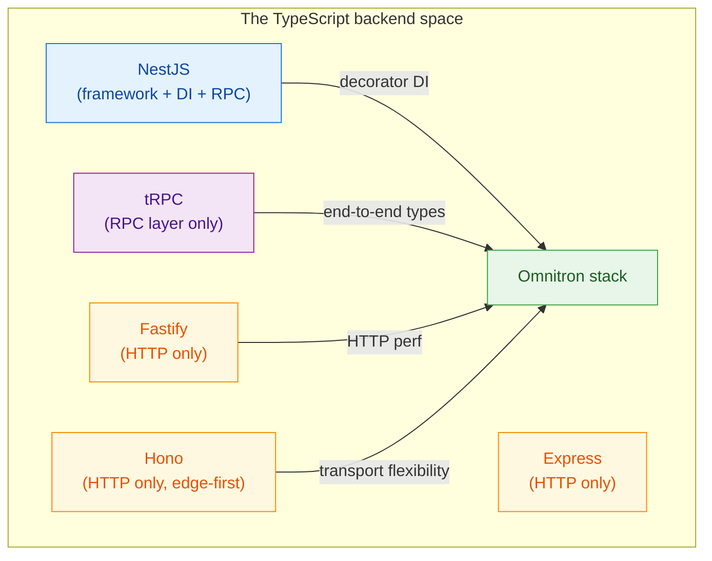

# vs alternatives

Comparing this stack to the most common alternatives. Strict —
each row is verifiable. Pick the row that matters most to your
team.

If you're migrating from one of these, the
[migration guides](./titan/migrations) cover the mechanical
parts. This page covers **fit**.

## The big picture

Omnitron borrows the decorator-DI from NestJS, the end-to-end
type ergonomics from tRPC, transport flexibility from Hono,
the supervised-process model from PM2/systemd — and unifies
them under one TypeScript codebase.

## vs NestJS

[NestJS](https://nestjs.com/) is the closest neighbour.

| Axis | NestJS | Omnitron stack |
| ---- | ------ | -------------- |
| **DI container** | InversifyJS-style | Nexus (custom; class-token-based with contextual injection) |
| **Decorators** | `@Module`, `@Injectable`, `@Controller`, `@Get`, `@Post`, … | `@Module`, `@Injectable`, `@Service`, `@Public`, `@Validate`, `@Auth` |
| **Transport** | Express / Fastify under the hood (HTTP only by default; microservices add-on for TCP/Redis/NATS) | Native: HTTP / WS / TCP / Unix — same service surface |
| **Type safety client ↔ server** | OpenAPI codegen or separate `.d.ts` sync | Service interface IS the type; no codegen |
| **Validation** | class-validator + class-transformer (decorator-heavy DTOs) | Zod schemas inline via `@Validate(schema)` |
| **Module ecosystem** | Huge — most things have a `@nestjs/*` package | 16 focused official modules + community |
| **Testing** | `Test.createTestingModule()` | `createTestApp()` (similar shape) |
| **Lifecycle** | `OnModuleInit`, `OnApplicationBootstrap`, `OnApplicationShutdown` | `OnInit`, `OnStart`, `OnStop`, `OnDestroy` (semantically similar) |
| **Supervisor / fleet** | Not included; you run it under PM2 / systemd / k8s | Omnitron daemon — supervised processes, 19+ RPC services, web console, MCP server |
| **Bundle size** | Larger; pulls in metadata-reflect + RxJS for parts | Modular; pay-for-what-you-use |

### Pick NestJS when…

- Your team already knows it.
- You need the broad ecosystem (huge selection of `@nestjs/*`
  packages — auth strategies, GraphQL, gRPC, etc.).
- HTTP-only is fine; transport flexibility doesn't matter.

### Pick Omnitron when…

- End-to-end TypeScript (no OpenAPI / protobuf step) is a hard
  requirement.
- You'll use ≥2 transports (HTTP + WS, or HTTP + TCP, or all
  four).
- You want operator surface (supervisor, fleet, web console, MCP)
  in the same stack — not a separate ops pipeline.
- You want smaller per-app footprint.

→ Migration: [from NestJS](./titan/migrations/from-nestjs.md)

## vs tRPC

[tRPC](https://trpc.io/) is the gold standard for type-safe RPC.

| Axis | tRPC | Omnitron stack |
| ---- | ---- | -------------- |
| **Type sharing** | Inferred from router → typed on client; same monorepo | Service interface shared; same monorepo |
| **Transport** | HTTP + WebSocket (built-in) | HTTP + WS + TCP + Unix |
| **DI** | None — plain functions in routers | Container DI with lifecycle |
| **Validation** | Zod (or Yup, Superstruct, …) — schema-first | Zod via `@Validate` decorator |
| **Server framework** | Adapter pattern — runs on Express/Fastify/Next/Hono/etc. | Standalone Titan framework |
| **Middleware** | Per-procedure context middleware | DI middleware + Netron middleware (per-call) |
| **Subscriptions** | WebSocket-based via SubscriptionResolver | AsyncIterable methods over WS |
| **Auth** | Context-based — you wire it | `titan-auth` module + decorators |
| **Caching client-side** | React Query (separate package) | `netron-react` cache (built-in) |
| **Cross-language** | TS-only by design | TS-only; MessagePack wire format extensible |
| **Operator surface** | None — you bring it | Full Omnitron daemon |

### Pick tRPC when…

- You want a minimal RPC layer on top of an existing HTTP server
  (Next.js API routes, Hono, Express).
- The backend is small and doesn't need a full framework's DI /
  lifecycle / modules.
- You're already invested in React Query for client cache.

### Pick Omnitron when…

- You want the full stack (DI + lifecycle + 16+ modules), not
  just the RPC layer.
- You need transports beyond HTTP/WS (TCP / Unix for
  service-to-service).
- You want auth / cache / retry / circuit breaker as
  framework-level concerns, not per-procedure code.

## vs Fastify / Express / Hono

These are HTTP servers — different category, but often the
starting comparison.

| Axis | Fastify / Express / Hono | Omnitron stack |
| ---- | ------------------------ | -------------- |
| **Scope** | HTTP only | Full stack (HTTP + DI + RPC + UI + ops) |
| **Routing** | Path-based (`app.get('/users/:id', ...)`) | Service-based (`UsersService.findById`) — RPC abstracts paths |
| **DI** | None — manual wiring | Container DI |
| **Validation** | Per-route via plugins (Fastify schema, Zod with adapter) | Decorator on method (`@Validate`) |
| **Auth** | Per-route middleware | App-level + per-method decorators |
| **WebSocket** | Add-on plugin | Native — same service over both transports |
| **Bundle** | Tiny (Hono <15 kB on edge) | Larger; framework-level |
| **Performance** | Fastify ~70K req/s, Hono ~150K req/s on edge | Comparable HTTP perf; the cost is framework features |

### Pick the HTTP server when…

- You're building a small, focused REST/HTTP service.
- You want full control over routing, middleware order, request
  lifecycle.
- You're targeting edge runtimes (Hono) or single-binary deploys.

### Pick Omnitron when…

- You need RPC semantics (typed methods, not HTTP endpoints).
- You need DI / modules / lifecycle / multi-transport — building
  these on top of Express ends up reinventing 60% of Titan.

## vs PM2 / systemd / Docker Compose

Omnitron is a **supervisor + control plane**, similar in scope
to PM2 (for Node) or systemd (for any process) — but typed,
opinionated for TypeScript services.

| Axis | PM2 | systemd | Docker Compose | Omnitron |
| ---- | --- | ------- | -------------- | -------- |
| **Process supervision** | Yes (Node-only) | Yes (any) | Container-level | Yes (Node-first) |
| **Health checks** | Basic | Manual | `healthcheck:` clause | Per-app, per-process, typed |
| **Cluster mode** | Round-robin Node cluster | n/a | Swarm (separate) | Leader election + state sync |
| **Logs** | File rotation | journald | Per-container | Per-app, structured (pino) |
| **RPC into running apps** | None | None | None | Yes — same Netron protocol as clients |
| **Configuration** | `ecosystem.config.js` | Unit files | `docker-compose.yml` | `omnitron.config.ts` + per-app `defineSystem` |
| **TypeScript-native** | No (any Node app) | No | No | Yes |
| **Web console** | PM2+ paid add-on | No | Portainer (separate) | Built-in |
| **MCP for agents** | No | No | No | Built-in (`omnitron kb mcp`) |

### Pick PM2 when…

- Single-app Node deployment on one box.
- You want lightweight; no opinion on app code.

### Pick systemd when…

- Mixed-language fleet.
- You manage the OS layer too.

### Pick Docker Compose / k8s when…

- Container-first deployment.
- Multi-language; Omnitron just becomes one service among many.

### Pick Omnitron when…

- All apps are Titan apps (or any decorated services).
- You want typed control of the running fleet, not just process
  babysitting.

## vs the typical "modern TypeScript stack"

A typical Next.js + Prisma + tRPC + Tailwind setup:

| Concern | Typical | Omnitron stack |
| ------- | ------- | -------------- |
| Backend framework | Next.js API routes / Hono / tRPC server | Titan |
| RPC | tRPC | Netron |
| Frontend | Next.js / Vite + React | Vite + React (Prism + netron-react) |
| Design system | shadcn/ui or Material-UI | Prism (built on MUI v9) |
| DB layer | Prisma / Drizzle | titan-database (Kysely + Kysera plugins) |
| Auth | NextAuth / Clerk | titan-auth |
| Form lib | react-hook-form + zod | react-hook-form + zod (via Prism `<Field>`) |
| Cache | React Query | netron-react QueryCache |
| State | Zustand / Jotai | Zustand (via Prism `createStore`) |
| Deployment | Vercel / Cloudflare / Render | Docker + supervised by Omnitron |

If you're already deep in the typical stack, the migration cost
is real. The tradeoff: Omnitron unifies it under one decorator
grammar, end-to-end types, and one operator surface.

## Honest tradeoffs

What this stack **gives up**:

- **HTTP routing flexibility.** RPC services don't map cleanly
  to `/api/v2/users/:id/profile.png`. Custom routes are
  supported but feel bolted on.
- **Massive ecosystem.** NestJS has more 3rd-party packages.
  npm has more shadcn-style components than Prism.
- **Edge runtime support.** Titan + Omnitron daemon assume
  Node. You can't ship Titan to Cloudflare Workers.
- **One-runtime restriction for Omnitron.** Apps can be Bun/Deno;
  the daemon needs Node.

What you **get back**:

- One language end-to-end with no codegen.
- One decorator grammar across DI / RPC / auth / validation.
- One operator surface (CLI + web console + MCP) for any app.
- Per-module independence (16+ modules, opt-in each).
- Built-in fleet primitives (cluster, fleet, replication).

## See also

- [Migration / from NestJS](./titan/migrations/from-nestjs.md)
- [Migration / from Express](./titan/migrations/from-express.md)
- [Migration / from prom-client](./titan/migrations/from-prom-client.md)
- [Principles](./foundations/principles.md) — why this stack looks like this
- [Architecture](./foundations/architecture.md) — the layer composition
