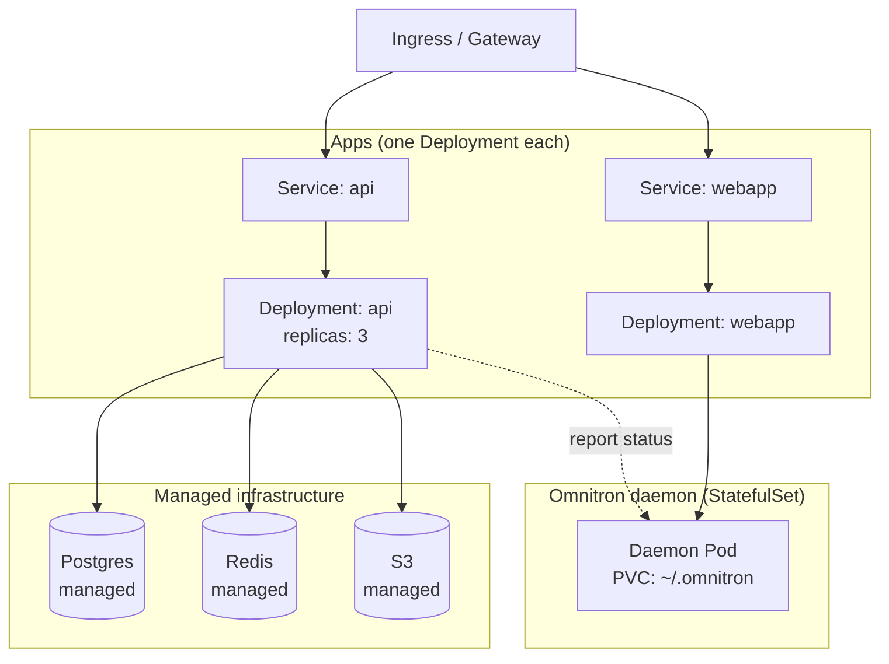

# Kubernetes

For production at scale. The pattern: one Deployment per
Titan app, one Statefulset for the daemon (with its persistent
state), managed Postgres + Redis as separate clusters.

## Topology



In Kubernetes you have two valid patterns:

| Pattern | When |
| ------- | ---- |
| **Daemon-per-pod** (Omnitron supervises the apps in the pod) | Small clusters; one or two services per pod |
| **K8s-supervises-apps** (Omnitron is the control plane only) | Large clusters; one Deployment per Titan app; Omnitron daemon as a separate StatefulSet for control/inspection |

This page covers pattern 2 — the production default.

## Per-app Deployment

```yaml
# k8s/api/deployment.yaml
apiVersion: apps/v1
kind: Deployment
metadata:
  name: api
  namespace: platform
spec:
  replicas: 3
  selector:
    matchLabels: { app: api }
  template:
    metadata:
      labels: { app: api }
    spec:
      containers:
        - name: api
          image: registry.example.com/platform-api:v1.4.2
          ports:
            - { name: http, containerPort: 3001 }
          env:
            - { name: NODE_ENV, value: production }
            - name: DATABASE_URL
              valueFrom: { secretKeyRef: { name: api-secrets, key: database-url } }
            - name: REDIS_URL
              valueFrom: { secretKeyRef: { name: api-secrets, key: redis-url } }
            - name: JWT_SECRET
              valueFrom: { secretKeyRef: { name: api-secrets, key: jwt-secret } }
          resources:
            requests: { cpu: '500m', memory: '512Mi' }
            limits:   { cpu: '2000m', memory: '2Gi' }
          livenessProbe:
            httpGet: { path: /healthz, port: http }
            initialDelaySeconds: 30
            periodSeconds:       10
            timeoutSeconds:      5
            failureThreshold:    3
          readinessProbe:
            httpGet: { path: /readyz, port: http }
            initialDelaySeconds: 5
            periodSeconds:       3
            timeoutSeconds:      3
            failureThreshold:    2
          startupProbe:
            httpGet: { path: /healthz, port: http }
            initialDelaySeconds: 0
            periodSeconds:       2
            timeoutSeconds:      2
            failureThreshold:    60      # 2 min grace for cold start
          lifecycle:
            preStop:
              exec:
                command: ['sh', '-c', 'sleep 10']    # let LB drain
      terminationGracePeriodSeconds: 45
---
apiVersion: v1
kind: Service
metadata:
  name: api
  namespace: platform
spec:
  selector: { app: api }
  ports:
    - { name: http, port: 80, targetPort: http }
```

Key points:

- **Three probes**: liveness, readiness, startup.
  - **Liveness** → `/healthz` from `titan-health`. Kill if it
    fails persistently.
  - **Readiness** → `/readyz`. Stop sending traffic when
    failing; resume when passing.
  - **Startup** → `/healthz` with longer `failureThreshold` —
    masks liveness during cold-start (especially when
    eager-loading heavy services).
- **`preStop` sleep 10 s** — lets the load balancer's endpoint
  list update before SIGTERM. Avoids 502s during pod rotation.
- **`terminationGracePeriodSeconds: 45`** — > app's
  `shutdown.timeout`. Otherwise k8s SIGKILLs mid-drain.

## Omnitron daemon as StatefulSet

The daemon needs persistent state (`~/.omnitron/`) and a stable
identity:

```yaml
# k8s/daemon/statefulset.yaml
apiVersion: apps/v1
kind: StatefulSet
metadata:
  name: omnitron
  namespace: platform
spec:
  serviceName: omnitron
  replicas: 1
  selector:
    matchLabels: { app: omnitron }
  template:
    metadata:
      labels: { app: omnitron }
    spec:
      containers:
        - name: omnitron
          image: registry.example.com/platform-omnitron:v1.4.2
          ports:
            - { name: tcp,  containerPort: 9700 }
            - { name: http, containerPort: 9800 }
          env:
            - { name: OMNITRON_HOME, value: /var/lib/omnitron }
            - { name: NODE_ENV,      value: production }
          volumeMounts:
            - { name: state, mountPath: /var/lib/omnitron }
          resources:
            requests: { cpu: '200m', memory: '256Mi' }
            limits:   { cpu: '1000m', memory: '1Gi' }
  volumeClaimTemplates:
    - metadata: { name: state }
      spec:
        accessModes: ['ReadWriteOnce']
        resources: { requests: { storage: 5Gi } }
        storageClassName: 'fast-ssd'
---
apiVersion: v1
kind: Service
metadata:
  name: omnitron
  namespace: platform
spec:
  selector: { app: omnitron }
  ports:
    - { name: tcp,  port: 9700, targetPort: tcp }
    - { name: http, port: 9800, targetPort: http }
```

Operators can `kubectl port-forward svc/omnitron 9800` and open
the webapp on their machine.

## Ingress

```yaml
# k8s/ingress.yaml
apiVersion: networking.k8s.io/v1
kind: Ingress
metadata:
  name: platform
  namespace: platform
  annotations:
    cert-manager.io/cluster-issuer: letsencrypt
    nginx.ingress.kubernetes.io/proxy-body-size: '50m'
spec:
  ingressClassName: nginx
  tls:
    - hosts: [api.example.com, app.example.com]
      secretName: platform-tls
  rules:
    - host: api.example.com
      http:
        paths:
          - { path: /, pathType: Prefix, backend: { service: { name: api, port: { number: 80 } } } }
    - host: app.example.com
      http:
        paths:
          - { path: /, pathType: Prefix, backend: { service: { name: omnitron, port: { number: 9800 } } } }
```

Two hosts — one for the API (Titan apps), one for the webapp.

## Secrets

```yaml
# k8s/secrets.yaml — do NOT commit. Use sealed-secrets or external-secrets in real life.
apiVersion: v1
kind: Secret
metadata:
  name: api-secrets
  namespace: platform
type: Opaque
stringData:
  database-url: postgres://platform@platform-pg.svc.cluster.local:5432/platform
  redis-url:    redis://platform-redis.svc.cluster.local:6379
  jwt-secret:   '<set via secret manager>'
```

Production options:

- **Sealed Secrets** (Bitnami): commit encrypted secrets to git.
- **External Secrets Operator**: sync from AWS Secrets Manager /
  GCP Secret Manager / Vault.
- **Pod-level secret manager mount** (e.g., AWS Secrets Store CSI
  Driver).

## HorizontalPodAutoscaler

```yaml
apiVersion: autoscaling/v2
kind: HorizontalPodAutoscaler
metadata:
  name: api
  namespace: platform
spec:
  scaleTargetRef:
    apiVersion: apps/v1
    kind:       Deployment
    name:       api
  minReplicas: 2
  maxReplicas: 10
  metrics:
    - type: Resource
      resource: { name: cpu,    target: { type: Utilization, averageUtilization: 70 } }
    - type: Resource
      resource: { name: memory, target: { type: Utilization, averageUtilization: 80 } }
```

`titan-pm`'s own autoscaler operates at the worker-pool level
within a process; HPA operates at the pod level. Use both —
HPA for cross-pod scale, `titan-pm` for cross-worker.

## PodDisruptionBudget

```yaml
apiVersion: policy/v1
kind: PodDisruptionBudget
metadata:
  name: api
  namespace: platform
spec:
  minAvailable: 2
  selector:
    matchLabels: { app: api }
```

Keeps at least 2 pods up during voluntary disruptions (node
drains, cluster upgrades).

## NetworkPolicy

```yaml
apiVersion: networking.k8s.io/v1
kind: NetworkPolicy
metadata:
  name: api-ingress
  namespace: platform
spec:
  podSelector:
    matchLabels: { app: api }
  policyTypes: [Ingress, Egress]
  ingress:
    - from:
        - namespaceSelector: { matchLabels: { name: ingress-nginx } }
      ports:
        - { protocol: TCP, port: 3001 }
  egress:
    - to:
        - namespaceSelector: { matchLabels: { kubernetes.io/metadata.name: platform } }
    - to:
        - namespaceSelector: { matchLabels: { kubernetes.io/metadata.name: kube-system } }
      ports:
        - { protocol: UDP, port: 53 }
```

Allow ingress only from the nginx ingress controller; restrict
egress to in-namespace + DNS.

## Rolling updates

```yaml
spec:
  strategy:
    type: RollingUpdate
    rollingUpdate:
      maxSurge:       1
      maxUnavailable: 0
```

`maxUnavailable: 0` keeps capacity at 100% throughout the
rollout. `maxSurge: 1` adds one new pod, waits for it to become
ready, then terminates an old one.

For high-throughput apps, set `maxSurge: 25%` for faster
rollouts.

## Database migrations

Run as an initContainer or pre-deploy Job:

```yaml
# Pre-deploy Job, runs to completion before pods rotate
apiVersion: batch/v1
kind: Job
metadata:
  name: migrate-{{ .Values.deployVersion }}
  namespace: platform
spec:
  backoffLimit: 1
  template:
    spec:
      restartPolicy: Never
      containers:
        - name: migrate
          image: registry.example.com/platform-api:v1.4.2
          command: ['pnpm', 'omnitron', 'infra', 'migrate']
          env:
            - { name: DATABASE_URL, valueFrom: { secretKeyRef: { name: api-secrets, key: database-url } } }
```

Wire as a Helm pre-install / pre-upgrade hook.

## Webapp deployment

Static assets behind an nginx container:

```yaml
apiVersion: apps/v1
kind: Deployment
metadata:
  name: webapp
spec:
  replicas: 2
  template:
    spec:
      containers:
        - name: webapp
          image: registry.example.com/platform-webapp:v1.4.2
          ports: [{ name: http, containerPort: 80 }]
          # Built static; nginx serves it
```

Or — simpler — let the Omnitron daemon serve the webapp from
its HTTP port (9800) and point ingress there.

## Observability

- **Logs** → stdout → cluster log aggregator (Loki / Datadog /
  ELK).
- **Metrics** → scrape `/metrics` from each pod via
  Prometheus annotations:
  ```yaml
  annotations:
    prometheus.io/scrape: 'true'
    prometheus.io/port:   '3001'
    prometheus.io/path:   '/metrics'
  ```
- **Traces** → OTel collector as DaemonSet; apps export to it.
- **Alerts** → `OmnitronAlerts` + PrometheusRules.

## Disaster recovery

Backup priorities:

1. **Postgres** — managed snapshots + WAL archiving.
2. **Omnitron daemon state** (`omnitron-data` PVC) — snapshot
   regularly; survival of the daemon is important for the
   uptime-bar history.
3. **Secrets** — backed up via the secret manager itself.

The Postgres data is the only **catastrophic** loss.
Everything else can be reconstructed.

## Cost-savings tips

- **Spot / preemptible** for worker pools; on-demand for the
  daemon.
- **Memory requests > limits, CPU limits > requests**: gives
  headroom under burst while bin-packing efficiently.
- **One daemon per cluster**, not per app.
- **`titan-cache` L1 only** for read-heavy apps to avoid Redis
  hops.

## See also

- [Deployment overview](./index.md)
- [PaaS](./paas.md) — for smaller setups
- [Cluster + Fleet](./../omnitron/cluster.md) — multi-cluster patterns
- [Observability](./../omnitron/observability.md)
