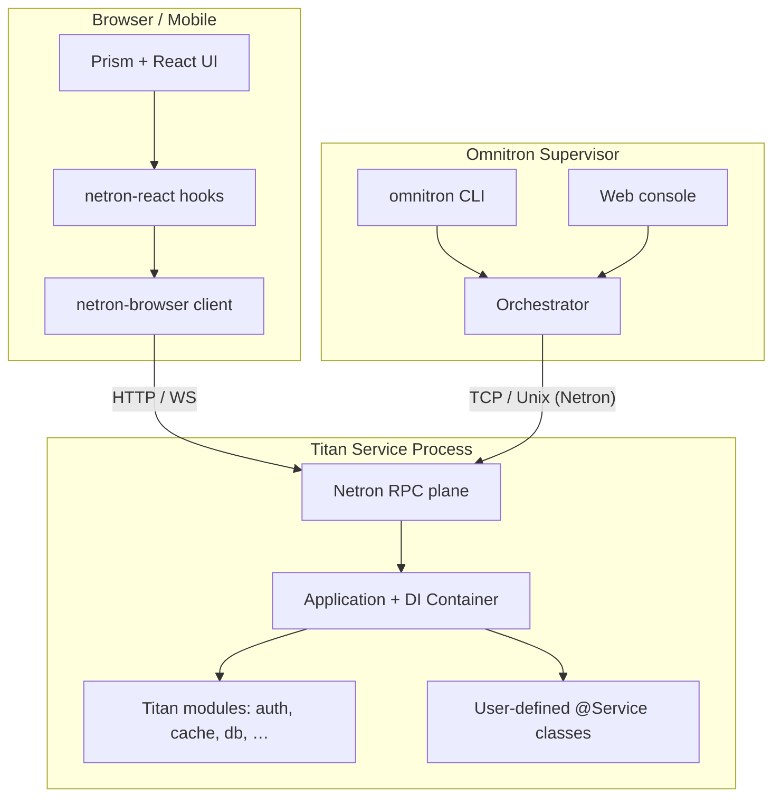

# Architecture

How an Omnitron-based system composes at runtime.

## The layers

Three observations:

1. The browser and the supervisor talk to the service over the **same
   protocol**, just different transports. The service does not know
   which one is calling.
2. The DI container is the only thing that owns service instances. The
   transport plane (Netron) is a thin adapter from wire format to
   container-resolved methods.
3. The supervisor is itself a Titan app. It exposes a Netron service
   that the CLI and the web console call. The "operator API" is a
   first-class part of the runtime.

## A request, end to end

1. **Browser** — a React component renders, gets the typed
   service with `const users = useService<UsersService>('users')`,
   and calls `users.findById.useQuery([id])`.
2. **Hook** — `netron-react` looks up the cached result; if missing,
   asks the `netron-browser` client for the call.
3. **Client** — serialises the call as a Netron packet, sends it over
   the configured transport (HTTP for queries by default, WS for
   subscriptions).
4. **Transport** — the Titan service's `HttpTransport` decodes the
   packet and routes it to the Netron dispatcher.
5. **Dispatcher** — looks up the registered `users@1.0.0` service in
   the container, validates arguments against the method's schema,
   invokes the method.
6. **Service method** — runs in the container's scope. Dependencies
   (`Database`, `Logger`, etc.) are constructor-injected; nothing is
   pulled from globals.
7. **Response** — the return value is serialised back through Netron;
   typed errors are mapped to client-side `NetronError` instances.
8. **Hook** — caches the result, surfaces it to the React render.

End to end, the type of `data` in the React component is **the return
type of the service method**. No translation step.

## Where each package lives in this picture

| Package                   | Responsibility                                                                     |
| ------------------------- | ---------------------------------------------------------------------------------- |
| `@omnitron-dev/titan`     | DI container, module system, lifecycle, validation, Netron core, transports        |
| `@omnitron-dev/netron-browser` | Browser-side Netron client (HTTP + WS), middleware, error mapping            |
| `@omnitron-dev/netron-react`   | React hooks built on netron-browser; cache and devtools                      |
| `@omnitron-dev/prism`     | Design system: theme, layouts, blocks, forms, accessibility                        |
| `@omnitron-dev/omnitron`  | Application supervisor, CLI, web console, observability                            |
| `titan-*` (14 packages)   | Optional Titan modules: auth, cache, db, discovery, events, etc.                   |
| `@omnitron-dev/common`, `cuid`, `eventemitter`, `msgpack`, `testing` | Shared primitives                       |

## Cross-cutting concerns

- **Configuration** — `ConfigModule` validates against a Zod schema at
  boot. Misconfiguration is a startup error, not a 3 AM runtime crash.
- **Logging** — `LoggerModule` produces structured JSON with trace IDs.
  The Omnitron CLI tails them in real time across multiple services.
- **Tracing** — Netron propagates a trace context through every call.
  The supervisor's `telemetry-relay` ships traces to your collector.
- **Errors** — Typed `NetronError` subclasses carry status, code, and
  cause across the wire. Client receives the original error type, not
  a generic `Error`.

Next: [Monorepo](./monorepo.md) — how the Omnitron source tree itself
is organised.
