# Titan vs Omnitron

These are **two distinct layers**. Most projects use **Titan
alone** — it's a complete backend framework. **Omnitron is
opt-in** — a higher-level platform that supervises, deploys,
and operates many Titan apps together.

This page draws the line precisely so you know what to install
and what to skip.

## At a glance

```mermaid
flowchart TB
  subgraph Titan["Titan — backend framework (always)"]
    direction LR
    App[Application.create&#40;module&#41;]
    DI[Nexus DI container]
    Net[Netron RPC<br/>HTTP / WS / TCP / Unix]
    Lif[Lifecycle hooks]
    Mods[16+ modules: auth, cache, db, ...]
  end

  subgraph Omnitron["Omnitron — supervisor + control plane (opt-in)"]
    direction LR
    Daemon[Long-running daemon]
    CLI[75+ CLI commands]
    Console[Web console]
    Infra[Declarative infra provisioning]
    Cluster[Cluster + fleet]
    MCP[MCP server for AI agents]
  end

  Titan -. you can use this alone .-> Run1[node dist/index.js]
  Titan --> Omnitron
  Omnitron --> Run2[omnitron up — supervises N Titan apps]

  classDef titan fill:#e8f5e9,stroke:#43a047,color:#1b5e20
  classDef omni fill:#f3e5f5,stroke:#8e24aa,color:#4a148c
  class Titan titan
  class Omnitron omni
```



**Titan = the runtime.** Build a backend, expose RPC, run it.

**Omnitron = the operator.** Supervise many backends, provide
the operator UI / CLI / agent surface.

## Titan alone (no Omnitron)

`@omnitron-dev/titan` is **a self-contained backend framework**.
You can build a complete production service with just Titan +
the modules you need. No daemon, no extra runtime, no operator
overhead — just a Node process.

```typescript
// my-app/src/main.ts — that's the whole entrypoint
import { Application, Module, Service, Public } from '@omnitron-dev/titan';
import { TitanDatabaseModule } from '@omnitron-dev/titan-database';
import { TitanAuthModule }     from '@omnitron-dev/titan-auth';

@Service('users@1.0.0')
class UsersService {
  @Public()
  async findById(id: string) { /* ... */ }
}

@Module({
  imports: [
    TitanDatabaseModule.forRoot({ dialect: 'postgres', connection: env.DATABASE_URL }),
    TitanAuthModule.forRoot({ jwtSecret: env.JWT_SECRET }),
  ],
  providers: [UsersService],
})
class AppModule {}

const app = await Application.create(AppModule, {
  netron: { http: { port: 3000 } },
});

await app.start();
process.on('SIGTERM', () => app.stop());
```

Run with:

```bash
node dist/main.js
```

You get **everything**:

| Feature | Where it comes from |
| ------- | ------------------- |
| Decorator DI | core Titan |
| Netron RPC (HTTP/WS/TCP/Unix) | core Titan |
| Module system | core Titan |
| Lifecycle hooks (`onInit` / `onStart` / `onStop` / `onDestroy`) | core Titan |
| Graceful shutdown | core Titan |
| Validation | core Titan + zod |
| Typed errors over the wire | core Titan |
| Structured logging | `LoggerModule` (built-in) |
| Schema-validated config | `ConfigModule` (built-in) |
| JWT auth + JWKS | `titan-auth` |
| Database + RLS + migrations | `titan-database` |
| Multi-tier cache | `titan-cache` |
| Cron / interval / timeouts | `titan-scheduler` |
| Health probes for k8s | `titan-health` |
| Distributed locks | `titan-lock` |
| Rate limiting | `titan-ratelimit` |
| Worker pools / process management | `titan-pm` |
| Prometheus metrics | `titan-metrics` |
| Notifications (email / push / SMS / webhooks) | `titan-notifications` |
| Service discovery | `titan-discovery` |
| In-process event bus | `titan-events` |
| Cross-tab browser auth | `netron-browser` + `AuthManager` |
| React hooks for RPC | `netron-react` |
| UI design system | `prism` |

**This is a complete stack.** Run it under any process
supervisor: PM2, systemd, Docker, Kubernetes, Fly, Railway,
Render — Titan is just a Node process.

## What Omnitron adds

`@omnitron-dev/omnitron` is **an optional higher-level
platform** that **uses Titan internally** (it's itself a Titan
app) and **supervises other Titan apps**.

Adds, **on top of** what Titan already gives you:

| Capability | What it does |
| ---------- | ------------ |
| **Long-running daemon** | One supervisor process owns N apps, survives crashes, persists state |
| **Multi-app lifecycle** | `omnitron up` starts a fleet of Titan apps with declarative ordering (`dependsOn`) |
| **75+ CLI subcommands** | `omnitron start/stop/restart/reload/logs/metrics/inspect/exec/scale/...` for any app |
| **Web console (Omnitron Console)** | React + Vite + Prism UI: dashboards, logs, metrics, traces, fleet view, MCP — at `http://localhost:9800` |
| **20+ management RPC services** | `OmnitronDaemon`, `OmnitronAuth`, `OmnitronDeploy`, `OmnitronFleet`, `OmnitronSecrets`, `OmnitronBackups`, `OmnitronPipelines`, `OmnitronKubernetes`, `OmnitronLogs`, `OmnitronTraces`, `OmnitronHealth`, `OmnitronAlerts`, `OmnitronNodes`, ... |
| **Declarative infrastructure** | `omnitronConfig` per app declares Postgres/Redis/S3/custom-daemons; reconciler provisions via Docker (dev) or bare-metal hooks (prod) |
| **Project + Stack model** | Many projects × many environments (dev/staging/prod) supervised side-by-side |
| **Cluster mode** | Multi-node with simplified Raft leader election + state replication |
| **Fleet** | Inventory of remote daemons + cross-node operations |
| **Hot reload in dev** | File watcher rebuilds + restarts apps on save |
| **Per-app log aggregation** | Rotation, retention, structured query — `omnitron logs api -f -g error -l warn` |
| **Persistent state** | `~/.omnitron/state.json` survives daemon restart; rehydrates running apps |
| **Encrypted secret store** | `omnitron secret set/get/list/delete` with at-rest encryption |
| **Backup service** | `omnitron backup create/restore` for managed databases |
| **Deployment workflows** | `omnitron deploy app --strategy rolling|canary|blue-green` |
| **CI/CD pipelines** | First-class pipeline definition + execution |
| **Kubernetes integration** | `omnitron k8s pods/deploy scale` from the same CLI |
| **Node inventory + health monitor** | SSH-based health checks, 90-day uptime bars |
| **MCP server for AI agents** | `omnitron kb mcp` exposes ~40 typed tools to agents |
| **Knowledge base** | Hybrid full-text + semantic search of the codebase |
| **API gateway** | Optional OpenResty gateway with Lua maintenance mode |
| **Tor hidden services** | Optional `.onion` exposure for operator surfaces |

It's not "Titan with extras" — it's a separate platform that
happens to *use* Titan as its runtime substrate.

## When you need Omnitron

Reach for Omnitron when **any** of these apply:

- **≥ 2 Titan apps** to start, stop, and inspect together.
- **Multi-environment** — dev / staging / prod stacks on the
  same host without container orchestration.
- **Multi-node fleet** — coordinate apps across machines from
  one operator surface.
- **Web console** — you want a UI for ops, not just a CLI.
- **Declarative infra** — `omnitronConfig: { database: true,
  redis: true, s3: true }` and forget about provisioning.
- **AI agent integration** — `omnitron kb mcp` for agents to
  drive the platform.
- **Operator-level RBAC** — three roles (viewer / operator /
  admin) on top of your app's user auth.

## When you don't

Omnitron is **overkill** for:

- **Single Titan app** running on one box — `node dist/main.js`
  is fine.
- **Already containerised** — if Docker Compose / Kubernetes /
  Fly is your supervisor, Omnitron's supervision overlaps. Run
  the Titan apps directly in containers.
- **Edge / serverless** — Cloudflare Workers, Deno Deploy,
  AWS Lambda. Omnitron daemon assumes Node + Unix sockets;
  doesn't fit these runtimes.
- **Single-purpose microservice** — one team, one service, one
  deploy. The framework overhead doesn't pay back.
- **Smaller projects (≤ 2 apps, single team)** — Titan + your
  preferred process manager is simpler.

## Migration paths

### Start with Titan alone

```bash
pnpm add @omnitron-dev/titan
# ... add modules as needed
node dist/main.js
```

### Add Omnitron later

The same Titan app **runs unchanged** under Omnitron. Just
add the ecosystem config:

```typescript
// omnitron.config.ts (new file at repo root)
import { defineEcosystem } from '@omnitron-dev/omnitron';

export default defineEcosystem({
  apps: [
    { name: 'api', bootstrap: './apps/api/dist/bootstrap.js' },
  ],
});
```

Convert `main.ts` to `bootstrap.ts`:

```typescript
// apps/api/src/bootstrap.ts — was main.ts
import { defineSystem } from '@omnitron-dev/omnitron';

export default defineSystem({
  name:    'api',
  version: '1.0.0',
  processes: [
    {
      name:   'http',
      module: './app.module.js',
      transports: { http: { port: 3000 } },
    },
  ],
});
```

Run:

```bash
omnitron up                      # starts daemon + api
```

The Titan app's source — `@Service`, `@Module`, `@Public`,
business logic, modules — **does not change**. The same Netron
endpoints work; clients keep working without modification.

### Drop Omnitron later

Equally easy in reverse: replace `omnitron up` with `node
dist/main.js` (using the original `main.ts`-style boot) or with
your container orchestrator. Titan keeps running.

## Cost comparison

| Concern | Titan alone | Titan + Omnitron |
| ------- | ----------- | ---------------- |
| Bundle size at runtime | ~5–15 MB resident per app | + daemon ~50 MB |
| Boot time | Seconds (depends on modules) | + daemon ~1–2 s |
| Operator learning curve | Read Titan docs | Read Titan + Omnitron CLI |
| Operations surface | Process manager + DB/Redis hosting | Daemon + ops UI |
| Dev hot-reload | `tsx watch` / `nodemon` | Built into `omnitron up` |
| Log aggregation | stdout → log shipper | Built-in ring buffer + rotation |
| Multi-app supervision | Your container orchestrator | Built-in |
| Configuration management | `omnitron.config.ts` not needed | `omnitron.config.ts` declares the ecosystem |

## What the docs cover for each

| Section | Layer |
| ------- | ----- |
| [Titan overview](../titan/overview.md) | Titan core |
| [Titan modules](../titan/modules) | The 16+ official modules — all usable without Omnitron |
| [Frontend / Netron](../frontend/netron) | Browser-side; works whether the backend is Titan-alone or Omnitron-supervised |
| [Omnitron overview](../omnitron/overview.md) | Omnitron-specific |
| [Omnitron CLI](../omnitron/cli.md) | The 75+ commands — only relevant if you use Omnitron |
| [Deployment guides](../deployment) | Both layers — install paths for Titan-alone and Omnitron-supervised |
| [Tutorial](../tutorial) | Builds with Titan; the last step adds Docker (no Omnitron) |

## Real numbers

A small project (one Titan app, single Postgres, two
HTTP routes):

| Setup | RAM | Boot time | Lines of config |
| ----- | --- | --------- | --------------- |
| Titan alone, `node dist/main.js` | ~80 MB | 1.5 s | ~15 lines (`main.ts`) |
| Titan + Omnitron daemon | ~130 MB (80 + 50 daemon) | 2.5 s | + 20 lines (`omnitron.config.ts` + `bootstrap.ts`) |

For 1 app: the ratio is bad. For 5 apps: same daemon, ~150 MB
total vs 5 × 80 = 400 MB if each apps' supervision was
duplicated.

## TL;DR

**Titan is the framework. You probably need it.**

**Omnitron is the platform. You probably don't — until you do.**

| You have… | Use |
| --------- | --- |
| One Titan app | Titan alone + your process manager |
| 2–5 Titan apps in one repo | Titan + (PM2 or Docker Compose or Omnitron) |
| Multi-environment / multi-node | Omnitron |
| Need ops UI + CLI + MCP for agents | Omnitron |
| Edge / serverless | Titan alone (Omnitron doesn't fit) |
| Largest possible scale | Titan + Kubernetes (Omnitron optional inside k8s) |

## See also

- [Architecture](./architecture.md) — how Titan composes
- [Principles](./principles.md) — the rules behind both layers
- [Comparison](../comparison.md) — how the whole stack compares to alternatives
- [Omnitron overview](../omnitron/overview.md) — if you've decided you want Omnitron
- [Deployment](../deployment) — how to ship either way
