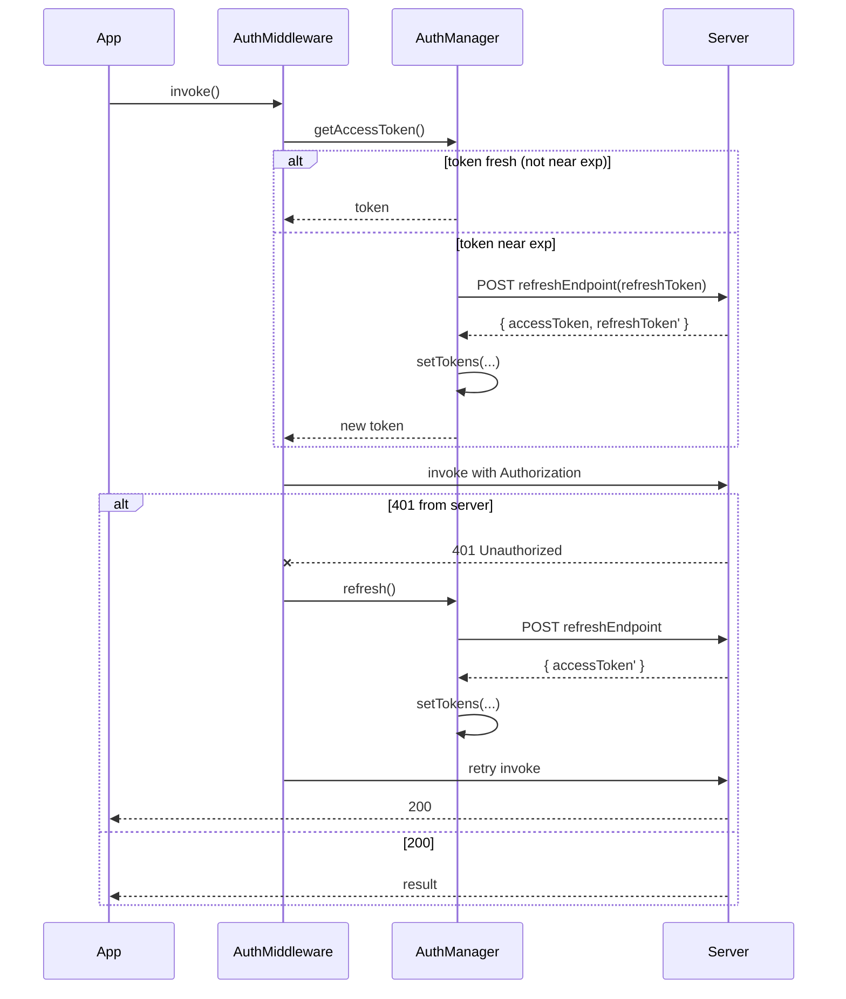

# Auth manager

`AuthManager` (from `@omnitron-dev/netron-browser/auth`) owns
browser-side authentication state: where tokens live, when to
refresh, how to propagate sign-in/out across tabs, and when to
time out an idle session.

It's used by `AuthMiddleware` to attach tokens to every RPC
call and to refresh on 401.

## Wiring

```typescript
import { AuthManager } from '@omnitron-dev/netron-browser/auth';
import { AuthMiddleware } from '@omnitron-dev/netron-browser/middleware';

const auth = new AuthManager({
  storage:           'localStorage',
  tokenKey:          'platform:tokens',
  refreshEndpoint:   '/auth/refresh',
  inactivityTimeout: 30 * 60_000,         // 30 min
  crossTabSync:      true,
});

const client = createClient({ url: 'https://api.example.com' });
client.use(AuthMiddleware({ authManager: auth }));

// On sign-in success:
await auth.setTokens({ accessToken, refreshToken, sessionId, expiresAt });

// On sign-out:
await auth.clear();
```

## Options

| Option | Default | Notes |
| ------ | ------- | ----- |
| `storage` | `'localStorage'` | `'localStorage'` \| `'sessionStorage'` \| `'memory'` |
| `tokenKey` | `'netron:tokens'` | Storage key |
| `refreshEndpoint` | — | Path / URL to call on 401 |
| `refreshFn` | — | Custom refresh function (overrides endpoint) |
| `inactivityTimeout` | `0` (disabled) | Auto-sign-out after N ms idle |
| `crossTabSync` | `true` | Use BroadcastChannel to sync sign-in/out across tabs |
| `channelName` | `'netron-auth'` | BroadcastChannel name |
| `tokenExpiryBuffer` | `30_000` | Refresh N ms before exp |

## Storage backends

| Backend | Survives | Use case |
| ------- | -------- | -------- |
| `'localStorage'` | Tab close + reload | Long-lived sessions; most apps |
| `'sessionStorage'` | Tab close (per-tab) | "Remember me off" |
| `'memory'` | Reload | Highest security; user re-auths on every refresh |

For HttpOnly-cookie auth, set `storage: 'memory'` (or skip the
manager entirely) — the browser handles the cookie.

## Token shape

```typescript
interface AuthTokens {
  accessToken:    string;
  refreshToken?:  string;
  sessionId?:     string;
  expiresAt?:     number;          // epoch ms — used for proactive refresh
  user?:          Partial<User>;    // optional cached profile
}
```

`expiresAt` lets the manager refresh **proactively** —
`tokenExpiryBuffer` ms before expiry — rather than waiting for
401.

## Auto-refresh flow



Proactive + reactive — the buffer covers clock skew + slow
networks; the 401 handler covers refresh that fired
mid-request.

### Concurrent-request deduplication

Multiple in-flight requests that 401 simultaneously share one
refresh call — they don't all hit the refresh endpoint. The
manager queues subsequent calls and resolves them with the
refreshed token.

## Cross-tab sync

When `crossTabSync: true`, sign-in / sign-out in one tab
propagates to all open tabs via `BroadcastChannel`:

```mermaid
sequenceDiagram
  participant Tab1
  participant BC as BroadcastChannel
  participant Tab2
  participant Tab3

  Tab1->>Tab1: auth.setTokens(...)
  Tab1->>BC: postMessage({type: 'sign-in', tokens})
  BC-->>Tab2: message
  BC-->>Tab3: message
  Tab2->>Tab2: update local state
  Tab3->>Tab3: update local state

  Note over Tab1: user clicks sign-out
  Tab1->>Tab1: auth.clear()
  Tab1->>BC: postMessage({type: 'sign-out'})
  BC-->>Tab2: message
  BC-->>Tab3: message
  Tab2->>Tab2: clear local; redirect to /sign-in
  Tab3->>Tab3: clear local; redirect to /sign-in
```

Falls back to localStorage `storage` events on browsers without
BroadcastChannel.

## Inactivity timeout

```typescript
new AuthManager({
  inactivityTimeout: 30 * 60_000,
  // ...
});
```

Resets on:
- Any user input (`mousemove`, `keydown`, `click`, `touchstart`,
  `scroll`).
- Any RPC call (proves activity).
- Cross-tab activity (one active tab keeps all alive).

When the timeout expires:

```typescript
auth.on('inactivity-timeout', async () => {
  await auth.clear();
  navigate('/sign-in?reason=timeout');
});
```

The manager just **fires the event**; your app decides what to
do (sign out, lock screen with PIN unlock, ...).

## Event subscriptions

```typescript
auth.on('sign-in',  ({ user, source })  => { /* sync local state */ });
auth.on('sign-out', ({ source })        => { /* redirect */ });
auth.on('refresh',  ({ accessToken })   => { /* update header banner */ });
auth.on('refresh-failed', ({ error })   => { /* probably show sign-in */ });
auth.on('inactivity-timeout', () => { /* lock or sign out */ });
```

`source` is `'self'` for actions originated in this tab,
`'remote'` for cross-tab broadcasts.

## React integration

netron-react's `AuthProvider` wraps `AuthManager` and exposes
`useAuth()`:

```tsx
import { AuthProvider, useAuth } from '@omnitron-dev/netron-react/auth';

<AuthProvider>
  <Outlet />
</AuthProvider>

function UserMenu() {
  const { user, isAuthenticated, signIn, signOut, refresh } = useAuth();

  if (!isAuthenticated) {
    return <Button onClick={() => signIn(credentials)}>Sign in</Button>;
  }
  return (
    <Menu>
      <MenuItem disabled>{user.email}</MenuItem>
      <MenuDivider />
      <MenuItem onClick={signOut}>Sign out</MenuItem>
    </Menu>
  );
}
```

### Route guards

```tsx
import { AuthGuard, GuestGuard } from '@omnitron-dev/netron-react/auth';

<Routes>
  <Route element={<GuestGuard><AuthLayout /></GuestGuard>}>
    <Route path="/sign-in" element={<SignInPage />} />
  </Route>
  <Route element={<AuthGuard><DashboardLayout /></AuthGuard>}>
    <Route path="/" element={<Dashboard />} />
  </Route>
</Routes>
```

`<AuthGuard>` redirects unauthenticated users to `/sign-in`
(configurable); `<GuestGuard>` redirects authenticated users to
`/` (configurable).

### Role-gated content

```tsx
import { useAuth } from '@omnitron-dev/netron-react/auth';

function AdminPanel() {
  const { user, hasRole } = useAuth();
  if (!hasRole('admin')) return null;
  return <DestructiveOperations />;
}
```

`hasRole` checks `user.roles` against the argument; supports
arrays for "any of":

```tsx
hasRole(['admin', 'moderator'])
```

## Sign-in flow with 2FA

```tsx
async function handleSignIn(values: { email: string; password: string; totpCode?: string }) {
  try {
    const result = await authService.signIn(values);

    if (result.requires2fa) {
      setPendingMfa(true);                  // show 2FA input
      return;
    }

    await auth.setTokens({
      accessToken:  result.accessToken,
      refreshToken: result.refreshToken,
      sessionId:    result.sessionId,
      expiresAt:    Date.now() + result.expiresIn * 1_000,
      user:         result.user,
    });

    navigate('/');
  } catch (e) {
    form.setError('root', { message: e.message });
  }
}
```

The two-step flow keeps the 2FA input out of the password form
until needed.

## Sign-in flow with WebAuthn / passkey

```typescript
const challenge = await authService.getWebAuthnChallenge({ email });
const credential = await navigator.credentials.get({ publicKey: challenge });
const result     = await authService.verifyWebAuthn({ credential });
await auth.setTokens(result);
```

The manager doesn't care about the source — it stores tokens
the same way regardless of method.

## Programmatic token access (advanced)

```typescript
const token = await auth.getAccessToken();
const isAuth = auth.isAuthenticated();
const user = auth.getUser();
const session = auth.getSessionId();
```

Useful for direct `fetch` calls outside the RPC client (file
uploads, third-party SDKs).

## Custom refresh function

```typescript
new AuthManager({
  refreshFn: async (refreshToken) => {
    const response = await fetch('/auth/refresh', {
      method:  'POST',
      headers: { 'Content-Type': 'application/json' },
      body:    JSON.stringify({ refreshToken }),
    });
    if (!response.ok) throw new Error('refresh failed');
    return await response.json();    // { accessToken, refreshToken?, expiresAt? }
  },
});
```

Use when refresh isn't a simple POST — e.g., when you must
include a CSRF token, when you sign the refresh request, or
when the endpoint lives on a different domain.

## Security considerations

- **localStorage tokens** are accessible to all scripts on the
  origin — XSS = token compromise. Mitigations: CSP, no
  user-controlled HTML, monitor for XSS reports.
- **HttpOnly cookies** are immune to XSS but require CSRF
  protection. Pick one model and stick to it.
- **Don't log tokens.** Even at `debug` level — log `kid` /
  `code` only.
- **Inactivity timeout** matters for shared / public computers.
  Default to 30 min for admin surfaces; longer for personal
  apps.
- **Token rotation hooks** (`auth.on('refresh', ...)`) can
  notify the user when sessions rotate — useful for security
  dashboards.

## Best practices

- **One `AuthManager` per app.** Multiple managers means
  multiple BroadcastChannels and possible state divergence.
- **Wire the manager once at boot**, before any RPC calls fire.
- **Use `expiresAt` for proactive refresh.** Reactive-only
  refresh produces one failed request per token cycle.
- **Always `await auth.setTokens(...)`** before navigating —
  the first post-sign-in render needs valid auth.
- **`crossTabSync: true`** unless you have a specific reason
  not to.

## Anti-patterns

- **Storing tokens in both cookies and localStorage.** Pick
  one. Mixed approaches cause refresh / clear bugs.
- **Setting `inactivityTimeout`** on a "watch-only" dashboard
  embedded in a kiosk. The user is the screen, not someone
  typing.
- **Custom inactivity timer alongside `AuthManager`'s.**
  Conflicting timers; one wins, one doesn't.
- **Skipping `await` on `auth.refresh()`.** The refresh fires
  but the next call still uses the old token.

## See also

- [Middleware / AuthMiddleware](./middleware.md#authmiddleware) —
  how the manager wires into RPC calls
- [netron-react / Auth](./react.md#authentication) — React glue
- [Omnitron / Auth & RBAC](../../omnitron/auth-rbac.md) — full
  cross-stack auth model
- [Titan / titan-auth](../../titan/modules/auth.mdx) — server side
