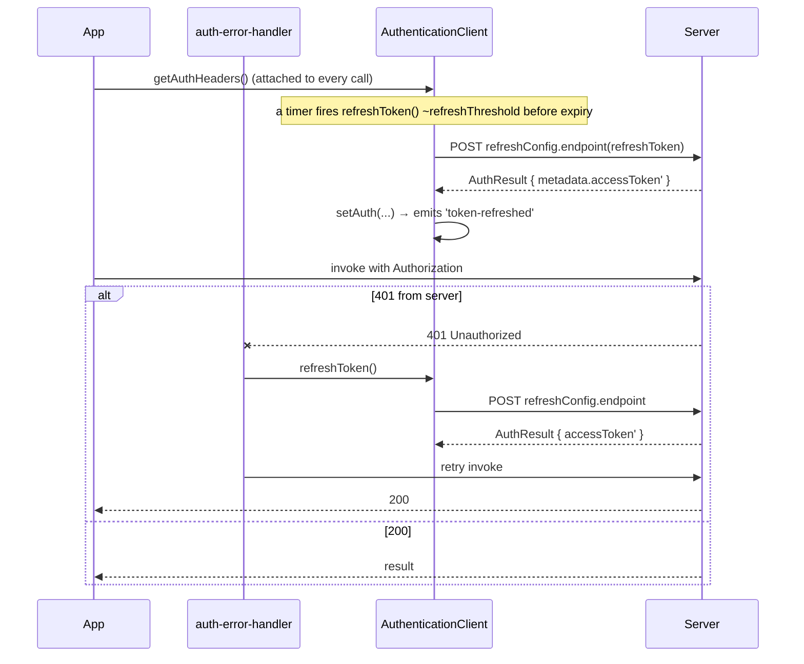
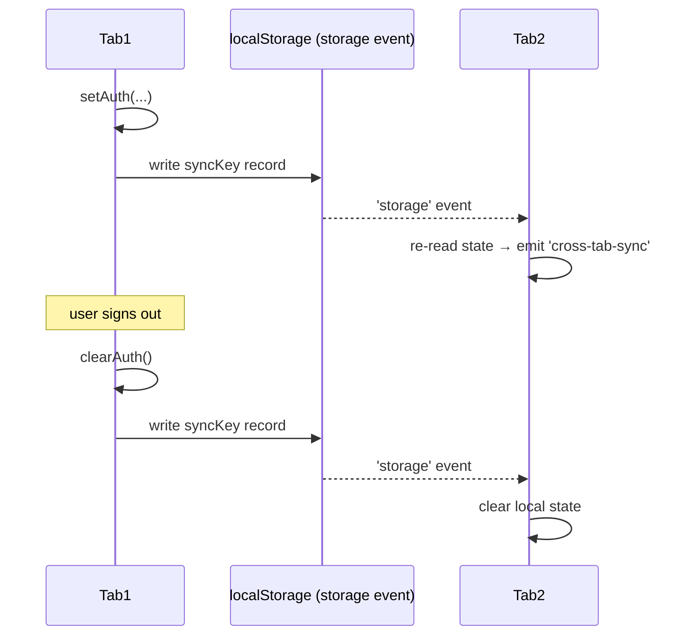

# Auth client

:::info
For the framework-wide authorisation model (permission strings,
ABAC, RLS bridge) start at [Authentication & Authorisation](../../auth/index.md).
This page is the browser-side **token-lifecycle** reference.
:::

`AuthenticationClient` (from `@omnitron-dev/netron-browser`)
owns browser-side authentication state: where the token lives,
when to refresh, how to propagate sign-in/out across tabs, and
when to time out an idle session.

You attach it to a transport client (HTTP or WebSocket) so every
RPC call carries the token, and a refresh fires automatically on
401. In React apps it's usually wrapped by netron-react's
[`AuthProvider`](./react.md#authentication) — but the client
works standalone.

Verified against `packages/netron-browser/src/auth/`.

## Wiring

Pass an `AuthenticationClient` to the transport client. The
client attaches the token to every request and the built-in
`auth-error-handler` middleware refreshes + retries on 401:

```typescript
import { HttpClient } from '@omnitron-dev/netron-browser';
import { AuthenticationClient, LocalTokenStorage } from '@omnitron-dev/netron-browser';
import { createAuthErrorMiddleware } from '@omnitron-dev/netron-browser/middleware';

const auth = new AuthenticationClient({
  storage:          new LocalTokenStorage('platform:token'),
  autoRefresh:      true,
  refreshThreshold: 5 * 60_000,                 // refresh 5 min before expiry
  refreshConfig:    { endpoint: '/auth/refresh' },
  inactivityConfig: { timeout: 30 * 60_000 },   // 30 min
  crossTabSync:     { enabled: true },
});

const client = new HttpClient({ url: 'https://api.example.com', auth });

// Refresh-then-retry on 401 (and surface 403 / 429):
client.use(createAuthErrorMiddleware({
  authClient:        auth,
  onSessionExpired:  () => location.assign('/sign-in?reason=expired'),
}));

// On sign-in success (an AuthResult from your authenticate call):
auth.setAuth(result);

// On sign-out:
await auth.logout();   // POSTs logoutConfig.endpoint if set, then clearAuth()
```

> `AuthenticationClient` is the real class — there is no
> `AuthManager`, no `setTokens`, no `clear()`. Use `setAuth()` /
> `clearAuth()` / `logout()` and `getToken()`.

## Constructor options

`new AuthenticationClient(options: AuthOptions)` — all fields optional:

| Option | Default | Notes |
| ------ | ------- | ----- |
| `storage` | `new MemoryTokenStorage()` | A `TokenStorage` instance (see below). **Secure-by-default** — memory, not localStorage. |
| `storageKey` | `'netron_auth_token'` | Convenience: if `storage` is omitted but `storageKey` is set, a `LocalTokenStorage(storageKey)` is created |
| `autoRefresh` | `true` | Schedule a refresh before expiry |
| `refreshThreshold` | `5 * 60_000` | Refresh this many ms before `expiresAt` |
| `autoAttach` | `true` | Attach the token to outgoing requests |
| `refreshConfig` | — | `{ endpoint, method?, headers?, buildBody? }` |
| `logoutConfig` | — | `{ endpoint, method?, headers?, includeToken? }` |
| `inactivityConfig` | `{ timeout: 30*60_000, events: ['click','keypress','mousemove'] }` | Idle auto-sign-out |
| `crossTabSync` | `{ enabled: true, syncKey: 'netron_auth_sync' }` | Sync sign-in/out across tabs |
| `transport` | — | A token transport strategy (Bearer / Cookie / Hybrid — see below) |

## Storage backends

`storage` takes a `TokenStorage` **instance** (not a string).
Four implementations ship from `@omnitron-dev/netron-browser`:

| Class | Survives | Use case |
| ----- | -------- | -------- |
| `MemoryTokenStorage` | nothing (reload clears) | **Default.** Highest security; user re-auths on reload |
| `LocalTokenStorage(key?)` | tab close + reload | Long-lived sessions; most apps |
| `SessionTokenStorage(key?)` | tab close (per-tab) | "Remember me off" |
| `NoopTokenStorage` | — | Cookie-mode — the browser holds an HttpOnly cookie, nothing is stored client-side |

```typescript
import { LocalTokenStorage, MemoryTokenStorage, NoopTokenStorage }
  from '@omnitron-dev/netron-browser';

new AuthenticationClient({ storage: new LocalTokenStorage('myapp:token') });
```

The `TokenStorage` interface is `getToken() / setToken() /
removeToken() / hasToken()` plus generic `getValue() / setValue()
/ removeValue()` (the client persists a serialized context
alongside the token).

### Token transports (Bearer / Cookie / Hybrid)

How the token reaches the server is a pluggable
`IClientTokenTransport` (T#176). Pass one as `transport`:

| Transport | Sends | Use |
| --------- | ----- | --- |
| `BearerClientTokenTransport` | `Authorization: Bearer <token>` header (+ `?token=` on WS) | Default bearer-token model |
| `CookieClientTokenTransport` | nothing — sets `credentials: 'include'` so the browser sends the HttpOnly cookie | Cookie-mode auth (pair with `NoopTokenStorage`) |
| `HybridClientTokenTransport` | both — cookie credentials + bearer header | Migration / dual-mode |

```typescript
import { AuthenticationClient, NoopTokenStorage } from '@omnitron-dev/netron-browser';
import { CookieClientTokenTransport } from '@omnitron-dev/netron-browser';

// HttpOnly-cookie auth: no client-side token, browser sends the cookie.
const auth = new AuthenticationClient({
  storage:   new NoopTokenStorage(),
  transport: new CookieClientTokenTransport(),
});
```

## Token + result shapes

After authenticating, you hand the client an `AuthResult` (the
shape your server's authenticate task returns):

```typescript
interface AuthResult {
  success:   boolean;
  context?:  AuthContext;            // user identity + roles/permissions
  error?:    string;
  metadata?: Record<string, any>;    // tokens live here: { accessToken, refreshToken, refreshTokenExpiresAt }
}

interface AuthContext {
  userId:       string;
  roles:        string[];
  permissions:  string[];
  scopes?:      string[];
  token?:       { type: 'bearer' | 'mac' | 'custom'; expiresAt?: Date; issuer?: string; audience?: string[] };
  metadata?:    Record<string, any>;
}
```

`setAuth(result)` reads the access token from
`metadata.accessToken` and the refresh token from
`metadata.refreshToken`, and uses `context.token.expiresAt` for
proactive refresh. For a bare token (no full result) use
`setToken(token, context?)`.

## Auto-refresh flow


```mermaid
sequenceDiagram
  participant App
  participant MW as auth-error-handler
  participant Auth as AuthenticationClient
  participant Server

  App->>Auth: getAuthHeaders()  (attached to every call)
  Note over Auth: a timer fires refreshToken() ~refreshThreshold before expiry
  Auth->>Server: POST refreshConfig.endpoint(refreshToken)
  Server-->>Auth: AuthResult { metadata.accessToken' }
  Auth->>Auth: setAuth(...)  → emits 'token-refreshed'
  App->>Server: invoke with Authorization
  alt 401 from server
    Server--xMW: 401 Unauthorized
    MW->>Auth: refreshToken()
    Auth->>Server: POST refreshConfig.endpoint
    Server-->>Auth: AuthResult { accessToken' }
    MW->>Server: retry invoke
    Server-->>App: 200
  else 200
    Server-->>App: result
  end
```

Proactive (`autoRefresh` + `refreshThreshold`) covers clock skew
and slow networks; the reactive `auth-error-handler` middleware
covers a refresh that fired mid-request.

### Concurrent-request deduplication

`refreshToken()` coalesces concurrent calls via a single shared
`refreshPromise` — multiple requests that 401 simultaneously
share one refresh call rather than all hitting the endpoint.

## Cross-tab sync

With `crossTabSync: { enabled: true }`, sign-in / sign-out in one
tab propagates to others via the storage `storage` event (the
client writes a record to `crossTabSync.syncKey`):


```mermaid
sequenceDiagram
  participant Tab1
  participant LS as localStorage (storage event)
  participant Tab2

  Tab1->>Tab1: setAuth(...)
  Tab1->>LS: write syncKey record
  LS-->>Tab2: 'storage' event
  Tab2->>Tab2: re-read state → emit 'cross-tab-sync'

  Note over Tab1: user signs out
  Tab1->>Tab1: clearAuth()
  Tab1->>LS: write syncKey record
  LS-->>Tab2: 'storage' event
  Tab2->>Tab2: clear local state
```

(`enableCrossTabSync()` / `disableCrossTabSync()` toggle it at
runtime.) Cross-tab auth sync uses `storage` events; the separate
multi-tab WebSocket leader-election feature is unrelated.

## Inactivity timeout

```typescript
new AuthenticationClient({
  inactivityConfig: {
    timeout: 30 * 60_000,
    events:  ['click', 'keypress', 'mousemove'],   // activity resets the timer
    onInactivity: () => { /* optional callback */ },
  },
});
```

When the timeout expires the client emits `'inactivity'`, calls
`onInactivity` (if given), then `clearAuth()`. Subscribe to react
in your app:

```typescript
auth.on('inactivity', () => navigate('/sign-in?reason=timeout'));
```

## Event subscriptions

Subscribe with `on(event, handler)` / unsubscribe with
`off(event, handler)`. The six event types:

```typescript
auth.on('authenticated',   ({ context })      => { /* signed in */ });
auth.on('unauthenticated', ()                 => { /* signed out / cleared */ });
auth.on('token-refreshed', ({ context })      => { /* token rotated */ });
auth.on('error',           ({ error, context })=> { /* refresh/logout failed */ });
auth.on('inactivity',      ({ lastActivity }) => { /* idle timeout */ });
auth.on('cross-tab-sync',  ({ type })         => { /* another tab changed auth */ });
```

## React integration

netron-react's `AuthProvider` wraps the auth lifecycle and
exposes `useAuth()`. Sign-in runs through the provider's
`onLogin` handler; components call `login` / `logout` (see the
[netron-react auth section](./react.md#authentication) for the
full provider API):

```tsx
import { AuthProvider, useAuth } from '@omnitron-dev/netron-react/auth';

<AuthProvider
  config={{ refreshEndpoint: '/auth/refresh', storage: 'local', autoRefresh: true }}
  onLogin={(credentials) => client.invoke('auth', 'signIn', [credentials])}
>
  <Outlet />
</AuthProvider>

function UserMenu() {
  const { user, isAuthenticated, login, logout } = useAuth();

  if (!isAuthenticated) {
    return <Button onClick={() => login(credentials)}>Sign in</Button>;
  }
  return (
    <Menu>
      <MenuItem disabled>{user?.userId}</MenuItem>
      <MenuDivider />
      <MenuItem onClick={() => logout()}>Sign out</MenuItem>
    </Menu>
  );
}
```

`useAuth()` returns `{ isAuthenticated, user, login, logout,
refresh, getAuthHeaders, hasRole, hasPermission, hasAnyRole,
hasAllRoles }`.

### Route guards

```tsx
import { AuthGuard, GuestGuard } from '@omnitron-dev/netron-react/auth';

<Routes>
  <Route element={<GuestGuard redirectTo="/"><AuthLayout /></GuestGuard>}>
    <Route path="/sign-in" element={<SignInPage />} />
  </Route>
  <Route element={<AuthGuard redirectTo="/sign-in"><DashboardLayout /></AuthGuard>}>
    <Route path="/" element={<Dashboard />} />
  </Route>
</Routes>
```

`<AuthGuard>` renders children when authenticated, else its
`fallback` (and can `redirectTo`); `<GuestGuard>` is the inverse.
`<RoleGuard role="…">` / `<PermissionGuard permission="…">` gate
on RBAC.

### Role-gated content

```tsx
import { useAuth } from '@omnitron-dev/netron-react/auth';

function AdminPanel() {
  const { hasRole } = useAuth();
  if (!hasRole('admin')) return null;
  return <DestructiveOperations />;
}
```

`hasRole(role)` checks the context's `roles`; `hasAnyRole(roles)`
/ `hasAllRoles(roles)` cover the array cases.

## Sign-in flow with 2FA

```tsx
async function handleSignIn(values: { email: string; password: string; totpCode?: string }) {
  try {
    const result = await client.invoke('auth', 'signIn', [values]);   // returns AuthResult

    if (result.metadata?.requires2fa) {
      setPendingMfa(true);                  // show 2FA input, call signIn again with totpCode
      return;
    }

    auth.setAuth(result);                   // stores token + context, emits 'authenticated'
    navigate('/');
  } catch (e) {
    form.setError('root', { message: (e as Error).message });
  }
}
```

The two-step flow keeps the 2FA input out of the password form
until needed. (Through React, prefer `useAuth().login(values)` —
it runs the provider's `onLogin` and calls `setAuth` for you.)

## Sign-in flow with WebAuthn / passkey

```typescript
const challenge  = await client.invoke('auth', 'getWebAuthnChallenge', [{ email }]);
const credential = await navigator.credentials.get({ publicKey: challenge });
const result     = await client.invoke('auth', 'verifyWebAuthn', [{ credential }]);
auth.setAuth(result);
```

The client doesn't care about the source — `setAuth` stores the
result the same way regardless of method.

## Programmatic token access (advanced)

```typescript
const token   = auth.getToken();              // string | undefined (synchronous)
const isAuth  = auth.isAuthenticated();
const context = auth.getContext();            // AuthContext | undefined (userId, roles, …)
const session = auth.getSessionMetadata();    // { sessionId, loginTime, … } | undefined
const headers = auth.getAuthHeaders();        // e.g. { Authorization: 'Bearer …' }
```

Useful for direct `fetch` calls outside the RPC client (file
uploads, third-party SDKs) — merge `getAuthHeaders()` into your
request.

## Custom refresh

`refreshConfig` shapes the refresh request — use `buildBody` /
`headers` / `method` when refresh isn't a plain
`POST { refreshToken }`:

```typescript
new AuthenticationClient({
  refreshConfig: {
    endpoint:  '/auth/refresh',
    method:    'POST',
    headers:   { 'X-CSRF-Token': readCsrfCookie() },
    buildBody: (refreshToken) => JSON.stringify({ refreshToken }),
  },
});
```

## Security considerations

- **Default storage is memory** — secure-by-default. Opt into
  `LocalTokenStorage` only when you need persistence across
  reloads, and understand that localStorage tokens are reachable
  by any script on the origin (XSS = token compromise).
- **HttpOnly cookies** are immune to XSS but need CSRF
  protection — use `CookieClientTokenTransport` + `NoopTokenStorage`
  and the `csrf` middleware (`createCsrfMiddleware`). Pick one
  model and stick to it.
- **Don't log tokens.** Even at `debug` level.
- **Inactivity timeout** matters for shared / public computers —
  default 30 min; keep it short for admin surfaces.
- **Token rotation hooks** (`auth.on('token-refreshed', …)`) can
  surface session rotation in a security dashboard.

## Best practices

- **One `AuthenticationClient` per app**, wired before any RPC
  calls fire.
- **Attach it to the transport** (`new HttpClient({ url, auth })`)
  so tokens flow automatically; add `createAuthErrorMiddleware`
  for refresh-on-401.
- **Use a real `expiresAt`** (via the result's
  `context.token.expiresAt`) so `autoRefresh` fires proactively
  instead of one-failed-request-per-cycle.
- **`crossTabSync: { enabled: true }`** unless you have a
  specific reason not to.

## Anti-patterns

- **Storing tokens in both cookies and localStorage.** Pick one
  transport model; mixed approaches cause refresh / clear bugs.
- **Reaching for `AuthManager` / `setTokens`.** Those don't
  exist — it's `AuthenticationClient` + `setAuth` / `clearAuth`.

## See also

- [netron-react auth](./react.md#authentication) — the React provider + guards
- [Middleware](./middleware.md) — `createAuthMiddleware`, `createAuthErrorMiddleware`, `createCsrfMiddleware`
- [Cookie-mode auth](../../auth/index.md) — the closed-platform cookie model
