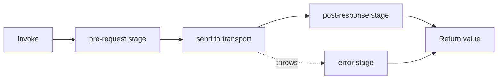

# netron-browser

`@omnitron-dev/netron-browser` is the **framework-agnostic
browser RPC client** for Titan services. Dual transport
(HTTP + WebSocket), type-safe service proxies, full middleware
pipeline, LRU caching, retry + circuit breaker, auth manager
with cross-tab sync, and a multi-backend pool when you talk to
more than one Netron server.

> **Works with any frontend.** Vanilla JS, Vue, Svelte, Solid,
> Angular, Lit, React, Web Workers, Electron renderers —
> anywhere you can `import` an ES module. Not tied to React.
> For React-specific hooks / providers / cache integration, see
> [netron-react](./react.md) — an **optional** layer on top of
> this package.
>
> The **server side** lives inside Titan at
> `@omnitron-dev/titan/netron` (with all four transports). Pair
> this client with that server.

Verified against `packages/netron-browser/src/`.

```bash
pnpm add @omnitron-dev/netron-browser
```

## Architecture

```mermaid
flowchart TB
  subgraph App["Your app"]
    Code[Code calls client.service&#40;...&#41;]
  end

  subgraph Client["NetronClient"]
    Proxy[Service proxy]
    MW[Middleware pipeline]
    Cache[LRU cache]
    Retry[Retry + circuit breaker]
    Auth[Auth manager]
    Transport{Transport selector}
  end

  subgraph Transports
    HTTP[HttpClient<br/>fetch + batch + cache]
    WS[WebSocketClient<br/>persistent + reconnect]
  end

  Code --> Proxy
  Proxy --> MW
  MW --> Cache
  Cache --> Retry
  Retry --> Auth
  Auth --> Transport
  Transport -- 'http' --> HTTP
  Transport -- 'websocket' --> WS

  HTTP --> Server[(Netron server<br/>HTTP transport)]
  WS --> Server2[(Netron server<br/>WS transport)]
```



## Quick start

```typescript
import { createClient } from '@omnitron-dev/netron-browser';

const client = createClient({
  url:       'http://localhost:3000',
  transport: 'http',
});

await client.connect();

// 1. Direct invocation
const result = await client.invoke('calculator', 'add', [2, 3]);

// 2. Type-safe proxy
interface Calculator {
  add(a: number, b: number): Promise<number>;
}

const calc = client.service<Calculator>('calculator');
const sum  = await calc.add(2, 3);

// 3. Same call over WebSocket
const ws = createClient({ url: 'wss://api.example.com', transport: 'websocket' });
await ws.connect();
const live = ws.service<Calculator>('calculator');
```

## Client options

```typescript
interface NetronClientOptions {
  url:        string;
  transport?: 'http' | 'websocket';      // default 'http'
  timeout?:   number;                     // ms
  headers?:   Record<string, string>;
  http?: {
    retry?:      boolean;
    maxRetries?: number;
  };
  websocket?: {
    protocols?:            string | string[];
    reconnect?:            boolean;
    reconnectInterval?:    number;
    maxReconnectAttempts?: number;
  };
}
```

## Transports

### HTTP

The default. One fetch per call. Works through any reverse
proxy, no special routing required. Supports:

- **Request batching** — concurrent calls in the same tick
  coalesce into one HTTP request.
- **Server-side caching headers** — the server's `Cache-Control`
  is honoured client-side via the LRU cache.
- **Retry on transient failures** — `network`/`5xx` errors retry
  with exponential backoff.
- **Idempotency keys** — generated for safe retries on mutating
  calls.

```typescript
const client = createClient({
  url:       '/api',
  transport: 'http',
  http: {
    retry:      true,
    maxRetries: 3,
  },
});
```

### WebSocket

For subscriptions, bidirectional streaming, low-latency RPC:

```typescript
const client = createClient({
  url:       'wss://api.example.com',
  transport: 'websocket',
  websocket: {
    reconnect:            true,
    reconnectInterval:    1_000,
    maxReconnectAttempts: 20,
  },
});

await client.connect();
```

Reconnect uses exponential backoff capped at `reconnectInterval ×
maxReconnectAttempts`. The client transparently re-subscribes
streams on reconnect.

### Connection state

```typescript
import type { ConnectionState } from '@omnitron-dev/netron-browser';

client.getState();        // 'idle' | 'connecting' | 'connected' | 'disconnected' | 'reconnecting'
client.isConnected();     // boolean
client.getMetrics();      // { requests, errors, avgLatency, ... }
```

## Service proxies — typed RPC

```typescript
interface UserService {
  findById(id: string):                    Promise<User>;
  list(filter: UserFilter):                Promise<User[]>;
  create(input: CreateUser):               Promise<User>;
  subscribe(filter: UserFilter):           AsyncIterable<UserEvent>;
}

const users = client.service<UserService>('users');

await users.findById('u_42');           // Promise<User>
await users.create({ email: '...' });   // Promise<User>

for await (const evt of users.subscribe({ tier: 'pro' })) {
  console.log(evt);                       // streamed over WS
}
```

The proxy is a `Proxy` that resolves any property access into an
RPC call against the named service. No code generation required —
your shared `.d.ts` is enough.

### Service descriptor

```typescript
const desc = await client.getServiceDescriptor('users');
// desc.methods, desc.subscriptions, desc.types, ...
```

Useful for building generic UIs that inspect a service at
runtime.

## Middleware pipeline

Middleware runs around every invocation. Three stages:



Each middleware has a `priority` — lower runs first within its
stage.

### Built-in middleware

| Middleware | Stage | Purpose |
| ---------- | ----- | ------- |
| `AuthMiddleware` | pre | Attach `Authorization: Bearer ...` from auth manager |
| `RetryMiddleware` | error | Retry transient failures with exponential backoff |
| `CacheMiddleware` | pre + post | LRU cache with stale-while-revalidate |
| `LoggingMiddleware` | pre + post + error | Structured request/response logging |
| `TracingMiddleware` | pre + post | OpenTelemetry-style trace context |
| `CircuitBreakerMiddleware` | error | Trip after N failures; half-open after cooldown |

```typescript
client.use(AuthMiddleware({ getToken: () => localStorage.getItem('token') }));
client.use(RetryMiddleware({ maxAttempts: 3, on: ['network', '5xx'] }));
client.use(CacheMiddleware({ ttl: 60_000, maxSize: 500 }));
```

### Custom middleware

```typescript
import type { NetronMiddleware } from '@omnitron-dev/netron-browser';

const TimingMiddleware: NetronMiddleware = {
  stage:    'post',
  priority: 100,
  handler:  async (ctx, next) => {
    const start = performance.now();
    try {
      return await next();
    } finally {
      console.debug(`${ctx.service}.${ctx.method}`, performance.now() - start, 'ms');
    }
  },
};

client.use(TimingMiddleware);
```

## Fluent interface — chainable per-call config

Configure middleware behaviour on a single call without
adding it globally:

```typescript
const user = await client
  .cache({ ttl: 60_000 })
  .retry({ maxAttempts: 5 })
  .timeout(3_000)
  .service<UserService>('users')
  .findById('u_42');
```

Per-call config wins over global middleware config. Useful when
99% of calls use defaults but one hot path needs longer cache
or more retries.

## Caching

The LRU cache is bounded; tagged for granular invalidation:

```typescript
import { LRUCache } from '@omnitron-dev/netron-browser';

const cache = new LRUCache({
  maxSize:     1_000,
  defaultTTL:  60_000,
  staleWhileRevalidate: 10_000,    // serve stale up to 10s extra; refresh in bg
});

client.use(CacheMiddleware({ cache }));

// Tag a query for selective invalidation:
await client
  .cache({ tags: ['user:u_42', 'tier:pro'] })
  .service<UserService>('users')
  .findById('u_42');

// Later — invalidate everything tagged with that user:
cache.invalidateByTag('user:u_42');
```

Stats are exposed via `cache.getStats()` — hits, misses,
evictions, hit ratio.

## Retry + circuit breaker

```typescript
client.use(RetryMiddleware({
  maxAttempts: 3,
  on:          ['network', '5xx', 'timeout'],
  backoff:     { type: 'exponential', base: 500, max: 8_000, jitter: true },
}));

client.use(CircuitBreakerMiddleware({
  threshold:    5,             // open after 5 failures
  resetTimeout: 30_000,        // try half-open after 30s
  on:           ['5xx', 'timeout'],
}));
```

The breaker prevents a flapping backend from being hammered —
once tripped, calls fail-fast with `CircuitOpenError` until the
reset window. After cooldown, one probe request runs; success
closes the breaker.

## Auth manager

```typescript
import { AuthManager } from '@omnitron-dev/netron-browser';

const auth = new AuthManager({
  storage:           'localStorage',     // 'session' | 'memory'
  tokenKey:          'platform:token',
  refreshEndpoint:   '/auth/refresh',
  inactivityTimeout: 30 * 60_000,        // 30 min
  crossTabSync:      true,               // BroadcastChannel
});

client.use(AuthMiddleware({ authManager: auth }));

// On sign-in:
await auth.setTokens({ accessToken, refreshToken, sessionId });

// On sign-out:
await auth.clear();
```

Auth manager features:

- **Token storage** — localStorage / sessionStorage / memory.
- **Auto-refresh** — on 401, call refresh endpoint, retry the
  original request transparently.
- **Cross-tab sync** — sign-in / sign-out in one tab propagates
  to all open tabs (BroadcastChannel under the hood).
- **Inactivity timeout** — auto-sign-out after N ms of no
  activity.
- **Token rotation hooks** — `auth.on('rotated', cb)` for app-
  level reactions.

## Multi-backend client

When the app talks to multiple Netron servers — e.g., one for
identity, one for media, one for analytics — wrap each in a
`BackendClient` and pool them:

```typescript
import { BackendPool, BackendClient } from '@omnitron-dev/netron-browser';

const pool = new BackendPool({
  backends: {
    auth:      new BackendClient({ url: 'https://auth.example.com' }),
    media:     new BackendClient({ url: 'https://media.example.com' }),
    analytics: new BackendClient({ url: 'https://analytics.example.com' }),
  },
  routes: {
    'users.*':       'auth',
    'objects.*':     'media',
    'reports.*':     'analytics',
  },
});

await pool.connectAll();

const users = pool.service<UserService>('users');
await users.findById('u_42');        // automatically routed to 'auth' backend
```

Pattern matching is glob-style. Calls not matching any rule
throw `BackendNotConfiguredError`.

### Health-aware routing

```typescript
const pool = new BackendPool({
  backends:    /* ... */,
  routes:      /* ... */,
  healthCheck: {
    interval:  30_000,
    timeout:   2_000,
    onUnhealthy: 'fail',       // 'fail' | 'fallback' | 'queue'
  },
});
```

Unhealthy backends fail fast or fall back to a designated backup
(when configured).

## Errors

Server-side `TitanError` subclasses arrive as the same class on
the client — wire format preserves the constructor name and
`code`:

```typescript
import { TitanError, ErrorCode } from '@omnitron-dev/netron-browser';

try {
  await users.findById('missing');
} catch (e) {
  if (!(e instanceof TitanError)) throw e;

  switch (e.code) {
    case ErrorCode.NOT_FOUND:        return null;
    case ErrorCode.UNAUTHORIZED:     return triggerReauth();
    case ErrorCode.TOO_MANY_REQUESTS: return scheduleRetry(e);
    default:                          throw e;
  }
}
```

→ See [Titan / Errors catalog](../../titan/modules/errors-catalog.mdx)
for the full code reference.

## Subpaths

| Subpath | Contents |
| ------- | -------- |
| `@omnitron-dev/netron-browser` | Everything; convenient root |
| `@omnitron-dev/netron-browser/client` | `NetronClient`, `HttpClient`, `WebSocketClient`, `BackendPool` |
| `@omnitron-dev/netron-browser/auth` | `AuthManager`, token storage helpers |
| `@omnitron-dev/netron-browser/middleware` | All built-in middleware |
| `@omnitron-dev/netron-browser/core` | Types, defaults, factory helpers |
| `@omnitron-dev/netron-browser/core-tasks` | Built-in service tasks (`$system.describe`, etc.) |
| `@omnitron-dev/netron-browser/transport` | Low-level transport adapters |
| `@omnitron-dev/netron-browser/packet` | Wire-format helpers (rarely used directly) |
| `@omnitron-dev/netron-browser/errors` | `TitanError` hierarchy mirror |
| `@omnitron-dev/netron-browser/utils` | URL parsing, header normalisation, `LRUCache` |
| `@omnitron-dev/netron-browser/routing` | Multi-backend route matching |
| `@omnitron-dev/netron-browser/types` | All public types |

## Performance characteristics

| Operation | Cost |
| --------- | ---- |
| HTTP RPC over LAN | 0.5–2 ms |
| WebSocket RPC after connect | 0.1–0.5 ms |
| WS reconnect from cold | 100 ms – 1 s (depends on backoff) |
| Cached call (LRU hit) | ~0.01 ms (no network) |
| Middleware overhead per call | ~0.05 ms per registered middleware |
| Proxy access | ~0.01 ms per property read |

Bundle: ~20–30 kB gzipped for the root import. Subpath imports
can ship just the transport you use (HTTP-only: ~12 kB).

## Examples

The package ships runnable examples at
`packages/netron-browser/examples/` covering:

- Basic HTTP usage
- WebSocket subscriptions
- Auth manager flow
- Multi-backend routing
- Custom middleware

## Best practices

- **Use service proxies, not raw `invoke`.** Types flow through;
  refactors stay safe.
- **One client per backend.** Don't recreate on every render —
  treat the client as a long-lived singleton.
- **Wire AuthManager once.** Cross-tab sync requires a single
  manager instance to share state via BroadcastChannel.
- **Cache idempotent reads, not writes.** Mutations should
  invalidate by tag, not cache.
- **Circuit breaker before retry.** Order matters — the breaker
  prevents the retry loop from hammering a dead backend.
- **Set `timeout`** explicitly. Browser fetch defaults are
  effectively no-timeout; surface as `TimeoutError` for clean
  client UX.
- **Reconnect bounded.** `maxReconnectAttempts` prevents tabs
  from connecting forever after a permanent outage.

## Anti-patterns

- **Storing tokens in cookies + localStorage.** Pick one. Cross-
  site contexts work better with HttpOnly cookies; same-site
  apps work better with localStorage + AuthManager.
- **Per-call new client.** Defeats caching, breaks WS reconnect,
  wastes connections.
- **Catching `Error` generically.** Lose the typed `code`;
  always check `instanceof TitanError`.
- **Custom retry logic on top of `RetryMiddleware`.** Double
  retries amplify failure load; disable one or the other.
- **`maxReconnectAttempts: Infinity`.** A genuinely-dead server
  has open connections from every tab forever.

## See also

- [netron-react](./react.md) — React hooks built on this client
- [Titan / Netron](../../titan/netron.md) — server side
- [Titan / Errors catalog](../../titan/modules/errors-catalog.mdx) — typed errors
- [Prism](../prism/index.md) — UI components that pair with this client
