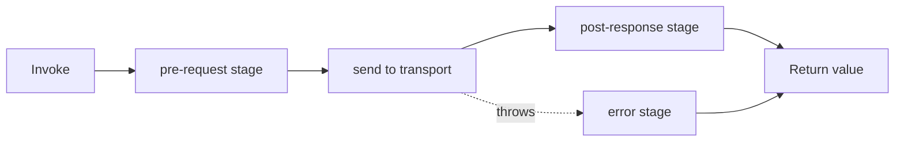

# netron-browser

`@omnitron-dev/netron-browser` is the **framework-agnostic
browser RPC client** for Titan services. Dual transport
(HTTP + WebSocket), type-safe service proxies, a middleware
pipeline (auth / logging / timing / error-transform / CSRF), an
optional fluent HTTP interface for caching / retry / circuit
breaking, an `AuthenticationClient` with cross-tab sync, and a
multi-backend pool when you talk to more than one Netron server.

> **Works with any frontend.** Vanilla JS, Vue, Svelte, Solid,
> Angular, Lit, React, Web Workers, Electron renderers —
> anywhere you can `import` an ES module. Not tied to React.
> For React-specific hooks / providers / cache integration, see
> [netron-react](./react.md) — an **optional** layer on top of
> this package.
>
> The **server side** lives inside Titan at
> `@omnitron-dev/titan/netron` (with all four transports). Pair
> this client with that server.

Verified against `packages/netron-browser/src/`.

```bash
pnpm add @omnitron-dev/netron-browser
```

## Architecture


```mermaid
flowchart TB
  subgraph App["Your app"]
    Code[Code calls client.service&#40;...&#41;]
  end

  subgraph Client["NetronClient"]
    Proxy[Service proxy]
    MW[Middleware pipeline<br/>auth / logging / timing / CSRF]
    Auth[AuthenticationClient]
    Transport{Transport selector}
  end

  subgraph Transports
    HTTP[HttpClient<br/>fetch + retry option]
    WS[WebSocketClient<br/>persistent + reconnect]
  end

  Code --> Proxy
  Proxy --> MW
  MW --> Auth
  Auth --> Transport
  Transport -- 'http' --> HTTP
  Transport -- 'websocket' --> WS

  HTTP --> Server[(Netron server<br/>HTTP transport)]
  WS --> Server2[(Netron server<br/>WS transport)]
```

> Caching, richer retry, and circuit breaking are **not** in the
> invocation pipeline — they live in the optional [fluent HTTP
> interface](#fluent-http-interface--caching-retry-circuit-breaking)
> reached via `peer.queryFluentInterface(...)`.

## Quick start

```typescript
import { createClient } from '@omnitron-dev/netron-browser';

const client = createClient({
  url:       'http://localhost:3000',
  transport: 'http',
});

await client.connect();

// 1. Direct invocation
const result = await client.invoke('calculator', 'add', [2, 3]);

// 2. Type-safe proxy
interface Calculator {
  add(a: number, b: number): Promise<number>;
}

const calc = client.service<Calculator>('calculator');
const sum  = await calc.add(2, 3);

// 3. Same call over WebSocket
const ws = createClient({ url: 'wss://api.example.com', transport: 'websocket' });
await ws.connect();
const live = ws.service<Calculator>('calculator');
```

## Client options

```typescript
interface NetronClientOptions {
  url:        string;
  transport?: 'http' | 'websocket';      // default 'http'
  timeout?:   number;                     // ms
  headers?:   Record<string, string>;
  http?: {
    retry?:      boolean;
    maxRetries?: number;
  };
  websocket?: {
    protocols?:            string | string[];
    reconnect?:            boolean;
    reconnectInterval?:    number;
    maxReconnectAttempts?: number;
  };
}
```

## Transports

### HTTP

The default. One fetch per call. Works through any reverse
proxy, no special routing required. Supports:

- **Retry on transient failures** — set `retry: true` and the
  client re-sends on network/timeout errors with exponential
  backoff (`2^n × 1000ms`), up to `maxRetries` attempts.
- **Auth re-invocation** — when an auth-error middleware refreshes
  the token after a 401, the request is automatically re-sent
  once with the new credentials.

For response caching, deduplication, richer retry strategies, and
circuit breaking, use the [fluent HTTP
interface](#fluent-http-interface--caching-retry-circuit-breaking).

```typescript
const client = createClient({
  url:       '/api',
  transport: 'http',
  http: {
    retry:      true,    // default false
    maxRetries: 3,       // default 3 when retry is enabled
  },
});
```

### WebSocket

For subscriptions, bidirectional streaming, low-latency RPC:

```typescript
const client = createClient({
  url:       'wss://api.example.com',
  transport: 'websocket',
  websocket: {
    reconnect:            true,
    reconnectInterval:    1_000,
    maxReconnectAttempts: 20,
  },
});

await client.connect();
```

Reconnect uses exponential backoff capped at `reconnectInterval ×
maxReconnectAttempts`. The client transparently re-subscribes
streams on reconnect.

### Connection state

```typescript
import type { ConnectionState } from '@omnitron-dev/netron-browser';

client.getState();        // 'idle' | 'connecting' | 'connected' | 'disconnected' | 'reconnecting'
client.isConnected();     // boolean
client.getMetrics();      // { requests, errors, avgLatency, ... }
```

## Service proxies — typed RPC

```typescript
interface UserService {
  findById(id: string):                    Promise<User>;
  list(filter: UserFilter):                Promise<User[]>;
  create(input: CreateUser):               Promise<User>;
  subscribe(filter: UserFilter):           AsyncIterable<UserEvent>;
}

const users = client.service<UserService>('users');

await users.findById('u_42');           // Promise<User>
await users.create({ email: '...' });   // Promise<User>

for await (const evt of users.subscribe({ tier: 'pro' })) {
  console.log(evt);                       // streamed over WS
}
```

The proxy is a `Proxy` that resolves any property access into an
RPC call against the named service. No code generation required —
your shared `.d.ts` is enough.

### Service descriptor

```typescript
const desc = await client.getServiceDescriptor('users');
// desc.methods, desc.subscriptions, desc.types, ...
```

Useful for building generic UIs that inspect a service at
runtime.

## Middleware pipeline

Middleware runs around every invocation. Three stages:


```mermaid
flowchart LR
  In[Invoke] --> Pre[pre-request stage]
  Pre --> Send[send to transport]
  Send --> Post[post-response stage]
  Post --> Out[Return value]
  Send -. throws .-> Err[error stage]
  Err --> Out
```

Each middleware has a `priority` — lower runs first within its
stage.

### Built-in middleware

All built-in middleware are **factory functions** (`create*`):

| Middleware | Stage | Purpose |
| ---------- | ----- | ------- |
| `createAuthMiddleware` | pre | Attach `Authorization: Bearer ...` from a token provider |
| `createLoggingMiddleware` | pre + post + error | Structured request/response logging |
| `createTimingMiddleware` | pre + post | Per-call duration metrics |
| `createErrorTransformMiddleware` | error | Normalise transport errors into a consistent shape |
| `createCsrfMiddleware` | pre | Attach the CSRF double-submit header (cookie mode) |

> There is **no** retry, cache, or circuit-breaker middleware.
> Retry is an `HttpClient` option; caching and circuit breaking
> live in the [fluent HTTP
> interface](#fluent-http-interface--caching-retry-circuit-breaking).
> See [Middleware → Not middleware](./middleware.md#not-middleware).

```typescript
import {
  createAuthMiddleware,
  createLoggingMiddleware,
} from '@omnitron-dev/netron-browser';

client.use(createAuthMiddleware({ tokenProvider: { getToken: () => localStorage.getItem('token') } }));
client.use(createLoggingMiddleware({ logRequestPayload: false }));
```

### Custom middleware

A middleware is a plain `(ctx, next) => Promise<void>` function;
register it with `client.use(fn, config?, stage?)`:

```typescript
import {
  type MiddlewareFunction,
  MiddlewareStage,
} from '@omnitron-dev/netron-browser';

const timingMiddleware: MiddlewareFunction = async (ctx, next) => {
  const start = performance.now();
  try {
    await next();
  } finally {
    console.debug(`${ctx.service}.${ctx.method}`, performance.now() - start, 'ms');
  }
};

client.use(timingMiddleware, { name: 'timing', priority: 100 }, MiddlewareStage.POST_RESPONSE);
```

See [Middleware](./middleware.md) for the full context shape,
stages, and registration rules.

## Fluent HTTP interface — caching, retry, circuit breaking

For HTTP-transport calls you can opt into a **fluent interface**
that adds per-call caching, retry, deduplication, timeout, and
more — without touching the middleware pipeline. It is reached
through the HTTP peer's `queryFluentInterface<T>(...)` (HTTP
transport only; not available over WebSocket):

```typescript
import { HttpRemotePeer } from '@omnitron-dev/netron-browser';

// `peer` is the HttpRemotePeer for an HTTP connection.
const users = await peer.queryFluentInterface<UserService>('users@1.0.0');

// Chainable per-call configuration, then call the method:
const user = await users
  .cache(60_000)              // cache for 60s (number → { maxAge })
  .retry({ attempts: 5 })     // fluent RetryOptions
  .timeout(3_000)
  .api.findById('u_42');
```

Each chainable method (`.cache()`, `.retry()`, `.timeout()`,
`.priority()`, `.dedupe()`, `.transform()`, `.fallback()`, …)
returns a configurable proxy; access the method through `.api`
(or call it directly on the proxy) to execute. Configuration
applies to that one call.

> The fluent primitives (`FluentInterface`, `HttpCacheManager`,
> `RetryManager`, `QueryBuilder`, `CircuitBreakerOptions`,
> `CacheOptions`, `RetryOptions`) are re-exported from the package
> root and shared with `@omnitron-dev/netron-http-core`.

### Caching

Caching is provided by the fluent interface's `HttpCacheManager`,
not by a middleware. Configure it per call with `.cache(...)`:

```typescript
// CacheOptions:
//   { maxAge, staleWhileRevalidate?, tags?, cacheOnError?, key? }
const user = await users
  .cache({
    maxAge:               60_000,
    staleWhileRevalidate: 10_000,        // serve stale up to 10s while refreshing
    tags:                 ['user:u_42', 'tier:pro'],
  })
  .api.findById('u_42');

// Invalidate by cache-key pattern (string = exact/prefix, or a RegExp):
users.invalidate('user:u_42*');
users.clearCache();
```

A shared `HttpCacheManager` can be attached to the peer so every
fluent interface it creates uses the same cache + stats — and so
you can invalidate by **tag** (the array form of `invalidate()`
matches tags, not keys):

```typescript
import { HttpCacheManager } from '@omnitron-dev/netron-browser';

const cache = new HttpCacheManager({ maxEntries: 1_000 });
peer.setCacheManager(cache);

// …after a tagged .cache({ tags: ['user:u_42'] }) call:
cache.invalidate(['user:u_42']);     // invalidate everything tagged user:u_42
```

> **Note:** `createClient`'s `http.caching` / `http.cacheTTL`
> options are currently inert — the basic `HttpClient` does not
> cache. Use the fluent interface (or netron-react's query cache —
> see [Caching](./caching.md)) for response caching.

`LRUCache` (from `@omnitron-dev/netron-browser/utils`) is a
general-purpose bounded cache utility — not a request cache
middleware.

### Retry & circuit breaking

The fluent `.retry(...)` takes a `RetryOptions`:

```typescript
// RetryOptions:
//   { attempts, backoff?, initialDelay?, maxDelay?, jitter?,
//     shouldRetry?, onRetry?, attemptTimeout?, factor?, idempotent? }
const user = await users
  .retry({
    attempts:     3,
    backoff:      'exponential',         // 'exponential' | 'linear' | 'constant'
    initialDelay: 500,
    maxDelay:     8_000,
    jitter:       0.1,
    idempotent:   true,                  // allow retrying ambiguous failures
  })
  .api.findById('u_42');
```

Circuit breaking is configured on a `RetryManager` via
`CircuitBreakerOptions` and attached to the peer:

```typescript
import { RetryManager } from '@omnitron-dev/netron-browser';

// CircuitBreakerOptions:
//   { threshold, windowTime, cooldownTime, successThreshold? }
const retryManager = new RetryManager({
  circuitBreaker: {
    threshold:    5,           // open after 5 failures…
    windowTime:   10_000,      // …within a 10s window
    cooldownTime: 30_000,      // try half-open after 30s
  },
});

peer.setRetryManager(retryManager);
```

When the breaker is open, calls fail fast with a `TitanError`
(`code: ErrorCode.SERVICE_UNAVAILABLE`, message
`"Circuit breaker is open"`) until the cooldown elapses; after
cooldown one probe runs and success closes the breaker. There is
no `CircuitOpenError` class — check `e.code ===
ErrorCode.SERVICE_UNAVAILABLE`.

## Authentication

The real class is **`AuthenticationClient`** (from
`@omnitron-dev/netron-browser`) — there is no `AuthManager`.
Construct one, attach it to the transport client, then drive it
with `setAuth()` / `clearAuth()` / `logout()`:

```typescript
import { HttpClient } from '@omnitron-dev/netron-browser';
import { AuthenticationClient, LocalTokenStorage } from '@omnitron-dev/netron-browser';

const auth = new AuthenticationClient({
  storage:           new LocalTokenStorage('platform:token'),  // or Session/Memory/Noop
  refreshConfig:     { endpoint: '/auth/refresh' },
  inactivityConfig:  { timeout: 30 * 60_000 },                 // 30 min
  crossTabSync:      { enabled: true },                        // storage-event sync
});

// Attach to the transport (HttpClient / WebSocketClient accept `auth`):
const client = new HttpClient({ url: '/api', auth });

// On sign-in — pass the server's AuthResult:
auth.setAuth(result);

// On sign-out:
await auth.logout();   // POSTs logoutConfig.endpoint if set, then clears state
auth.clearAuth();      // local-only clear (no server call)
```

`AuthenticationClient` features:

- **Token storage** — `LocalTokenStorage` / `SessionTokenStorage`
  / `MemoryTokenStorage` (default) / `NoopTokenStorage` (cookie
  mode).
- **Auto-refresh** — schedules a refresh before expiry via
  `refreshConfig`; `refreshToken()` coalesces concurrent calls.
- **Cross-tab sync** — sign-in / sign-out in one tab propagates
  to all open tabs (via the `storage` event).
- **Inactivity timeout** — auto-`clearAuth()` after N ms of no
  activity (`inactivityConfig`).
- **Events** — `auth.on('authenticated' | 'token-refreshed' |
  'unauthenticated' | 'error' | 'inactivity', cb)`.

Read the current token with `auth.getToken()` (synchronous,
`string | undefined`) and check status with
`auth.isAuthenticated()`. For the full reference — storage
backends, token transports, cookie mode — see
[Auth](./auth.md).

## Multi-backend client

When the app talks to multiple Netron servers — e.g., one for
identity, one for media, one for analytics — wrap each in a
`BackendClient` and pool them:

```typescript
import { createMultiBackendClient } from '@omnitron-dev/netron-browser';

// Backends sit behind one origin, separated by path — a gateway with
// /auth, /media, /analytics under it. One auth client and one middleware
// chain then cover all of them.
const client = createMultiBackendClient({
  baseUrl: 'https://api.example.com',
  backends: {
    auth:      { path: '/auth' },
    media:     { path: '/media' },
    analytics: { path: '/analytics' },
  },
  defaultBackend: 'auth',
  routing: {
    // String patterns match by prefix, not as globs.
    patterns: [
      { pattern: 'objects', backend: 'media' },
      { pattern: 'reports', backend: 'analytics' },
    ],
  },
});

const users = client.service<UserService>('users');
await users.findById('u_42');        // unrouted → defaultBackend, 'auth'
```

A string pattern matches by prefix, not as a glob; a `RegExp`
covers anything more. A call matching no rule goes to
`defaultBackend` rather than throwing.

### Health checks

`enableHealthChecks` (off by default) and `healthCheckInterval`
(30s) make the pool poll its backends. Nothing re-routes away
from an unhealthy one — there is no failover map and no
`onUnhealthy` policy; a call to a backend that is down fails like
any other call.

→ [Multi-backend](./multi-backend.md) for routing, per-backend
auth, and the React provider.

## Errors

Server-side `TitanError` subclasses arrive as the same class on
the client — wire format preserves the constructor name and
`code`:

```typescript
import { TitanError, ErrorCode } from '@omnitron-dev/netron-browser/errors';

try {
  await users.findById('missing');
} catch (e) {
  if (!(e instanceof TitanError)) throw e;

  switch (e.code) {
    case ErrorCode.NOT_FOUND:        return null;
    case ErrorCode.UNAUTHORIZED:     return triggerReauth();
    case ErrorCode.TOO_MANY_REQUESTS: return scheduleRetry(e);
    default:                          throw e;
  }
}
```

→ See [Titan / Errors catalog](../../titan/modules/errors-catalog.mdx)
for the full code reference.

## Subpaths

| Subpath | Contents |
| ------- | -------- |
| `@omnitron-dev/netron-browser` | Everything; convenient root |
| `@omnitron-dev/netron-browser/client` | `NetronClient`, `HttpClient`, `WebSocketClient`, `BackendPool` |
| `@omnitron-dev/netron-browser` | `AuthenticationClient`, token storage + token-transport helpers |
| `@omnitron-dev/netron-browser/middleware` | All built-in middleware |
| `@omnitron-dev/netron-browser/core` | Types, defaults, factory helpers |
| `@omnitron-dev/netron-browser/core-tasks` | Built-in service tasks (`$system.describe`, etc.) |
| `@omnitron-dev/netron-browser/transport` | Low-level transport adapters |
| `@omnitron-dev/netron-browser/packet` | Wire-format helpers (rarely used directly) |
| `@omnitron-dev/netron-browser/errors` | `TitanError` hierarchy mirror |
| `@omnitron-dev/netron-browser/utils` | URL parsing, header normalisation, `LRUCache` |
| `@omnitron-dev/netron-browser/routing` | Multi-backend route matching |
| `@omnitron-dev/netron-browser/types` | All public types |

## Performance characteristics

| Operation | Cost |
| --------- | ---- |
| HTTP RPC over LAN | 0.5–2 ms |
| WebSocket RPC after connect | 0.1–0.5 ms |
| WS reconnect from cold | 100 ms – 1 s (depends on backoff) |
| Cached call (LRU hit) | ~0.01 ms (no network) |
| Middleware overhead per call | ~0.05 ms per registered middleware |
| Proxy access | ~0.01 ms per property read |

Bundle: ~20–30 kB gzipped for the root import. Subpath imports
can ship just the transport you use (HTTP-only: ~12 kB).

## Examples

The package ships runnable examples at
`packages/netron-browser/examples/` covering:

- Basic HTTP usage
- WebSocket subscriptions
- Authentication flow
- Multi-backend routing
- Custom middleware

## Best practices

- **Use service proxies, not raw `invoke`.** Types flow through;
  refactors stay safe.
- **One client per backend.** Don't recreate on every render —
  treat the client as a long-lived singleton.
- **Wire `AuthenticationClient` once.** Cross-tab sync requires a
  single instance to share state via the `storage` event.
- **Cache idempotent reads, not writes.** Mutations should
  invalidate by tag, not cache.
- **Circuit breaker before retry.** A `RetryManager` configured
  with `circuitBreaker` checks the breaker before each attempt,
  so a tripped breaker prevents the retry loop from hammering a
  dead backend.
- **Set `timeout`** explicitly. Browser fetch defaults are
  effectively no-timeout; surface as `TimeoutError` for clean
  client UX.
- **Reconnect bounded.** `maxReconnectAttempts` prevents tabs
  from connecting forever after a permanent outage.

## Anti-patterns

- **Storing tokens in cookies + localStorage.** Pick one. Cross-
  site contexts work better with HttpOnly cookies; same-site
  apps work better with localStorage + `AuthenticationClient`.
- **Per-call new client.** Defeats caching, breaks WS reconnect,
  wastes connections.
- **Catching `Error` generically.** Lose the typed `code`;
  always check `instanceof TitanError`.
- **Stacking the `HttpClient` `retry` option with fluent
  `.retry(...)`.** Double retries amplify failure load; pick one
  layer.
- **`maxReconnectAttempts: Infinity`.** A genuinely-dead server
  has open connections from every tab forever.

## See also

- [netron-react](./react.md) — React hooks built on this client
- [Titan / Netron](../../titan/netron.md) — server side
- [Titan / Errors catalog](../../titan/modules/errors-catalog.mdx) — typed errors
- [Prism](../prism/index.md) — UI components that pair with this client
