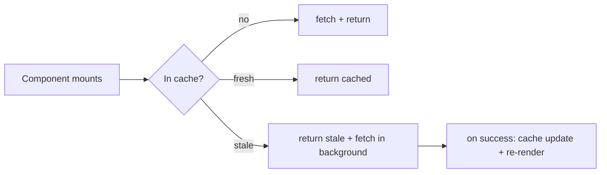

# Caching

netron-browser ships an LRU cache + CacheMiddleware; netron-react
layers a query cache on top with React-aware subscriptions.

## Two cache layers

| Layer | When to use |
| ----- | ----------- |
| **netron-browser LRU** | Vanilla JS / web workers / non-React clients |
| **netron-react QueryCache** | React apps — used by `useQuery` |

Both share the same TTL / stale-while-revalidate / tag
invalidation semantics. Pick one — don't double-cache.

## netron-react QueryCache

Used automatically by every `useQuery` / `useService(...).x.useQuery`:

```tsx
const { data, isLoading, isStale } = users.getUser.useQuery([userId], {
  staleTime:    30_000,
  gcTime:       5 * 60_000,
  refetchOnWindowFocus:  true,
  refetchOnReconnect:    true,
  refetchInterval:       60_000,
});
```

| Option | Default | Meaning |
| ------ | ------- | ------- |
| `staleTime` | `0` | Data is fresh for N ms; while fresh, no refetch on subscribe |
| `gcTime` | `5 * 60_000` | Drop from cache N ms after last subscriber unmounts |
| `refetchOnMount` | `true` | Refetch when a component mounts subscribing to this key |
| `refetchOnWindowFocus` | `false` | Refetch when tab regains focus |
| `refetchOnReconnect` | `true` | Refetch when WS / network reconnects |
| `refetchInterval` | `false` | Periodic refetch in ms |
| `enabled` | `true` | Skip the query when `false` |
| `placeholderData` | — | Initial value before first fetch |
| `select` | — | Transform `data` per subscription |

### Cache key

Generated from `[service, method, args]`:

```typescript
// All these are the same cache key:
users.getUser.useQuery(['u_42']);
users.getUser.useQuery(['u_42']);

// These are different keys:
users.getUser.useQuery(['u_42']);
users.getUser.useQuery(['u_43']);
```

Args are deep-equal-compared — `{a:1, b:2}` and `{b:2, a:1}`
match.

### Programmatic cache access

```tsx
import { useNetronClient } from '@omnitron-dev/netron-react';

function CacheManager() {
  const client = useNetronClient();
  const cache  = client.getQueryCache();

  return (
    <>
      <Button onClick={() => cache.invalidateQueries(['users'])}>
        Refresh all users queries
      </Button>
      <Button onClick={() => cache.removeQueries(['users', 'getUser', 'u_42'])}>
        Drop one specific
      </Button>
      <Button onClick={() => cache.setQueryData(['users', 'getUser', 'u_42'], updatedUser)}>
        Patch cached value
      </Button>
      <Button onClick={() => cache.clear()}>
        Nuke everything
      </Button>
    </>
  );
}
```

| Method | Effect |
| ------ | ------ |
| `getQueryData(key)` | Read cached data without subscribing |
| `setQueryData(key, data)` | Write to cache directly |
| `setQueryData(key, (old) => new)` | Functional update |
| `invalidateQueries(filter)` | Mark stale → subscribers refetch |
| `removeQueries(filter)` | Drop from cache |
| `cancelQueries(filter)` | Abort in-flight queries matching filter |
| `prefetchQuery(args)` | Warm cache without rendering |
| `clear()` | Drop everything |

### Filter patterns

```tsx
cache.invalidateQueries(['users']);                  // every users.* query
cache.invalidateQueries(['users', 'getUser']);       // every getUser
cache.invalidateQueries(['users', 'getUser', 'u_42']); // one specific
cache.invalidateQueries({ predicate: (q) => q.queryKey[0] === 'users' && q.state.dataUpdatedAt < Date.now() - 60_000 });
```

The functional `predicate` form lets you invalidate by age,
state, or any custom condition.

## Stale-while-revalidate

```tsx
users.getUser.useQuery([userId], {
  staleTime: 30_000,
  gcTime:    5 * 60_000,
});
```

Flow when component mounts:



`isStale` is exposed in the result — components can show a
subtle "refreshing" indicator while stale-while-revalidate
runs.

## Optimistic updates

```tsx
const updateProfile = users.updateProfile.useMutation({
  onMutate: async (newProfile) => {
    // 1. Cancel any in-flight queries that would clobber the optimistic update
    await cache.cancelQueries(['users', 'getUser', userId]);

    // 2. Snapshot the previous value
    const previous = cache.getQueryData(['users', 'getUser', userId]);

    // 3. Optimistically update
    cache.setQueryData(['users', 'getUser', userId], (old) => ({
      ...old,
      ...newProfile,
    }));

    // 4. Return context for rollback
    return { previous };
  },
  onError: (err, _newProfile, context) => {
    // Rollback to snapshot
    if (context?.previous) {
      cache.setQueryData(['users', 'getUser', userId], context.previous);
    }
  },
  onSettled: () => {
    // Always re-fetch authoritative state
    cache.invalidateQueries(['users', 'getUser', userId]);
  },
});
```

Pattern:
1. **Cancel** to avoid race with in-flight fetches.
2. **Snapshot** for rollback.
3. **Optimistic write** for instant UI feedback.
4. **Rollback on error** — restore snapshot.
5. **Invalidate on settled** — re-sync with server truth.

## Tag-based invalidation

For non-React (netron-browser LRU):

```typescript
import { LRUCache, CacheMiddleware } from '@omnitron-dev/netron-browser';

const cache = new LRUCache({
  maxSize:              1_000,
  defaultTTL:           60_000,
  staleWhileRevalidate: 10_000,
});

client.use(CacheMiddleware({ cache }));

// Tag queries with arbitrary labels:
await client
  .cache({ tags: ['user:u_42', 'tier:pro'] })
  .service<UserService>('users')
  .getUser('u_42');

// Later, when user u_42 changes:
cache.invalidateByTag('user:u_42');

// Or all pro-tier cached data:
cache.invalidateByTag('tier:pro');
```

Tags are arbitrary strings — typical patterns:

- `user:<id>` — invalidate one user's queries
- `tenant:<id>` — invalidate one tenant's queries
- `entity:<type>` — invalidate one collection
- `feature:<flag>` — invalidate when a flag flips

A single cache entry can carry multiple tags; invalidating any
one drops the entry.

## Prefetching

```tsx
import { useNetronClient } from '@omnitron-dev/netron-react';

function ProjectLink({ id }: { id: string }) {
  const client = useNetronClient();
  return (
    <Link
      to={`/projects/${id}`}
      onMouseEnter={() => {
        client.getQueryCache().prefetchQuery({
          service: 'projects',
          method:  'getProject',
          args:    [id],
        });
      }}
    >
      {name}
    </Link>
  );
}
```

When the user hovers a link, prefetch the target's data so the
destination renders instantly.

## Cache stats

```typescript
const stats = cache.getStats();
// { size, hits, misses, evictions, hitRatio }
```

Surface in devtools or a metrics dashboard.

## React Query parity

netron-react's QueryCache API is intentionally TanStack
Query–compatible at the high level — if you've used React
Query, the mental model carries over. The differences:

- Cache key is `[service, method, args]` not free-form.
- Backed by netron-browser, not raw fetch.
- Subscribes via `useService` / `useQuery` hooks; same shape.

## Best practices

- **`staleTime` ≥ 30 s** for most read queries — saves needless
  refetches.
- **`refetchOnWindowFocus: true`** for dashboards and admin
  surfaces — keeps data fresh after returning to a tab.
- **Optimistic updates** for fast-feedback mutations — but
  always invalidate on settled to converge with server truth.
- **Invalidate by widest sensible key** after mutations —
  invalidating `['users']` after creating a user catches `list`
  + `count` + `getUser` callers.
- **Use tags for non-React clients** — easier to reason about
  than key patterns.
- **Don't cache mutating calls.** `delete` / `update` should
  never read from cache.

## Anti-patterns

- **`staleTime: 0` everywhere.** Defeats caching; every mount
  refetches.
- **`gcTime: Infinity`.** Cache grows unboundedly; first call
  after page reload is cold anyway.
- **Manual cache writes from multiple components.** Use
  invalidation; manual writes drift.
- **Caching paginated lists without page-aware keys.**
  `[users, list, {page: 1}]` and `[users, list, {page: 2}]`
  must be separate keys.
- **Invalidating after every keystroke.** Debounce or move to
  `onBlur`.

## See also

- [Middleware](./middleware.md) — `CacheMiddleware` configuration
- [netron-react](./react.md) — `useQuery` / `useMutation`
- [Multi-backend](./multi-backend.md) — per-backend cache
