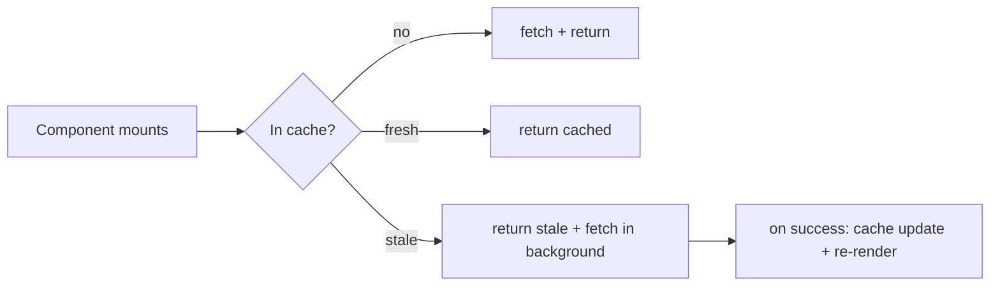

# Caching

netron-browser caches HTTP responses through its **fluent HTTP
interface** (`HttpCacheManager`); netron-react layers a query
cache on top with React-aware subscriptions.

## Two cache layers

| Layer | When to use |
| ----- | ----------- |
| **netron-browser fluent cache** (`HttpCacheManager`) | Vanilla JS / web workers / non-React HTTP clients |
| **netron-react QueryCache** | React apps — used by `useQuery` |

Both share the same TTL / stale-while-revalidate / tag
invalidation semantics. Pick one — don't double-cache.

> The fluent cache is opt-in per call (`.cache(...)`) on a
> service obtained via `peer.queryFluentInterface(...)`. The
> basic `createClient()` / `HttpClient` path does **not** cache —
> its `http.caching` / `http.cacheTTL` options are currently
> inert.

## netron-react QueryCache

Used automatically by every `useQuery` / `useService(...).x.useQuery`:

```tsx
const { data, isLoading, isStale } = users.getUser.useQuery([userId], {
  staleTime:    30_000,
  cacheTime:    5 * 60_000,
  refetchOnWindowFocus:  true,
  refetchOnReconnect:    true,
  refetchInterval:       60_000,
});
```

| Option | Default | Meaning |
| ------ | ------- | ------- |
| `staleTime` | `0` | Data is fresh for N ms; while fresh, no refetch on subscribe |
| `cacheTime` | `5 * 60_000` | Drop from cache N ms after last subscriber unmounts |
| `refetchOnMount` | `true` | Refetch when a component mounts subscribing to this key |
| `refetchOnWindowFocus` | `false` | Refetch when tab regains focus |
| `refetchOnReconnect` | `true` | Refetch when WS / network reconnects |
| `refetchInterval` | `false` | Periodic refetch in ms |
| `enabled` | `true` | Skip the query when `false` |
| `placeholderData` | — | Initial value before first fetch |
| `select` | — | Transform `data` per subscription |

### Cache key

Generated from `[service, method, args]`:

```typescript
// All these are the same cache key:
users.getUser.useQuery(['u_42']);
users.getUser.useQuery(['u_42']);

// These are different keys:
users.getUser.useQuery(['u_42']);
users.getUser.useQuery(['u_43']);
```

Args are deep-equal-compared — `{a:1, b:2}` and `{b:2, a:1}`
match.

### Programmatic cache access

```tsx
import { useNetronClient } from '@omnitron-dev/netron-react';

function CacheManager() {
  const client = useNetronClient();
  const cache  = client.getQueryCache();

  return (
    <>
      <Button onClick={() => client.invalidateQueries({ queryKey: ['users'] })}>
        Refresh all users queries
      </Button>
      <Button onClick={() => client.removeQueries({ queryKey: ['users', 'getUser', 'u_42'] })}>
        Drop one specific
      </Button>
      <Button onClick={() => cache.set(['users', 'getUser', 'u_42'], updatedUser)}>
        Patch cached value
      </Button>
      <Button onClick={() => client.clear()}>
        Nuke everything
      </Button>
    </>
  );
}
```

The TanStack-style filter methods live on the **client**; the
low-level read/write methods live on the **QueryCache**
(`client.getQueryCache()`):

| Method | Lives on | Effect |
| ------ | -------- | ------ |
| `getQueryCache().get(key)` | cache | Read cached data without subscribing |
| `getQueryCache().set(key, data)` | cache | Write to cache directly |
| `invalidateQueries(filters)` | client | Mark stale → subscribers refetch |
| `removeQueries(filters)` | client | Drop from cache |
| `cancelQueries(filters)` | client | Abort in-flight queries matching filter |
| `prefetchQuery(key, fetcher)` | client | Warm cache without rendering |
| `clear()` | client | Drop everything |

To patch a cached value functionally, read-then-set:

```tsx
const prev = cache.get(['users', 'getUser', 'u_42']);
cache.set(['users', 'getUser', 'u_42'], { ...prev, ...patch });
```

### Filter patterns

The client's filter methods take a `QueryFilters` object —
`{ queryKey?, exact?, status?, stale?, fetching?, predicate? }`.
`queryKey` is a prefix match by default; add `exact: true` for
an exact match.

```tsx
client.invalidateQueries({ queryKey: ['users'] });                  // every users.* query
client.invalidateQueries({ queryKey: ['users', 'getUser'] });       // every getUser
client.invalidateQueries({ queryKey: ['users', 'getUser', 'u_42'], exact: true }); // one specific
client.invalidateQueries({ predicate: (q) => q.queryKey[0] === 'users' && q.state.dataUpdatedAt < Date.now() - 60_000 });
```

The functional `predicate` form lets you invalidate by age,
state, or any custom condition.

## Stale-while-revalidate

```tsx
users.getUser.useQuery([userId], {
  staleTime: 30_000,
  cacheTime: 5 * 60_000,
});
```

Flow when component mounts:


```mermaid
flowchart LR
  Mount[Component mounts]
  Mount --> Check{In cache?}
  Check -- no --> Fetch[fetch + return]
  Check -- fresh --> Return[return cached]
  Check -- stale --> Revalidate[return stale + fetch in background]
  Revalidate --> UpdateCache[on success: cache update + re-render]
```

`isStale` is exposed in the result — components can show a
subtle "refreshing" indicator while stale-while-revalidate
runs.

## Optimistic updates

```tsx
const updateProfile = users.updateProfile.useMutation({
  onMutate: async (newProfile) => {
    // 1. Cancel any in-flight queries that would clobber the optimistic update
    client.cancelQueries({ queryKey: ['users', 'getUser', userId] });

    // 2. Snapshot the previous value
    const previous = cache.get(['users', 'getUser', userId]);

    // 3. Optimistically update
    cache.set(['users', 'getUser', userId], {
      ...previous,
      ...newProfile,
    });

    // 4. Return context for rollback
    return { previous };
  },
  onError: (err, _newProfile, context) => {
    // Rollback to snapshot
    if (context?.previous) {
      cache.set(['users', 'getUser', userId], context.previous);
    }
  },
  onSettled: () => {
    // Always re-fetch authoritative state
    client.invalidateQueries({ queryKey: ['users', 'getUser', userId] });
  },
});
```

Pattern:
1. **Cancel** to avoid race with in-flight fetches.
2. **Snapshot** for rollback.
3. **Optimistic write** for instant UI feedback.
4. **Rollback on error** — restore snapshot.
5. **Invalidate on settled** — re-sync with server truth.

## Tag-based invalidation

For non-React HTTP clients, attach an `HttpCacheManager` to the
peer and tag calls through the fluent `.cache({ tags })`:

```typescript
import { HttpCacheManager } from '@omnitron-dev/netron-browser';

const cache = new HttpCacheManager({ maxEntries: 1_000 });
peer.setCacheManager(cache);

const users = await peer.queryFluentInterface<UserService>('users@1.0.0');

// Tag a cached call with arbitrary labels:
await users
  .cache({
    maxAge:               60_000,
    staleWhileRevalidate: 10_000,
    tags:                 ['user:u_42', 'tier:pro'],
  })
  .api.getUser('u_42');

// Later, when user u_42 changes — invalidate by tag.
// (The array form of invalidate() matches tags; a bare string
// matches cache keys, so pass tags as an array.)
cache.invalidate(['user:u_42']);

// Or all pro-tier cached data:
cache.invalidate(['tier:pro']);
```

Tags are arbitrary strings — typical patterns:

- `user:<id>` — invalidate one user's queries
- `tenant:<id>` — invalidate one tenant's queries
- `entity:<type>` — invalidate one collection
- `feature:<flag>` — invalidate when a flag flips

A single cache entry can carry multiple tags; invalidating any
one drops the entry. `cache.invalidate()` also accepts a key
`RegExp` or a `'prefix*'` string for pattern-based invalidation.

## Prefetching

```tsx
import { useNetronClient, useService } from '@omnitron-dev/netron-react';

function ProjectLink({ id }: { id: string }) {
  const client   = useNetronClient();
  const projects = useService<ProjectService>('projects');
  return (
    <Link
      to={`/projects/${id}`}
      onMouseEnter={() => {
        client.prefetchQuery(
          ['projects', 'getProject', id],
          () => projects.getProject.call(id),
        );
      }}
    >
      {name}
    </Link>
  );
}
```

When the user hovers a link, prefetch the target's data so the
destination renders instantly.

## Cache stats

The fluent `HttpCacheManager` exposes hit/miss statistics:

```typescript
const stats = cache.getStats();
// CacheStats:
//   { entries, hits, misses, hitRate, sizeBytes, activeRevalidations }
```

Surface in devtools or a metrics dashboard.

## React Query parity

netron-react's QueryCache API is intentionally TanStack
Query–compatible at the high level — if you've used React
Query, the mental model carries over. The differences:

- Cache key is `[service, method, args]` not free-form.
- Backed by netron-browser, not raw fetch.
- Subscribes via `useService` / `useQuery` hooks; same shape.

## Best practices

- **`staleTime` ≥ 30 s** for most read queries — saves needless
  refetches.
- **`refetchOnWindowFocus: true`** for dashboards and admin
  surfaces — keeps data fresh after returning to a tab.
- **Optimistic updates** for fast-feedback mutations — but
  always invalidate on settled to converge with server truth.
- **Invalidate by widest sensible key** after mutations —
  invalidating `['users']` after creating a user catches `list`
  + `count` + `getUser` callers.
- **Use tags for non-React clients** — easier to reason about
  than key patterns.
- **Don't cache mutating calls.** `delete` / `update` should
  never read from cache.

## Anti-patterns

- **`staleTime: 0` everywhere.** Defeats caching; every mount
  refetches.
- **`cacheTime: Infinity`.** Cache grows unboundedly; first call
  after page reload is cold anyway.
- **Manual cache writes from multiple components.** Use
  invalidation; manual writes drift.
- **Caching paginated lists without page-aware keys.**
  `[users, list, {page: 1}]` and `[users, list, {page: 2}]`
  must be separate keys.
- **Invalidating after every keystroke.** Debounce or move to
  `onBlur`.

## See also

- [Browser client](./browser.md#fluent-http-interface--caching-retry-circuit-breaking) — fluent `HttpCacheManager` / `.cache()`
- [netron-react](./react.md) — `useQuery` / `useMutation`
- [Multi-backend](./multi-backend.md) — shared cache across backends
