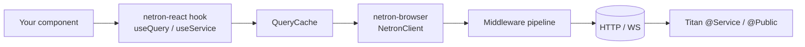

# Netron in the browser

> **Note about server-side Netron:** the server lives inside
> Titan itself at `@omnitron-dev/titan/netron` — including all
> four transports (HTTP / WebSocket / TCP / Unix). You don't
> install a separate package for the server. This section
> covers the **browser-side** clients only.

Two packages cover the browser side of Netron RPC:

| Package | Role | Framework |
| ------- | ---- | --------- |
| [`@omnitron-dev/netron-browser`](./browser.md) | Transport layer — HTTP, WebSocket, middleware, auth, multi-backend | **Framework-agnostic** — vanilla JS, Vue, Svelte, Solid, Angular, Lit, React, Web Workers, Electron |
| [`@omnitron-dev/netron-react`](./react.md) | React-specific hooks, providers, cache, devtools | **React-only** |

For React apps you install both. For non-React apps install
just `netron-browser`:

```bash
# React apps:
pnpm add @omnitron-dev/netron-browser @omnitron-dev/netron-react

# Vue / Svelte / Solid / Angular / Lit / vanilla JS:
pnpm add @omnitron-dev/netron-browser
```

## How they relate



**`netron-browser` is the foundation** and works in any
JavaScript environment. **`netron-react` is an optional layer**
that adds React glue: cache, suspense, providers, devtools,
multi-backend hooks. For Vue / Svelte / Solid / Angular / Lit
apps, wrap `netron-browser` calls in your framework's
reactivity primitives directly.

## Deep dives

Topic-focused references:

- [Transports](./transports.md) — HTTP, WebSocket, auto-mode, reconnect tuning
- [Middleware](./middleware.md) — three-stage pipeline, built-in middleware, custom middleware
- [Caching](./caching.md) — LRU cache, stale-while-revalidate, tag invalidation
- [Auth manager](./auth.md) — token rotation, cross-tab sync, inactivity timeout
- [Multi-backend](./multi-backend.md) — `MultiBackendProvider`, routing, per-backend hooks
- [Error handling](./errors.md) — typed errors, retry classification, circuit breaker
- [Testing](./testing.md) — MockProvider, integration patterns
- [SSR](./ssr.md) — dehydration / hydration

## Quick start — single backend

```tsx
import { NetronReactClient, NetronProvider, useService }
  from '@omnitron-dev/netron-react';

interface UserService {
  getUser(id: string): Promise<User>;
}

const client = new NetronReactClient({
  url:       'https://api.example.com',
  transport: 'auto',
});

function App() {
  return (
    <NetronProvider client={client}>
      <UserCard userId="u_42" />
    </NetronProvider>
  );
}

function UserCard({ userId }: { userId: string }) {
  const users = useService<UserService>('users');
  const { data, isLoading } = users.getUser.useQuery([userId]);
  return isLoading ? <Skeleton /> : <div>{data.email}</div>;
}
```

## Quick start — multi-backend

```tsx
import { MultiBackendProvider, useBackendService }
  from '@omnitron-dev/netron-react';

<MultiBackendProvider
  backends={{
    auth:    { url: 'https://auth.example.com',    transport: 'auto' },
    media:   { url: 'https://media.example.com',   transport: 'auto' },
    streams: { url: 'wss://streams.example.com',   transport: 'websocket' },
  }}
  routes={{
    'users.*':   'auth',
    'objects.*': 'media',
    'events.*':  'streams',
  }}
>
  <Outlet />
</MultiBackendProvider>

function Component() {
  const users = useBackendService<UserService>('auth', 'users');
  const { data } = users.getUser.useQuery([id]);
}
```

## See also

- [Prism / Netron integration](../prism/index.md#netron-integration--omnitron-devprismnetron) —
  re-export helpers via Prism
- [Titan / Netron](../../titan/netron.md) — server side
- [Architecture](../../titan/concepts/architecture.md) — full
  cross-stack picture
