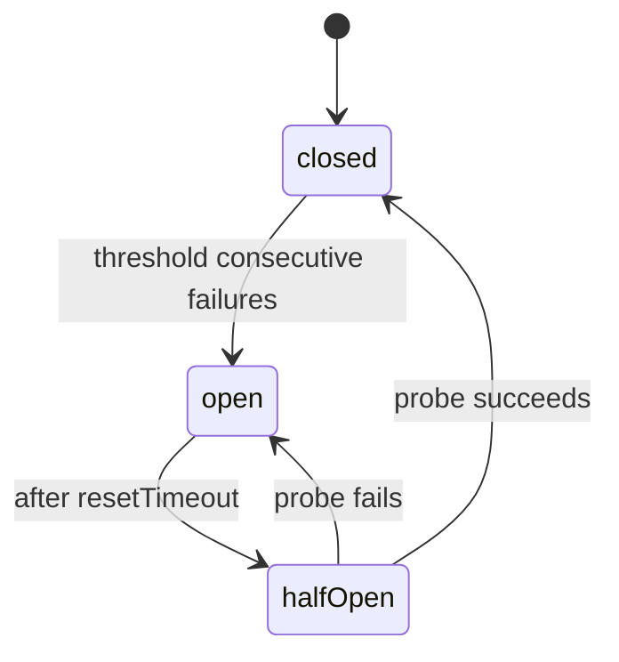

# Middleware

The middleware pipeline runs around every RPC invocation —
auth, retry, cache, logging, tracing, circuit breaking, custom
hooks. Three stages, prioritised within each.

## Three-stage pipeline

```mermaid
flowchart LR
  Inv[client.invoke&#40;...&#41;] --> Pre[pre-request stage]
  Pre --> Send[transport.send]
  Send -- ok --> Post[post-response stage]
  Send -- throws --> Err[error stage]
  Post --> Out[return value]
  Err --> Out
  Err -. recovered .-> Post
```



| Stage | Runs | Typical uses |
| ----- | ---- | ------------ |
| **pre-request** | Before transport call | Attach auth header, check cache, trace context start |
| **post-response** | After successful transport call | Cache the response, emit metrics, end trace |
| **error** | After transport throws | Retry, circuit-break, refresh token + retry, transform errors |

Within a stage, lower `priority` runs first. The error stage can
re-enter the pipeline (e.g., RetryMiddleware calling `next()`
again) — bounded by max attempts.

## Middleware shape

```typescript
interface NetronMiddleware {
  name?:    string;             // for devtools display
  stage:    'pre' | 'post' | 'error' | 'all';
  priority: number;             // lower runs first
  handler:  (ctx: MiddlewareContext, next: () => Promise<unknown>) => Promise<unknown>;
}

interface MiddlewareContext {
  service:   string;
  method:    string;
  args:      unknown[];
  request:   { headers: Record<string, string>; hints?: RequestHints };
  response?: unknown;           // populated in post / error stages
  error?:    unknown;           // populated in error stage
  attempt:   number;            // 1-based; retry middleware increments
  metadata:  Map<string, unknown>;   // arbitrary state passed between middleware
}
```

## Registering middleware

```typescript
client.use(AuthMiddleware({ getToken: () => localStorage.getItem('token') }));
client.use(RetryMiddleware({ maxAttempts: 3 }));
client.use(CacheMiddleware({ ttl: 60_000 }));
```

Or pass via options:

```typescript
const client = createClient({
  url: 'https://api.example.com',
  middleware: [
    AuthMiddleware({ ... }),
    RetryMiddleware({ ... }),
    CacheMiddleware({ ... }),
  ],
});
```

## Built-in middleware

### `AuthMiddleware`

```typescript
import { AuthMiddleware } from '@omnitron-dev/netron-browser/middleware';

client.use(AuthMiddleware({
  getToken:     () => authManager.getAccessToken(),
  headerName:   'Authorization',
  scheme:       'Bearer',
  onUnauthorized: async () => {
    await authManager.refresh();
  },
}));
```

| Option | Default | Notes |
| ------ | ------- | ----- |
| `getToken` | — | Sync or async function |
| `headerName` | `'Authorization'` | |
| `scheme` | `'Bearer'` | Set to `''` for raw token |
| `onUnauthorized` | — | Called on 401; if it returns, the call is retried with refreshed token |
| `skipFor` | `[]` | Service patterns to skip (`['public.*']`) |

When integrated with `AuthManager` (see [Auth](./auth.md)), the
middleware reads from there directly — no manual `getToken`
needed.

### `RetryMiddleware`

```typescript
client.use(RetryMiddleware({
  maxAttempts: 3,
  on:          ['network', '5xx', 'timeout', 'ECONNRESET'],
  backoff: {
    type:   'exponential',
    base:   500,
    max:    8_000,
    jitter: true,
  },
  shouldRetry: (error, attempt, ctx) => {
    if (ctx.method.startsWith('delete')) return false;   // skip mutating calls
    return true;
  },
}));
```

`on` accepts:
- `'network'` — any `NetworkError`
- `'timeout'` — `TimeoutError`
- `'5xx'` — any error with `code >= 500`
- specific `ErrorCode` values
- specific error class names

The breaker check (see below) takes precedence — if the breaker
is open, no retry is attempted.

### `CircuitBreakerMiddleware`

```typescript
client.use(CircuitBreakerMiddleware({
  threshold:    5,             // open after 5 consecutive failures
  resetTimeout: 30_000,        // try half-open after 30s
  on:           ['5xx', 'timeout', 'network'],
  perService:   true,          // separate breakers per service name
}));
```

States:



When **open**, calls fail-fast with `CircuitOpenError` — never
hitting the network. After `resetTimeout` the breaker enters
**half-open**: one probe call is allowed; success closes,
failure re-opens.

### `CacheMiddleware`

```typescript
client.use(CacheMiddleware({
  ttl:                 60_000,
  staleWhileRevalidate: 10_000,
  maxSize:             500,
  skipFor:             ['*.create', '*.update', '*.delete'],
  keyBy: (ctx) => `${ctx.service}.${ctx.method}.${JSON.stringify(ctx.args)}`,
}));
```

Cache hits return immediately. Stale-while-revalidate serves
the stale value and refreshes in the background up to
`staleWhileRevalidate` ms past the TTL.

See [Caching](./caching.md) for the full LRU + tag-invalidation
API.

### `LoggingMiddleware`

```typescript
client.use(LoggingMiddleware({
  logger: (entry) => console.debug('[netron]', entry),
  stages: ['pre', 'post', 'error'],
  redact: ['args.0.password', 'args.0.secret'],
}));
```

Each log entry:

```typescript
{
  service:    string;
  method:     string;
  attempt:    number;
  stage:      'pre' | 'post' | 'error';
  durationMs: number;
  args?:      unknown[];        // redacted
  result?:    unknown;
  error?:     unknown;
}
```

### `TracingMiddleware`

```typescript
client.use(TracingMiddleware({
  tracer:        otelTracer,
  serviceName:   'web',
  propagator:    'w3c',         // 'w3c' | 'jaeger'
}));
```

Starts a span per RPC call; injects W3C `traceparent` header so
the server's spans connect to the client's.

### `MetricsMiddleware`

```typescript
client.use(MetricsMiddleware({
  onMetric: (metric) => {
    if (metric.name === 'rpc.call.duration') {
      analytics.recordTiming(metric.value, metric.labels);
    }
  },
}));
```

Emits standard metrics:
- `rpc.call.total` (counter, labels: service, method, status)
- `rpc.call.duration` (histogram, labels: service, method)
- `rpc.call.error.total` (counter, labels: service, method, code)

## Custom middleware

```typescript
import type { NetronMiddleware } from '@omnitron-dev/netron-browser';

const TimingMiddleware: NetronMiddleware = {
  name:     'timing',
  stage:    'all',
  priority: 100,
  handler:  async (ctx, next) => {
    const start = performance.now();
    try {
      const result = await next();
      console.debug(`[ok] ${ctx.service}.${ctx.method}`, performance.now() - start, 'ms');
      return result;
    } catch (e) {
      console.debug(`[err] ${ctx.service}.${ctx.method}`, performance.now() - start, 'ms', e);
      throw e;
    }
  },
};

client.use(TimingMiddleware);
```

### Useful patterns

**Tenant scoping**:

```typescript
const TenantMiddleware: NetronMiddleware = {
  stage:    'pre',
  priority: 50,
  handler:  async (ctx, next) => {
    ctx.request.headers['X-Tenant-ID'] = getCurrentTenant();
    return next();
  },
};
```

**Conditional fall-back to mock**:

```typescript
const MockFallbackMiddleware: NetronMiddleware = {
  stage:    'error',
  priority: 1_000,         // run last
  handler:  async (ctx, next) => {
    if (import.meta.env.MODE === 'development' && ctx.error instanceof NetworkError) {
      const mock = mocks[`${ctx.service}.${ctx.method}`];
      if (mock) return mock(ctx.args);
    }
    return next();        // re-throw
  },
};
```

**Error tagging for Sentry**:

```typescript
const SentryMiddleware: NetronMiddleware = {
  stage:    'error',
  priority: 200,
  handler:  async (ctx, next) => {
    Sentry.withScope((scope) => {
      scope.setTag('rpc.service', ctx.service);
      scope.setTag('rpc.method',  ctx.method);
      scope.setContext('rpc',     { args: ctx.args, attempt: ctx.attempt });
      Sentry.captureException(ctx.error);
    });
    return next();        // re-throw
  },
};
```

## Per-call middleware via fluent API

Override middleware behaviour for one call without registering
globally:

```typescript
const user = await client
  .cache({ ttl: 5 * 60_000, tags: ['users'] })
  .retry({ maxAttempts: 5, on: ['network', 'timeout'] })
  .timeout(3_000)
  .skipMiddleware(['logging'])
  .service<UserService>('users')
  .findById(id);
```

Per-call config wins over global config.

## Ordering rules

Within a stage, lower priority runs first. Typical ordering:

| Priority | Middleware | Why |
| -------- | ---------- | --- |
| 0–10 | Tracing (pre) | Start span before everything else |
| 10–30 | Auth | Attach header before transport |
| 30–50 | Tenant / context | Other request-context attributes |
| 50–80 | Cache (pre check) | Skip transport on hit |
| 80–100 | Custom hooks | App-specific |
| (transport runs) | | |
| 0–10 | Cache (post write) | Capture response |
| 10–30 | Metrics | Record latency / status |
| 30–50 | Logging | Final log |
| 50–80 | Tracing (post end) | End span |

Error stage: retry → circuit-breaker (after) → error transform
→ sentry → re-throw.

## Devtools

When `<NetronDevtools>` is mounted, the middleware chain for
each call is visible in the panel — useful for debugging
ordering issues.

## Best practices

- **Idempotent middleware.** Re-entry from retry should
  produce the same effect.
- **Don't mutate `ctx.args` after `next()`.** Other middleware
  in the chain may have captured them.
- **Bound everything.** Retry has max attempts; cache has TTL;
  circuit breaker has reset timeout.
- **Skip mutating calls in retry.** Use `shouldRetry` or
  `skipFor` to keep deletes/updates safe.
- **Devtools-friendly `name`.** Helps when the chain grows
  past 5 middlewares.

## Anti-patterns

- **Logging full request body in production.** Sensitive
  values leak; use `redact`.
- **Retry without circuit breaker.** A flapping backend gets
  hammered; the breaker prevents amplification.
- **Cache mutating calls.** `update` should never read from
  cache; use `skipFor` patterns.
- **Async work in `pre` stage that doesn't `await`.** Fires
  and forgets — middleware ordering breaks.

## See also

- [Caching](./caching.md) — `CacheMiddleware` deep-dive
- [Auth manager](./auth.md) — `AuthMiddleware` + auto-refresh
- [Error handling](./errors.md) — retry classification
- [Transports](./transports.md) — what middleware wraps
