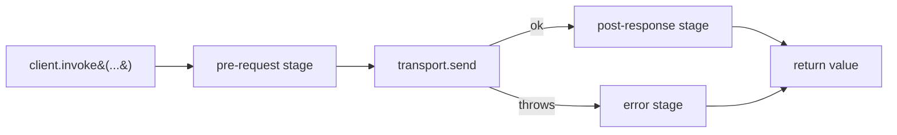

# Middleware

The middleware pipeline runs around every RPC invocation —
auth, logging, timing, error transformation, CSRF, custom hooks.
Three stages, prioritised within each.

Middleware in `@omnitron-dev/netron-browser` are **factory
functions that return a `MiddlewareFunction`** — there are no
middleware classes. You register them on an `HttpClient` or
`WebSocketClient` (not on `NetronClient` — see
[Registering middleware](#registering-middleware)).

## Three-stage pipeline


```mermaid
flowchart LR
  Inv[client.invoke&#40;...&#41;] --> Pre[pre-request stage]
  Pre --> Send[transport.send]
  Send -- ok --> Post[post-response stage]
  Send -- throws --> Err[error stage]
  Post --> Out[return value]
  Err --> Out
```

| Stage | Constant | Runs | Typical uses |
| ----- | -------- | ---- | ------------ |
| `pre-request` | `MiddlewareStage.PRE_REQUEST` | Before transport call | Attach auth header, attach CSRF token, start timing |
| `post-response` | `MiddlewareStage.POST_RESPONSE` | After successful transport call | Log/measure the response, read response headers |
| `error` | `MiddlewareStage.ERROR` | After transport throws | Refresh-token-and-retry (auth), transform errors |

Within a stage, lower `priority` runs first (default `100`). The
error stage runs your error middleware; on the HTTP transport, a
middleware that signals an auth retry triggers exactly **one**
re-send of the request (see
[`createAuthErrorMiddleware`](#createautherrormiddleware)).

> Retry, caching, and circuit-breaking are **not** middleware in
> this package — see [Not middleware](#not-middleware).

## Middleware shape

A middleware is a plain function: `(ctx, next) => …`. Call
`await next()` to run the rest of the chain.

```typescript
import type {
  MiddlewareFunction,
  ClientMiddlewareContext,
} from '@omnitron-dev/netron-browser';

// type MiddlewareFunction =
//   (ctx: ClientMiddlewareContext, next: () => Promise<void>)
//     => Promise<void> | void;

const myMiddleware: MiddlewareFunction = async (ctx, next) => {
  // ...before
  await next();
  // ...after
};
```

The context (`ClientMiddlewareContext`):

```typescript
interface ClientMiddlewareContext {
  service: string;
  method: string;
  args: any[];

  request?: {
    headers?: Record<string, string>;
    timeout?: number;
    metadata?: Record<string, any>;
    credentials?: RequestCredentials; // cookie/hybrid mode → 'include'
  };

  response?: {
    data?: any;
    headers?: Record<string, string>;
    metadata?: Record<string, any>;
  };

  error?: Error;                       // populated in the error stage

  timing: {
    start: number;
    end?: number;
    middlewareTimes: Map<string, number>;
  };

  metadata: Map<string, any>;          // shared state across middleware
  skipRemaining?: boolean;             // set to short-circuit the chain
  transport: 'http' | 'websocket';
}
```

The per-middleware config (`MiddlewareConfig`, all optional except
`name`):

```typescript
interface MiddlewareConfig {
  name: string;                                       // for metrics/debug
  priority?: number;                                  // default 100; lower runs first
  condition?: (ctx: ClientMiddlewareContext) => boolean;
  onError?: (error: Error, ctx: ClientMiddlewareContext) => void;
  services?: string[] | RegExp;                       // restrict to services
  methods?: string[] | RegExp;                        // restrict to methods
}
```

## Registering middleware

`client.use(middleware, config?, stage?)` registers a middleware
and returns `this` (chainable). Available on `HttpClient` and
`WebSocketClient`. `stage` defaults to
`MiddlewareStage.PRE_REQUEST`.

```typescript
import { HttpClient } from '@omnitron-dev/netron-browser/client';
import {
  createAuthMiddleware,
  createLoggingMiddleware,
  StorageTokenProvider,
  MiddlewareStage,
} from '@omnitron-dev/netron-browser';

const client = new HttpClient({ url: 'https://api.example.com' });

client
  .use(createAuthMiddleware({
    tokenProvider: new StorageTokenProvider(localStorage, 'token'),
  }))
  .use(createLoggingMiddleware({ logRequestPayload: true }));
```

Or build a pipeline up front and pass it in. The `middleware`
option is a **single** `IMiddlewareManager` (a `MiddlewarePipeline`
instance) — **not an array**:

```typescript
import {
  MiddlewarePipeline,
  createLoggingMiddleware,
  createTimingMiddleware,
} from '@omnitron-dev/netron-browser';

const pipeline = new MiddlewarePipeline();
pipeline.use(createLoggingMiddleware());
pipeline.use(createTimingMiddleware());

const client = new HttpClient({
  url: 'https://api.example.com',
  middleware: pipeline,
});
```

**`createClient()` / `NetronClient` has no middleware option.** The
high-level `createClient()` / `NetronClient` API exposes **no**
middleware option. To register middleware, construct an
`HttpClient` or `WebSocketClient` directly and use `.use(...)` (or
the `middleware` pipeline option above).

## Built-in middleware

Most factories are importable from the package root
(`@omnitron-dev/netron-browser`). The two auth **error** helpers
live only on the `/middleware` subpath — they are noted inline.

### `createAuthMiddleware`

Attaches the auth token to outgoing requests in the **pre-request**
stage. `tokenProvider` is required; everything else is optional.
A `transport` strategy (bearer / cookie / hybrid) can be supplied
for T#176 cookie-mode; if omitted, a bearer transport is
synthesised from the legacy `headerName` / `tokenPrefix` options.

```typescript
import {
  createAuthMiddleware,
  StorageTokenProvider,
  SimpleTokenProvider,
} from '@omnitron-dev/netron-browser';

client.use(createAuthMiddleware({
  tokenProvider: new StorageTokenProvider(localStorage, 'access_token'),
  // headerName:  'Authorization',  // default
  // tokenPrefix: 'Bearer ',        // default
  skipServices: ['public'],
  skipMethods:  ['auth@1.0.0.signin'],
}));
```

| Option | Default | Notes |
| ------ | ------- | ----- |
| `tokenProvider` | — | **Required.** `{ getToken(): string \| null \| Promise<string \| null>; getTokenType?(): string }` |
| `transport` | bearer (synthesised) | `IClientTokenTransport` strategy; cookie/hybrid set `credentials: 'include'` |
| `headerName` | `'Authorization'` | Legacy bearer-only; ignored when `transport` is given |
| `tokenPrefix` | `'Bearer '` | Legacy bearer-only; ignored when `transport` is given |
| `skipServices` | `[]` | Service names to skip |
| `skipMethods` | `[]` | `service.method` pairs to skip |

Token-provider helpers:

- `SimpleTokenProvider(token | () => string | null)` — wrap a
  static string or getter.
- `StorageTokenProvider(storage, key)` — read from
  `localStorage` / `sessionStorage`.

### `createAuthErrorMiddleware`

> Import from the **`/middleware` subpath** —
> `@omnitron-dev/netron-browser/middleware`. These two helpers are
> not re-exported from the package root.

An **error**-stage middleware that handles auth failures: on 401
it refreshes the token via the `AuthenticationClient` and signals
a retry (the HTTP transport re-sends once); 403 and 429 surface
through callbacks. Register it on the `ERROR` stage.

```typescript
import { AuthenticationClient } from '@omnitron-dev/netron-browser/auth';
import {
  createAuthErrorMiddleware,
  MiddlewareStage,
} from '@omnitron-dev/netron-browser/middleware';

const authClient = new AuthenticationClient({ autoRefresh: true });

client.use(
  createAuthErrorMiddleware({
    authClient,
    onSessionExpired: () => { window.location.href = '/login'; },
    onAccessDenied:   (details) => showNotification(details),
    onRateLimited:    (retryAfter) => warn(`Retry after ${retryAfter}s`),
    maxRetries: 1,
  }),
  { name: 'auth-error-handler', priority: 10 },
  MiddlewareStage.ERROR,
);
```

| Option | Default | Notes |
| ------ | ------- | ----- |
| `authClient` | — | **Required.** `AuthenticationClient` used for refresh |
| `onSessionExpired` | — | Called on 401 when refresh fails |
| `onAccessDenied` | — | Called on 403 with `{ service, method, userId?, requiredPermissions?, details? }` |
| `onRateLimited` | — | Called on 429 with `retryAfter` seconds |
| `maxRetries` | `1` | Max refresh-and-retry attempts |
| `retryStatusCodes` | `[401]` | Codes that trigger refresh+retry |
| `emitEvents` | `true` | Emit events on the auth client |

There is also a shorthand:

```typescript
import { createSimpleAuthErrorMiddleware } from '@omnitron-dev/netron-browser/middleware';

client.use(
  createSimpleAuthErrorMiddleware(authClient, {
    onSessionExpired: () => { window.location.href = '/login'; },
  }),
  undefined,
  MiddlewareStage.ERROR,
);
```

### `createLoggingMiddleware`

Logs requests, responses, and errors. Wraps all three stages
around `next()`.

```typescript
import {
  createLoggingMiddleware,
  ConsoleLogger,
} from '@omnitron-dev/netron-browser';

client.use(createLoggingMiddleware({
  logger: new ConsoleLogger('[netron]'),
  logRequestPayload:  true,
  logResponsePayload: false,
}));
```

| Option | Default | Notes |
| ------ | ------- | ----- |
| `logger` | `new ConsoleLogger()` | Any `Logger` (`debug`/`info`/`warn`/`error`) |
| `requestLogLevel` | `'info'` | `LogLevel` |
| `responseLogLevel` | `'info'` | `LogLevel` |
| `errorLogLevel` | `'error'` | `LogLevel` |
| `logRequestPayload` | `false` | Include `ctx.args` — avoid in prod |
| `logResponsePayload` | `false` | Include `ctx.response.data` |
| `skipServices` / `skipMethods` | `[]` | Skip lists |

Also exported: the `Logger` interface, `ConsoleLogger` class, and
`LogLevel` type.

### `createTimingMiddleware`

Measures call duration via the `performance` API, records to a
collector, and can flag slow calls.

```typescript
import {
  createTimingMiddleware,
  InMemoryMetricsCollector,
} from '@omnitron-dev/netron-browser';

const collector = new InMemoryMetricsCollector(1000);

client.use(createTimingMiddleware({
  collector,
  slowThreshold: 1000,
  onSlowRequest: (m) => console.warn('slow', m.service, m.method, m.duration),
  onMeasure:     (m) => analytics.record(m),
}));

collector.getAverageDuration('users', 'findById');
collector.getSlowestCalls(10);
```

| Option | Default | Notes |
| ------ | ------- | ----- |
| `collector` | — | `MetricsCollector`; `InMemoryMetricsCollector` provided |
| `onMeasure` | — | `(metrics: PerformanceMetrics) => void` per call |
| `slowThreshold` | — | ms threshold for the slow-call callback |
| `onSlowRequest` | console.warn | Called when `duration > slowThreshold` |
| `skipServices` / `skipMethods` | `[]` | Skip lists |

Also exported: `MetricsCollector` / `PerformanceMetrics` types and
`InMemoryMetricsCollector` (package root). For observing the emitted
`performance.measure` entries there is also `createPerformanceObserver(cb)`,
which is exported only from the `/middleware` subpath
(`@omnitron-dev/netron-browser/middleware`), not the package root.

### `createErrorTransformMiddleware`

An **error**-stage middleware that normalises thrown errors into a
consistent `NormalizedError` shape and (optionally) maps codes to
user-facing messages.

```typescript
import {
  createErrorTransformMiddleware,
  CommonErrorMessages,
} from '@omnitron-dev/netron-browser';

client.use(createErrorTransformMiddleware({
  errorMessages: CommonErrorMessages,
  includeStack:  false,
  onError: (normalized) => Sentry.captureException(normalized),
}));
```

| Option | Default | Notes |
| ------ | ------- | ----- |
| `transformer` | `defaultErrorTransformer` | `(error, { service, method, transport }) => NormalizedError \| Error` |
| `onError` | — | Called with the normalised error |
| `includeStack` | `true` | Include `error.stack` |
| `includeContext` | `true` | Include `service` / `method` |
| `errorMessages` | `{}` | Map of error code → message |
| `skipServices` / `skipMethods` | `[]` | Skip lists |

Also exported: `defaultErrorTransformer`, `CommonErrorMessages`,
and the guards `isRetryableError`, `isClientError`,
`isServerError`.

### `createCsrfMiddleware`

Pre-request middleware for cookie-mode auth (T#176). Reads the
CSRF cookie and echoes it in the `X-CSRF-Token` header
(double-submit). No-ops outside the browser or before the cookie
is set.

```typescript
import { createCsrfMiddleware } from '@omnitron-dev/netron-browser';

client.use(createCsrfMiddleware({
  // cookieName: 'omni_csrf',   // default
  // headerName: 'X-CSRF-Token', // default
  skipMethods: ['auth@1.0.0.signin', 'auth@1.0.0.refresh'],
}));
```

| Option | Default | Notes |
| ------ | ------- | ----- |
| `cookieName` | `'omni_csrf'` | CSRF cookie to read |
| `headerName` | `'X-CSRF-Token'` | Header to echo it in |
| `skipMethods` | `[]` | `service.method` pairs the server has exempted |

Register this alongside `createAuthMiddleware` when using the
cookie token transport; bearer mode does not need it.

## Custom middleware

Any `(ctx, next)` function works. Read/write `ctx.request.headers`
before `next()`; inspect `ctx.response` / `ctx.error` after.

```typescript
import type { MiddlewareFunction } from '@omnitron-dev/netron-browser';

const tenantMiddleware: MiddlewareFunction = async (ctx, next) => {
  if (!ctx.request) ctx.request = {};
  if (!ctx.request.headers) ctx.request.headers = {};
  ctx.request.headers['X-Tenant-ID'] = getCurrentTenant();
  await next();
};

client.use(tenantMiddleware, { name: 'tenant', priority: 50 });
```

### Useful patterns

**Skip transport on a cache hit** (set `skipRemaining` and
populate `ctx.response`):

```typescript
const cacheReadMiddleware: MiddlewareFunction = async (ctx, next) => {
  const key = `${ctx.service}.${ctx.method}:${JSON.stringify(ctx.args)}`;
  const hit = memoryCache.get(key);
  if (hit !== undefined) {
    ctx.response = { data: hit };
    ctx.skipRemaining = true;     // short-circuits the chain
    return;                        // do not call next()
  }
  await next();
};
```

**Error tagging for Sentry** (register on the `ERROR` stage):

```typescript
import { MiddlewareStage } from '@omnitron-dev/netron-browser';

const sentryMiddleware: MiddlewareFunction = async (ctx, next) => {
  try {
    await next();
  } catch (error) {
    Sentry.withScope((scope) => {
      scope.setTag('rpc.service', ctx.service);
      scope.setTag('rpc.method',  ctx.method);
      scope.setContext('rpc', { args: ctx.args });
      Sentry.captureException(error);
    });
    throw error;                   // re-throw
  }
};

client.use(sentryMiddleware, { name: 'sentry', priority: 200 }, MiddlewareStage.ERROR);
```

**Restrict to specific services/methods** via config:

```typescript
client.use(myMiddleware, {
  name: 'mutations-only',
  methods: /\.(create|update|delete)$/,
});
```

## Ordering rules

Within a stage, lower `priority` runs first (default `100`).
Service- and method-scoped middleware are merged with global
middleware and the whole set is re-sorted by priority. A typical
ordering:

| Stage | Priority | Middleware | Why |
| ----- | -------- | ---------- | --- |
| pre-request | 10 | Auth | Attach token before transport |
| pre-request | 20 | CSRF | Attach CSRF header (cookie mode) |
| pre-request | 30 | Timing (start) | Bracket the call |
| pre-request | 50 | Tenant / context | Other request attributes |
| post-response | 30 | Logging | Final log |
| post-response | 50 | Timing (record) | Record latency |
| error | 10 | Auth error handler | Refresh + retry on 401 |
| error | 100 | Error transform | Normalise the thrown error |
| error | 200 | Sentry | Report, then re-throw |

## Not middleware

Some capabilities that *look* like middleware are configured
elsewhere in this package — do not look for middleware factories
for them.

### Retry — an `HttpClient` option

Request retry is **not** middleware. It is a built-in
`HttpClient` option: set `retry: true` and `maxRetries`. Backoff
is exponential (`2^n × 1000ms`) and it applies to the **HTTP
transport only**.

```typescript
const client = new HttpClient({
  url: 'https://api.example.com',
  retry: true,
  maxRetries: 3,   // default 3 when retry is enabled
});
```

See [Browser client](./browser.md) for the full client options.

### Circuit-breaking & caching — the fluent HTTP interface

Circuit-breaking and response caching live in the **advanced
fluent HTTP interface** (`HttpRemotePeer` / `FluentInterface`,
the same surface as `@omnitron-dev/netron-http-core`), not in the
middleware pipeline:

- **Caching** — `HttpCacheManager`, `CacheOptions` (and the
  per-call `.cache({ ... })` fluent builder).
- **Circuit breaking** — `CircuitBreakerOptions`.
- **Fluent retry** — `RetryOptions` with an `attempts` field
  (e.g. `.retry({ attempts: 3 })`). Note this `attempts` field is
  the *fluent* retry option — it is unrelated to the
  `HttpClient` `retry`/`maxRetries` options above, and there is
  no retry middleware.

These are exported from the package root for advanced use
(`HttpCacheManager`, `RetryManager`, `FluentInterface`,
`CircuitBreakerOptions`, `CacheOptions`, `RetryOptions`). They are
documented with the fluent interface, not here.

## Best practices

- **Always `await next()`.** Fire-and-forget breaks ordering and
  loses the response/error.
- **Initialise `ctx.request.headers` before writing.** Both may be
  `undefined` (`ctx.request ??= {}; ctx.request.headers ??= {}`).
- **Re-throw in error middleware** unless you genuinely recover —
  swallowing the error hides failures.
- **Name your middleware.** `config.name` shows up in the
  pipeline's per-middleware metrics (`getMetrics()`).
- **Don't log payloads in production.** Keep `logRequestPayload`
  off, or use `skipServices` / `skipMethods` for sensitive calls.

## See also

- [Browser client](./browser.md) — `HttpClient` options including `retry` / `maxRetries`
- [Auth](./auth.md) — `AuthenticationClient`, token transports, cookie mode
- [Error handling](./errors.md) — error types and codes
- [Transports](./transports.md) — what middleware wraps
