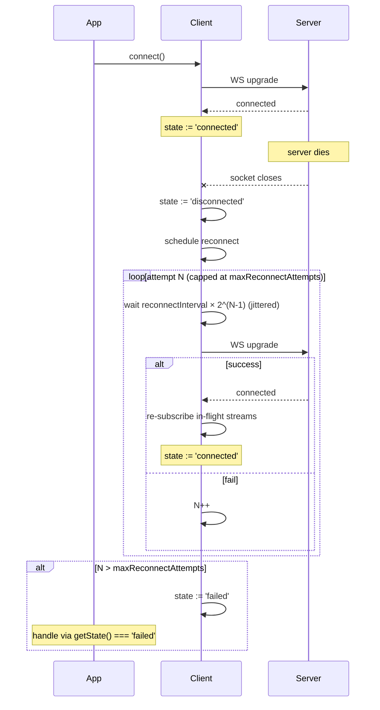

# Transports

netron-browser ships two transports — HTTP and WebSocket — plus
an "auto" mode that picks based on what your services declare.

## Picking a transport

| You need… | Transport |
| --------- | --------- |
| Request / response RPC with caching | `'http'` |
| Server-side streaming (`AsyncIterable` returns) | `'websocket'` |
| Bidirectional messaging / presence | `'websocket'` |
| Mix of both — let the framework decide | `'auto'` |

For the typical "fetch some data" call, HTTP wins on caching,
batching, and CDN compatibility. WebSocket wins when latency
matters or when the call is a stream.

## HTTP transport

```typescript
import { createClient } from '@omnitron-dev/netron-browser';

const client = createClient({
  url:       'https://api.example.com',
  transport: 'http',
  timeout:   10_000,                  // ms per request
  headers:   { 'X-Client': 'web/1.0' },
  http: {
    retry:      true,
    maxRetries: 3,
  },
});
```

| Feature | Behaviour |
| ------- | --------- |
| **Request batching** | Concurrent calls in the same tick coalesce into one HTTP POST when the server supports it |
| **Caching** | Server's `Cache-Control` honoured by the LRU cache |
| **Retry** | `network` / `5xx` failures retry with exponential backoff |
| **Compression** | `Accept-Encoding: gzip, br` automatic |
| **Idempotency keys** | Generated for mutating retries (no double-send) |
| **CORS** | Standard browser CORS; server must allow your origin |

### Sample HTTP wire format

POST to `/<endpoint>` with msgpack body containing
`{service, method, args, ctx}`. Response is `{result}` or
`{error}` with a typed shape — see [Error handling](./errors.md).

### When HTTP loses

- **Long-poll / streaming responses** — `fetch` can stream, but
  the API isn't friendly. Use WebSocket.
- **Sub-50 ms latency** — every HTTP call pays TLS handshake +
  connection setup on cold network. WebSocket amortises both.

## WebSocket transport

```typescript
const client = createClient({
  url:       'wss://api.example.com',
  transport: 'websocket',
  websocket: {
    protocols:            ['netron-v1'],
    reconnect:            true,
    reconnectInterval:    1_000,         // initial backoff
    maxReconnectAttempts: 20,
  },
});

await client.connect();
```

### Reconnect behaviour



Defaults (`reconnect: true`, `reconnectInterval: 1_000`,
`maxReconnectAttempts: 10`) give roughly a 17-minute window of
reconnect attempts before giving up.

### Tuning per environment

| Environment | Settings |
| ----------- | -------- |
| Mobile / flaky network | `maxReconnectAttempts: 50`, `reconnectInterval: 2_000` |
| Server / desktop LAN | defaults |
| Test / CI | `reconnect: false` (fail fast) |

### Subscriptions over WS

When a service method returns `AsyncIterable<T>`, the WS
transport wires it as a long-running stream:

```typescript
interface OrderService {
  watchAll(filter: OrderFilter): AsyncIterable<OrderEvent>;
}

const orders = client.service<OrderService>('orders');

for await (const event of orders.watchAll({ tier: 'pro' })) {
  console.log(event);
}
```

The client tracks subscription IDs internally; on reconnect it
re-subscribes transparently using the original args.

### Custom protocols / sub-protocols

```typescript
const client = createClient({
  url:       'wss://api.example.com',
  transport: 'websocket',
  websocket: {
    protocols: ['netron-v1', 'netron-v0'],   // server picks one
  },
});
```

Useful for gradual server upgrades — old clients negotiate
`netron-v0`, new clients prefer `netron-v1`.

## Auto mode

```typescript
const client = createClient({
  url:       'https://api.example.com',
  transport: 'auto',
});

await client.connect();
```

Auto mode:

1. Probes the server's transport descriptor on first call.
2. If WebSocket is available **and** any used service declares
   streaming methods → upgrades to WS.
3. Otherwise stays on HTTP.

Useful when you don't know upfront which services your app
will call.

## Connection state

```typescript
type ConnectionState =
  | 'idle'           // not yet connected
  | 'connecting'     // in-flight connect
  | 'connected'      // active
  | 'disconnected'   // lost; not retrying
  | 'reconnecting'   // backoff in progress
  | 'failed';        // gave up after maxReconnectAttempts

client.getState();        // current state
client.isConnected();     // boolean shortcut
client.on('stateChange', (state) => console.log(state));
```

### React integration

```tsx
import { useNetronConnection } from '@omnitron-dev/netron-react';

function ConnectionIndicator() {
  const { state, lastError } = useNetronConnection();
  return (
    <Chip
      label={state}
      color={state === 'connected' ? 'success' :
             state === 'reconnecting' ? 'warning' :
             state === 'failed' ? 'error' : 'default'}
    />
  );
}
```

## Headers, cookies, and CORS

### Custom headers

```typescript
const client = createClient({
  url:     'https://api.example.com',
  headers: {
    'X-App-Version': '1.4.2',
    'X-Tenant-ID':   tenantId,
  },
});
```

Headers apply to every request; combine with auth middleware
for `Authorization`.

### Cookies

```typescript
const client = createClient({
  url:        'https://api.example.com',
  credentials: 'include',     // browser fetch default 'same-origin'
});
```

For cross-origin cookie-based auth, the server must respond
with `Access-Control-Allow-Credentials: true`.

### CORS preflight tips

- Allow `POST` + custom headers in server CORS config.
- For WebSocket, the server's CORS doesn't apply (handshake
  uses Origin header) — but ensure your reverse proxy allows
  WS upgrades from your origin.

## Metrics & introspection

```typescript
const metrics = client.getMetrics();
// {
//   requests:    1234,
//   errors:      12,
//   avgLatency:  45.2,
//   cacheHits:   456,
//   cacheMisses: 778,
//   ...
// }
```

Expose in devtools UI:

```tsx
import { useNetronClient } from '@omnitron-dev/netron-react';

function Metrics() {
  const client = useNetronClient();
  const [m, setM] = useState(client.getMetrics());
  useEffect(() => {
    const i = setInterval(() => setM(client.getMetrics()), 1_000);
    return () => clearInterval(i);
  }, [client]);
  return <pre>{JSON.stringify(m, null, 2)}</pre>;
}
```

## Best practices

- **One client per backend host.** Sharing the same backend
  across pages = one client; multi-backend = wrap in
  `MultiBackendProvider`.
- **`'auto'` for unknown server features.** `'http'` if you
  know all calls are request/response.
- **Cap `maxReconnectAttempts`** in production — `Infinity`
  keeps tabs hammering a dead server forever.
- **Reconnect interval ≥ 1 s.** Faster intervals don't recover
  faster; they just generate more failed handshakes.
- **Set `timeout`** explicitly — browser fetch is effectively
  unlimited by default.

## Anti-patterns

- **Recreating client per render.** Loses cache, breaks WS,
  thrashes the server. Singleton.
- **`maxReconnectAttempts: Infinity`.** A genuinely-dead
  server has open sockets from every tab forever.
- **Polling on HTTP when WS is available.** Subscribe instead;
  faster + cheaper.
- **`'websocket'` for pure request/response.** No batching, no
  caching, harder to debug.

## See also

- [Middleware](./middleware.md) — pipeline run around every call
- [Caching](./caching.md) — works with HTTP responses
- [Error handling](./errors.md) — what each transport throws
- [netron-browser](./browser.md) — full client API
