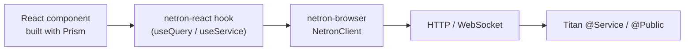

# Frontend overview

> The **server-side** Netron lives inside Titan itself
> (`@omnitron-dev/titan/netron`, including all four
> transports). This section covers the **browser side**.

Browser-side packages:

| Package | Role | Framework | Size |
| ------- | ---- | --------- | ---- |
| [`@omnitron-dev/netron-browser`](./netron/browser.md) | RPC transport (HTTP + WebSocket), middleware, auth, multi-backend pool | **Framework-agnostic** — vanilla JS, Vue, Svelte, Solid, Angular, Lit, React, Web Workers | ~25 kB gz |
| [`@omnitron-dev/netron-react`](./netron/react.md) | React hooks, query/mutation cache, auth guards, devtools | **React-only** — optional layer on top of netron-browser | ~15 kB gz |
| [`@omnitron-dev/prism`](./prism/index.md) | Design system: MUI v7 components, blocks, layouts, forms, hooks | **React-only** (MUI v7 is React) — optional | ~80 kB gz (root); tree-shakeable |

`netron-browser` works everywhere. Add `netron-react` + `prism`
**only** for React apps. For Vue / Svelte / Solid / Angular / Lit,
use `netron-browser` directly and wrap calls in your framework's
reactivity primitives.

## How they compose



A typical screen:

```tsx
import { DataGridBlock }   from '@omnitron-dev/prism/blocks';
import { useService }      from '@omnitron-dev/netron-react';

interface UserService {
  list(filter: UserFilter): Promise<User[]>;
}

function UsersPage() {
  const users = useService<UserService>('users');
  return (
    <DataGridBlock
      title="Users"
      columns={[
        { field: 'email',  header: 'Email' },
        { field: 'role',   header: 'Role'  },
      ]}
      query={({ page, sort, filter }) =>
        users.list.useQuery([{ page, sort, filter }])
      }
    />
  );
}
```

Three packages, one screen, no codegen.

## End-to-end types

There is no schema file, no codegen step, no manual sync. The
TypeScript compiler is the source of truth:

```typescript
// Shared package — the contract:
export interface UsersService {
  findById(id: string): Promise<User | null>;
}

// Browser — type flows through:
const users = useService<UsersService>('users');
const { data } = users.findById.useQuery([id]);
//      ^? User | null | undefined
```

A method signature change on the server fails the build on
every caller in the same `tsc` pass.

## Wiring an app from scratch

```tsx
import { NetronReactClient, NetronProvider }   from '@omnitron-dev/netron-react';
import { AuthProvider }                        from '@omnitron-dev/netron-react/auth';
import { PrismProvider, ProviderStack }        from '@omnitron-dev/prism/core';
import { createTheme }                         from '@omnitron-dev/prism/theme';
import { RouterProvider }                      from 'react-router-dom';

const client = new NetronReactClient({
  url:       import.meta.env.VITE_API_URL,
  transport: 'auto',
  auth: {
    signInMethod:    'OmnitronAuth.signIn',
    refreshMethod:   'OmnitronAuth.refreshSession',
    storage:         'localStorage',
    inactivityTimeout: 30 * 60_000,
  },
});

const theme = createTheme({ mode: 'dark', palette: { primary: { main: '#7c4dff' } } });

function App() {
  return (
    <ProviderStack
      providers={[
        [NetronProvider, { client }],
        [AuthProvider,   {}],
        [PrismProvider,  { theme }],
        [RouterProvider, { router }],
      ]}
    >
      <Outlet />
    </ProviderStack>
  );
}
```

Four providers, one app. Anything Titan-side becomes
discoverable through `useService`.

## Multi-backend out of the box

Talking to several Netron servers? Swap `NetronProvider` for
`MultiBackendProvider`:

```tsx
import { MultiBackendProvider, useBackendService }
  from '@omnitron-dev/netron-react';

<MultiBackendProvider
  backends={{
    auth:      { url: 'https://auth.example.com',      transport: 'auto' },
    media:     { url: 'https://media.example.com',     transport: 'auto' },
    analytics: { url: 'https://analytics.example.com', transport: 'http' },
  }}
  routes={{
    'users.*':   'auth',
    'objects.*': 'media',
    'reports.*': 'analytics',
  }}
>
  <Outlet />
</MultiBackendProvider>

// In components:
const users = useBackendService<UserService>('auth', 'users');
```

→ [netron-react / Multi-backend](./netron/react.md#multi-backend-support).

## What lives where

| You want… | Reach for |
| --------- | --------- |
| Theme, colors, typography | `@omnitron-dev/prism/theme` |
| Dashboard / auth / data-grid shell | `@omnitron-dev/prism/blocks` |
| Sidebar + topbar layout | `@omnitron-dev/prism/layouts` |
| Card / Table / Drawer / Form field | `@omnitron-dev/prism/components/*` |
| Schema-aware forms | `@omnitron-dev/prism/forms` |
| Persisted UI state (sidebar open, dark mode) | `@omnitron-dev/prism/state` |
| Plain React hooks (`useArray`, `useFocusTrap`, …) | `@omnitron-dev/prism/hooks` |
| Type-safe RPC call inside a component | `useService` from `@omnitron-dev/netron-react` |
| Live data over WebSocket | `useSubscription` from `@omnitron-dev/netron-react` |
| Sign-in flow + route guards | `@omnitron-dev/netron-react/auth` + `<AuthGuard>` |
| Multi-backend setup | `MultiBackendProvider` from `@omnitron-dev/netron-react` |
| Raw RPC client (no React) | `createClient` from `@omnitron-dev/netron-browser` |
| Cross-tab auth sync | `AuthManager` from `@omnitron-dev/netron-browser/auth` |
| Cache, retry, circuit breaker | `@omnitron-dev/netron-browser/middleware` |

## Bundle strategy

| Stage | Bundle goal |
| ----- | ----------- |
| First paint (auth screen) | Prism `<AuthBlock>` + auth provider — ~50 kB gz |
| Authenticated shell | + `<DashboardLayout>` + nav + topbar — ~80 kB gz |
| Per-route page | Lazy-load with `React.lazy()` — pages add 10–30 kB each |
| Charts / editor / lightbox | Lazy import only on routes that use them |

Use subpath imports (`@omnitron-dev/prism/components/card`)
rather than the root import for the leanest payload.

## Production reference

The Omnitron Console (`apps/omnitron/webapp/`) is built entirely
from these three packages. ~20 pages, multi-backend, full RBAC,
real-time subscriptions, devtools — see
[Console](../omnitron/console.md) for the route map.

## Read on

- [Prism](./prism/index.md) — design system in depth
- [netron-browser](./netron/browser.md) — the transport client
- [netron-react](./netron/react.md) — React hooks
