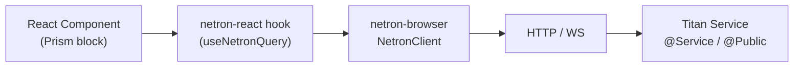

# Frontend Overview

Three packages cover the browser side of an Omnitron app:

| Package                          | Role                                                              |
| -------------------------------- | ----------------------------------------------------------------- |
| `@omnitron-dev/netron-browser`   | Browser-optimised Netron client (HTTP + WS, middleware, errors)   |
| `@omnitron-dev/netron-react`     | React hooks, query/mutation cache, devtools                       |
| `@omnitron-dev/prism`            | Design system: tokens, layouts, blocks, forms, accessibility      |

They compose top-down: a Prism block renders, a netron-react hook fetches,
the netron-browser client transports. The TypeScript service interface
defined on the backend is the type signature your component receives.

## Architecture



- The component imports the **service interface type** from a shared
  package.
- The hook resolves that type via `queryInterface<T>()` against a running
  Titan app.
- The client speaks Netron over the chosen transport.
- The server's `@Service` class fields the call.

## End-to-end types

There is no codegen, no schema file, no manual sync step. The
TypeScript compiler is the source of truth. A method signature change
on the server fails the build on every caller in the same `tsc` pass.

```typescript
// Shared package — the contract.
export interface UsersService {
  findById(id: string): Promise<User | null>;
}

// Browser — the type travels with the import.
const users = await client.queryInterface<UsersService>('users@1.0.0');
const user  = await users.findById('u_42');
//    ^? User | null
```

## Read on

- [Prism](./prism.md) — design system in depth.
- [netron-browser](./netron-browser.md) — the client.
- [netron-react](./netron-react.md) — React hooks.
