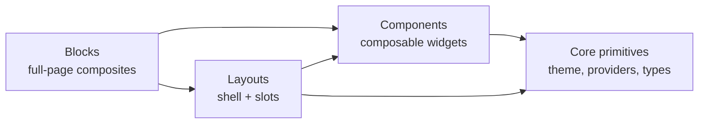

# Prism

<code>@omnitron-dev/prism</code> is the design system. Pre-composed,
theme-aware components and entire UI blocks for building
production React frontends — built on **MUI v7**, integrated
with **react-hook-form + zod**, and ready for **Vite / Next /
Remix** out of the box.

Verified against `packages/prism/src/` and its `package.json`
exports map.

```bash
pnpm add @omnitron-dev/prism
```

## Three layers of API

Prism intentionally exposes the same vocabulary at three depths:



Pick the level that matches your need:

- **Blocks** — copy a `<DashboardBlock>`, fill the slots, ship a screen.
- **Layouts** — own the routing; use `<DashboardLayout>` for shell.
- **Components** — assemble from `<Card>` / `<Table>` / `<Drawer>`.
- **Core** — direct theme / provider / hooks access for custom work.

## Subpath exports

| Subpath | What it exports |
| ------- | --------------- |
| `@omnitron-dev/prism` | Everything; convenient but largest |
| `@omnitron-dev/prism/theme` | `createTheme()`, palette, typography, shadows, presets |
| `@omnitron-dev/prism/core` | `<PrismProvider>`, `<ProviderStack>`, context primitives |
| `@omnitron-dev/prism/layouts` | `<DashboardLayout>`, `<AuthLayout>`, layout types |
| `@omnitron-dev/prism/blocks` | `<AuthBlock>`, `<DashboardBlock>`, `<DataGridBlock>` |
| `@omnitron-dev/prism/blocks/*` | Individual block subpaths |
| `@omnitron-dev/prism/components` | All 50+ components |
| `@omnitron-dev/prism/components/*` | Individual component subpaths |
| `@omnitron-dev/prism/forms` | Schema-aware form helpers |
| `@omnitron-dev/prism/hooks` | 25+ React hooks |
| `@omnitron-dev/prism/state` | Zustand-based store factory |
| `@omnitron-dev/prism/accessibility` | A11y primitives + ARIA helpers |
| `@omnitron-dev/prism/netron` | Pre-wired Netron auth/UI bindings |
| `@omnitron-dev/prism/http` | HTTP fetcher helpers |
| `@omnitron-dev/prism/utils` | Pure utility functions |
| `@omnitron-dev/prism/cli` | CLI helpers (used by `prism` bin) |

Tree-shaking works on every subpath — import the smallest scope
your bundler needs.

## Minimum wiring

```tsx
import { PrismProvider } from '@omnitron-dev/prism/core';
import { createTheme }   from '@omnitron-dev/prism/theme';

const theme = createTheme({ palette: { mode: 'dark', primary: { main: '#7c4dff' } } });

function App() {
  return (
    <PrismProvider theme={theme}>
      <Outlet />
    </PrismProvider>
  );
}
```

`<PrismProvider>` sets up MUI's `ThemeProvider`, `CssBaseline`,
the snackbar host, the icon registry, react-query (if a query
client is passed), and the i18n context.

For more sophisticated apps, use `<ProviderStack>` to layer
multiple providers cleanly:

```tsx
<ProviderStack
  providers={[
    [QueryClientProvider, { client: queryClient }],
    [AuthProvider,         { client: authClient }],
    [PrismProvider,        { theme }],
    [RouterProvider,       { router }],
  ]}
>
  <Outlet />
</ProviderStack>
```

The `[Provider, props]` tuple shape keeps deep nesting flat.

## Theme

```tsx
import { createTheme } from '@omnitron-dev/prism/theme';

const theme = createTheme({
  mode: 'dark',
  palette: {
    primary:   { main: '#7c4dff' },
    secondary: { main: '#00bcd4' },
    error:     { main: '#f44336' },
  },
  typography: {
    fontFamily: '"Inter", "Roboto", sans-serif',
    fontSize:   14,
  },
  shape: { borderRadius: 8 },
  spacing: 8,
});
```

| Theme piece | Source | Purpose |
| ----------- | ------ | ------- |
| `palette` | `theme/palette/` | Brand colours, semantic colours, action states |
| `typography` | `theme/typography.ts` | Type ramp, line heights, font weights |
| `shadows` | `theme/shadows.ts` | Elevation steps |
| `custom-shadows` | `theme/custom-shadows.ts` | Coloured / softer shadows for emphasis |
| `mixins` | `theme/mixins.ts` | Reusable `sx` snippets |
| `presets` | `theme/presets/` | Pre-tuned themes (cyber, classic, …) |
| `css-variables` | `theme/css-variables.ts` | CSS-var output for SSR colour-mode flicker fix |

### Dark mode

```tsx
import { useColorMode } from '@omnitron-dev/prism/core';

function ModeToggle() {
  const { mode, setMode } = useColorMode();
  return (
    <Button onClick={() => setMode(mode === 'dark' ? 'light' : 'dark')}>
      {mode === 'dark' ? 'Light' : 'Dark'}
    </Button>
  );
}
```

Mode is persisted in localStorage; respects `prefers-color-scheme`
on first visit.

## Layouts

Three pre-built shells for the most common app shapes:

| Layout | Source | Use case |
| ------ | ------ | -------- |
| `<DashboardLayout>` | `layouts/dashboard/` | Admin / operator consoles with sidebar + topbar |
| `<AuthLayout>` | `layouts/auth/` | Sign-in / sign-up / recover flows |
| `<CoreLayout>` | `layouts/core/` | Minimal page shell — header + footer |

```tsx
import { DashboardLayout } from '@omnitron-dev/prism/layouts';
import { Outlet } from 'react-router-dom';

const navItems = [
  { title: 'Dashboard', path: '/',         icon: 'home'         },
  { title: 'Apps',      path: '/apps',     icon: 'box'          },
  { title: 'Settings',  path: '/settings', icon: 'cog', roles: ['admin'] },
];

function ConsoleShell() {
  return (
    <DashboardLayout navItems={navItems} brand="Platform">
      <Outlet />
    </DashboardLayout>
  );
}
```

Layout features:
- Collapsible sidebar with hover-expand.
- Topbar with search, notifications, user menu.
- Breadcrumbs derived from the active route.
- Per-nav-item role visibility (`roles: ['admin']`).
- Auto-responsive: collapses to drawer below `md` breakpoint.

## Blocks — full-page composites

Blocks are higher-level than layouts — they wire layout + several
components for a specific user-flow.

| Block | Source | What you get |
| ----- | ------ | ------------ |
| `<AuthBlock>` | `blocks/auth-block/` | Full sign-in screen — email/password + OAuth + 2FA + recovery links |
| `<DashboardBlock>` | `blocks/dashboard-block/` | KPI tiles + trend chart + recent-activity list, theme-aware |
| `<DataGridBlock>` | `blocks/data-grid-block/` | Filterable / sortable / paginated table with row actions, toolbar, export |

Drop a block into a route; pass the data callbacks:

```tsx
import { DataGridBlock } from '@omnitron-dev/prism/blocks';

function UsersPage() {
  return (
    <DataGridBlock
      title="Users"
      columns={[
        { field: 'email',  header: 'Email' },
        { field: 'role',   header: 'Role'  },
        { field: 'status', header: 'Status', render: StatusChip },
      ]}
      query={({ page, sort, filter }) => usersService.list({ page, sort, filter })}
      onRowAction={[
        { id: 'edit',   label: 'Edit',   onClick: (row) => navigate(`/users/${row.id}`) },
        { id: 'remove', label: 'Remove', danger: true, onClick: (row) => deleteUser.mutate(row.id) },
      ]}
    />
  );
}
```

## Components — 50+ widgets

Components grouped by purpose. Each is also available as its own
subpath import for granular bundling.

### Data display

| Component | Subpath |
| --------- | ------- |
| `<Card>` | `components/card/` |
| `<Table>` | `components/table/` |
| `<Chart>` | `components/chart/` (ApexCharts wrapper) |
| `<Carousel>` | `components/carousel/` |
| `<Avatar>` | `components/avatar/` |
| `<Badge>` | `components/badge/` |
| `<Lightbox>` | `components/lightbox/` |
| `<TagCloud>` | `components/tag-cloud/` |
| `<Progress>` | `components/progress/` |

### Navigation

| Component | Subpath |
| --------- | ------- |
| `<Breadcrumbs>` | `components/breadcrumbs/` |
| `<Menu>` | `components/menu/` |
| `<MegaMenu>` | `components/mega-menu/` |
| `<NavCard>` | `components/nav-card/` |
| `<NavSection>` | `components/nav-section/` |
| `<NavigationProgress>` | `components/navigation-progress/` |
| `<ScrollSpy>` | `components/scroll-spy/` |
| `<ScrollToTop>` | `components/scroll-to-top/` |
| `<Stepper>` | `components/stepper/` |
| `<Tabs>` | `components/tabs/` |

### Input & feedback

| Component | Subpath |
| --------- | ------- |
| `<Field>` | `components/field/` (form field wrapper) |
| `<Label>` | `components/label/` |
| `<SearchInput>` | `components/search-input/` |
| `<DateRangePicker>` | `components/date-range-picker/` |
| `<DurationPicker>` | `components/duration-picker/` |
| `<CountrySelect>` | `components/country-select/` |
| `<Editor>` | `components/editor/` (Tiptap) |
| `<TiptapRenderer>` | `components/tiptap-renderer/` |
| `<ContentRenderer>` | `components/content-renderer/` |
| `<CommandPalette>` | `components/command-palette/` |
| `<ConfirmDialog>` | `components/confirm-dialog/` |
| `<Snackbar>` | `components/snackbar/` |
| `<Tooltip>` | `components/tooltip/` |
| `<Popover>` | `components/popover/` |
| `<Alert>` | `components/alert/` (incl. `<FormAlert>`) |
| `<AdminFilters>` | `components/admin-filters/` |

### Layout & utility primitives

| Component | Subpath |
| --------- | ------- |
| `<Drawer>` | `components/drawer/` |
| `<DocLayout>` | `components/doc-layout/` |
| `<PageContent>` | `components/page-content/` |
| `<Scrollbar>` | `components/scrollbar/` |
| `<EmptyContent>` | `components/empty-content/` |
| `<ErrorBoundary>` | `components/error-boundary/` |
| `<LoadingScreen>` | `components/loading-screen/` |
| `<Skeleton>` | `components/skeleton/` |
| `<Animate>` | `components/animate/` |
| `<SvgColor>` | `components/svg-color/` |
| `<Image>` | `components/image/` |
| `<Settings>` | `components/settings/` (in-app settings drawer) |
| `<Changelog>` | `components/changelog/` |
| `<Accordion>` | `components/accordion/` |

Subpath imports cut bundle weight:

```tsx
import { Card } from '@omnitron-dev/prism/components/card';
```

## Forms — schema-aware

Prism's form layer wraps **react-hook-form + zod** with a context
provider that propagates schema metadata into fields.

```tsx
import { SchemaProvider } from '@omnitron-dev/prism/forms';
import { Field }          from '@omnitron-dev/prism/components/field';
import { useForm }        from 'react-hook-form';
import { zodResolver }    from '@hookform/resolvers/zod';
import { z }              from 'zod';

const Schema = z.object({
  email:    z.string().email(),
  password: z.string().min(8),
});

function SignInForm() {
  const form = useForm({ resolver: zodResolver(Schema) });

  return (
    <SchemaProvider schema={Schema}>
      <form onSubmit={form.handleSubmit(onSubmit)}>
        <Field name="email"    label="Email"    type="email" />
        <Field name="password" label="Password" type="password" />
        <Button type="submit">Sign in</Button>
      </form>
    </SchemaProvider>
  );
}
```

`<Field>` reads the schema from context to infer:
- Input type (`email`, `number`, `password`).
- Required state.
- Min/max constraints (passed as HTML attributes for native UX).
- Error message format.

`<FormAlert>` (in `components/alert/`) is the canonical surface
for form-level error display — inline, not toast.

## Hooks — 25+

| Hook | Purpose |
| ---- | ------- |
| `useArray` | Reactive array operations |
| `useAsync` | Lifecycle-safe async state |
| `useBackToTop` | Detect deep scroll → show "back to top" |
| `useClientRect` | Element rect with resize observer |
| `useConfigFromQuery` | Read URL query params into typed config |
| `useCookies` | Cookie state mirror |
| `useCountdownDate` | Countdown to a specific date |
| `useCountdownSeconds` | Countdown to a seconds offset |
| `useDoubleClick` | Detect double-click vs single |
| `useFocusTrap` | Trap focus inside a container (a11y) |
| `useImageDimensions` | Natural width/height of an image URL |
| `useInfiniteScroll` | Append-on-scroll pattern |
| `useIntersectionObserver` | Visibility-based callbacks |
| `useIsomorphicLayoutEffect` | SSR-safe layout effect |
| `useKeyboardShortcut` | Register `kbd` chord handlers |
| `useLazyQuery` | Lazy version of `useQuery` |
| `useMutation` | Optimistic mutations with rollback |
| `useOnlineStatus` | Reactive `navigator.onLine` |
| `usePasswordVisibility` | Toggle for password fields |
| `usePopoverHover` | Hover-managed popover open state |
| `useScrollOffsetTop` | Triggers when scrolled past N |
| `useScrollPosition` | Tracked scroll position |
| `useSessionStorage` | Reactive sessionStorage mirror |
| `useThrottle` | Throttled value |
| `useUpdateEffect` | Effect that skips first render |
| `useWindowSize` | Reactive window dimensions |

All hooks are SSR-safe via `useIsomorphicLayoutEffect` where it
matters.

## State management

Prism ships a Zustand-based factory for app-level state:

```tsx
import { createStore } from '@omnitron-dev/prism/state';

interface UIState {
  sidebarOpen: boolean;
  toggleSidebar: () => void;
}

export const useUIStore = createStore<UIState>((set) => ({
  sidebarOpen:   true,
  toggleSidebar: () => set((s) => ({ sidebarOpen: !s.sidebarOpen })),
}), {
  name:    'ui-store',
  persist: { storage: 'localStorage', whitelist: ['sidebarOpen'] },
  version: 2,
  migrate: (persisted, version) => {
    // version-aware migration
  },
});
```

Wraps Zustand with `settings-version` migration helpers — when
you bump `version`, persisted state from older versions runs
through `migrate` before being adopted.

## Accessibility

`@omnitron-dev/prism/accessibility` ships primitives that the
components use internally and that you can reuse:

- `<VisuallyHidden>` — screen-reader-only text.
- `useFocusTrap` — trap focus in modals.
- `useEscapeKey` — fire on Esc with optional stop-propagation.
- `useReturnFocus` — restore focus when an overlay closes.
- ARIA helpers for combobox / listbox / tablist patterns.

All `<Field>`-based forms produce correct labelling automatically.

## Netron integration — `@omnitron-dev/prism/netron`

Pre-wired auth + UI bindings for apps that talk to a Titan
backend via Netron:

```tsx
import { PrismNetronProvider, useAuth } from '@omnitron-dev/prism/netron';
import { NetronReactClient }           from '@omnitron-dev/netron-react';

const client = new NetronReactClient({ url: 'https://api.example.com' });

function App() {
  return (
    <PrismNetronProvider client={client}>
      <Outlet />
    </PrismNetronProvider>
  );
}

function Profile() {
  const { user, signOut } = useAuth();
  return <div>{user?.email} <Button onClick={signOut}>Sign out</Button></div>;
}
```

Stitches `<AuthProvider>` + `<PrismProvider>` into a single
provider, plus wires sign-out into the navigation menu and adds
the `<AuthGuard>` / `<GuestGuard>` route wrappers.

## CLI — `prism` binary

```bash
prism init                 # scaffold Prism config in current project
prism add component card   # generate boilerplate using registered template
prism list components      # show available components
```

The CLI uses templates from `templates/` (shipped with the
package) plus the schema in `registry.json` for available
component metadata.

Useful when sketching a new screen from primitives.

## Best practices

- **Pick the smallest layer.** A `<DashboardBlock>` is faster
  than composing it from 12 components, but constrains you to
  its prop API. Drop to `<DashboardLayout>` + components when
  you need flexibility.
- **One `<PrismProvider>` per app.** Multiple providers create
  duplicate snackbar hosts and confused theme contexts.
- **Subpath imports for bundle size.** Root import is convenient
  but big; per-component imports keep first-paint fast.
- **Use schema-driven forms.** `<Field>` + `SchemaProvider`
  produces consistent UX with zero per-field boilerplate.
- **Surface form errors with `<FormAlert>` inline**; reserve
  toasts (`<Snackbar>`) for transient background events.
- **`createStore` over raw Zustand** for any state that
  persists — `settings-version` handles migrations.

## Anti-patterns

- **Custom CSS overriding Prism components.** Use `sx` props or
  the theme — CSS overrides break on MUI version bumps.
- **Inline `useState` for global UI state.** Sidebar open/close,
  dark mode, drawer state — use a `createStore`.
- **Ignoring SSR hydration.** Wrap colour-mode setup in
  `useIsomorphicLayoutEffect` or use the CSS-vars output to
  avoid hydration flash.
- **Coupling components to backends directly.** Components stay
  presentation; backend hooks come from `@omnitron-dev/netron-react`.

## See also

- [netron-browser](./netron-browser.md) — the RPC client layer
- [netron-react](./netron-react.md) — React hooks for RPC
- [Frontend overview](./overview.md) — the three-package picture
- [Console](../omnitron/console.md) — a real production app built
  on Prism + netron-react
