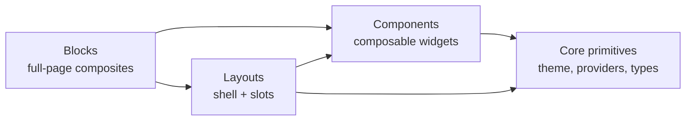

# Prism

<code>@omnitron-dev/prism</code> is the design system. Pre-composed,
theme-aware components and entire UI blocks for building
production React frontends — built on **MUI v7**, integrated
with **react-hook-form + zod**, ready for **Vite / Next /
Remix** out of the box.

```bash
pnpm add @omnitron-dev/prism
```

## Three layers of API



Pick the level that matches your need:

- [**Blocks**](./blocks.md) — copy a `<DashboardBlock>`, fill the
  slots, ship a screen.
- [**Layouts**](./layouts.md) — own the routing; use
  `<DashboardLayout>` for shell.
- [**Components**](./components.md) — assemble from `<Card>` /
  `<Table>` / `<Drawer>`.
- [**Theme**](./theme.md) — palette, typography, shadows,
  density, dark mode.
- [**Forms**](./forms.md) — schema-aware forms with `<Field>` +
  `SchemaProvider`.
- [**Hooks catalog**](./hooks-catalog.md) — 25+ React hooks.

## Subpath exports

| Subpath | What it exports |
| ------- | --------------- |
| `@omnitron-dev/prism` | Everything; convenient but largest |
| `@omnitron-dev/prism/theme` | `createTheme()`, palette, typography, shadows, presets |
| `@omnitron-dev/prism/core` | `<PrismProvider>`, `<ProviderStack>`, context primitives |
| `@omnitron-dev/prism/layouts` | `<DashboardLayout>`, `<AuthLayout>`, `<CoreLayout>` |
| `@omnitron-dev/prism/blocks` | `<AuthBlock>`, `<DashboardBlock>`, `<DataGridBlock>` |
| `@omnitron-dev/prism/blocks/*` | Individual block subpaths |
| `@omnitron-dev/prism/components` | All 50+ components |
| `@omnitron-dev/prism/components/*` | Individual component subpaths |
| `@omnitron-dev/prism/forms` | Schema-aware form helpers |
| `@omnitron-dev/prism/hooks` | 25+ React hooks |
| `@omnitron-dev/prism/state` | Zustand-based store factory |
| `@omnitron-dev/prism/accessibility` | A11y primitives + ARIA helpers |
| `@omnitron-dev/prism/netron` | Pre-wired Netron auth/UI bindings |
| `@omnitron-dev/prism/http` | HTTP fetcher helpers |
| `@omnitron-dev/prism/utils` | Pure utility functions |
| `@omnitron-dev/prism/cli` | CLI helpers (used by `prism` bin) |

Tree-shaking works on every subpath — import the smallest scope
your bundler needs.

## Minimum wiring

```tsx
import { PrismProvider } from '@omnitron-dev/prism/core';
import { createTheme }   from '@omnitron-dev/prism/theme';

const theme = createTheme({ palette: { mode: 'dark', primary: { main: '#7c4dff' } } });

function App() {
  return (
    <PrismProvider theme={theme}>
      <Outlet />
    </PrismProvider>
  );
}
```

`<PrismProvider>` sets up MUI's `ThemeProvider`, `CssBaseline`,
the snackbar host, the icon registry, react-query (if a query
client is passed), and the i18n context.

For more sophisticated apps, use `<ProviderStack>` to layer
multiple providers cleanly:

```tsx
<ProviderStack
  providers={[
    [QueryClientProvider, { client: queryClient }],
    [AuthProvider,         { client: authClient }],
    [PrismProvider,        { theme }],
    [RouterProvider,       { router }],
  ]}
>
  <Outlet />
</ProviderStack>
```

## State management — `createStore`

Prism ships a Zustand-based factory for app-level state with
version-aware migration:

```tsx
import { createStore } from '@omnitron-dev/prism/state';

interface UIState {
  sidebarOpen: boolean;
  toggleSidebar: () => void;
}

export const useUIStore = createStore<UIState>((set) => ({
  sidebarOpen:   true,
  toggleSidebar: () => set((s) => ({ sidebarOpen: !s.sidebarOpen })),
}), {
  name:    'ui-store',
  persist: { storage: 'localStorage', whitelist: ['sidebarOpen'] },
  version: 2,
  migrate: (persisted, version) => {
    // version-aware migration
  },
});
```

When you bump `version`, persisted state from older versions
runs through `migrate` before being adopted.

## Accessibility

`@omnitron-dev/prism/accessibility` ships primitives that the
components use internally and that you can reuse:

- `<VisuallyHidden>` — screen-reader-only text.
- `useFocusTrap` — trap focus in modals.
- `useEscapeKey` — fire on Esc with optional stop-propagation.
- `useReturnFocus` — restore focus when an overlay closes.
- ARIA helpers for combobox / listbox / tablist patterns.

All `<Field>`-based forms produce correct labelling
automatically.

## Netron integration — `@omnitron-dev/prism/netron`

Pre-wired auth + UI bindings for apps that talk to a Titan
backend via Netron:

```tsx
import { NetronProvider, createNetronClient }
  from '@omnitron-dev/prism/netron';

const client = createNetronClient({ transport: 'http', url: '/api' });

function App() {
  return (
    <NetronProvider client={client}>
      <Outlet />
    </NetronProvider>
  );
}
```

For multi-backend setups:

```tsx
import { createMultiBackendClient, MultiBackendProvider }
  from '@omnitron-dev/prism/netron';

const client = createMultiBackendClient({
  baseUrl: '',
  backends: {
    main:    { path: '/api/main' },
    storage: { path: '/api/storage' },
    realtime:{ path: '/api/realtime' },
  },
  defaultBackend: 'main',
});

<MultiBackendProvider client={client} autoConnect>
  <Outlet />
</MultiBackendProvider>
```

The bindings re-export `@omnitron-dev/netron-react` hooks —
see [netron/react](../netron/react.md) for the full hook
reference.

## CLI — `prism` binary

```bash
prism init                 # scaffold Prism config in current project
prism add component card   # generate boilerplate using registered template
prism list components      # show available components
```

The CLI uses templates from `templates/` (shipped with the
package) plus the schema in `registry.json` for available
component metadata.

## Best practices

- **Pick the smallest layer.** A [`<DashboardBlock>`](./blocks.md)
  is faster than composing it from 12 components, but constrains
  you to its prop API. Drop to [`<DashboardLayout>`](./layouts.md)
  + components when you need flexibility.
- **One `<PrismProvider>` per app.** Multiple providers create
  duplicate snackbar hosts and confused theme contexts.
- **Subpath imports for bundle size.** Per-component imports
  keep first-paint fast.
- **Use schema-driven forms.** [`<Field>` +
  `SchemaProvider`](./forms.md) produces consistent UX with zero
  per-field boilerplate.
- **Surface form errors with `<FormAlert>` inline**; reserve
  toasts (`<Snackbar>`) for transient background events.
- **`createStore` over raw Zustand** for any state that
  persists — `settings-version` handles migrations.

## See also

- [Components catalog](./components.md) — 50+ widgets with
  props + examples
- [Blocks](./blocks.md) — `<AuthBlock>`, `<DashboardBlock>`,
  `<DataGridBlock>`
- [Layouts](./layouts.md) — three app shells
- [Theme](./theme.md) — palette, typography, dark mode
- [Forms](./forms.md) — schema-aware form patterns
- [Hooks catalog](./hooks-catalog.md) — 25+ React hooks
- [netron-browser](../netron/browser.md) — the RPC client
- [netron-react](../netron/react.md) — React hooks for RPC
- [Frontend overview](../overview.md) — the three-package picture
