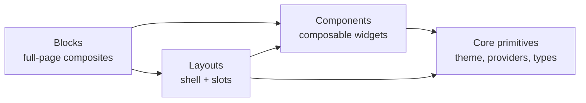

# Prism

<code>@omnitron-dev/prism</code> is the design system. Pre-composed,
theme-aware components and entire UI blocks for building
production React frontends — built on **MUI v9** + **React 19**,
integrated with **react-hook-form + zod**, ready for **Vite /
Next / Remix** out of the box.

```bash
pnpm add @omnitron-dev/prism
```

:::tip React 19 + MUI v9 idioms
Prism uses the latest patterns from both upstreams:

- **No `forwardRef`** — React 19 routes `ref` through props
  directly, so every component takes `ref` as a normal prop.
- **`slotProps` API** — the v9 replacement for the legacy
  `InputProps={...}` / `MenuProps={...}` / `TabIndicatorProps={...}` /
  `BackdropProps={...}` / `componentsProps={...}` families.
- **Unified `<Grid>` with `size={{ xs, sm, md }}`** — v1's
  `<Grid item xs={...}>` shorthand is gone.
- **Position classes for grouped controls** —
  `ToggleButtonGroup` and `ButtonGroup` mark children with
  `firstButton` / `middleButton` / `lastButton`; theme overrides
  target those classes instead of the deprecated
  `:not(:first-of-type)` sibling selector.

See [Components → Refs (React 19)](./components.md#refs-react-19)
and [Components → MUI v9 slot props](./components.md#mui-v9-slot-props)
for the consumer-side migration cheat sheet.
:::

## Three layers of API


```mermaid
flowchart LR
  Blocks[Blocks<br/>full-page composites]
  Layouts[Layouts<br/>shell + slots]
  Components[Components<br/>composable widgets]
  Core[Core primitives<br/>theme, providers, types]

  Blocks --> Layouts
  Blocks --> Components
  Layouts --> Components
  Components --> Core
  Layouts --> Core
```

Pick the level that matches your need:

- [**Blocks**](./blocks.md) — copy a `<DashboardBlock>`, fill the
  slots, ship a screen.
- [**Layouts**](./layouts.md) — own the routing; use
  `<DashboardLayout>` for shell.
- [**Components**](./components.md) — assemble from `<Card>` /
  `<Table>` / `<Drawer>`.
- [**Theme**](./theme.md) — palette, typography, shadows,
  density, dark mode.
- [**Forms**](./forms.md) — schema-aware forms with `<Field>` +
  `SchemaProvider`.
- [**Hooks catalog**](./hooks-catalog.md) — all 48 React hooks.
- [**Maps**](./maps.md) — self-hosted MapLibre map, markers,
  point picker and coverage layer.

## Subpath exports

There is no per-component subpath. `./components/*` and `./blocks/*`
globs used to appear in the package's `exports`, which made every
component directory resolvable to TypeScript while only three of them
shipped JavaScript — so `@omnitron-dev/prism/components/alert`
typechecked and then failed in the browser, and these pages recommended
that form in 55 places. The globs are gone: such an import is now a
compile error, which is where it belongs.

`<Editor>` and `<EmojiPicker>` keep their own subpaths because they are
deliberately code-split — the emoji dataset alone is ~80 kB gzipped and
should not sit on the critical path. Everything else comes from the root
or from `./components`; the bundler tree-shakes either.


| Subpath | What it exports |
| ------- | --------------- |
| `@omnitron-dev/prism` | Everything; convenient but largest |
| `@omnitron-dev/prism/theme` | `createPrismTheme()`, palette, typography, shadows, presets |
| `@omnitron-dev/prism/core` | `<PrismProvider>`, `<ProviderStack>`, context primitives |
| `@omnitron-dev/prism/layouts` | `<DashboardLayout>`, `<AuthCenteredLayout>` / `<AuthSplitLayout>` / `<AuthSimpleLayout>`, `<LayoutProvider>` |
| `@omnitron-dev/prism/blocks` | `<AuthBlock>`, `<DashboardBlock>`, `<DataGridBlock>` |
| `@omnitron-dev/prism/components` | All 50+ components |
| `@omnitron-dev/prism/components/editor` | `<Editor>` alone, as its own chunk |
| `@omnitron-dev/prism/components/emoji-picker` | `<EmojiPicker>` alone — the dataset is ~80 kB gz |
| `@omnitron-dev/prism/forms` | Schema-aware form helpers |
| `@omnitron-dev/prism/hooks` | 48 React hooks |
| `@omnitron-dev/prism/state` | Zustand-based store factory |
| `@omnitron-dev/prism/accessibility` | A11y primitives + ARIA helpers |
| `@omnitron-dev/prism/netron` | Pre-wired Netron auth/UI bindings |
| `@omnitron-dev/prism/http` | HTTP fetcher helpers |
| `@omnitron-dev/prism/cli` | CLI helpers (used by `prism` bin) |

Tree-shaking works on every subpath — import the smallest scope
your bundler needs.

## Minimum wiring

```tsx
import { PrismProvider } from '@omnitron-dev/prism/core';

function App() {
  return (
    <PrismProvider
      defaultSettings={{ mode: 'dark', preset: 'midnight', primaryColor: '#7c4dff' }}
    >
      <Outlet />
    </PrismProvider>
  );
}
```

`<PrismProvider>` builds the theme itself — you do not call
`createPrismTheme()` and hand it over, and there is no `theme`
prop to hand it to. It reads the settings store (persisted, so a
user's own choices survive a reload), falls back to
`defaultSettings` for anything unset, resolves `mode: 'system'`
against the OS preference, and calls `createPrismTheme()` with
the result. Both production consumers — the DAOS portal and the
Omnitron console — pass exactly `{ mode, preset, direction }`.

`defaultSettings` accepts `mode`, `preset`, `direction`,
`primaryColor`, `contrast`, `fontSize`, `fontFamily` and
`navLayout`. For MUI-level escapes use `themeOverrides`, which is
merged into the generated theme; `config` carries non-theme
configuration. `createPrismTheme()` is exported for building a
theme outside the provider (a standalone MUI tree, a snapshot
test), not for feeding one back in.

Beyond the theme, the provider sets up MUI's `ThemeProvider`,
`CssBaseline`, the snackbar host, the icon registry, and the
localization context (`dateAdapterLocale`, `dateLocaleText`).

For more sophisticated apps, use `<ProviderStack>` to layer
multiple providers cleanly:

```tsx
<ProviderStack
  providers={[
    [QueryClientProvider, { client: queryClient }],
    [AuthProvider,         { client: authClient }],
    [PrismProvider,        { defaultSettings: { mode: 'dark', preset: 'midnight' } }],
    [RouterProvider,       { router }],
  ]}
>
  <Outlet />
</ProviderStack>
```

## State management — `createPrismStore` / `createPersistedStore`

Prism ships Zustand-based store factories (Immer + DevTools +
optional localStorage persistence baked in). Use
`createPrismStore` for general state and `createPersistedStore`
for persisted state with version-aware migration:

```tsx
import { createPrismStore } from '@omnitron-dev/prism/state';

interface UIState {
  sidebarOpen: boolean;
  toggleSidebar: () => void;
}

// Immer middleware is enabled — mutate `state` directly in `set`.
export const useUIStore = createPrismStore<UIState>((set) => ({
  sidebarOpen:   true,
  toggleSidebar: () => set((s) => { s.sidebarOpen = !s.sidebarOpen; }),
}), {
  name:    'ui-store',
  persist: { partialize: (s) => ({ sidebarOpen: s.sidebarOpen }) },
});
```

For persisted preferences with migrations, pass a `version`
plus a `migrate` callback through the persist options:

```tsx
import { createPersistedStore } from '@omnitron-dev/prism/state';

export const useSettings = createPersistedStore<SettingsState>(
  (set) => ({ /* … */ }),
  'settings',                       // store name (positional)
  {
    version: 2,
    migrate: (persisted, version) => {
      // version-aware migration
      return persisted as SettingsState;
    },
  },
);
```

When you bump `version`, persisted state from older versions
runs through `migrate` before being adopted. (See also the
versioned-settings helpers in `@omnitron-dev/prism/state`.)

## Accessibility

`@omnitron-dev/prism/accessibility` ships primitives that the
components use internally and that you can reuse:

- `<VisuallyHidden>` — screen-reader-only text.
- `useFocusTrap` — trap focus in modals.
- `useEscapeKey` — fire on Esc with optional stop-propagation.
- `useReturnFocus` — restore focus when an overlay closes.
- ARIA helpers for combobox / listbox / tablist patterns.

All `<Field>`-based forms produce correct labelling
automatically.

## Netron integration — `@omnitron-dev/prism/netron`

Pre-wired auth + UI bindings for apps that talk to a Titan
backend via Netron:

```tsx
import { NetronProvider, createNetronClient }
  from '@omnitron-dev/prism/netron';

const client = createNetronClient({ transport: 'http', url: '/api' });

function App() {
  return (
    <NetronProvider client={client}>
      <Outlet />
    </NetronProvider>
  );
}
```

For multi-backend setups:

```tsx
import { createMultiBackendClient, MultiBackendProvider }
  from '@omnitron-dev/prism/netron';

const client = createMultiBackendClient({
  baseUrl: '',
  backends: {
    main:    { path: '/api/main' },
    storage: { path: '/api/storage' },
    realtime:{ path: '/api/realtime' },
  },
  defaultBackend: 'main',
});

<MultiBackendProvider client={client} autoConnect>
  <Outlet />
</MultiBackendProvider>
```

The bindings re-export `@omnitron-dev/netron-react` hooks —
see [netron/react](../netron/react.md) for the full hook
reference.

## CLI — `prism` binary

```bash
prism init                 # scaffold Prism config in current project
prism add component card   # generate boilerplate using registered template
prism list components      # show available components
```

The CLI uses templates from `templates/` (shipped with the
package) plus the schema in `registry.json` for available
component metadata.

## Best practices

- **Pick the smallest layer.** A [`<DashboardBlock>`](./blocks.md)
  is faster than composing it from 12 components, but constrains
  you to its prop API. Drop to [`<DashboardLayout>`](./layouts.md)
  + components when you need flexibility.
- **One `<PrismProvider>` per app.** Multiple providers create
  duplicate snackbar hosts and confused theme contexts.
- **Subpath imports for bundle size.** Per-component imports
  keep first-paint fast.
- **Use schema-driven forms.** [`<Field>` +
  `SchemaProvider`](./forms.md) produces consistent UX with zero
  per-field boilerplate.
- **Surface form errors with `<FormAlert>` inline**; reserve
  toasts (`<Snackbar>`) for transient background events.
- **`createPrismStore` / `createPersistedStore` over raw
  Zustand** for any state that persists — the versioned-settings
  helpers handle migrations.

## See also

- [Components catalog](./components.md) — 50+ widgets with
  props + examples
- [Blocks](./blocks.md) — `<AuthBlock>`, `<DashboardBlock>`,
  `<DataGridBlock>`
- [Layouts](./layouts.md) — three app shells
- [Theme](./theme.md) — palette, typography, dark mode
- [Forms](./forms.md) — schema-aware form patterns
- [Hooks catalog](./hooks-catalog.md) — 25+ React hooks
- [netron-browser](../netron/browser.md) — the RPC client
- [netron-react](../netron/react.md) — React hooks for RPC
- [Frontend overview](../overview.md) — the three-package picture
