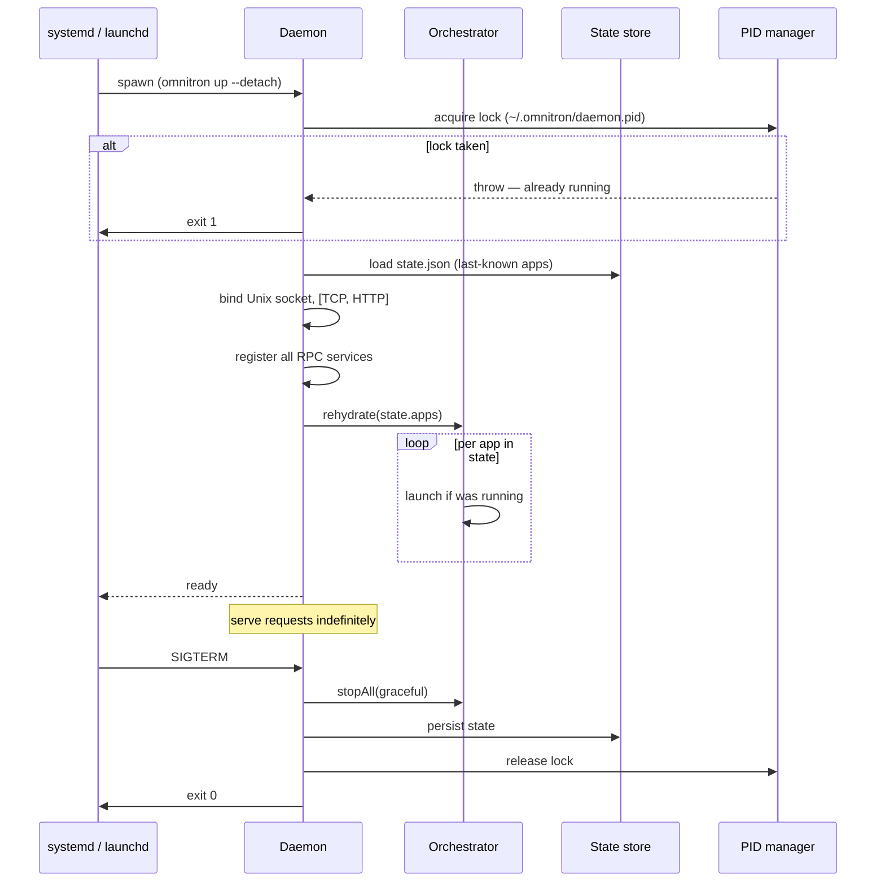
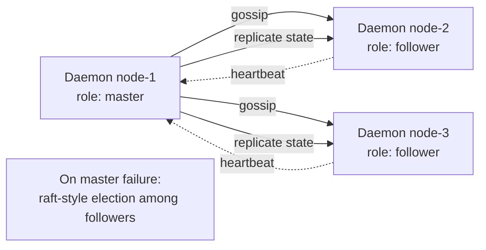
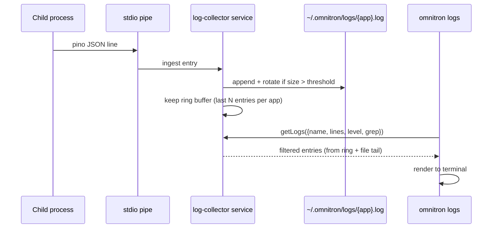
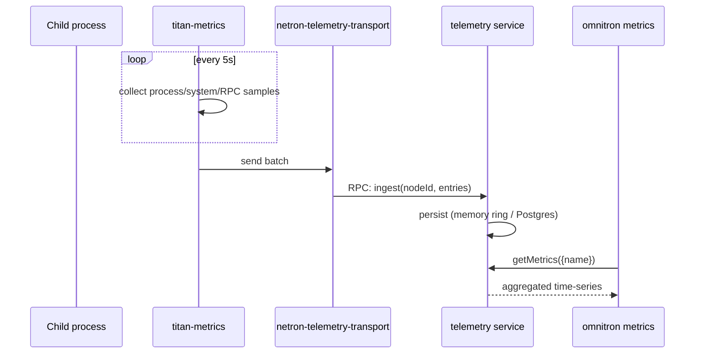

# Architecture

Omnitron is decomposed into a handful of long-lived objects that
all live inside a single daemon process. Operators talk to the
daemon over Netron RPC; the daemon spawns and watches child
processes; child processes report metrics, logs, and health back
through structured pipes.

This page describes those pieces in enough detail to debug an
incident at 2 AM.

## Component map

```mermaid
flowchart TB
  subgraph DaemonProc["Daemon process &#40;one per node&#41;"]
    direction TB

    subgraph IngressPlane["Ingress planes"]
      US[Unix socket<br/>~/.omnitron/daemon.sock]
      TCP[TCP listener<br/>0.0.0.0:9700]
      HTTP[HTTP/WS listener<br/>0.0.0.0:9800]
    end

    subgraph Core["Core services"]
      Netron[Netron RPC bus]
      Daemon[OmnitronDaemon service]
      Auth[Auth service + JWT]
      State[(State store<br/>state.json)]
      PIDM[PID manager]
      Sched[Daemon scheduler]
    end

    subgraph BuiltIn["Built-in RPC services &#40;19&#41;"]
      Deploy[deploy]
      Fleet[fleet]
      Secrets[secrets]
      Backup[backup]
      Pipeline[pipeline]
      Project[project]
      Infra[infrastructure]
      K8s[kubernetes]
      Logs[log-collector]
      Trace[trace-collector]
      Telemetry[telemetry]
      Health[health-check]
      Sync[sync]
      SysInfo[system-info]
      EventBC[event-broadcaster]
      Discovery[discovery]
      Alert[alert]
      Node[node-manager]
    end

    subgraph Orchestrator["Orchestrator subsystem"]
      AppHandle[App handle]
      Boot[Bootstrap loader]
      TSC[TS compiler]
      Watch[File watcher]
      DepRes[Dependency resolver]
      Router[Service router]
      Janitor[Process janitor]
      Classic[Classic launcher]
      MWP[Module-worker spawner]
    end

    subgraph InfraSub["Infrastructure subsystem"]
      Docker[Docker provider]
      Bare[Bare-metal provider]
      Provisioner[Service provisioner]
    end

    subgraph Cluster["Cluster subsystem"]
      Leader[Leader election]
      Replicate[State replication]
    end

    subgraph Webapp["Webapp host"]
      Static[Vite dev / static]
      Bridge[Netron HTTP bridge]
    end
  end

  US --> Netron
  TCP --> Netron
  HTTP --> Netron
  HTTP --> Static
  Static --> Bridge --> Netron

  Netron --> Auth
  Netron --> Daemon
  Daemon --> State
  Daemon --> PIDM
  Daemon --> Sched
  Daemon --> Orchestrator
  Daemon --> BuiltIn

  Orchestrator --> Classic
  Orchestrator --> MWP
  Orchestrator --> Watch
  Orchestrator --> Janitor

  Classic -- fork --> Children
  MWP -- fork --> Children[Child app processes]

  Daemon --> InfraSub
  InfraSub --> DockerD[Docker daemon]

  Daemon --> Cluster
  Cluster --> RemoteDaemons[Other omnitron daemons]
```



## The three planes

Omnitron exposes three independent transports — same Netron RPC
surface, different network shape.

### 1. Management plane — `unix://~/.omnitron/daemon.sock`

Unix domain socket, file mode `0o600` (owner-only). The **trust
boundary**: if you can open the socket, you've already passed the
OS-level identity check. CLI calls auth-bypass through this
socket for ergonomics.

| Carries                       | Used by                                  |
| ----------------------------- | ---------------------------------------- |
| All 19 RPC services           | `omnitron` CLI                           |
| The `OmnitronDaemon` service  | Webapp dev (when running locally)        |
| MCP server requests           | Agent processes spawned by the CLI       |

### 2. Public TCP plane — `tcp://0.0.0.0:9700`

Opt-in. Disabled by default; enable when:
- You run a fleet (other daemons connect for cluster membership).
- You operate `omnitron remote` (alias-addressed daemons).
- You expose a programmatic API to an external CI/CD.

JWT is **required** on this plane. RBAC roles
(`viewer` / `operator` / `admin`) gate every method.

### 3. HTTP / WS plane — `http://0.0.0.0:9800`

Opt-in. Serves:
- The webapp's static bundle (production build).
- The Netron HTTP bridge (`netron-browser` uses this).
- A REST gateway if `httpRest: true` is configured.

JWT also required here, except for static asset routes.

## Daemon lifecycle



The state-store is the **persistent intent** — what should be
running. On crash + restart, the daemon reads `state.json` and
relaunches anything that was alive at last write.

## State store — `state.json`

A single JSON file capturing:

```typescript
interface DaemonState {
  apps: Record<string, {
    name:        string;
    status:      'starting' | 'running' | 'stopped' | 'crashed';
    pid?:        number;
    startedAt?:  number;
    lastError?:  string;
    restarts:    number;
    processes:   Record<string, ChildProcessState>;
  }>;
  cluster?: {
    role:    'master' | 'follower';
    leader?: string;
    term:    number;
  };
}
```

Persisted on every status transition, atomic-rename style
(`write tmp → rename → fsync` parent). If the file is corrupt at
boot, the daemon starts fresh — empty apps map — and logs a
warning.

## PID manager

Owns `~/.omnitron/daemon.pid`. Responsibilities:

- **Lock acquisition** at boot: open exclusive, write `process.pid`.
  If lock fails, another daemon is running — abort.
- **Liveness sweep**: periodically check whether the lock-holding
  PID is still alive; if not, reclaim the lock.
- **Atomic ownership transfer** during `cluster.step-down` — the
  outgoing leader explicitly releases.

Child process PIDs are owned by the orchestrator (per `IAppHandle`),
not the PID manager.

## Daemon scheduler

A small in-process scheduler bound to the daemon's lifecycle.
Runs periodic tasks:

| Task                                  | Default interval |
| ------------------------------------- | ---------------- |
| Health probe sweep across all apps    | 15 s             |
| Metrics aggregation tick              | 5 s              |
| State persistence flush               | on transition + 30 s baseline |
| Crash-loop backoff timer              | per-app, exponential |
| Cluster heartbeat (if cluster.enabled)| 2 s              |
| Health-monitor sweep (cluster nodes)  | 60 s             |

All scheduler timers are `.unref()`-ed so they don't block
shutdown.

## Orchestrator subsystem

Owns the per-app launch pipeline. One `AppHandle` per running
app:

```mermaid
flowchart LR
  Daemon -- launch&#40;name&#41; --> AppH[AppHandle]
  AppH --> Boot[Bootstrap loader]
  Boot --> TSC[TS compiler<br/>if .ts source]
  Boot --> Resolve[Dependency resolver]
  Resolve --> SR[Service router]
  AppH --> Spawn{Spawn mode}
  Spawn -- classic --> CL[ClassicLauncher]
  Spawn -- module --> MWP[ModuleWorkerProcess]
  CL --> Forks
  MWP --> Forks[Child processes]
  AppH --> Watcher[FileWatcher<br/>if dev]
  AppH --> Janitor[ProcessJanitor]
```



Two launch modes:

- **Classic launcher** — `node bootstrap.js` is forked once;
  bootstrap is responsible for creating all `Application`s and
  running its own subprocess management. Used for legacy apps.
- **Module-worker spawner** — one fork per `IProcessEntry`. Each
  child imports a single module file and runs `Application.create`
  directly. Default for new apps; lower memory, faster boot.

→ Full pipeline: [Orchestrator](./orchestrator.md).

## Built-in RPC services

The daemon registers 19 Netron services at boot. They share
authentication / authorization with the `OmnitronDaemon` service.

| Service               | Purpose                                                    |
| --------------------- | ---------------------------------------------------------- |
| `OmnitronDaemon`      | App lifecycle — start / stop / restart / status / inspect  |
| `auth`                | JWT issue / verify / RBAC                                  |
| `secrets`             | Encrypted secret CRUD                                      |
| `infrastructure`      | Docker container management (Postgres / Redis / etc.)      |
| `deploy`              | Deployment workflows                                       |
| `fleet`               | Cross-node fleet operations                                |
| `pipeline`            | CI/CD pipeline runs                                        |
| `backup`              | Database backup / restore                                  |
| `project`             | Seed project registry                                      |
| `kubernetes`          | k8s integration (apply / scale / observe)                  |
| `node-manager`        | Infrastructure node inventory                              |
| `log-collector`       | Per-app log streaming + filtering                          |
| `trace-collector`     | Distributed trace ingestion                                |
| `telemetry`           | Telemetry-relay (`titan-telemetry-relay`) aggregator       |
| `health-check`        | Active health-check runs                                   |
| `discovery`           | Service discovery state                                    |
| `event-broadcaster`   | Cross-process event bus                                    |
| `alert`               | Alert rules + delivery                                     |
| `sync`                | Cross-daemon state synchronisation                         |
| `system-info`         | Host CPU / RAM / disk inventory                            |

→ Full reference: [Services reference](./services-reference.md).

## Infrastructure subsystem

When an app's `omnitronConfig.infrastructure` declares a
requirement, the daemon's infrastructure subsystem:

1. Checks if the requirement is already satisfied (running
   container, registered bare-metal service).
2. Resolves connection parameters (host / port / credentials).
3. Provisions if missing — Docker for dev/test, bare-metal hooks
   for prod.
4. Injects resolved env vars (`DATABASE_URL`, `REDIS_URL`, …) into
   the app at startup.

```mermaid
flowchart LR
  App[App declaration<br/>requires: { database, redis, s3 }]
  App --> Resolver
  Resolver{Provider?}
  Resolver -- dev/test --> Docker[Docker provider]
  Resolver -- prod --> Bare[Bare-metal hook]
  Docker --> Containers[Running containers]
  Bare --> Existing[Existing servers]
  Containers --> Inject[Inject env vars]
  Existing --> Inject
  Inject --> App
```

→ Reference: `omnitron infra status` shows current containers;
the [Infra CLI section](./cli.md#infrastructure) covers commands.

## Cluster subsystem

When `cluster.enabled: true` in daemon config, multiple daemons
form a cluster:



Election parameters:

| Parameter            | Default        |
| -------------------- | -------------- |
| `discovery`          | `'redis'` (or `'consul'` / `'static'`) |
| `electionTimeout`    | `5–15 s` (jittered) |
| `heartbeatInterval`  | `2 s`          |

Cluster operations are exposed via the `cluster` CLI command
group — see [CLI Cluster section](./cli.md#cluster-leader-election).

## Webapp host

The daemon optionally serves the React console:

| Mode             | Source                                          | When          |
| ---------------- | ----------------------------------------------- | ------------- |
| **Production**   | Pre-built bundle from `apps/omnitron/webapp/dist/` | After `pnpm build` |
| **Dev**          | Spawns Vite dev server with HMR                | `omnitron webapp dev` |

Both modes proxy Netron RPC over HTTP through the daemon's HTTP
plane.

## Auth model — three roles

The `OmnitronDaemon` service and others use role-based access:

| Role         | What they can do                                                     |
| ------------ | -------------------------------------------------------------------- |
| `viewer`     | Read-only: list / status / inspect / metrics / health / logs        |
| `operator`   | Viewer + lifecycle: start / stop / restart / reload / scale / exec  |
| `admin`      | Operator + destructive: shutdown / reloadConfig / setMetricsEnabled |

The local Unix socket bypasses auth — local CLI calls run as the
implicit `admin` (OS-level trust). TCP/HTTP planes always require
JWT.

## Data flow — log shipping



Logs flow through the daemon — no separate log shipper. The
ring buffer means `omnitron logs --follow` returns recent entries
immediately even if the file has been rotated.

## Data flow — metrics aggregation



Apps push metrics to the daemon via Netron — the daemon stores
and aggregates centrally. The webapp reads the same store.

## Data flow — leader election (cluster mode)

```mermaid
sequenceDiagram
  participant D1 as Daemon-1
  participant D2 as Daemon-2
  participant D3 as Daemon-3
  participant R as Redis (or Consul)

  Note over D1,D3: All boot as follower
  D1->>R: acquire leader lock (key: cluster:leader)
  R-->>D1: ok
  D1->>D1: role := master
  loop heartbeatInterval (2s)
    D1->>R: refresh lock TTL
    D2->>R: read leader; observe D1
    D3->>R: read leader; observe D1
  end
  Note over D1: D1 crashes
  R-->>R: lock TTL expires
  D2->>R: try acquire — wins
  D2->>D2: role := master
```

Step-down is graceful: `omnitron cluster step-down` releases the
lock and demotes self before the next election.

## Putting it together

Read these in order for a complete picture:

1. **[Daemon](./daemon.md)** — the always-on process; its
   internals.
2. **[Orchestrator](./orchestrator.md)** — how apps launch.
3. **[Services reference](./services-reference.md)** — every RPC
   method.
4. **[CLI](./cli.md)** — the operator's daily interface.
5. **[Console](./console.md)** — the web UI.
