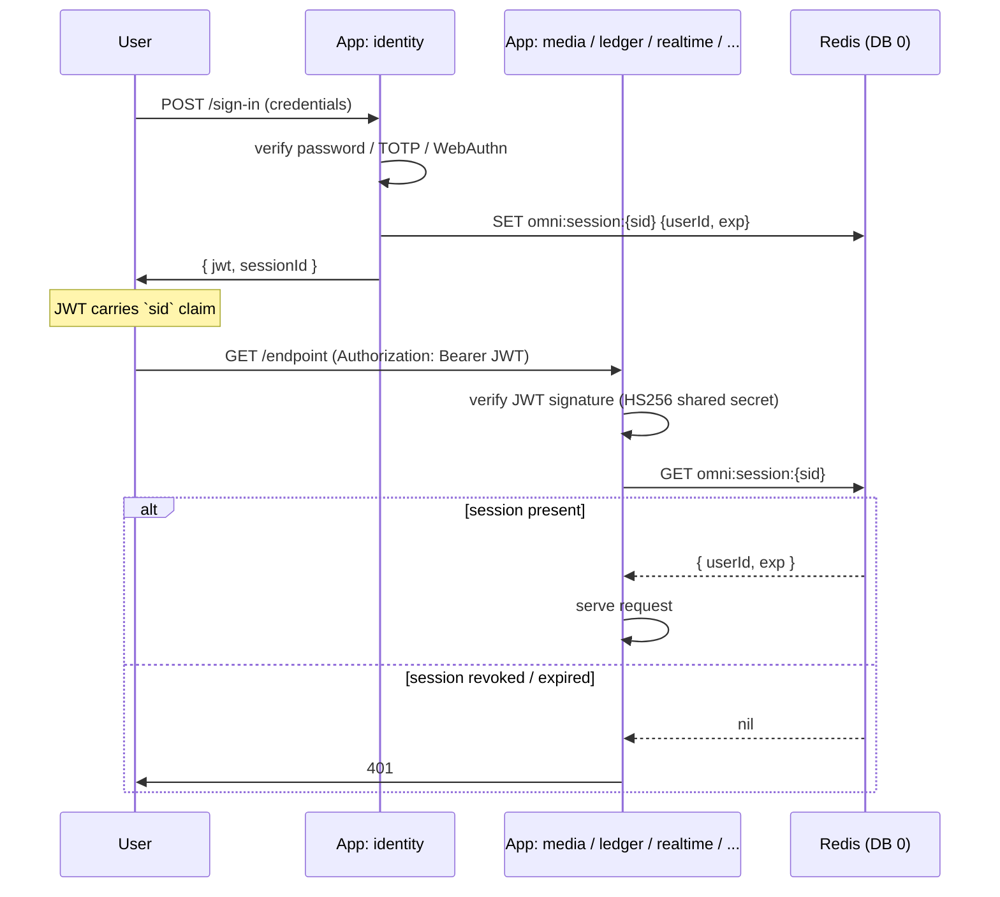

# Auth & RBAC

:::info
This page covers the **operator-flavoured** auth surface
(CLI, webapp, MCP, service-to-service). For the framework-
agnostic authorisation primitives (permission grammar,
per-user overrides, ABAC conditions, RLS bridge, audit
trail), start at [Authentication & Authorisation](../auth/index.md).
:::

Omnitron ships a complete authentication and authorization model
that covers operator surfaces (CLI, webapp, MCP), service-to-
service calls, and your applications' own user-facing endpoints.
This page covers the pieces and how they compose.

## Three identity surfaces

| Surface | Trust source | Auth flow |
| ------- | ------------ | --------- |
| Local CLI | OS-level file permission (Unix socket `0o600`) | Implicit admin — no JWT needed |
| Webapp / remote CLI | JWT issued by `OmnitronAuth.signIn` | Bearer token on every HTTP/TCP call |
| Service-to-service (cluster, fleet, sync) | JWT minted by the issuing daemon | Same as webapp; verified server-side |

Apps in your ecosystem add a **fourth** surface — end users
authenticating against one of your apps. The recommended
pattern (used by the production reference) is:

| Your surface | Trust source | Auth flow |
| ------------ | ------------ | --------- |
| End-user HTTP / WS calls | JWT issued by *your* identity app | Same JWT verified by every app in the fan-out |

## Three RBAC roles

| Role | Includes | What they can do |
| ---- | -------- | ---------------- |
| `viewer` | `viewer`, `operator`, `admin` | Read-only: list / inspect / status / metrics / health / logs |
| `operator` | `operator`, `admin` | Viewer + lifecycle: start / stop / restart / reload / scale / exec |
| `admin` | `admin` only | Operator + destructive: shutdown / reloadConfig / secrets / setMetricsEnabled |

Role hierarchy is **additive**: admin includes operator includes
viewer. Methods declare the **minimum** role required.

```typescript
// From the daemon RPC service:
@Public({ auth: { roles: VIEWER_ROLES } })   // ['admin','operator','viewer']
async list(): Promise<ProcessInfoDto[]> { /* ... */ }

@Public({ auth: { roles: OPERATOR_ROLES } }) // ['admin','operator']
async startApp(...) { /* ... */ }

@Public({ auth: { roles: ADMIN_ROLES } })    // ['admin']
async shutdown(...) { /* ... */ }

@Public({ auth: { allowAnonymous: true } })  // no token required
async ping() { /* ... */ }
```

→ See [Daemon / RPC surface](./daemon.md#rpc-surface--omnitrondaemon-service)
for the full method-by-method role map.

## Shared JWT across fan-out apps

The most powerful pattern: **one identity app issues; N apps
verify** using the same signing key. End users carry one bearer
token; it works against every app.



### Why Redis-backed sessions?

- **Instant revocation.** Delete `omni:session:{sid}` → next call
  on any app rejects. No "wait for token expiry".
- **O(1) check.** Redis lookup vs database hit on every call.
- **Cross-app coherence.** All apps see the same revocation
  immediately.

The JWT alone has a short TTL (15 minutes is typical); the
session in Redis carries the long-lived state.

## Shared auth factory pattern

Extract auth setup into a workspace package so every app boots
the same way:

```typescript
// packages/auth-utils/src/create-auth-manager.ts
export interface CreateJwtAuthManagerOptions {
  logger:        ILogger;
  jwtService:    IJWTService;
  sessionRedis:  Redis;
  cnfHmacSecret?: string;
  /** Postgres fallback for cold-cache session re-warm. */
  sessionLookup?: (sessionId: string) => Promise<SessionRecord | undefined>;
}

export function createJwtAuthManager(opts: CreateJwtAuthManagerOptions): AuthenticationManager {
  // 1. Verify JWT signature with shared key (HS256)
  // 2. Extract sid claim
  // 3. GET omni:session:{sid} from Redis
  // 4. If miss and sessionLookup provided → consult Postgres, re-warm Redis
  // 5. If cnfHmacSecret provided and JWT has cnf.fp → verify token-binding
  // 6. Return AuthContext or throw
  return /* ... */;
}
```

Each app's `bootstrap.ts`:

```typescript
hooks: {
  afterCreate: async (app) => {
    const jwt    = await app.container.resolveAsync(JWT_SERVICE_TOKEN);
    const logger = (await app.container.resolveAsync(LOGGER_SERVICE_TOKEN)).logger;
    const redis  = (await app.container.resolveAsync(REDIS_MANAGER)).getClient('sessions');

    if (app.netron) {
      app.netron.configureAuth(createJwtAuthManager({
        logger, jwtService: jwt, sessionRedis: redis,
        cnfHmacSecret: process.env.JWT_SECRET,
        // sessionLookup is provided ONLY by the identity app
      }));
    }
  },
}
```

**Only the identity app** sets `sessionLookup`. Other apps trust
the identity app to repopulate Redis on a cold session.

## Token cache

`titan-auth.jwt.tokenCacheTtl` controls per-app LRU caching of
verified tokens:

| TTL | Trade-off |
| --- | --------- |
| `10_000` (10 s) | Auth app — short, to honour revocations fast |
| `60_000` (1 min) | Other apps — fewer Redis calls per JWT |

The cache is local per process. Revocation triggers re-check on
every cached JWT only when the cache entry expires. Set
identity-app's TTL low; relax others.

## Token binding via `cnf.fp`

Standard JWT auth has one weakness: a stolen short-lived token
works until it expires. **`cnf.fp` binds the JWT to a refresh
chain** — if the chain rotates or revokes, the JWT becomes
invalid immediately even before expiry.

How it works:

1. Identity app issues a refresh token, records its id `rtid`.
2. When minting the access JWT, it stamps
   `cnf.fp = HMAC(secret, rtid)` into the JWT claims.
3. Every backend, after verifying signature + session, also:
   a. Looks up the session's **currently active** refresh-token id
      from Redis (re-warmed from Postgres by the identity app).
   b. Computes `HMAC(secret, currentRtid)`.
   c. If `cnf.fp` doesn't match → reject as 401.

Result: if the refresh chain rotates (user signed in elsewhere)
or revokes (user changed password), the JWT immediately stops
working without waiting for `exp`.

```typescript
createJwtAuthManager({
  // ...
  cnfHmacSecret: process.env.JWT_SECRET,  // typically the same JWT signing key
});
```

The HMAC secret is conventionally the same as the JWT signing
key — one rotation surface handled by the `kid` mechanism.

## Refresh token rotation

```mermaid
sequenceDiagram
  participant Client
  participant Auth as identity app

  Client->>Auth: POST /sign-in
  Auth-->>Client: { access: JWT(short), refresh: rtid_1 }
  Note over Client: rtid_1 stored in HttpOnly cookie

  loop access expires
    Client->>Auth: POST /refresh (rtid_1)
    Auth->>Auth: mark rtid_1 used; create rtid_2
    Auth-->>Client: { access: JWT(cnf.fp = HMAC(rtid_2)), refresh: rtid_2 }
    Note over Client: rtid_1 now used; only rtid_2 is presentable
  end

  Note over Client: token stolen and used after refresh
  Note over Auth: stolen JWT carries cnf.fp(rtid_1); session's<br/>currently-active is rtid_2 → mismatch → 401
```

Refresh tokens are **one-use** — using `rtid_N` invalidates it
and produces `rtid_N+1`. Reuse of an old refresh token is a
strong signal of token theft.

## Multi-key JWT verification (rotation without downtime)

```typescript
JwtModule.forRoot({
  algorithm: 'HS256',
  jwtSecret: 'current-key',                  // legacy / fallback
  verificationKeys: {
    'k2025-01': 'older-key-still-valid',
    'k2025-04': 'current-key',
    'k2025-07': 'next-key',
  },
});
```

When issuing, set `kid: 'k2025-04'` in the JWT header. Verifiers
pick the matching key by `kid`. Rotate by:

1. Add new key under a new `kid`.
2. Start signing with new `kid` (everywhere — coordinated deploy).
3. Wait for all old-key tokens to expire (`exp`).
4. Remove old key from `verificationKeys`.

Zero downtime, zero forced sign-outs.

## RLS context propagation

The Netron auth manager populates `authContext` in invocation
metadata; the **invocation wrapper** maps that into a kysera RLS
scope so Postgres policies see the right session variables.

```typescript
// Shared wrapper:
import { mapAuthToRLSContext } from '@omnitron-dev/titan/netron/auth';
import { rlsContext }          from '@omnitron-dev/titan-database/rls';

export function createRlsInvocationWrapper() {
  return async (metadata: Map<string, unknown>, fn: () => Promise<unknown>) => {
    const authCtx = metadata.get('authContext') as AuthContext | undefined;
    if (authCtx) {
      const rlsCtx = mapAuthToRLSContext(authCtx, {
        defaultTenantId: (authCtx.metadata as any)?.tenantId ?? 'default',
      });
      return rlsContext.runAsync(rlsCtx, fn);
    }
    return fn();
  };
}

// In every app's bootstrap:
auth: {
  jwt: { enabled: true, tokenCacheTtl: 60_000 },
  invocationWrapper: createRlsInvocationWrapper(),
},
```

Now every database query — from any `@Service` method — runs
inside an AsyncLocalStorage scope that exposes `user_id`,
`is_system`, `tenant_id` to RLS policies. Repositories pick this
up automatically via the kysera RLS plugin.

## Role hierarchy patterns for end-user RBAC

For your application's own role system (separate from the
operator roles above), declare a hierarchy and let library
functions handle precedence:

```typescript
// packages/auth-utils/src/role-hierarchy.ts
export const ROLE_PRIORITY = {
  guest:     0,
  user:      10,
  contributor: 20,
  moderator: 50,
  admin:     100,
} as const;

export type RoleName = keyof typeof ROLE_PRIORITY;

export function effectiveLevel(roles: readonly RoleName[]): number {
  return Math.max(0, ...roles.map(r => ROLE_PRIORITY[r] ?? 0));
}

export function canModerateUserWithRole(
  actor: readonly RoleName[],
  target: readonly RoleName[],
): boolean {
  return effectiveLevel(actor) > effectiveLevel(target);
}

export function visibleRolesFor(viewerRoles: readonly RoleName[]): RoleName[] {
  const cap = effectiveLevel(viewerRoles);
  return (Object.keys(ROLE_PRIORITY) as RoleName[]).filter(r => ROLE_PRIORITY[r] <= cap);
}
```

Centralised hierarchy = no per-feature ad-hoc checks. Tiered
visibility (search results, profile views) and tiered moderation
(who can ban whom) compose from these primitives.

## Anonymous and service-to-service endpoints

Three auth shapes per method:

```typescript
// 1. Public — anyone with socket access
@Public({ auth: { allowAnonymous: true } })
async ping() { /* ... */ }

// 2. Authenticated user — any logged-in user
@Public({ auth: { roles: ['user', 'admin'] } })
async getProfile() { /* ... */ }

// 3. Service-to-service — for inter-app calls
@Public({ auth: { roles: ['admin', 'operator', 'service_role'] } })
async receiveBatch(data: SyncBatch) { /* ... */ }
```

The `service_role` is a special role the daemon mints for
cross-app calls (e.g., `OmnitronSync.receiveBatch` between
master and slave daemons). End-user JWTs never carry it.

## API key pattern (for headless integrations)

For CI agents, partner integrations, or scripted clients that
shouldn't go through interactive sign-in:

```typescript
// In your identity app:
async createApiKey(userId: string, scopes: string[], expiresAt?: Date) {
  const apiKey = `pk_${crypto.randomBytes(32).toString('base64url')}`;
  const hash   = await argon2.hash(apiKey);
  await db.insertInto('api_keys').values({ userId, hash, scopes, expiresAt }).execute();
  return apiKey;     // returned ONCE; not stored in plaintext anywhere
}

async verifyApiKey(presented: string): Promise<AuthContext | null> {
  // Look up by prefix (first 8 chars) for fast filter
  const candidates = await db.selectFrom('api_keys')
    .where('hashPrefix', '=', presented.slice(3, 11))
    .selectAll().execute();
  for (const row of candidates) {
    if (await argon2.verify(row.hash, presented)) {
      return buildAuthContext(row.userId, row.scopes);
    }
  }
  return null;
}
```

Then in your auth manager, accept either JWT or API key:

```typescript
if (token.startsWith('pk_')) return verifyApiKey(token);
return verifyJwt(token);
```

API keys carry their own scope list — narrower than JWT roles —
so a compromised key only opens the doors you've granted it.

## TOTP / WebAuthn second factor

For human users (especially admins), require a second factor on
sign-in:

```typescript
async signIn({ email, password, totpCode }) {
  const user = await this.users.verifyPassword(email, password);
  if (!user) throw Errors.unauthorized('invalid credentials');

  if (user.totpEnabled) {
    if (!totpCode) return { requires2fa: true };
    const ok = await verifyTotp(user.totpSecret, totpCode, /* window */ 1);
    if (!ok) throw Errors.unauthorized('invalid 2FA code');
  }

  return this.createSession(user);
}
```

WebAuthn / passkeys are stronger; same flow shape.

For operator surfaces, **require 2FA for the admin role**:

```typescript
@Public({ auth: { roles: ADMIN_ROLES, requiresMfa: true } })
async destructiveOperation() { /* ... */ }
```

(The `requiresMfa` flag is an application-level convention; the
auth manager checks the session's `mfaVerified` claim before
allowing.)

## Auth in WebSockets

WS auth is verified on the **upgrade request** only:

```typescript
ws.on('upgrade', async (req) => {
  const token = extractBearer(req) ?? extractCookieToken(req);
  if (!token) return ws.reject(401);
  const authCtx = await authManager.verify(token);
  ws.context = authCtx;
});
```

After upgrade, the socket holds the AuthContext for its
lifetime. **Don't try to re-auth a live socket** — close it and
reopen.

For token rotation while a socket is open: the client receives
a `token.expiring-soon` push, refreshes the token via HTTP, and
reconnects WS. No in-band protocol mess.

## Audit logging

Every operator-level action should land in an append-only
audit log:

```typescript
@Public({ auth: { roles: OPERATOR_ROLES } })
async startApp({ name }: { name: string }, @Auth() ctx: AuthContext) {
  await this.audit.record({
    actor:     ctx.userId,
    action:    'app.start',
    target:    name,
    timestamp: Date.now(),
  });
  return this.orchestrator.start(name);
}
```

Recommended sink: a tamper-evident store (signed append-only
log, S3 object-lock bucket, or external SIEM). Local files
alone are insufficient for compliance.

## Anti-patterns

- **Auth check in custom HTTP routes that's weaker than the RPC
  surface.** Always call the same access predicate (`assertAccess`,
  `requireRole`) from both paths.
- **Tokens in URLs.** Show up in proxy logs, browser history,
  referer headers. Always use `Authorization: Bearer`.
- **No `cnf.fp` on high-value operations.** A 15-min JWT is fine
  for read APIs; for destructive actions, prefer token-binding so
  rotation invalidates immediately.
- **Skipping RLS for "internal" services.** Internal callers
  carry their own AuthContext; even the identity app's own
  queries benefit from RLS as defense in depth.
- **API keys without scopes.** A scope-less API key is a
  full-power credential in disguise. Always require a scope list.
- **One key for everything.** Separate keys per integration so
  rotation / revocation is granular.
- **Logging tokens.** Even at debug level, JWTs in logs let
  anyone with log access impersonate users. Log `kid` + `code`
  on failures, never the full token.
- **`allowAnonymous: true` on a mutating endpoint.** Be explicit;
  read-only auto-discovery is fine, but anything that writes
  state should require auth.

## See also

- [Daemon / Auth flow](./daemon.md#auth-flow) — the daemon's own auth
- [Services reference](./services-reference.md) — `OmnitronAuth` methods
- [Best practices / Shared authentication](./best-practices.md#shared-authentication-across-apps)
- [`titan-auth`](../titan/modules/auth.mdx) — JWT module reference
- [`titan-database`](../titan/modules/database.mdx) — RLS plugin
