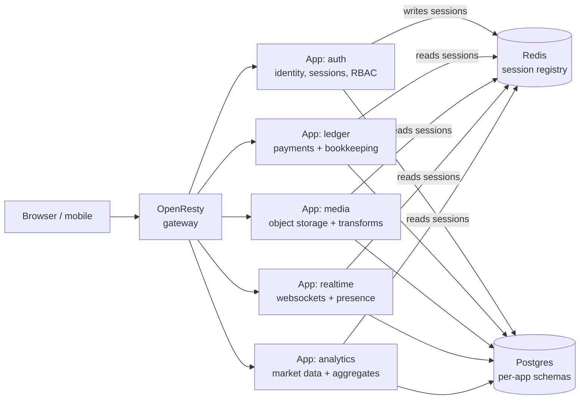

# Production best practices

A working multi-app Omnitron ecosystem looks remarkably different
from a "hello-world" `defineSystem`. This page collects the
patterns that emerge once you run several apps together — shared
authentication, ordered startup, custom infrastructure, graceful
shutdown ordering, gateway integration, and the half-dozen
quality-of-life decisions that make the difference between "it
boots" and "it stays up".

Every example uses generic placeholder names (`auth`, `ledger`,
`media`, `realtime`, `analytics`). Substitute the names that fit
your domain.

## The five-app fan-out

A common production shape: **one app owns identity**; **N
specialist apps delegate authentication back to it** via a
shared JWT. Each specialist owns its own data plane (database,
queue, blockchain daemon, object store, websockets) but trusts
the central auth.



Properties of this shape:

- **One signing key**, one JWT format — auth issues; everyone
  else verifies.
- **Session revocation is instant** because every backend checks
  the Redis session registry on each call.
- **Each specialist scales independently** — only `media` needs
  more CPU when traffic spikes uploads.
- **The auth app is `critical: true`**; the others are usually not.

A minimal `omnitron.config.ts` for this shape:

```typescript
export default defineEcosystem({
  project: 'platform',
  infrastructure: {
    services: {
      gateway: { preset: 'openresty', config: { configDir: './infra/nginx' } },
    },
    // postgres / redis / minio are auto-provisioned from app requirements
  },
  apps: [
    { name: 'auth',      bootstrap: './apps/auth/dist/bootstrap.js',      critical: true,
      watch: { directory: './apps/auth' } },
    { name: 'media',     bootstrap: './apps/media/dist/bootstrap.js',     dependsOn: ['auth'],
      startupTimeout: 90_000,  watch: { directory: './apps/media' } },
    { name: 'analytics', bootstrap: './apps/analytics/dist/bootstrap.js',
      watch: { directory: './apps/analytics' } },
    { name: 'ledger',    bootstrap: './apps/ledger/dist/bootstrap.js',    dependsOn: ['auth'],
      startupTimeout: 120_000, watch: { directory: './apps/ledger' } },
    { name: 'realtime',  bootstrap: './apps/realtime/dist/bootstrap.js',  dependsOn: ['auth'],
      watch: { directory: './apps/realtime' } },
  ],
  supervision: {
    strategy: 'one_for_one',
    maxRestarts: 5,
    window: 60_000,
    backoff: { type: 'exponential', initial: 1_000, max: 30_000, factor: 2 },
  },
  monitoring: { healthCheck: { interval: 15_000, timeout: 5_000 },
                metrics: { interval: 5_000, retention: 3_600 } },
  logging:    { level: 'info', maxSize: '50mb', maxFiles: 10, compress: true },
});
```

## Shared authentication across apps

Extract the auth wiring into a shared package — every app's
`bootstrap.ts` then calls one factory.

```typescript
// packages/auth-utils/src/create-auth-manager.ts
import { mapAuthToRLSContext } from '@omnitron-dev/titan/netron/auth';
import { rlsContext }          from '@omnitron-dev/titan-database/rls';

interface CreateJwtAuthManagerOptions {
  logger:        ILogger;
  jwtService:    IJWTService;
  sessionRedis:  Redis;
  cnfHmacSecret?: string;
  /** Optional Postgres lookup for cold-cache session re-warm — only the auth app provides this */
  sessionLookup?: (sessionId: string) => Promise<SessionRecord | undefined>;
}

export function createJwtAuthManager(opts: CreateJwtAuthManagerOptions): AuthenticationManager {
  // verify JWT signature → extract sessionId claim →
  // O(1) Redis lookup → re-warm from Postgres if cold and lookup provided →
  // optional cnf.fp (token-binding) verification
  return /* configured AuthenticationManager */;
}

export function createRlsInvocationWrapper() {
  return async (metadata: Map<string, unknown>, fn: () => Promise<unknown>) => {
    const authCtx = metadata.get('authContext') as AuthContext | undefined;
    if (authCtx) {
      const rlsCtx = mapAuthToRLSContext(authCtx, {
        defaultTenantId: (authCtx.metadata as any)?.tenantId ?? 'default',
      });
      return rlsContext.runAsync(rlsCtx, fn);
    }
    return fn();
  };
}
```

Each app's `bootstrap.ts` then:

```typescript
// apps/media/src/bootstrap.ts
import { defineSystem } from '@omnitron-dev/omnitron';
import { createJwtAuthManager, createRlsInvocationWrapper } from '@platform/auth-utils';
import { JWT_SERVICE_TOKEN } from '@omnitron-dev/titan-auth';
import { REDIS_MANAGER }     from '@omnitron-dev/titan-redis';
import { LOGGER_SERVICE_TOKEN } from '@omnitron-dev/titan/module/logger';

export default defineSystem({
  name: 'media',
  version: '1.0.0',
  processes: [{
    name: 'http',
    module: './app.module.js',
    critical: true,
    transports: {
      http: { port: 3002, host: '0.0.0.0', cors: true,
              requestTimeout: 300_000, maxRequestSize: '10gb' },
    },
    hooks: {
      afterCreate: async (app) => {
        const jwt           = await app.container.resolveAsync(JWT_SERVICE_TOKEN);
        const loggerModule  = await app.container.resolveAsync(LOGGER_SERVICE_TOKEN);
        const redisManager  = await app.container.resolveAsync(REDIS_MANAGER);
        const sessionRedis  = redisManager.getClient('sessions');

        if (app.netron) {
          app.netron.configureAuth(createJwtAuthManager({
            logger: loggerModule.logger,
            jwtService: jwt,
            sessionRedis,
            cnfHmacSecret: process.env.JWT_SECRET,
            // No sessionLookup — media trusts the auth app to re-warm
          }));
        }
      },
    },
  }],
  auth: {
    jwt: { enabled: true, tokenCacheTtl: 60_000 },
    invocationWrapper: createRlsInvocationWrapper(),
  },
});
```

Only the auth app provides `sessionLookup` — it owns the session
table. Other apps rely on Redis hits; on a cold session, the
first user request hitting the auth app re-warms the cache for
everyone.

### Token binding (`cnf.fp`)

Pass `cnfHmacSecret` to `createJwtAuthManager` and have the auth
app stamp `cnf.fp = HMAC(activeRefreshTokenId)` into issued JWTs.
On each call, every backend verifies the JWT's `cnf.fp` against
the session's currently-active refresh token id from Redis. If
the refresh chain has rotated (or been revoked), the token's
`cnf.fp` no longer matches — 401, instantly.

This guards against stolen short-lived JWTs even before they
expire.

## Ordered startup with `dependsOn`

Specialist apps that need the auth app warm before they start:

```typescript
apps: [
  { name: 'auth',     bootstrap: './apps/auth/dist/bootstrap.js',     critical: true },
  { name: 'media',    bootstrap: './apps/media/dist/bootstrap.js',    dependsOn: ['auth'] },
  { name: 'ledger',   bootstrap: './apps/ledger/dist/bootstrap.js',   dependsOn: ['auth'] },
  { name: 'realtime', bootstrap: './apps/realtime/dist/bootstrap.js', dependsOn: ['auth'] },
]
```

The orchestrator waits for an app's `dependsOn[]` to all report
healthy before starting it. Shutdown reverses the order
automatically.

## Tuning `startupTimeout` per app

The default 30 s startup timeout is fine for most apps. Apps
that initialise heavy resources need more:

| App profile | Typical `startupTimeout` |
| ----------- | ----------------------- |
| Plain HTTP service | 30 000 (default) |
| Image processor warm-up + S3 connect | 90 000 |
| Blockchain wallet RPC connection check + bootstrapping | 120 000 |
| Hardware crypto provider warm-up | 300 000 |

Set per app in `IEcosystemAppEntry.startupTimeout`. If an app
hits the timeout without reporting ready, the supervisor counts
it as a failed start and applies the restart policy.

## Worker processes within an app

`defineSystem` lets you fan out workers as separate processes
inside the same app:

```typescript
export default defineSystem({
  name: 'media',
  processes: [
    {
      name: 'http',
      module: './app.module.js',
      critical: true,
      transports: { http: { port: 3002 } },
      topology: { access: ['ImageTransformWorker'] },   // ← consumes sibling
    },
    {
      name: 'image-transform',
      module: './workers/image-transform.module.js',
      critical: false,            // worker pool — don't kill the app if it dies
      startupTimeout: 30_000,
      health: { enabled: true, interval: 30_000 },
      topology: { expose: true }, // ← exposes ImageTransformWorker @Service
    },
    {
      name: 'thumbnail-generator',
      module: './workers/thumbnail.module.js',
      critical: false,
      health: { enabled: false }, // burst worker — no need for health probe
    },
  ],
});
```

The pattern:
- **http** process exposes the public API; never blocks the event
  loop with CPU-bound work.
- **image-transform** process exposes `ImageTransformWorker` via
  `@Service`; http consumes it via `topology.access`.
- **thumbnail-generator** runs as a fire-and-forget worker — low
  criticality, no health probe overhead.

Result: CPU-bound work happens off the request event loop;
restarts of the worker pool don't take down the HTTP surface.

## Shutdown priority

When the daemon shuts down apps, lower `shutdown.priority`
numbers stop first; higher numbers stop later. Use this to drain
in dependency order:

```typescript
// apps/auth/src/bootstrap.ts
shutdown: { priority: 0, timeout: 10_000, drainConnections: true },

// apps/ledger/src/bootstrap.ts — should outlive auth on shutdown so
// in-flight transactions can complete before sessions become invalid
shutdown: { priority: 15, timeout: 10_000, drainConnections: true },

// apps/realtime/src/bootstrap.ts — must shut first to send
// disconnect frames to clients
shutdown: { priority: -10, timeout: 5_000, drainConnections: true },
```

Heuristic: an app that *depends on* another should shut **first**.

## Custom infrastructure with `networkMode` variants

When an app needs a service the presets don't cover (a search
engine, a blockchain daemon, a custom queue broker), declare it
in the app's `config/default.json` under `omnitron.infrastructure`:

```jsonc
{
  "omnitron": {
    "database": true,
    "redis":    true,
    "infrastructure": {
      "search": {
        "description": "Search engine for full-text indexing",
        "type": "daemon",
        "version": ">=8.10.0",
        "networkMode": "single-node",
        "ports": { "http": 9200, "transport": 9300 },
        "env": {
          "SEARCH_URL":      "http://${host}:${port:http}",
          "SEARCH_API_KEY":  "${secret:search_api_key}"
        },
        "secrets": {
          "search_api_key": { "secret": "search_api_key" }
        },
        "healthCheck": {
          "type": "command",
          "target": "curl -sf http://localhost:9200/_cluster/health",
          "interval": "30s", "timeout": "10s", "retries": 5, "startPeriod": "60s"
        },
        "startupTimeout": 120000,
        "docker": {
          "image": "elasticsearch:8.11.0",
          "environment": { "discovery.type": "single-node" },
          "resources": { "memory": "1G" },
          "variants": {
            "cluster": {
              "environment": { "cluster.name": "platform-search" },
              "resources":   { "memory": "4G", "memoryReservation": "2G" }
            }
          }
        },
        "bareMetal": {
          "systemdUnit": "elasticsearch",
          "dataDir": "/var/lib/elasticsearch",
          "user": "elasticsearch",
          "validateCommand": "elasticsearch --version"
        }
      }
    }
  }
}
```

What this delivers:
- Dev / test stacks get the Docker container automatically.
- Production stacks point at the bare-metal service via the
  `bareMetal` block + per-stack override.
- The app receives a literal `SEARCH_URL=http://localhost:9200`
  and `SEARCH_API_KEY=<decrypted>` at startup.
- `networkMode: 'cluster'` swaps the Docker config when a stack
  declares it.

## Redis: one client, many logical databases

Avoid running multiple Redis containers. One instance with
named clients per concern:

```typescript
// In your app:
const redisManager = await app.container.resolveAsync(REDIS_MANAGER);
const sessionRedis = redisManager.getClient('sessions');     // DB 0
const cacheRedis   = redisManager.getClient('cache');        // DB 1
const queueRedis   = redisManager.getClient('queue');        // DB 2
const ratelimitRedis = redisManager.getClient('ratelimit');  // DB 3
const locksRedis   = redisManager.getClient('locks');        // DB 4
```

Configure per-client DBs in app config:

```jsonc
{
  "redis": {
    "clients": {
      "sessions":  { "db": 0 },
      "cache":     { "db": 1 },
      "queue":     { "db": 2 },
      "ratelimit": { "db": 3 },
      "locks":     { "db": 4 }
    }
  }
}
```

`sessions` is intentionally shared across all backends in the
fan-out architecture — every app reads from DB 0 to validate
sessions.

→ Recommended DB split is also documented in
[titan-redis module-map](../titan/modules/module-map.mdx#where-redis-sits).

## Per-app HTTP transport tuning

Tuning the HTTP transport per-process by use case:

```typescript
// Auth — short connections, fast turnaround
transports: { http: {
  port: 3001, host: '0.0.0.0', cors: true,
  requestTimeout: 30_000, keepAliveTimeout: 65_000, headersTimeout: 60_000,
}}

// Media — big uploads, long sessions
transports: { http: {
  port: 3002, host: '0.0.0.0', cors: true,
  requestTimeout: 300_000, keepAliveTimeout: 65_000, headersTimeout: 60_000,
  maxRequestSize: '10gb',
}}

// Realtime — HTTP for RPC + WebSocket for live
transports: {
  http:      { port: 3005, host: '0.0.0.0', cors: true,
               requestTimeout: 120_000, keepAliveTimeout: 65_000, headersTimeout: 70_000 },
  websocket: { port: 3006, host: '0.0.0.0', path: '/ws',
               keepAlive: { interval: 30_000, timeout: 10_000 } },
}
```

Headers-timeout > keep-alive-timeout > request-timeout is the
common ordering; setting them all explicitly is more reliable
than relying on Node defaults.

## Custom HTTP routes alongside RPC

Co-locate non-RPC endpoints (object serving, file streaming,
image transforms, webhooks) with the RPC surface:

```typescript
processes: [{
  name: 'http',
  module: './app.module.js',
  transports: { http: { port: 3002, host: '0.0.0.0' } },
  customRoutes: [
    {
      method: 'GET',
      pattern: '/render/image/*',
      handler: async (req: Request): Promise<Response | null> => {
        const url = new URL(req.url);
        if (!url.pathname.startsWith('/render/image/')) return null;
        // Resolve bucket from path; verify auth; transform; serve.
        // Use the SAME services available via Netron (objectService, transformService)
        // so policy is identical across the RPC + REST surfaces.
        // ...
      },
    },
    {
      method: 'POST',
      pattern: '/webhooks/payment-provider',
      handler: async (req) => verifyAndRoute(req),
    },
  ],
}]
```

**Security trap**: if your custom route bypasses a check that
the RPC surface enforces, you have two access tiers. The route
above must call the same `assertAccess('read')` gate the RPC
path uses. Don't skip auth in custom routes just because the
RPC layer "usually handles it".

## Hot-reloadable runtime settings

For settings that should change without restart (commission
rate, feature flags, business rules), store them in the
database and load on boot:

```typescript
hooks: {
  afterCreate: async (app) => {
    // ... auth wiring above ...

    // Apply persisted runtime settings
    const settingsService = await app.container.resolveAsync(RUNTIME_SETTINGS_SERVICE_TOKEN);
    if (settingsService && typeof settingsService.loadAndApply === 'function') {
      await settingsService.loadAndApply();
    }
  },
}
```

A separate admin RPC method calls `setAndReload(key, value)` to
update at runtime; subscribers in-process get notified via
`titan-events`.

This pattern is for **business logic settings**, not connection
strings — those still belong to the static config.

## Eager-loading heavy services

Some services (blockchain RPC clients, encryption providers,
machine-learning model loaders) take seconds to initialise.
Lazy resolution means the first request after startup hangs
waiting for them. Eager-load them in `afterCreate`:

```typescript
hooks: {
  afterCreate: async (app) => {
    // ... auth wiring ...

    // Eagerly resolve to fire @PostConstruct initializers
    try {
      logger.info('eagerly resolving wallet providers');
      await app.container.resolveAsync(WALLET_PROVIDER_A_TOKEN);
      await app.container.resolveAsync(WALLET_PROVIDER_B_TOKEN);
      logger.info('wallet providers warm');
    } catch (err) {
      logger.warn({ err }, 'could not eagerly resolve wallet providers');
    }
  },
}
```

Without this, the supervisor reports the app "ready" but the
first user request still pays the cold-start cost on a
critical path.

## Reverse-proxy with maintenance-mode flag in Redis

A gateway in front of every app that can be flipped to
maintenance mode without restart:

```nginx
# infra/nginx/nginx.conf
worker_processes auto;

env REDIS_HOST;
env REDIS_PORT;
env REDIS_PASSWORD;

http {
  lua_package_path "/etc/nginx/lua/?.lua;;";
  lua_shared_dict maintenance_cache 1m;

  upstream auth_backend     { server ${UPSTREAM_AUTH_HOST}:${UPSTREAM_AUTH_PORT}; }
  upstream media_backend    { server ${UPSTREAM_MEDIA_HOST}:${UPSTREAM_MEDIA_PORT}; }
  upstream ledger_backend   { server ${UPSTREAM_LEDGER_HOST}:${UPSTREAM_LEDGER_PORT}; }
  upstream realtime_backend { server ${UPSTREAM_REALTIME_HOST}:${UPSTREAM_REALTIME_PORT}; }
  upstream realtime_ws      { server ${UPSTREAM_REALTIME_WS_HOST}:${UPSTREAM_REALTIME_WS_PORT}; }

  server {
    listen 8080;
    access_by_lua_file /etc/nginx/lua/maintenance_check.lua;

    location /api/auth/     { proxy_pass http://auth_backend; }
    location /api/media/    { proxy_pass http://media_backend; }
    location /api/ledger/   { proxy_pass http://ledger_backend; }
    location /api/realtime/ { proxy_pass http://realtime_backend; }
    location /ws/           {
      proxy_pass http://realtime_ws;
      proxy_http_version 1.1;
      proxy_set_header Upgrade $http_upgrade;
      proxy_set_header Connection "upgrade";
    }
  }
}
```

`maintenance_check.lua` reads a flag from Redis and serves
`maintenance.html` if set. Operators flip the flag with one
Redis command — no daemon restart, no DNS change, no LB
reconfiguration.

```lua
-- infra/nginx/lua/maintenance_check.lua
local cache = ngx.shared.maintenance_cache
local cached = cache:get("flag")
if cached == nil then
  local redis = require("resty.redis")
  local r = redis:new()
  r:set_timeout(50)
  if r:connect(os.getenv("REDIS_HOST"), os.getenv("REDIS_PORT")) == 1 then
    if os.getenv("REDIS_PASSWORD") then r:auth(os.getenv("REDIS_PASSWORD")) end
    local v = r:get("platform:maintenance")
    cached = (v == "1") and "1" or "0"
    cache:set("flag", cached, 1)   -- 1s TTL; minimal Redis chatter
  else
    cached = "0"   -- fail-open
  end
end
if cached == "1" then
  ngx.status = 503
  ngx.header.content_type = "text/html"
  ngx.say(io.open("/etc/nginx/maintenance.html"):read("*all"))
  ngx.exit(503)
end
```

Configure the OpenResty gateway as a preset under
`infrastructure.services`:

```typescript
infrastructure: {
  services: {
    gateway: {
      preset: 'openresty',
      config: { configDir: './infra/nginx' },
      ports:  { http: 8080 },
    },
  },
}
```

## Tor hidden service for operator console

For sensitive operator surfaces (the webapp, an admin portal),
expose them over a `.onion` address — no DNS, no SNI, no public
TLS termination to manage:

```typescript
infrastructure: {
  services: {
    gateway: { preset: 'openresty', config: { configDir: './infra/nginx' } },
    tor: {
      preset: 'tor',
      config: {
        hiddenServices: [
          { name: 'webapp', virtualPort: 80, target: 'host.docker.internal:9800' },
          { name: 'admin',  virtualPort: 80, target: 'host.docker.internal:8080' },
        ],
      },
    },
  },
}
```

The `.onion` addresses are derived from keys in a persistent
volume. Print them after bootstrap with `omnitron tor`.

This is a control-plane convenience for distributed teams — not a
substitute for proper RBAC. Defense in depth.

## RLS context propagation

Every app in the fan-out has the same auth wrapper:

```typescript
auth: {
  jwt: { enabled: true, tokenCacheTtl: 60_000 },
  invocationWrapper: createRlsInvocationWrapper(),
}
```

The wrapper maps the Netron `authContext` into a kysera RLS
scope before each invocation; row-level policies in the database
see the right `app.user_id` / `app.is_system` / `app.tenant_id`
session variables.

Even the auth app uses this wrapper — its own queries against
`user_sessions` / `refresh_tokens` benefit from RLS just as much.

## Per-app config with env override

A two-source pattern works for almost every app:

```typescript
config: {
  sources: [
    { type: 'file', path: 'apps/media/config/default.json', optional: true },
    { type: 'env',  prefix: 'MEDIA_' },
  ],
  envPrefix: 'MEDIA_',
}
```

In `config/default.json`: defaults, business rules, declarative
infrastructure declarations. Env vars override — used for
secrets, per-environment toggles, and any value that must not
appear in committed files.

Prefix matters: `MEDIA_` for media, `LEDGER_` for ledger, etc.
Avoids cross-app env collisions.

## Restart policies — be sparing with `critical`

`critical: true` means "kill the whole daemon if this crashes
past `maxRestarts`". Reserve it for the **one** app whose
absence makes the rest useless:

```typescript
apps: [
  { name: 'auth',     bootstrap: '...', critical: true  },  // without auth, nothing works
  { name: 'media',    bootstrap: '...', critical: false },  // media down → uploads broken, rest OK
  { name: 'ledger',   bootstrap: '...', critical: false },
  { name: 'realtime', bootstrap: '...', critical: false },
  { name: 'analytics',bootstrap: '...', critical: false },
]
```

If you mark everything critical, any single bug brings the whole
daemon down — including the apps that were working fine.

## Workers: `critical: false` + health-check tuning

Worker subprocesses (`captcha-generator`, `notification-worker`,
`deposit-worker`) have different health-check needs:

| Worker type | `critical` | `health.enabled` | Reason |
| ----------- | :--------: | :--------------: | ------ |
| Burst / fire-and-forget | `false` | `false` | No external surface to probe; supervisor restart is enough |
| Steady consumer (queue worker) | `false` | `true` (60 s) | Catch silent stalls; restart on failure |
| Critical pipeline (deposits, settlements) | `false` | `true` (30 s) | Tighter probes; faster recovery |

Health probes per worker run inside the worker process — set
`health.enabled: false` for workers without a credible health
signal to save the probe overhead.

## Monitoring + supervision baseline

The same supervision block fits ~90% of deployments:

```typescript
supervision: {
  strategy:    'one_for_one',
  maxRestarts: 5,
  window:      60_000,
  backoff:     { type: 'exponential', initial: 1_000, max: 30_000, factor: 2 },
},
monitoring: {
  healthCheck: { interval: 15_000, timeout: 5_000 },
  metrics:     { interval: 5_000,  retention: 3_600 },
},
logging: {
  level:    'info',
  maxSize:  '50mb',
  maxFiles: 10,
  compress: true,
},
```

Tune from here:
- **`maxRestarts: 5 / 60s`** is OK for most. Raise for noisier
  workloads, lower for crash-prone development.
- **`backoff.max: 30_000`** caps the restart delay at 30 s —
  past that, longer waits stop helping (the underlying issue
  isn't transient).
- **`healthCheck.interval: 15_000`** — every 15 s. Lower if you
  need faster failover; the cost is mostly RPC overhead.
- **`logging.maxSize: '50mb' × maxFiles: 10`** = 500 MB per app
  of log retention. Adjust for disk budget.

## Dev mode without surprises

For the dev experience:

```typescript
dev: {
  logLevel:   'debug',
  sourceMaps: true,
},
```

at the app level — applied with `omnitron dev`. Plus
`watch: { directory: './apps/X' }` per app at the ecosystem
level for HMR.

Don't watch `node_modules`, `dist`, or any test-output directory
— the file watcher's default ignores cover the common ones, but
extend `watch.ignore` if needed.

## What this looks like at scale

Five apps + one gateway + Postgres + Redis + S3-compatible
storage + one custom blockchain daemon = roughly 12 supervised
processes on a single node. The daemon's footprint stays under
~50 MB; each app brings its own ~50–150 MB depending on what it
loads. Operator memory:

| Memory budget | What runs |
| ------------- | --------- |
| 1 GB | Daemon + 3-4 light apps (dev VM) |
| 4 GB | Daemon + 5 apps + Postgres + Redis (single-node dev box) |
| 8 GB | All of the above + S3-compatible + blockchain daemons |
| 16 GB+ | Production-like single-node test bed |

CPU: each app idles at near-zero; spikes track load. The
biggest CPU consumer is usually the gateway (Lua + nginx) under
heavy traffic.

## When this fan-out shape is wrong

- **Single tenant, single concern.** Don't split for the sake of
  splitting; one app with multiple `IProcessEntry` processes is
  often cleaner.
- **No shared identity domain.** If the auth domain genuinely
  differs across services, separate fully (separate daemons /
  databases / Redis instances).
- **Strict isolation requirement.** If "tenant A's data cannot
  ever sit next to tenant B's data" is a compliance requirement,
  per-tenant deployments may beat one shared deployment.
- **You need < 100ms cold deploy.** Multi-app boots take longer.
  Single binary may win.

## See also

- [Configuration](./configuration.md) — every field used above
- [Infrastructure](./infrastructure.md) — `OmnitronAppConfig` and `IServiceRequirement` deep dive
- [Cluster + Fleet](./cluster.md) — when you outgrow one node
- [Observability](./observability.md) — the supervision baseline
- [Architecture](./architecture.md) — where each piece sits
