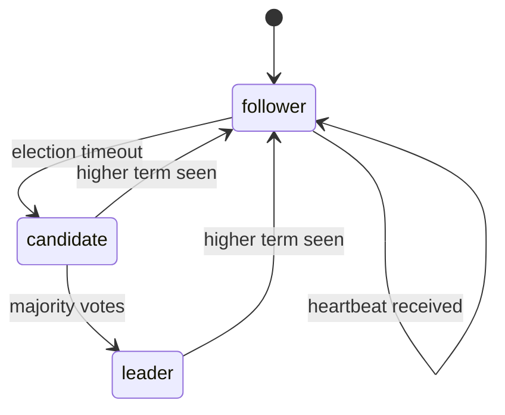
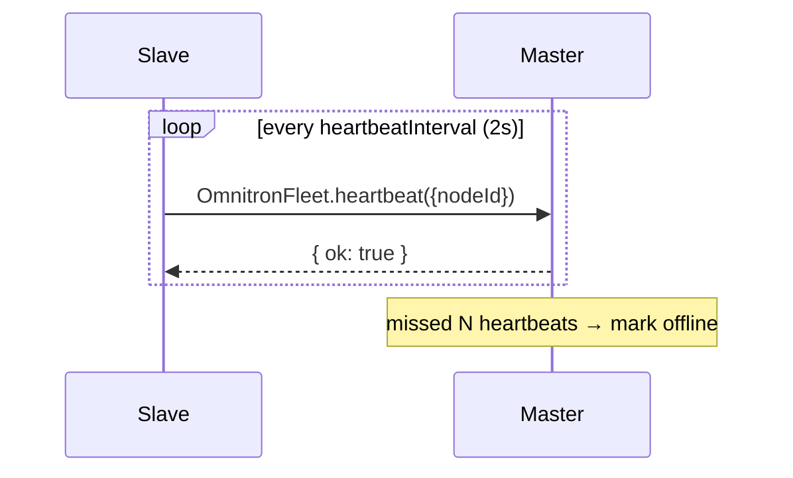
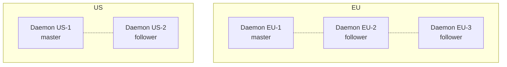
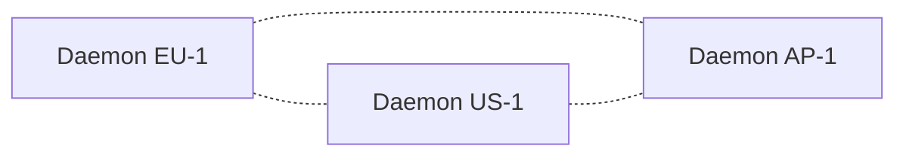

# Cluster + fleet

When you run Omnitron on more than one node, two subsystems
coordinate them: **cluster** (leader election, control-plane
consistency) and **fleet** (node inventory, cross-node queries).

This page covers both. Single-node operators can skip — none of
this runs without `cluster.enabled: true` or fleet nodes
registered.

Verified against `apps/omnitron/src/cluster/` and
`apps/omnitron/src/services/{fleet,sync,node-manager}.rpc-service.ts`.

## Two roles, two layers

| Layer | Concept | Service id |
| ----- | ------- | ---------- |
| Cluster | Leader / follower among a small set of daemons | `OmnitronCluster` |
| Fleet | Node inventory, cross-node fleet ops | `OmnitronFleet`, `OmnitronNodes` |
| State sync | Daemon-to-daemon batch replication | `OmnitronSync` |

A daemon in `role: master` is the control plane. A daemon in
`role: slave` runs autonomously and syncs back to master via
`OmnitronSync`. Within a cluster, a single master is elected at
any moment via `OmnitronCluster`.

## When to use what

| Setup | Use |
| ----- | --- |
| Single machine, no HA needed | Neither — default `role: master`, no cluster |
| Multiple machines, no leader concept (each daemon independent) | Fleet — register nodes, query across them |
| Multiple machines, one needs to be the canonical master with auto-failover | Cluster — leader election, state replication |
| Multi-region with autonomous edges syncing to a central master | Fleet + master-slave role pattern (no cluster needed) |

## Leader election — `LeaderElection`

A simplified Raft variant designed for small clusters (2–5
daemons), with longer timeouts than classic Raft because the
infrastructure-control workload doesn't need millisecond
consensus.

### State machine



### Election parameters

| Parameter | Default |
| --------- | ------- |
| `electionTimeout` | `5 000 – 15 000 ms` (jittered) |
| `heartbeatInterval` | `2 000 ms` |
| Election majority | `floor(N/2) + 1` |

Defaults from
`apps/omnitron/src/cluster/leader-election.ts`:

```typescript
const DEFAULT_CONFIG: ElectionConfig = {
  electionTimeout:    { min: 5_000, max: 15_000 },
  heartbeatInterval:  2_000,
};
```

### Election sequence

```mermaid
sequenceDiagram
  participant F as Follower
  participant Peers as Peer daemons
  participant Fleet as Fleet registry

  Note over F: heartbeat absent for electionTimeout
  F->>F: state := candidate; term++
  F->>Peers: VoteRequest{candidateId, term}
  Peers-->>F: VoteResponse{granted, term}
  alt majority granted
    F->>F: state := leader
    F->>Fleet: write role := master
    loop heartbeatInterval (2s)
      F->>Peers: LeaderHeartbeat{leaderId, term, configHash}
    end
    F->>F: emit 'leader:elected'
  else higher term seen
    F->>F: state := follower; term := higherTerm
  end
```

### Configuration

```typescript
// IDaemonConfig.cluster
cluster: {
  enabled:           true,
  discovery:         'redis' | 'static',
  peers?:            ['10.0.1.10:9700', '10.0.1.11:9700'],
  electionTimeout?:  { min: 5_000, max: 15_000 },
  heartbeatInterval?: 2_000,
}
```

Discovery providers:
- **`'redis'`** — peers register in a shared Redis key; auto-discovery.
- **`'static'`** — explicit `peers` array.

### Events emitted by `LeaderElection`

```typescript
'state:changed':  (state, previousState) => void;
'leader:elected': (leaderId, term)       => void;
'leader:lost':    (previousLeaderId)     => void;
'term:changed':   (term)                 => void;
```

Subscribe via `daemon.cluster.on(...)` for cluster-aware app
behaviour.

## `OmnitronCluster` RPC service

Five methods, all related to election + state:

| Method | Auth | Effect |
| ------ | ---- | ------ |
| `getState()` | anonymous | Current election state — `{nodeId, state, term, leaderId, votedFor, peers, uptime}` |
| `requestVote({candidateId, term})` | anonymous | Inter-daemon vote request |
| `leaderHeartbeat({leaderId, term, configHash?})` | anonymous | Leader-to-follower heartbeat |
| `stepDown()` | operator | Force the local leader to step down → triggers new election |
| `getConfigHash()` | operator | Hash of the current config (used to detect drift) |

Anonymous methods are for daemon-to-daemon comm; operator
methods are for human / CLI use.

### CLI

```bash
omnitron cluster status        # → getState()
omnitron cluster step-down     # → stepDown()
```

Sample `getState()` output:

```json
{
  "nodeId":   "node-1",
  "state":    "leader",
  "term":     7,
  "leaderId": "node-1",
  "votedFor": "node-1",
  "peers":    3,
  "uptime":   1843200
}
```

### Step-down semantics

`stepDown()` is graceful:
1. Stop sending heartbeats.
2. Transition local state to `follower`.
3. Followers detect missing heartbeats, elect a new leader.

Total downtime: typically ≤ one `electionTimeout` window
(5–15 s).

## Config sync — `ConfigSyncService`

The leader replicates ecosystem config to followers so they hold
a consistent view. On every config change:

1. Leader computes a content hash.
2. Heartbeats carry the hash.
3. Followers compare; if mismatched, pull the fresh config from
   the leader.
4. Followers apply locally (replacing their own).

Conflict resolution: **leader always wins** for config. Follower
local changes are overwritten — followers are not expected to be
the source of truth.

## `OmnitronFleet` RPC service — node inventory

Distinct from clusters. A fleet is any set of registered nodes;
they don't need leader election.

| Method | Auth | Effect |
| ------ | ---- | ------ |
| `listNodes()` | viewer | All registered fleet nodes |
| `getNode({nodeId})` | viewer | One node by id |
| `getSummary()` | viewer | Aggregate health, counts |
| `registerNode(registration)` | operator | Add a node to the fleet |
| `removeNode({nodeId})` | operator | Remove |
| `setRole({nodeId, role})` | operator | Promote / demote |
| `drainNode({nodeId})` | operator | Drain workloads off this node |
| `heartbeat({nodeId})` | anonymous | Daemon-to-daemon liveness ping |

### `FleetNode`

```typescript
interface FleetNode {
  id:       string;
  hostname: string;
  address:  string;
  role:     'master' | 'slave';
  status:   'online' | 'offline' | 'draining';
  lastSeen: number;
  // ... metadata (CPU/RAM snapshots, app counts)
}
```

### Heartbeat flow



The fleet's offline-detection threshold is driven by
`DEFAULT_DAEMON_CONFIG.healthMonitor.offlineTimeoutMs`
(`90_000 ms` default).

## `OmnitronNodes` — extended node management

The fleet service holds the live registry; `OmnitronNodes` holds
the **registered inventory** (declared nodes, SSH credentials,
health history). They overlap but serve different purposes.

14 methods, key categories:

- **Inventory**: `listNodes`, `getNode`, `addNode`,
  `updateNode`, `removeNode`.
- **Connectivity**: `checkNodeStatus`, `checkAllNodes`,
  `triggerNodeCheck`.
- **History**: `getCheckHistory`, `getUptimeBar`,
  `getNodeHealthSummaries`.
- **SSH**: `listSshKeys`.

### Uptime bars

`getUptimeBar({nodeId, bucketCount?, intervalMs?})` returns
historical health bucketed into time segments. The webapp uses
this for the green/yellow/red availability bars.

| Param | Default |
| ----- | ------- |
| `intervalMs` | `86 400 000` (24 h per bucket) |
| `bucketCount` | computed from `retentionDays` (default `90`) |

Each bucket is `healthy | degraded | offline | unknown`.

## State sync — `OmnitronSync` service

The master-slave replication mechanism. Slaves locally collect
metrics, logs, traces, alert events; periodically batch them and
push to master via `pushBatch`.

| Method | Effect |
| ------ | ------ |
| `receiveBatch(batch)` | Master accepts a sync batch from a slave |
| `drainBuffer({limit?})` | Slave-side: pull pending data without waiting for periodic sync |
| `getSyncStatus()` | Buffer size, lag, last successful sync timestamp |

### Sync config — `ISyncConfig`

```typescript
interface ISyncConfig {
  interval?:  number;     // 30_000 ms — sync attempt cadence
  batchSize?: number;     // 1_000 entries per batch
}
```

Designed for **eventually consistent** replication:
- Slaves buffer ALL data locally (SQLite WAL or local PG).
- Periodic sync attempts with exponential backoff on failure.
- Idempotent batches — safe to retry.
- Conflict resolution: master timestamp wins for config; slave
  data is append-only.

### Sync flow

```mermaid
sequenceDiagram
  participant Slave
  participant Buffer as Slave buffer
  participant Master

  loop continuously
    Slave->>Buffer: append metric/log/trace/alert
  end
  loop every interval (30s default)
    Slave->>Buffer: drain up to batchSize
    Slave->>Master: OmnitronSync.receiveBatch(batch)
    alt success
      Master-->>Slave: { accepted: N }
      Slave->>Buffer: clear sent entries
    else failure
      Master--xSlave: error
      Slave->>Slave: keep batch; retry next interval
    end
  end
```

If the master is offline, slaves keep functioning fully — local
apps supervised, metrics collected, logs captured. When the
master returns, accumulated data sync drains on the next cycle.

## Multi-region patterns

### Pattern A — one cluster per region



Each region elects its own leader. No cross-region election —
keeps quorum local. Cross-region calls go through ingress; each
region's webapp shows its own state.

### Pattern B — single global cluster



One global cluster with all daemons as peers. Pros: single source
of truth. Cons: cross-region election latency, more sensitive to
partitions.

Pattern A is almost always the right answer above 2 regions.

### Pattern C — fleet without cluster

Each daemon runs as `role: master` independently. Use the
`OmnitronFleet` service to query across them via aliased
addresses. No leader, no global state. Suitable when each
daemon's domain is independent (per-tenant deployments).

## Split-brain handling

Cluster mode's main failure mode: a network partition where both
sides think the other is dead and both elect leaders.

Mitigations:
- **Majority required.** Election requires `floor(N/2) + 1`
  votes — a minority partition cannot elect.
- **Term monotonicity.** Higher-term leader wins; the lower-term
  one steps down on first higher-term message.
- **Operator `step-down`.** If both sides somehow elected, the
  operator can force one side to step down.

For 2-node clusters, prefer manual leader assignment (one
permanent master) rather than auto-election — 2 nodes can't form
a majority when split.

## Operations

| Goal | Command |
| ---- | ------- |
| Check cluster state | `omnitron cluster status` |
| Force re-election | `omnitron cluster step-down` |
| Register a node | `omnitron node add --name N --host H ...` |
| Check all nodes | `omnitron node check` |
| Drain a node | `omnitron --json` then `OmnitronFleet.drainNode` (no CLI shortcut yet) |
| Per-node connectivity | `omnitron node check <id>` |
| Fleet status | `omnitron fleet status` |
| Fleet health | `omnitron fleet health` |
| Fleet metrics | `omnitron fleet metrics` |

## Anti-patterns

- **`cluster.enabled: true` with two daemons.** No majority on
  partition. Use three or skip cluster mode.
- **Mixed roles inside a cluster.** Cluster expects symmetric
  peers. Master / slave roles are for the `OmnitronSync` pattern,
  not cluster election.
- **Heartbeat interval > election timeout.** Followers always
  detect timeout before a heartbeat arrives — perpetual elections.
  Keep `heartbeatInterval` ≤ `electionTimeout.min / 2`.
- **Cross-region cluster without good ICMP.** Frequent split-brain
  symptoms. Use pattern A (one cluster per region).
- **Treating `OmnitronSync` as low-latency RPC.** It's batch
  replication with 30 s default cadence. For real-time
  cross-daemon coordination, use direct RPC to the relevant
  service.
- **Editing a slave's `state.json` and expecting it to propagate.**
  Slaves are downstream of master config. Edits get overwritten on
  next sync.

## See also

- [Architecture](./architecture.md#cluster-subsystem) — where
  cluster fits
- [CLI](./cli.md#cluster-leader-election) — `omnitron cluster ...`
- [Services reference](./services-reference.md) — `OmnitronFleet`,
  `OmnitronSync`, `OmnitronNodes`, `OmnitronCluster`
- [Daemon](./daemon.md#daemon-configuration) — cluster config fields
