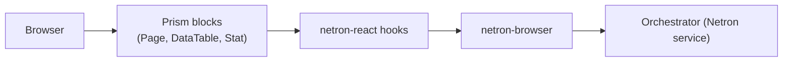

# Web Console

The web console at `apps/omnitron/webapp` is a Prism + netron-react app
that exposes the same operator surface as the CLI.

## What you can do

- **Stack overview** — every running service with state, restart count,
  and last health probe.
- **Live logs** — tail any service's structured logs in real time.
- **Metrics dashboards** — ApexCharts panels backed by the in-memory
  time series buffer from `titan-metrics`.
- **Service topology** — XYFlow graph of which services call which,
  derived from Netron tracing.
- **Service descriptors** — every registered method with its parameter
  schemas and example payloads.
- **Method invoker** — call any `@Public` method directly from the UI.
- **DLQ inspector** — list, retry, and discard dead-letter entries.
- **Scheduled jobs** — list, trigger, pause, edit cadence.

## Architecture



The console is a *consumer* of the same Netron operator surface the
CLI calls. Adding a new operator action:

1. Add a method to the orchestrator's `@Service`.
2. The console's TypeScript types pick it up.
3. Bind a Prism `Button` or `DataTable` action to the new
   `useNetronMutation`.

There is no separate "console API".

## Run locally

```bash
cd apps/omnitron/webapp
pnpm dev                       # Vite dev server
```

The console connects to the supervisor at `http://localhost:7000` by
default (override with `VITE_OMNITRON_URL`).

## Multi-stack

The console can connect to multiple supervisors at once and federate
the dashboards. Each connected stack appears as a tab in the side
navigation.

## Read also

- [Prism](../frontend/prism.md) — the design system the console is
  built on.
- [Orchestrator](./orchestrator.md) — the supervised state the console
  visualises.
