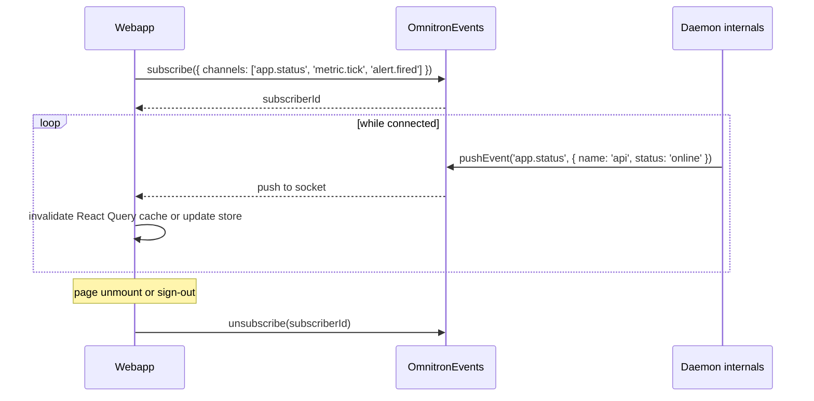

# Web console

The Omnitron webapp at `apps/omnitron/webapp/` is the visual
counterpart of the CLI. It's a React 19 + Vite + Prism SPA that
talks to the daemon via `@omnitron-dev/netron-browser` — the same
RPC surface the CLI uses.

Verified against `apps/omnitron/webapp/src/`.

## Tech stack

| Layer | Choice |
| ----- | ------ |
| Framework | React 19 |
| Build | Vite 8 with `@vitejs/plugin-react-swc` |
| Routing | `react-router-dom` 7 |
| Design system | `@omnitron-dev/prism` (workspace) |
| RPC client | `@omnitron-dev/netron-browser` over WebSocket |
| Charts | `react-apexcharts` |
| Graphs | `@xyflow/react` (topology, dependency graphs) |
| State | Local stores in `src/stores/` |
| Code splitting | Per-page `React.lazy()` |

## Filesystem layout

```text
webapp/
├── index.html
├── vite.config.ts
├── package.json
├── public/                   # static assets shipped as-is
└── src/
    ├── main.tsx              # entrypoint
    ├── app.tsx               # <App/> root
    ├── routes/               # router definition
    ├── layouts/              # ConsoleLayout, AuthLayout
    ├── pages/                # 20+ pages, lazy-loaded
    ├── components/           # shared UI building blocks
    ├── hooks/                # custom React hooks
    ├── netron/               # browser RPC client wiring
    ├── auth/                 # AuthGuard, GuestGuard, ProjectGuard
    ├── stores/               # state stores
    ├── utils/
    └── stubs/                # dev-mode mock data
```

## Route map

All routes other than `/auth/sign-in` are gated by `AuthGuard`.
Routes marked **project-scoped** require an active project (via
`ProjectGuard`) — selected from the project switcher in the
sidebar.

| Path | Page | Scope | Backing RPC |
| ---- | ---- | ----- | ----------- |
| `/auth/sign-in` | `SignInPage` | guest | `OmnitronAuth.signIn` |
| `/` | `DashboardPage` | global | aggregate from many services |
| `/nodes` | `NodesPage` | global | `OmnitronNodes` |
| `/projects` | `ProjectsPage` | global | `OmnitronProject` |
| `/system` | `SystemInfoPage` | global | `OmnitronSystemInfo` |
| `/settings` | `SettingsPage` | global | `OmnitronAuth` + config |
| `/logs` | `LogsPage` | global | `OmnitronLogs` |
| `/apps` | `AppsListPage` | project | `OmnitronDaemon.list` |
| `/apps/:name` | `AppDetailPage` | project | `OmnitronDaemon.getApp` + many |
| `/stacks` | `StacksPage` | project | `OmnitronProject.listStacks` |
| `/stacks/:name` | `StackDetailPage` | project | `OmnitronProject.getStackStatus` |
| `/metrics` | `MetricsPage` | project | `OmnitronDaemon.getMetrics` |
| `/topology` | `TopologyPage` | project | derived from `OmnitronDiscovery` + services |
| `/containers` | `ContainersPage` | project | `OmnitronInfra` |
| `/deployments` | `DeploymentsPage` | project | `OmnitronDeploy` |
| `/alerts` | `AlertsPage` | project | `OmnitronAlerts` |
| `/pipelines` | `PipelinesPage` | project | `OmnitronPipelines` |
| `/traces` | `TracesPage` | project | `OmnitronTraces` |
| `/dashboard-builder` | `DashboardBuilderPage` | project | custom dashboard composer |
| `*` | redirect to `/` | — | — |

## Page-by-page

### Dashboard

The landing page after sign-in. Shows:

- Daemon status card (version, uptime, PID).
- Total apps / online / errored counts.
- Aggregate CPU / memory.
- Recent alerts.
- Recent deployments.
- Cluster status when cluster mode is enabled.

Refreshes every 5 s via React Query.

### Apps list & detail

`/apps` — table view of every managed app: status, instances,
CPU, memory, restart count, mode (classic vs bootstrap),
critical flag.

`/apps/:name` — single-app deep dive:
- Live status with restart history timeline.
- Per-process breakdown (sub-processes for bootstrap mode).
- Resource graphs (CPU / RSS / event-loop lag).
- Health probes summary.
- DI dependency graph (renders Mermaid via daemon's
  `getDependencyGraph`).
- Log stream with filter (level, grep).
- Resolved environment variables.
- Action buttons: Start / Stop / Restart / Reload / Scale.
- Inspect button → drills into `OmnitronDaemon.inspect`.

### Stacks

`/stacks` — projects' stacks side-by-side with status, app count,
runtime (Docker container count).

`/stacks/:name` — per-stack view: which apps run here, which
infrastructure, runtime status. Start / stop the whole stack.

### Logs

Cross-app log viewer. Three modes:

- **Tail** — most recent N lines per app.
- **Stream** — live append; auto-scroll; pause on hover.
- **Search** — server-side regex over the log files.

Filters:
- App selector (multi).
- Level (≥).
- Free-text regex.
- Time range.

Uses `OmnitronLogs.streamLogs` for live mode; `queryLogs` for
history.

### Metrics

Time-series view backed by the daemon's metrics aggregator. Per
app, per metric name, per label combination. Built on
ApexCharts.

Predefined panels:
- CPU per app, stacked.
- RSS per app.
- Event-loop lag p95.
- RPC latency p95 per service.
- Error rate per app.

The `/dashboard-builder` page lets operators compose custom
panels and save them.

### Topology

`/topology` — XYFlow service graph derived from
`OmnitronDiscovery` plus the live Netron service mesh. Nodes are
services; edges are observed calls. Useful to see "who actually
talks to whom" vs the static declaration.

### Containers

`/containers` — Docker container inventory from `OmnitronInfra`.
Shows status, image, ports, resource use. Per-container actions:
restart, logs, exec (when daemon has Docker socket access).

### Deployments

`/deployments` — deployment history from `OmnitronDeploy`. List
of past deploys, strategy, version, deployer, duration. Trigger
new deploys or rollbacks here too.

### Alerts

`/alerts` — alert rule manager + event log. Rules tab: list,
edit, create. Events tab: fired alerts, ack / resolve actions.

### Pipelines

`/pipelines` — CI/CD pipeline list, definition editor, run
history, live run view.

### Traces

`/traces` — distributed trace viewer. Trace list with filters,
single-trace waterfall, service-map view. Backed by
`OmnitronTraces`.

### Nodes

`/nodes` — fleet node inventory. Per-node:
- Status, hostname, last-seen timestamp.
- Uptime bar (90 days of green/yellow/red segments — backed by
  `getUptimeBar`).
- SSH connectivity test.
- Per-node actions: drain, remove, edit.

### Projects

`/projects` — registered project list. Add / scan / remove
projects. Project switcher in sidebar mirrors this.

### System info

`/system` — host inventory: OS, CPU, RAM, disk, network
interfaces. Refreshes on demand.

### Settings

`/settings` — auth user management, change-password, system
preferences.

## Auth flow

```mermaid
sequenceDiagram
  participant U as User
  participant W as Webapp
  participant D as Daemon
  participant A as OmnitronAuth

  U->>W: visit /
  W->>W: AuthGuard checks token
  alt no token
    W->>U: redirect to /auth/sign-in
    U->>W: enter credentials
    W->>D: HTTP POST /netron/...
    D->>A: signIn(credentials)
    A-->>D: { token, sessionId, roles }
    D-->>W: response
    W->>W: store token; redirect to /
  end
  W->>D: every subsequent call carries Authorization: Bearer ...
  D->>A: validateToken(token)
  A-->>D: claims | reject
```

The token is held in `localStorage` (default) or `sessionStorage`
when "remember me" is off. Logout clears it and calls
`OmnitronAuth.signOut`.

## RBAC in the UI

The webapp respects the same three roles as the daemon
(`viewer` / `operator` / `admin`). Behaviour:

| Surface element | Visible to | Disabled for |
| --------------- | ---------- | ------------ |
| Read-only pages (Dashboard, Logs, Metrics, Traces) | everyone | — |
| Start / Stop / Restart buttons | viewer (visible) | viewer (disabled with tooltip) |
| Scale, Reload, Exec | operator + admin | viewer (hidden) |
| Secrets editor | admin | non-admin (hidden) |
| Shutdown daemon, Reload config | admin | non-admin (hidden) |
| Settings → users | admin | non-admin (hidden) |

Buttons consult `useAuth()` and disable / hide accordingly. The
daemon still enforces server-side — UI gating is convenience, not
security.

## Real-time event flow

The webapp uses `OmnitronEvents` for live updates:



Combined with React Query's `refetchOnWindowFocus`, the
dashboard refreshes essentially instantly when state changes.

## Build / run modes

### Dev mode

```bash
cd apps/omnitron/webapp
pnpm dev                    # Vite dev server with HMR
```

Daemon address resolves from `VITE_OMNITRON_URL` env (default
`http://localhost:9800`). Auth credentials come from your
`omnitron auth` setup.

### Production build

```bash
cd apps/omnitron/webapp
pnpm build                  # tsc -b && vite build → dist/
```

The compiled bundle lands in `webapp/dist/`. The daemon serves it
directly from its HTTP listener at `:9800` (when configured) — no
separate nginx is required for the basic case. For the nginx
deployment (the `omnitron webapp start` path), the container
mounts `dist/` and proxies `/netron/*` to the daemon.

### Open the webapp

| Command | Effect |
| ------- | ------ |
| `omnitron webapp build` | Compile the bundle |
| `omnitron webapp start [-f]` | Start nginx container serving static + gateway |
| `omnitron webapp open` | Open the running webapp in the system browser |

## Project switcher

The sidebar carries a project dropdown — switching projects
re-scopes every project-scoped page to that project's apps /
stacks / etc. Stored in the auth context; persists across
sessions.

## Empty / error states

Every page is built around three states:

- **Loading** — skeleton with shimmer (`<LoadingScreen />` from
  Prism).
- **Empty** — friendly empty state with the primary action
  ("Add your first project", "Connect a node", …).
- **Error** — error card with retry button + JSON of the underlying
  error (operators love seeing the actual error).

## Performance characteristics

- **Code-splitting** — each page is `React.lazy`'d; initial
  bundle ~ 250 kB gzipped.
- **HMR** — Vite + SWC; instant in dev.
- **React Query** caches RPC results; default 30 s stale time.
- **WebSocket** for `OmnitronEvents` subscribers — one socket per
  tab.

## Adding a new page

The pattern is mechanical:

1. Add `apps/omnitron/webapp/src/pages/my-page.tsx` exporting
   default React component.
2. Add a lazy import + `<Route path="my-page" ...>` in
   `src/routes/index.tsx`.
3. Add a nav entry in `src/layouts/console-layout.tsx`.
4. Use existing hooks (`useNetronQuery`, `useNetronMutation`)
   from `src/netron/` to call the relevant RPC service.

No separate API layer to wire — the daemon already exposes
everything.

## Anti-patterns

- **Storing secrets in `localStorage`.** Use the auth token only;
  for actual secrets, the daemon's `OmnitronSecrets` is the right
  place.
- **Polling instead of subscribing.** When `OmnitronEvents`
  already emits the change, use it — saves the daemon a lot of
  RPC roundtrips.
- **Bypassing `AuthGuard`.** Every protected route should sit
  under the `<AuthGuard>` wrapper; ad-hoc auth checks per page
  drift.
- **Calling the daemon directly with `fetch`.** Use the typed
  `useNetronQuery` / `useNetronMutation` hooks — they handle
  auth, retries, types.

## See also

- [CLI](./cli.md) — the same operator surface from the terminal
- [Services reference](./services-reference.md) — every RPC the
  webapp consumes
- [Architecture](./architecture.md) — where the webapp sits
- [Prism](../frontend/prism/index.md) — the design system the webapp uses
- [netron-browser](../frontend/netron/browser.md) — the RPC client
- [netron-react](../frontend/netron/react.md) — React hooks for RPC
