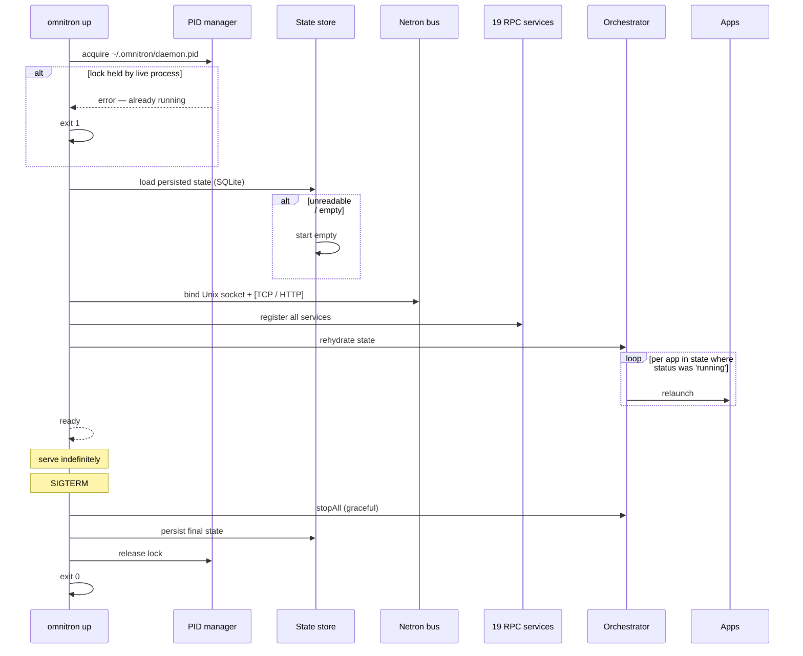
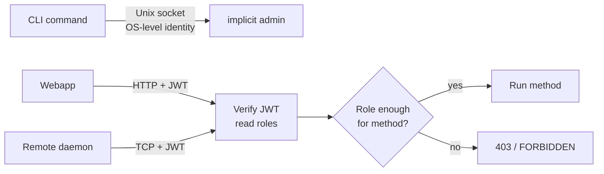

# Daemon

The daemon is the one Omnitron component that **stays up**.
Everything else — CLI invocations, webapp connections, child app
processes — is transient. The daemon owns the process tree, the
on-disk state, the lock, and the RPC surface.

Verified against `src/daemon/`:

```
daemon/
├── daemon.ts            (1591 lines) — main daemon class
├── daemon.rpc-service.ts        — Netron-facing service
├── daemon.module.ts             — Titan module wiring
├── daemon-client.ts             — Typed RPC client (used by CLI)
├── daemon-entry.ts              — Standalone entrypoint
├── daemon-scheduler.ts          — Periodic task scheduler
├── pid-manager.ts               — PID file lock + liveness sweep
└── state-store.ts               — Persistent state on disk
```

## Lifecycle


```mermaid
sequenceDiagram
  participant Init as omnitron up
  participant PM as PID manager
  participant SS as State store
  participant N as Netron bus
  participant SVC as 19 RPC services
  participant Orch as Orchestrator
  participant Apps

  Init->>PM: acquire ~/.omnitron/daemon.pid
  alt lock held by live process
    PM-->>Init: error — already running
    Init->>Init: exit 1
  end
  Init->>SS: load persisted state (SQLite)
  alt unreadable / empty
    SS->>SS: start empty
  end
  Init->>N: bind Unix socket + [TCP / HTTP]
  Init->>SVC: register all services
  Init->>Orch: rehydrate state
  loop per app in state where status was 'running'
    Orch->>Apps: relaunch
  end
  Init-->>Init: ready
  Note over Init: serve indefinitely
  Note over Init: SIGTERM
  Init->>Orch: stopAll (graceful)
  Init->>SS: persist final state
  Init->>PM: release lock
  Init->>Init: exit 0
```

## PID manager — `pid-manager.ts`

Owns the daemon lock file `~/.omnitron/daemon.pid`. Responsibilities:

- **Acquire** on boot: write `process.pid` to the file with an
  exclusive open. If the file exists and the PID inside is still
  alive, abort.
- **Signature verification.** The file carries a process-start
  signature (PID + start time fingerprint). A stale PID with the
  same numeric value as a recycled new process is detected and
  treated as dead.
- **Liveness sweep.** A periodic check ensures the lock owner is
  still alive; reclaims if the holder has crashed without
  releasing.
- **Release** on `SIGTERM` / `SIGINT` / normal exit.

When `omnitron up` reports "daemon already running", this is the
check that fired.

## State store — `state-store.ts`

Persists daemon intent to a **SQLite-backed** key/value row
(`DaemonStateStore`, `state_kv` key `orchestrator:persisted-state`)
co-located with the daemon's other state surfaces (PID lock,
project registry, node registry, backup index). SQLite WAL-mode
transactions remove the torn-write risk that the legacy
`fsync` + atomic-rename JSON recipe guarded against. Writes are
serialised through an internal promise chain so back-to-back
`save()` calls never interleave; callers use a synchronous API
and the actual write is awaited in the background.

Each persisted app entry records `name`, `pid`, `status`,
`mode` (`classic` | `bootstrap`), `startedAt`, `restarts`, and
`port`:

| Mode        | When                                                    | Layout                                                 |
| ----------- | ------------------------------------------------------- | ------------------------------------------------------ |
| `classic`   | App was launched via classic launcher (single fork)     | One PID + status per app                               |
| `bootstrap` | App was launched via the PM supervisor (per-process)     | Per-process PID + status, parent app aggregates       |

**Legacy migration.** On the first boot of the SQLite-backed
code, if an old `~/.omnitron/state.json` exists it is read once,
migrated into the SQLite row, and unlinked. After that the JSON
file never reappears.

State is persisted on every status transition (start, stop,
crash, restart). A crash of the daemon itself leaves the row in a
consistent state — on next boot, the daemon rehydrates and
relaunches whatever was running.

## Daemon scheduler — `daemon-scheduler.ts`

A small set of periodic jobs registered against `titan-scheduler`
and tied to the daemon's lifecycle. `registerDaemonJobs()` wires:

| Job                  | Cadence                                      | Notes                                        |
| -------------------- | -------------------------------------------- | -------------------------------------------- |
| `metrics-collection` | `monitoring.metrics.interval` (default 5 s)  | Polls app state, records via `titan-metrics` |
| `log-rotation`       | 60 s                                         | `LogManager.checkRotation`                   |
| `session-cleanup`    | 5 min                                        | Master only (requires the auth service / PG) |
| `alert-evaluation`   | `monitoring.healthCheck.interval` (default 15 s) | Master only (requires PG)                |
| `fleet-heartbeat`    | `monitoring.healthCheck.interval` (default 15 s) | Master only (requires PG)                |

The master-only jobs are skipped on a standalone single-node
setup where the auth / alert / fleet services aren't wired.

## Daemon configuration

The daemon's own config (not project / ecosystem config) lives in
the `DEFAULT_DAEMON_CONFIG` object — most operators never touch
it. Values:

| Field                                | Default                                         |
| ------------------------------------ | ----------------------------------------------- |
| `socketPath`                         | `~/.omnitron/daemon.sock`                       |
| `port` (TCP)                         | `9700`                                          |
| `host` (TCP)                         | `0.0.0.0`                                       |
| `httpPort`                           | `9800`                                          |
| `pidFile`                            | `~/.omnitron/daemon.pid`                        |
| `stateFile`                          | `~/.omnitron/state.json`                        |
| `logDir`                             | `~/.omnitron/logs`                              |
| `role`                               | `master`                                        |
| `cluster.enabled`                    | `false`                                         |
| `cluster.discovery`                  | `redis`                                         |
| `cluster.electionTimeout`            | `5 000–15 000 ms` (jittered)                    |
| `cluster.heartbeatInterval`          | `2 000 ms`                                      |
| `secrets.provider`                   | `file`                                          |
| `secrets.path`                       | `~/.omnitron/secrets.enc`                       |
| `healthMonitor.intervalMs`           | `60 000` (1/min)                                |
| `healthMonitor.concurrency`          | `20`                                            |
| `healthMonitor.offlineTimeoutMs`     | `90 000`                                        |
| `healthMonitor.retentionDays`        | `90` (uptime history)                           |
| `healthMonitor.uptimeIntervalMs`     | `86 400 000` (24 h per bar segment)             |

Override via CLI flags on `omnitron up` or via the daemon
configuration file (advanced — not part of the project ecosystem
config).

## RPC surface — `OmnitronDaemon` service

The daemon registers `@Service({ name: 'OmnitronDaemon' })` on
the Netron bus. Verified from
[`src/daemon/daemon.rpc-service.ts`](https://github.com/omnitron-dev/omni/tree/main/apps/omnitron/src/daemon/daemon.rpc-service.ts).

Every method is gated by role:

| Role         | Members                              | Methods                                                                 |
| ------------ | ------------------------------------ | ----------------------------------------------------------------------- |
| `viewer`     | `viewer`, `operator`, `admin`        | `list`, `getApp`, `status`, `getMetrics`, `getHealth`, `getLogs`, `inspect`, `getEnv`, `getDependencyGraph`, `getWatchStatus` |
| `operator`   | `operator`, `admin`                  | `startApp`, `startAll`, `stopApp`, `stopAll`, `restartApp`, `restartAll`, `reloadApp`, `scale`, `enableWatch`, `disableWatch` |
| `admin`      | `admin` only                         | `shutdown`, `reloadConfig`, `setMetricsEnabled`, `exec` |
| anonymous    | anyone with socket access            | `ping` (allowAnonymous) |

### Methods, by intent

#### App lifecycle (`operator`)

| Method                                                          | Returns                          |
| --------------------------------------------------------------- | -------------------------------- |
| `startApp({ name })`                                            | `ProcessInfoDto`                 |
| `startAll()`                                                    | `ProcessInfoDto[]`               |
| `stopApp({ name, force?, timeout? })`                           | `{ success: boolean }`           |
| `stopAll({ force? })`                                           | `{ count: number }`              |
| `restartApp({ name })`                                          | `ProcessInfoDto`                 |
| `restartAll()`                                                  | `ProcessInfoDto[]`               |
| `reloadApp({ name })`                                           | `ProcessInfoDto`                 |
| `scale({ name, instances })`                                    | `ProcessInfoDto`                 |

#### Inspection (`viewer`)

| Method                                                          | Returns                          |
| --------------------------------------------------------------- | -------------------------------- |
| `list()`                                                        | `ProcessInfoDto[]`               |
| `getApp({ name })`                                              | `ProcessInfoDto`                 |
| `status()`                                                      | `DaemonStatusDto`                |
| `getMetrics({ name? })`                                         | `AggregatedMetricsDto`           |
| `getHealth({ name? })`                                          | `AggregatedHealthDto`            |
| `getLogs({ name?, lines? })`                                    | `LogEntryDto[]`                  |
| `inspect({ name })`                                             | `AppDiagnosticsDto`              |
| `getEnv({ name })`                                              | `Record<string, string>`         |
| `getDependencyGraph({ name })`                                  | Graph object                     |
| `getWatchStatus()`                                              | `{ enabled, apps: [...] }`       |

#### Watch control (`operator`)

| Method                                                          | Returns                          |
| --------------------------------------------------------------- | -------------------------------- |
| `enableWatch({ apps? })`                                        | `{ watching: [...] }`            |
| `disableWatch()`                                                | `{ success: boolean }`           |

#### Admin (`admin`)

| Method                                                          | Returns                          |
| --------------------------------------------------------------- | -------------------------------- |
| `shutdown({ force? })`                                          | `{ success: boolean }`           |
| `reloadConfig()`                                                | `{ success: boolean }`           |
| `setMetricsEnabled({ name?, enabled })`                         | `{ success: boolean }`           |

#### Heartbeat (anonymous)

| Method                                                          | Returns                          |
| --------------------------------------------------------------- | -------------------------------- |
| `ping()`                                                        | `{ uptime, version, pid }`       |

#### RPC plumbing (`admin`)

| Method                                                          | Returns                          |
| --------------------------------------------------------------- | -------------------------------- |
| `exec({ name, service, method, args })`                         | `unknown` (whatever the called method returns) |

`exec` is what `omnitron exec api users findById u_42` routes
through. It is **admin-gated** — invoking arbitrary methods on a
managed app is a privileged operation.

## Auth flow

Authentication is intentionally split between transports:


```mermaid
flowchart LR
  CLI[CLI command]
  Webapp[Webapp]
  Remote[Remote daemon]

  CLI -- Unix socket<br/>OS-level identity --> AuthBypass[implicit admin]
  Webapp -- HTTP + JWT --> JWT
  Remote -- TCP + JWT --> JWT

  JWT[Verify JWT<br/>read roles]
  JWT --> RoleCheck{Role enough<br/>for method?}
  RoleCheck -- yes --> Invoke[Run method]
  RoleCheck -- no --> Reject[403 / FORBIDDEN]
```

The Unix socket auth-bypass is **deliberate**: file mode `0o600`
means only the daemon's UID can open it. If the OS trusts you to
write to the socket, the daemon trusts the request. TCP and HTTP
always require JWT.

## Daemon client — `daemon-client.ts`

The typed Netron client used by every CLI command:

```typescript
import { DaemonClient } from '@omnitron-dev/omnitron/internal';

const client = new DaemonClient();
await client.ping();                       // probe
await client.startApp({ name: 'api' });
await client.getMetrics({ name: 'api' });
await client.exec({
  name:    'api',
  service: 'users',
  method:  'findById',
  args:    ['u_42'],
});
```

The same client opens connections to remote daemons (when
addressed by alias) over TCP.

## Auto-restart and backoff

When an app crashes, the daemon consults its `IRestartPolicy`
(per `IProcessEntry.restartPolicy` or default
`supervision.backoff`). The default exponential backoff:

| Attempt | Delay before relaunch |
| ------- | --------------------- |
| 1       | `initial × 1` (1 s)   |
| 2       | `initial × 2` (2 s)   |
| 3       | `initial × 4` (4 s)   |
| ...     | capped at `max` (30 s default) |

After `maxRestarts` within `window` (default 5 in 60 s), the
supervisor stops trying and marks the app `crashed`. State is
persisted so an operator can inspect and intervene.

## Failure scenarios

| Scenario                                  | What the daemon does                                              |
| ----------------------------------------- | ----------------------------------------------------------------- |
| Child process exits 0                     | Treat as graceful; don't restart unless `autoRestart: always`     |
| Child process exits non-zero              | Apply restart policy; backoff; persist                            |
| Child process hangs (no heartbeat)        | Health probe fails; restart after grace period                    |
| Daemon itself crashes                     | systemd / launchd respawns; persisted SQLite state rehydrates     |
| Lock-file PID is alive but daemon hung    | `omnitron kill` force-removes the lock                            |
| Two `omnitron up` race                    | Second loses the PID lock; exits with error                       |
| Storage failure persisting state          | Logs at error; in-memory state continues; next flush retries      |
| Disk full                                 | State persistence + logs fail loudly                              |
| Cluster split (cluster.enabled)           | Both sides may elect a leader; manual `step-down` resolves        |

## Operating runbook

| Goal                                  | Command                                          |
| ------------------------------------- | ------------------------------------------------ |
| Is the daemon up?                     | `omnitron ping`                                  |
| What's running right now?             | `omnitron status` / `omnitron --json status`    |
| Force shutdown                        | `omnitron down` (graceful) or `omnitron kill` (forceful) |
| Reload daemon config without restart  | `omnitron --json status` then admin call (or restart) |
| See the lock holder                   | `cat ~/.omnitron/daemon.pid`                     |
| Reset persisted process state cold    | `omnitron down` → delete `~/.omnitron/data/daemon-state.db` → `omnitron up` (note: this DB also holds the project / node / backup registries) |
| Reset secret store from cold          | `omnitron down` → `rm ~/.omnitron/secrets.enc` → `omnitron up` |

## Anti-patterns

- **Editing the daemon state DB by hand.** Persisted state lives
  in a SQLite DB (`~/.omnitron/data/daemon-state.db`), not a
  hand-editable JSON file. The schema may evolve; poke it directly
  and you risk a broken next restart. Prefer using the CLI to
  drive state changes.
- **Running two daemons against the same `~/.omnitron/`.** They
  fight over the lock. Multiple daemons need different home
  directories.
- **Exposing the TCP port without a JWT secret.** Anyone reaching
  the port can inspect at minimum, and operate / admin with default
  roles. Configure auth before opening port `9700`.
- **Treating `kill` as routine.** Force-kill skips graceful
  shutdown — pending logs may be lost, child processes may be
  reparented to init. Use `down` first.
- **Removing the lock file while the daemon is running.** Causes
  inconsistent state where two daemons can subsequently start.

## See also

- [Architecture](./architecture.md) — where the daemon fits in
  the broader picture
- [Orchestrator](./orchestrator.md) — what the daemon hands apps off to
- [Services reference](./services-reference.md) — all 19 RPC services
- [CLI](./cli.md) — every command that talks to this daemon
