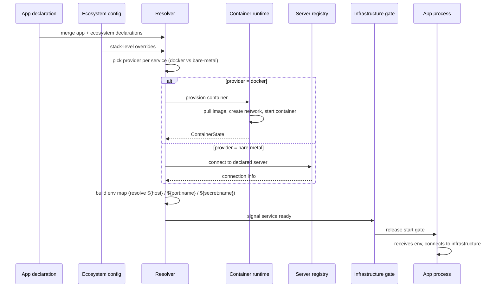
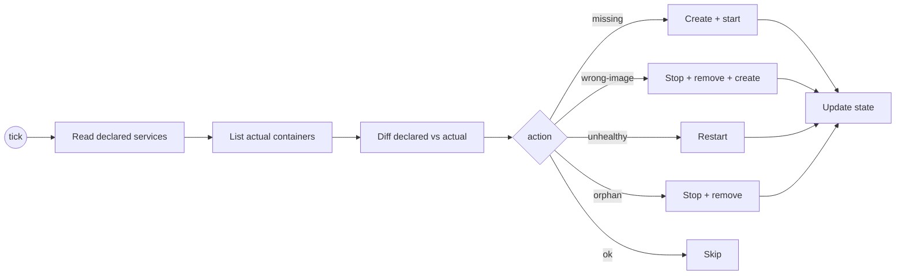
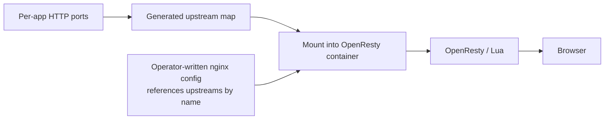

# Infrastructure

Omnitron treats infrastructure as **declarative dependencies of
your apps**. An app declares what it needs (a Postgres database,
a Redis instance, a custom blockchain daemon, anything). The
infrastructure subsystem provisions whatever's missing, resolves
connection parameters, and injects the right env vars at app
startup. The app never hardcodes hosts or ports.

Verified against `apps/omnitron/src/infrastructure/`:

```
infrastructure/
├── infrastructure.service.ts   — orchestrator service
├── service-resolver.ts         — picks the right provider per stack
├── container-runtime.ts        — Docker provider
├── stack-infra-manager.ts      — per-stack lifecycle
├── server-registry.ts          — bare-metal connection registry
├── config-normalizer.ts        — schema validation
├── gateway-generator.ts        — OpenResty config materialisation
├── infrastructure-gate.ts      — readiness barrier (block app start until deps healthy)
├── phantom-endpoint-janitor.ts — clean up dead resolutions
├── presets/                    — built-in presets (postgres, redis, minio, openresty, tor)
├── runtime/                    — runtime helpers (Docker compose builder, env injectors)
└── types.ts                    — public types
```

## Two layers of declaration

| Layer | What you declare | Where |
| ----- | ---------------- | ----- |
| **Ecosystem** | What services exist for the whole project | `omnitron.config.ts` → `infrastructure: { ... }` |
| **App** | What this specific app needs | `config/default.json` → `omnitron: { ... }` |

The ecosystem layer says "we run Postgres at port 5432 with these
databases"; the app layer says "I need access to the `main`
database with these env vars". The resolver wires the two
together.

## Ecosystem layer — `InfrastructureConfig`

```typescript
// omnitron.config.ts
export default defineEcosystem({
  // ...
  infrastructure: {
    services: {
      db:      { preset: 'postgres', config: { databases: { main: {}, ledger: {} } } },
      cache:   { preset: 'redis' },
      storage: { preset: 'minio', config: { buckets: ['uploads'] } },
      gateway: { preset: 'openresty', config: { configDir: './infra/nginx' } },
    },
  },
});
```

Two forms supported per entry:

- **Preset shorthand** — `{ preset: 'postgres', config?: {...} }`. The
  preset registry expands to a full `IServiceRequirement`.
- **Full requirement** — direct `IServiceRequirement` object for
  custom services.

### Built-in presets

| Preset | Type | Default ports | Notes |
| ------ | ---- | ------------- | ----- |
| `postgres` | database | `5432` | Configurable extensions, databases, version |
| `redis` | cache | `6379` | Configurable maxmemory policy |
| `minio` | storage | `9000` (API), `9001` (console) | Buckets, quota, public/private |
| `openresty` | gateway | `8080` | Mounts `configDir`, hot-reloadable Lua |
| `tor` | daemon | configurable | Hidden service support |

Presets are versioned: bumping the omnitron version may change
preset defaults, but each project pins its own ecosystem config.

### Legacy shape

```typescript
infrastructure: {
  postgres:   { ... },
  redis:      { ... },
  minio:      { ... },
  gateway:    { ... },
  tor:        { ... },
  containers: { my-service: { ... } },
}
```

Still works for backward compatibility, but the unified
`services: { ... }` map is the canonical form going forward.

## App layer — `OmnitronAppConfig`

In each app's `config/default.json`:

```json
{
  "omnitron": {
    "database": true,
    "redis":    true,
    "s3":       { "bucket": "uploads", "quota": "10gb" },
    "services": {
      "discovery":     true,
      "notifications": true
    },
    "infrastructure": {
      "search": {
        "type": "daemon",
        "ports": { "http": 9200 },
        "env":   { "SEARCH_URL": "http://${host}:${port:http}" },
        "docker": { "image": "elasticsearch:8.11.0" }
      }
    }
  }
}
```

The resolver merges this with the ecosystem-level declaration
and produces the per-app env injection.

### Shorthand booleans

| Declaration | Effect |
| ----------- | ------ |
| `"database": true` | Auto-create one database for this app in the shared Postgres; inject `DATABASE_URL` |
| `"database": { "dedicated": true }` | Provision a dedicated Postgres container |
| `"database": { "dialect": "mysql" }` | Use MySQL instead (presets exist) |
| `"redis": true` | Auto-assign a Redis DB index; inject `REDIS_URL` |
| `"redis": { "dedicated": true }` | Dedicated Redis container |
| `"s3": true` | Default bucket on the shared MinIO |
| `"s3": { "bucket": "X", "quota": "10gb" }` | Named bucket with quota |

### Custom infrastructure

For apps that need infrastructure beyond the presets, declare a
full `IServiceRequirement` under `infrastructure: { <name>: {...} }`.

## `IServiceRequirement` — the universal shape

```typescript
interface IServiceRequirement {
  description?: string;
  type?: 'database' | 'cache' | 'daemon' | 'gateway' | 'storage' | 'sidecar' | 'tool';

  // Named ports this service exposes
  ports: Record<string, number>;

  // Env vars to inject INTO THE APP (not the service container)
  env: Record<string, string>;

  // Optional health check definition
  healthCheck?: IServiceHealthCheck;

  // Other services this service depends on
  dependsOn?: string[];

  // Secrets injected via ${secret:name} templates
  secrets?: Record<string, string | SecretRef>;

  // Docker provisioning (dev/test)
  docker?: IDockerServiceConfig;

  // Bare-metal provisioning (prod)
  bareMetal?: IBareMetalServiceConfig;

  version?:        string;
  networkMode?:    string;       // 'regtest' | 'testnet' | 'mainnet' | custom
  critical?:       boolean;      // default true; app blocks on this
  startupTimeout?: number;       // default 120 000
}
```

### Env variable templating

The `env` values support three template placeholders:

| Template | Resolves to |
| -------- | ----------- |
| `${host}` | Provisioner-resolved hostname / IP |
| `${port:<name>}` | Resolved port for the named port |
| `${secret:<name>}` | Decrypted secret value at runtime |

Example:

```json
{
  "infrastructure": {
    "search": {
      "type": "daemon",
      "ports": { "http": 9200 },
      "env": {
        "SEARCH_URL":      "http://${host}:${port:http}",
        "SEARCH_API_KEY":  "${secret:searchApiKey}"
      },
      "docker": { "image": "elasticsearch:8.11.0" }
    }
  }
}
```

The app receives a literal `SEARCH_URL=http://localhost:9200` and
`SEARCH_API_KEY=<decrypted value>` at startup.

### Network modes

`networkMode` lets one declaration provision differently per
environment:

```json
{
  "ledger-daemon": {
    "type": "daemon",
    "ports": { "rpc": 18443 },
    "env":   { "LEDGER_URL": "http://${host}:${port:rpc}" },
    "docker": {
      "variants": {
        "regtest": { "image": "ledger:latest", "command": ["--regtest"] },
        "testnet": { "image": "ledger:latest", "command": ["--testnet"] },
        "mainnet": { "image": "ledger:latest", "command": ["--mainnet"] }
      }
    }
  }
}
```

Set `networkMode` at the stack level or via env var; the
resolver picks the matching variant.

## Provisioning flow



The **infrastructure gate** (`infrastructure-gate.ts`) blocks app
start until every `critical: true` service is healthy. Non-critical
services are best-effort.

## Stack-level overrides

```typescript
stacks: {
  dev: {
    type: 'local',
    serviceOverrides: {
      // All apps using 'search' connect to a dev cluster:
      search: { external: { host: '10.0.1.5', ports: { http: 9200 } } },
    },
  },
  prod: {
    type: 'cluster',
    serviceOverrides: {
      // Use specific image in prod:
      search: { docker: { image: 'elasticsearch:8.11.0-secured' } },
    },
  },
}
```

`IServiceOverride` shape:

- `external: { host, ports }` — disable provisioning, point at an
  existing server.
- `docker: { ... }` — override the Docker config.
- `bareMetal: { ... }` — override the bare-metal config.
- `disabled: true` — skip this service entirely for this stack.

Overrides can also be app-scoped using `<appName>/<serviceName>`
keys:

```typescript
serviceOverrides: {
  // Only the analytics app's search uses a custom image:
  'analytics/search': { docker: { image: 'opensearch:2.x' } },
}
```

## Docker provider

Docker is the default for `dev` / `test` stacks. The provider:

1. Pulls the image (if not local).
2. Creates the container network if missing.
3. Starts the container with declared ports / volumes / env.
4. Polls Docker's healthcheck until healthy (or `startupTimeout`).
5. Reports `ContainerState` to the resolver.

Container lifecycle is reconciled — the provider periodically
verifies declared services match running containers. Drifted
containers are restarted; orphaned ones are removed.

### `IDockerServiceConfig`

```typescript
interface IDockerServiceConfig {
  image:        string;
  command?:     string | string[];
  env?:         Record<string, string>;
  volumes?:     IVolumeMount[];
  network?:     IDockerNetworkConfig;
  user?:        string;
  privileged?:  boolean;
  capabilities?: { add?: string[]; drop?: string[] };
  resources?:   ResourceLimits;
  healthCheck?: ContainerHealthCheck;
  labels?:      Record<string, string>;
  variants?:    Record<string, Partial<IDockerServiceConfig>>;   // for networkMode
  // ... more options for fine-tuning
}
```

### `IVolumeMount`

```typescript
interface IVolumeMount {
  source:     string;     // host path or named volume
  target:     string;     // path inside the container
  type?:      'bind' | 'volume';
  readOnly?:  boolean;
}
```

Named volumes are created on demand and survive container
restarts. Bind mounts read from host paths verbatim.

## Bare-metal provider

For `prod` stacks (or wherever you don't want Docker), declare a
bare-metal connection:

```typescript
{
  type: 'database',
  ports: { tcp: 5432 },
  env: { DATABASE_URL: 'postgres://${secret:db_user}:${secret:db_pass}@${host}:${port:tcp}/main' },
  bareMetal: {
    discovery: 'static',
    servers: [{ host: '10.0.1.10', port: 5432 }],
  },
  secrets: {
    db_user: { secret: 'db_user' },
    db_pass: { secret: 'db_pass' },
  },
}
```

The provider connects to the declared server(s), verifies health,
and resolves the same env-template machinery.

### `IBareMetalServiceConfig`

```typescript
interface IBareMetalServiceConfig {
  discovery: 'static' | 'consul' | 'k8s';
  servers?:  Array<{ host: string; port?: number; weight?: number }>;
  // ... discovery-specific options
}
```

`static` is the simplest — explicit address list. `consul` and
`k8s` discover live service endpoints.

## Container state

The `OmnitronInfra` RPC service exposes:

```typescript
interface ContainerState {
  name:        string;
  image:       string;
  status:      'not_found' | 'created' | 'running' | 'paused' | 'restarting' | 'exited' | 'dead';
  containerId?: string;
  ports?:      Record<string, number>;
  health?:     'healthy' | 'unhealthy' | 'starting' | 'none';
  startedAt?:  string;
  error?:      string;
}

interface InfrastructureState {
  services:        Record<string, ContainerState>;
  ready:           boolean;
  lastReconciled?: string;
}
```

`omnitron infra status` / `omnitron infra ps` print this.

## Reconcile loop

A periodic reconciler runs inside the daemon:



The reconciler runs every 30 s by default, plus on demand
(`omnitron infra up` / `infra down`).

## Phantom endpoint janitor

Apps that crash or are removed leave behind stale env injections
in the state store. The phantom janitor sweeps these:

- Endpoints referenced only by removed apps → marked phantom.
- Phantom endpoints older than the retention window are dropped
  from the state store.
- Underlying Docker containers are not removed unless explicitly
  requested (operator might want to keep data around).

## Secrets in infrastructure

Declared via `secrets` per service:

```json
{
  "secrets": {
    "db_password": { "secret": "production_db_password" },
    "api_key":     { "secret": "search_api_key" }
  },
  "env": {
    "DB_PASS": "${secret:db_password}",
    "API_KEY": "${secret:api_key}"
  }
}
```

The string before `:` is the logical name used in templates; the
`{ secret: 'X' }` refers to a key in the daemon's encrypted
secret store (`omnitron secret set X ...`). Secrets are resolved
**at injection time** — never written to disk.

## Health checks per service

```json
{
  "healthCheck": {
    "tcp":      { "port": 5432 },
    "http":     { "path": "/healthz", "port": 8080, "status": 200 },
    "command":  { "exec": ["pg_isready", "-U", "postgres"], "interval": "5s" },
    "retries":  10,
    "timeout":  "10s"
  }
}
```

Three probe types — TCP, HTTP, exec. The infrastructure gate uses
these to decide when to release the start gate for dependent apps.

## API gateway integration

When `gateway` is configured (preset or custom), Omnitron
materialises an OpenResty config from your `configDir` plus
auto-generated upstream maps. The `gateway-generator.ts` does this.



This means your app process can move ports and the operator-
written nginx config doesn't change — the generated upstream map
always points at the current location.

## CLI surface

| Command | Effect |
| ------- | ------ |
| `omnitron infra up` | Provision all infrastructure |
| `omnitron infra down [--volumes]` | Stop everything; `--volumes` deletes data |
| `omnitron infra status` (`ps`) | Container inventory |
| `omnitron infra logs [service] [-f] [-n N]` | Tail container logs |
| `omnitron infra psql [database]` | Open psql against the managed Postgres |
| `omnitron infra redis-cli` | Open redis-cli against the managed Redis |
| `omnitron infra migrate [app]` | Run database migrations |
| `omnitron infra reset [--yes]` | **DESTRUCTIVE** — drop and recreate all data |

→ Full reference: [CLI / Infrastructure](./cli.md#infrastructure).

## Failure modes

| Symptom | Cause | Fix |
| ------- | ----- | --- |
| App stuck "waiting for infrastructure" | Critical service unhealthy or timing out | `omnitron infra status` to check; bump `startupTimeout` |
| `omnitron infra up` reports port collision | Two stacks competing for the same port | Use `portOffsets` in stack settings |
| Reconciler keeps recreating a container | Image changed but cache stale | `docker pull` or `omnitron infra reset` |
| Phantom env vars in app | Old service declaration not cleaned | Phantom janitor handles automatically; rerun after retention window |
| Health check passes but app can't connect | Network firewall / Docker network mismatch | Verify the container is on the right network; check `omnitron infra logs <service>` |

## Anti-patterns

- **Hardcoding `DATABASE_URL` in app code.** The whole point of
  the subsystem is to inject it. Read `process.env.DATABASE_URL`.
- **Skipping `critical: true` on essential services.** Without it,
  the app starts before the database is ready and crashes
  hard. Default is `true`; leave it.
- **Sharing a `redis` instance between dev and staging without DB
  offsets.** Keyspaces collide. Use `portOffsets` and
  `redisDbOffset`.
- **`omnitron infra reset` without backup.** Destroys data
  irreversibly. Run `omnitron backup create` first.
- **Embedding secrets in env templates as literals.** Use the
  `${secret:X}` template; the daemon decrypts at injection time.
- **Bypassing the resolver to write Docker compose by hand.**
  Drifts from `omnitron.config.ts` cause reconciler thrashing.

## See also

- [Configuration](./configuration.md) — where `infrastructure: { ... }` lives
- [CLI](./cli.md#infrastructure) — `omnitron infra ...`
- [Services reference](./services-reference.md) — `OmnitronInfra` methods
- [Architecture](./architecture.md#infrastructure-subsystem) — where this fits
