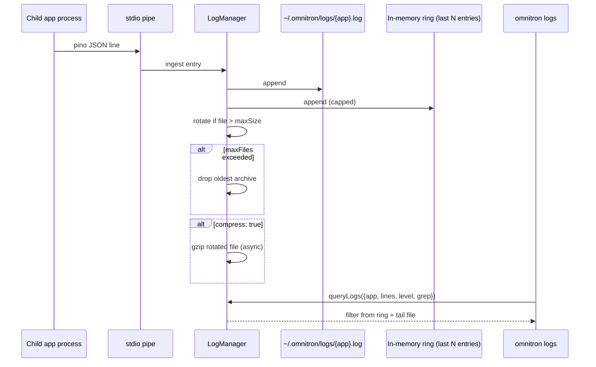
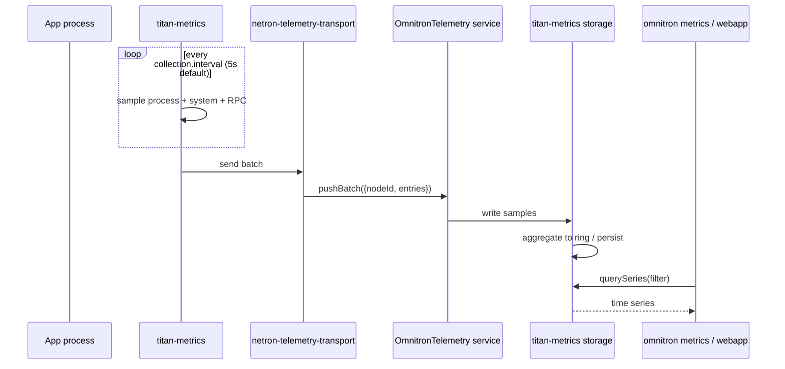
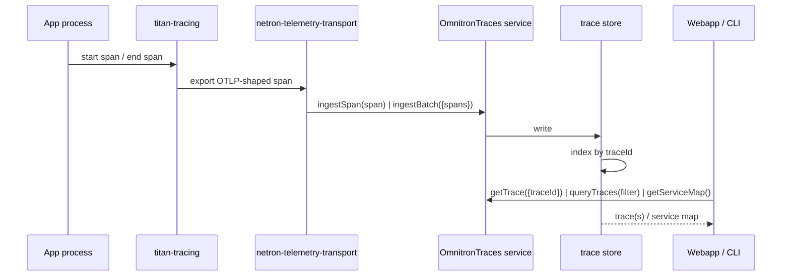
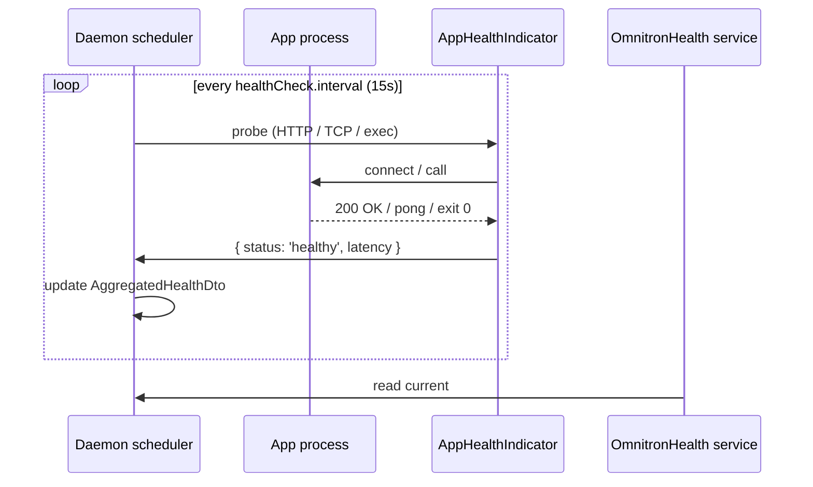

# Observability

Every supervised app emits logs, metrics, traces, and health
signals — all of them flow through the daemon, get stored, and
are queryable via RPC. No separate Prometheus / Loki / Tempo to
deploy for the baseline.

This page describes those pipelines end-to-end so you know which
knob to turn and which storage to inspect when something goes
wrong.

Verified against `apps/omnitron/src/{observability,monitoring,services}/`.

## The four pipelines

| Signal | Owner | Storage | Exposure |
| ------ | ----- | ------- | -------- |
| **Logs** | `log-collector` service + `LogManager` | `~/.omnitron/logs/{app}.log` + rotated archives | RPC: `OmnitronLogs.queryLogs` / `streamLogs` |
| **Metrics** | `MetricsBridge` + `OmnitronTelemetry` | titan-metrics storage (memory / SQLite / Postgres) | RPC: `OmnitronTelemetry.pushBatch` (ingest), `OmnitronMetrics` (read) |
| **Traces** | `OmnitronTraces` | trace-store (in-memory ring + optional persistence) | RPC: `ingestSpan`, `queryTraces`, `getServiceMap` |
| **Health** | `OmnitronHealth` + `OmnitronNodes` health monitor | rolling window in state-store | RPC: `checkApp`, `getCheckHistory`, `getUptimeBar` |

## Logs

### Flow



### `LogManager`

The orchestrator wires every spawned child's stdout/stderr
through a `LogManager`. Responsibilities:

- Append every pino JSON line to `~/.omnitron/logs/{app}.log`.
- Maintain an in-memory ring of the last N entries per app (used
  by `omnitron logs` for fast tail without disk I/O).
- Rotate when file size exceeds the configured threshold.
- Drop the oldest archive when count exceeds `maxFiles`.
- Optionally gzip rotated archives (async, doesn't block writers).

Defaults from `ecosystem.logging`:

| Option | Default |
| ------ | ------- |
| `level` | `'info'` |
| `maxSize` | `'50mb'` |
| `maxFiles` | `10` |
| `compress` | `true` |

Per-app overrides live in `IAppDefinition.observability.logging`.

### `OmnitronLogs` RPC

| Method | Effect |
| ------ | ------ |
| `queryLogs({app?, level?, grep?, lines?, ...})` | Filter & return entries |
| `streamLogs({app?, follow})` | Live subscription |
| `getLogStats()` | Per-app file size + rotation count |

Both `queryLogs` and `streamLogs` consult the in-memory ring
first, then fall back to file tail for older entries.

### CLI

```bash
omnitron logs                       # daemon log
omnitron logs api                   # one app
omnitron logs api -f -l warn -g err # follow + level filter + regex
omnitron logs api --file            # read directly from files (bypass daemon)
omnitron --json logs api            # NDJSON output
```

### Log entries — `LogEntryDto`

```typescript
interface LogEntryDto {
  timestamp:  number;       // ms epoch
  level:      'trace'|'debug'|'info'|'warn'|'error'|'fatal';
  app:        string;
  pid?:       number;
  process?:   string;       // sub-process name in bootstrap mode
  message:    string;
  // ...arbitrary fields from the structured log
}
```

The arbitrary fields are whatever the app put into its log
context (typically a request id, user id, span id, etc.).

## Metrics

### Flow



### Producer side — `MetricsBridge`

`apps/omnitron/src/observability/metrics-bridge.ts` is the
in-daemon bridge that:

- Hosts the `MetricsService` shared by daemon services.
- Pushes daemon-internal metrics (RPC call counts, app supervision
  events, infra reconciler outcomes) to storage on the same
  cadence as app-side metrics.
- Generates daemon-level `omnitron_*` series alongside per-app
  series.

### Producer side — apps

App processes load `titan-metrics` (auto-loaded when present in
their `@Module` imports) and configure the netron-telemetry
transport:

```typescript
@Module({
  imports: [
    TitanMetricsModule.forRoot({
      appName: 'api',
      collection: { enabled: true, interval: 5_000, process: true, system: true, rpc: true },
      storage:    { type: 'memory' },
    }),
    NetronTelemetryTransportModule.forRoot({
      targetUrl: 'unix://~/.omnitron/daemon.sock',
      service:   'OmnitronTelemetry',
    }),
  ],
})
class AppModule {}
```

Inside the app, `metrics.recordTyped(...)` calls write to the
local `titan-metrics` registry; the transport batches them and
pushes via `OmnitronTelemetry.pushBatch`.

### Aggregator side — daemon

`OmnitronTelemetry.pushBatch({nodeId, entries})`:
1. Accepts a batch from any app.
2. Hands it to the configured storage backend
   (`memory` / `sqlite` / `postgres`).
3. Returns the count of entries accepted (used for ack).

The aggregator role typically runs on the master daemon; slave
daemons either:
- Run their own local aggregator + sync metrics via
  `OmnitronSync`, or
- Push directly across the network to master via TCP transport.

### Read side — `OmnitronMetrics` (from `titan-metrics`)

The `titan-metrics` module's `MetricsRpcService` is auto-registered
as `OmnitronMetrics`. The webapp / CLI read through it.

See [titan-metrics docs](../titan/modules/metrics.mdx) for the
full read API — `getSnapshot`, `querySeries`,
`getPrometheusText`, `evictApp`.

### Aggregated metrics — `AggregatedMetricsDto`

`OmnitronDaemon.getMetrics({name?})` returns:

```typescript
interface AggregatedMetricsDto {
  timestamp: number;
  apps: Record<string, {
    cpu:        number;
    memory:     number;
    requests?:  number;
    errors?:    number;
    latency?:   { p50, p95, p99, mean };
  }>;
  totals: {
    cpu:    number;
    memory: number;
  };
}
```

This is the canonical "what's everyone using" snapshot — used by
the dashboard's overview tiles.

### CLI

```bash
omnitron metrics                    # all apps
omnitron metrics api                # one app
omnitron --json metrics             # NDJSON
```

For time-series queries, use the webapp or call
`OmnitronMetrics.querySeries` directly via `omnitron exec`.

## Traces

### Flow



### `OmnitronTraces` RPC

| Method | Effect |
| ------ | ------ |
| `ingestSpan(span)` | Push one span |
| `ingestBatch({spans})` | Push many |
| `getTrace({traceId})` | One trace (all its spans) |
| `queryTraces(filter)` | Filter by service / op / duration / status / time |
| `getServiceMap()` | Derived `service_a → service_b` call graph |

### `TraceFilter`

```typescript
interface TraceFilter {
  service?:    string;
  operation?:  string;
  minDuration?: number;        // ms
  maxDuration?: number;
  status?:     'ok' | 'error';
  from?:       number;         // epoch ms
  to?:         number;
  limit?:      number;
  offset?:     number;
}
```

### CLI

No dedicated `omnitron traces` command — use the webapp's
`/traces` page or call directly:

```bash
omnitron exec OmnitronTraces getTrace '{"traceId":"abc123"}'
```

## Health

Two levels: **app health** (HTTP/TCP/exec probes against running
apps) and **node health** (cross-machine availability).

### App health flow



### `AppHealthIndicator`

`apps/omnitron/src/monitoring/app-health.indicator.ts` runs the
probe types declared per-app:

- **TCP** — connect attempt to a port.
- **HTTP** — GET `/healthz` (or custom path), expect 200.
- **Exec** — run a command; non-zero exit = unhealthy.

The same indicator is shared across the daemon scheduler and the
`OmnitronHealth.checkApp` RPC method.

### `DockerHealthIndicator`

`apps/omnitron/src/monitoring/docker-health.indicator.ts` does
the same for managed infrastructure containers — uses Docker's
healthcheck output where available, falls back to TCP probe.

### `OmnitronHealth` RPC

| Method | Effect |
| ------ | ------ |
| `checkApp({appName, port?})` | Probe one app on demand |
| `checkApps()` | Probe every app |
| `checkInfrastructure()` | Probe every infra container |
| `checkAll()` | Full platform health report |

### `OmnitronNodes` health (cross-machine)

For fleet nodes (registered in `OmnitronNodes`), the
**health-monitor** runs separately:

| Parameter | Default |
| --------- | ------- |
| `intervalMs` | `60_000` (1/min) |
| `concurrency` | `20` |
| `offlineTimeoutMs` | `90_000` |
| `pingEnabled` | `true` (ICMP) |
| `pingTimeout` | `5_000` |
| `sshTimeout` | `10_000` |
| `omnitronCheckTimeout` | `15_000` |
| `retentionDays` | `90` |
| `uptimeIntervalMs` | `86_400_000` (24h per uptime bar segment) |

Per-node history is stored for 90 days and surfaced as the
green/yellow/red **uptime bars** in the webapp.

### CLI

```bash
omnitron health [app]              # daemon-level health summary
omnitron health-check [app]        # detailed HTTP/TCP probe report
omnitron node check [id]           # node connectivity probe
```

## Putting it together — what the daemon stores

```text
~/.omnitron/
├── logs/                      # log-manager rotated files
│   ├── daemon.log
│   ├── api.log
│   ├── api.log.1.gz
│   └── ...
├── state.json                 # app status + health summary
└── secrets.enc

(plus per-storage-backend persistence — Postgres / SQLite per metrics+traces config)
```

## Retention

| Signal | Retention default |
| ------ | ----------------- |
| Logs | `logging.maxFiles` × `logging.maxSize` (default ~ 500 MB per app) |
| Metrics (in-memory) | `monitoring.metrics.retention` (default 3 600 s) |
| Metrics (persistent) | `titan-metrics.retention.maxAge` (default `7d`) |
| Traces (in-memory ring) | default 10 000 spans, oldest dropped |
| Traces (persistent) | configured per backend |
| Health history | `healthMonitor.retentionDays` (default 90 days) |
| Alert events | from `OmnitronAlerts` per-rule retention |

Tune retention to match storage budget; defaults are sensible
for small-to-medium fleets.

## Wiring telemetry from your apps

The minimum to get an app into the pipeline:

```typescript
@Module({
  imports: [
    // Logs: pino is auto-routed via stdout to LogManager — no module needed
    // Just use the standard logger

    // Metrics:
    TitanMetricsModule.forRoot({
      appName: 'api',
      collection: { enabled: true },
      storage:    { type: 'memory' },
    }),
    NetronTelemetryTransportModule.forRoot({
      targetUrl: 'unix://~/.omnitron/daemon.sock',
      service:   'OmnitronTelemetry',
    }),

    // Health:
    TitanHealthModule.forRoot({
      enableMemoryIndicator:    true,
      enableEventLoopIndicator: true,
      enableRpcService:         true,    // exposes Health@1.0.0
    }),

    // Tracing (optional):
    TitanTracingModule.forRoot({
      serviceName: 'api',
      exporter: { type: 'netron', service: 'OmnitronTraces' },
    }),
  ],
})
class AppModule {}
```

Logs flow automatically via stdio. Metrics, health, and traces
each need their respective module imported and wired to the
daemon's transport.

## Anti-patterns

- **High-cardinality metric labels.** `userId` as a label
  multiplies series count by user count. Use buckets / tiers,
  not per-entity ids.
- **`omnitron logs --file` in production.** Bypasses the daemon's
  ring buffer; reads raw files. Slower and unfiltered.
- **No retention on the persistent metrics store.** Disk fills;
  queries get slow. Default `'7d'` is sensible.
- **Tracing every span at 100% sampling.** Volume kills the
  daemon. Use head sampling at the producer (titan-tracing has
  built-in samplers).
- **Custom HTTP health endpoint that talks to the database on
  every probe.** Health probes run every 15 s — that's a lot of
  pointless queries. Use a cached health summary.
- **Treating `getMetrics()` as a high-frequency call.** It
  aggregates across apps; if you need real-time per-app data,
  query `OmnitronMetrics.querySeries` with the right filter.

## See also

- [`titan-metrics`](../titan/modules/metrics.mdx) — producer-side detail
- [`titan-telemetry-relay`](../titan/modules/telemetry-relay.mdx) — store-and-forward for offline producers
- [`titan-health`](../titan/modules/health.mdx) — indicator framework
- [Services reference](./services-reference.md) — `OmnitronLogs`,
  `OmnitronTelemetry`, `OmnitronTraces`, `OmnitronHealth`,
  `OmnitronNodes`
- [Architecture](./architecture.md) — where these pipelines sit
- [CLI](./cli.md#monitoring) — `omnitron logs` / `metrics` / `health`
