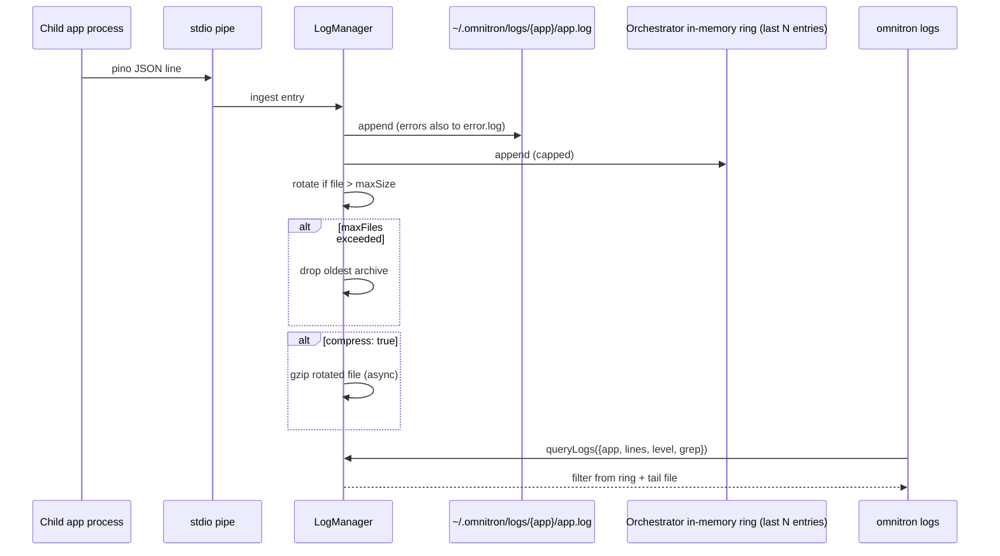
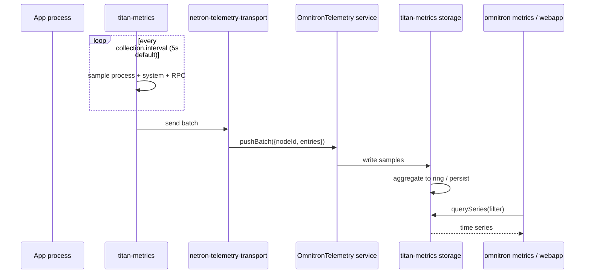
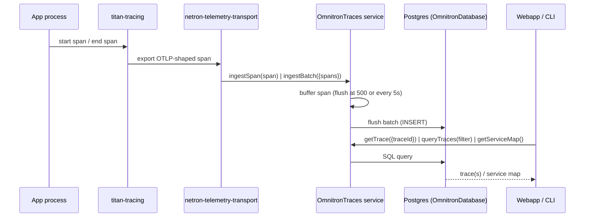
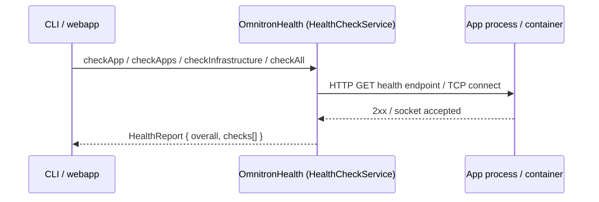

# Observability

Every supervised app emits logs, metrics, traces, and health
signals — all of them flow through the daemon, get stored, and
are queryable via RPC. No separate Prometheus / Loki / Tempo to
deploy for the baseline.

This page describes those pipelines end-to-end so you know which
knob to turn and which storage to inspect when something goes
wrong.

Verified against `apps/omnitron/src/{observability,monitoring,services}/`.

## The four pipelines

| Signal | Owner | Storage | Exposure |
| ------ | ----- | ------- | -------- |
| **Logs** | `log-collector` service + `LogManager` | `~/.omnitron/logs/{app}/app.log` (+ `error.log`) + rotated archives | RPC: `OmnitronLogs.queryLogs` / `streamLogs` |
| **Metrics** | `MetricsBridge` + `OmnitronTelemetry` | titan-metrics storage (memory / SQLite / Postgres) | RPC: `OmnitronTelemetry.pushBatch` (ingest), `OmnitronMetrics` (read) |
| **Traces** | `OmnitronTraces` (`TraceCollectorService`) | Postgres (`OmnitronDatabase`), write-buffered | RPC: `ingestSpan`, `ingestBatch`, `getTrace`, `queryTraces`, `getServiceMap` |
| **Health** | `OmnitronHealth` (app/infra probes) + `OmnitronNodes` health monitor (fleet) | rolling window in state-store / node history | RPC: `OmnitronHealth.checkApp` / `checkAll`; `OmnitronNodes.getCheckHistory` / `getUptimeBar` |

## Logs

### Flow


```mermaid
sequenceDiagram
  participant App as Child app process
  participant Pipe as stdio pipe
  participant LM as LogManager
  participant File as ~/.omnitron/logs/{app}/app.log
  participant Ring as Orchestrator in-memory ring (last N entries)
  participant CLI as omnitron logs

  App->>Pipe: pino JSON line
  Pipe->>LM: ingest entry
  LM->>File: append (errors also to error.log)
  LM->>Ring: append (capped)
  LM->>LM: rotate if file > maxSize
  alt maxFiles exceeded
    LM->>LM: drop oldest archive
  end
  alt compress: true
    LM->>LM: gzip rotated file (async)
  end
  CLI->>LM: queryLogs({app, lines, level, grep})
  LM-->>CLI: filter from ring + tail file
```

### `LogManager`

The orchestrator wires every spawned child's stdout/stderr
through a `LogManager`. Responsibilities:

- Append every pino JSON line to a per-app file. The layout is
  directory-per-app, not a flat file: a standalone app writes
  `~/.omnitron/logs/{app}/app.log`; the daemon itself writes
  `~/.omnitron/logs/omnitron.log`; project-mode apps write under
  `~/.omnitron/projects/{project}/{stack}/logs/{app}/app.log`.
- Dual-write errors and fatals to a sibling `error.log` so a
  noisy info stream doesn't bury them.
- Rotate when file size exceeds the configured threshold.
- Drop the oldest archive when count exceeds `maxFiles`.
- Optionally gzip rotated archives (async, doesn't block writers).

The fast-tail in-memory ring of the last N entries lives in the
`OrchestratorService` (the `LogManager` delegates `getLogs()` to
it), so `omnitron logs` can tail without disk I/O.

Defaults from `ecosystem.logging`:

| Option | Default |
| ------ | ------- |
| `level` | `'info'` |
| `maxSize` | `'50mb'` |
| `maxFiles` | `10` |
| `compress` | `true` |

Per-app overrides live in `IAppDefinition.observability.logging`.

### `OmnitronLogs` RPC

| Method | Effect |
| ------ | ------ |
| `queryLogs({app?, level?, search?, labels?, traceId?, from?, to?, limit?, offset?})` | Filter & return entries (note: full-text filter is `search`, not `grep`; page with `limit`/`offset`) |
| `streamLogs({app?, level?, search?, tail?, since?})` | Return the last `tail` entries (default 100) in chronological order — poll for near-real-time tailing |
| `getLogStats()` | Per-app file size + rotation count |

`streamLogs` is a poll-friendly "recent entries" call rather than
a push subscription; pass `since` to fetch only entries after a
timestamp.

### CLI

```bash
omnitron logs                       # daemon log
omnitron logs api                   # one app
omnitron logs api -f -l warn -g err # follow + level filter + regex
omnitron logs api --file            # read directly from files (bypass daemon)
omnitron --json logs api            # NDJSON output
```

### Log entries — `LogEntryDto`

```typescript
interface LogEntryDto {
  timestamp:  number;       // ms epoch
  level:      'trace'|'debug'|'info'|'warn'|'error'|'fatal';
  app:        string;
  pid?:       number;
  process?:   string;       // sub-process name in bootstrap mode
  message:    string;
  // ...arbitrary fields from the structured log
}
```

The arbitrary fields are whatever the app put into its log
context (typically a request id, user id, span id, etc.).

## Metrics

### Flow


```mermaid
sequenceDiagram
  participant App as App process
  participant TM as titan-metrics
  participant Trans as netron-telemetry-transport
  participant Tel as OmnitronTelemetry service
  participant Store as titan-metrics storage
  participant CLI as omnitron metrics / webapp

  loop every collection.interval (5s default)
    TM->>TM: sample process + system + RPC
  end
  TM->>Trans: send batch
  Trans->>Tel: pushBatch({nodeId, entries})
  Tel->>Store: write samples
  Store->>Store: aggregate to ring / persist
  CLI->>Store: querySeries(filter)
  Store-->>CLI: time series
```

### Producer side — `MetricsBridge`

`apps/omnitron/src/observability/metrics-bridge.ts` is the
in-daemon bridge that:

- Hosts the `MetricsService` shared by daemon services.
- Pushes daemon-internal metrics (RPC call counts, app supervision
  events, infra reconciler outcomes) to storage on the same
  cadence as app-side metrics.
- Generates daemon-level `omnitron_*` series alongside per-app
  series.

### Producer side — apps

App processes load `titan-metrics` (auto-loaded when present in
their `@Module` imports) and configure the netron-telemetry
transport:

```typescript
@Module({
  imports: [
    TitanMetricsModule.forRoot({
      appName: 'api',
      collection: { enabled: true, interval: 5_000, process: true, system: true, rpc: true },
      storage:    { type: 'memory' },
    }),
    NetronTelemetryTransportModule.forRoot({
      targetUrl: 'unix://~/.omnitron/daemon.sock',
      service:   'OmnitronTelemetry',
    }),
  ],
})
class AppModule {}
```

Inside the app, `metrics.recordTyped(...)` calls write to the
local `titan-metrics` registry; the transport batches them and
pushes via `OmnitronTelemetry.pushBatch`.

### Aggregator side — daemon

`OmnitronTelemetry.pushBatch({nodeId, entries})`:
1. Accepts a batch from any app.
2. Hands it to the configured storage backend
   (`memory` / `sqlite` / `postgres`).
3. Returns the count of entries accepted (used for ack).

The aggregator role typically runs on the master daemon; slave
daemons either:
- Run their own local aggregator + sync metrics via
  `OmnitronSync`, or
- Push directly across the network to master via TCP transport.

### Read side — `OmnitronMetrics` (from `titan-metrics`)

The `titan-metrics` module's `MetricsRpcService` is auto-registered
as `OmnitronMetrics`. The webapp / CLI read through it.

See [titan-metrics docs](../titan/modules/metrics.mdx) for the
full read API — `getSnapshot`, `querySeries`,
`getPrometheusText`, `evictApp`.

### Prometheus scrape endpoint — `MetricsServer`

`apps/omnitron/src/observability/metrics-server.ts` runs a tiny
standalone HTTP server *alongside* the RPC surface, so an
existing Prometheus can scrape the daemon directly:

- `GET /metrics` → text/plain Prometheus exposition
  (`metrics.getPrometheusText()`, after refreshing per-app gauges).
- `GET /healthz` (and `/health`) → `ok` for liveness probes.
- Anything else → 404; non-GET → 405.

Port defaults to `httpPort + 3` (≈ `9803`); it binds to
**`127.0.0.1` by default** so the aggregate counters aren't
exposed network-wide. To scrape remotely, bind `0.0.0.0` **and**
set a bearer token (`authToken`) — `/metrics` then requires
`Authorization: Bearer <token>` (constant-time compared);
`/healthz` stays public. Binding non-loopback without a token
logs a loud warning.

So the "no separate Prometheus to deploy" baseline still holds —
but if you *do* run Prometheus, this is the endpoint to point it
at, rather than the RPC read path.

### Aggregated metrics — `AggregatedMetricsDto`

`OmnitronDaemon.getMetrics({name?})` returns:

```typescript
interface AggregatedMetricsDto {
  timestamp: number;
  apps: Record<string, {
    cpu:        number;
    memory:     number;
    requests?:  number;
    errors?:    number;
    latency?:   { p50, p95, p99, mean };
  }>;
  totals: {
    cpu:    number;
    memory: number;
  };
}
```

This is the canonical "what's everyone using" snapshot — used by
the dashboard's overview tiles.

### CLI

```bash
omnitron metrics                    # all apps
omnitron metrics api                # one app
omnitron --json metrics             # NDJSON
```

For time-series queries (`OmnitronMetrics.querySeries`), use the
webapp — `OmnitronMetrics` is a daemon-hosted service, so it
isn't reachable through `omnitron exec` (which targets services
running inside a managed app).

## Traces

### Flow


```mermaid
sequenceDiagram
  participant App as App process
  participant OTel as titan-tracing
  participant Trans as netron-telemetry-transport
  participant TC as OmnitronTraces service
  participant Store as Postgres (OmnitronDatabase)
  participant UI as Webapp / CLI

  App->>OTel: start span / end span
  OTel->>Trans: export OTLP-shaped span
  Trans->>TC: ingestSpan(span) | ingestBatch({spans})
  TC->>TC: buffer span (flush at 500 or every 5s)
  TC->>Store: flush batch (INSERT)
  UI->>TC: getTrace({traceId}) | queryTraces(filter) | getServiceMap()
  TC->>Store: SQL query
  Store-->>UI: trace(s) / service map
```

### `OmnitronTraces` RPC

| Method | Effect |
| ------ | ------ |
| `ingestSpan(span)` | Push one span |
| `ingestBatch({spans})` | Push many |
| `getTrace({traceId})` | One trace (all its spans) |
| `queryTraces(filter)` | Filter by service / op / duration / tags / time |
| `getServiceMap()` | Derived `service_a → service_b` call graph |

Storage is **Postgres-backed**, not an in-memory ring:
`TraceCollectorService` write-buffers spans (flushing to
`OmnitronDatabase` whenever the buffer hits 500 spans or every
5 s), and `getTrace` / `queryTraces` / `getServiceMap` run SQL
queries against that table.

### `TraceFilter`

```typescript
interface TraceFilter {
  service?:    string;
  operation?:  string;
  minDuration?: number;        // ms
  maxDuration?: number;
  from?:       string;         // ISO timestamp
  to?:         string;
  tags?:       Record<string, string>;
  limit?:      number;
}
```

### CLI

No dedicated `omnitron traces` command. `OmnitronTraces` is a
daemon-hosted RPC service, and `omnitron exec` only reaches
services *inside a managed app* (it routes by app name) — so the
trace API is consumed by the webapp's `/traces` page rather than
from the CLI.

## Health

Two levels: **app/infra health** (on-demand probes via
`OmnitronHealth`) and **node health** (cross-machine
availability). On top of those sit two **titan-health
indicators** that roll up live state for the daemon's own
`/health` summary.

### `OmnitronHealth` — active probing

`HealthCheckService` (`apps/omnitron/src/services/health-check.service.ts`,
exposed as `OmnitronHealth`) does the actual probing on demand,
using `@xec-sh/ops` `HealthChecker` with built-in TCP/HTTP
fallbacks:

- **HTTP** — GET the app's health endpoint, expect a 2xx.
- **TCP** — connect attempt to a port (used for infra services).
- Process liveness is folded in from the orchestrator.


```mermaid
sequenceDiagram
  participant Caller as CLI / webapp
  participant HC as OmnitronHealth (HealthCheckService)
  participant App as App process / container

  Caller->>HC: checkApp / checkApps / checkInfrastructure / checkAll
  HC->>App: HTTP GET health endpoint / TCP connect
  App-->>HC: 2xx / socket accepted
  HC-->>Caller: HealthReport { overall, checks[] }
```

### `AppHealthIndicator`

`apps/omnitron/src/monitoring/app-health.indicator.ts` is a
titan-health indicator (name `'apps'`) — **not** a network
prober. It reads `orchestrator.list()` and grades by *process
status*: `healthy` when all managed apps are online, `degraded`
when some are crashed/errored, `unhealthy` when a `critical` app
is down. It feeds the daemon's aggregated `/health` summary, not
the per-app HTTP/TCP probe path above.

### `DockerHealthIndicator`

`apps/omnitron/src/monitoring/docker-health.indicator.ts` is the
infra counterpart (name `'docker'`). It reads
`InfrastructureService.getState()` and aggregates each managed
container's reported `status` / `health` — it does not itself
run Docker healthchecks or fall back to a TCP probe; it reports
the infra service's cached state.

### `OmnitronHealth` RPC

| Method | Effect |
| ------ | ------ |
| `checkApp({appName, port?})` | Probe one app on demand |
| `checkApps()` | Probe every app |
| `checkInfrastructure()` | Probe every infra container |
| `checkAll()` | Full platform health report |

### `OmnitronNodes` health (cross-machine)

For fleet nodes (registered in `OmnitronNodes`), the
**health-monitor** runs separately:

| Parameter | Default |
| --------- | ------- |
| `intervalMs` | `60_000` (1/min) |
| `concurrency` | `20` |
| `offlineTimeoutMs` | `90_000` |
| `pingEnabled` | `true` (ICMP) |
| `pingTimeout` | `5_000` |
| `sshTimeout` | `10_000` |
| `omnitronCheckTimeout` | `15_000` |
| `retentionDays` | `90` |
| `uptimeIntervalMs` | `86_400_000` (24h per uptime bar segment) |

Per-node history is stored for 90 days and surfaced as the
green/yellow/red **uptime bars** in the webapp.

### CLI

```bash
omnitron health [app]              # daemon-level health summary
omnitron health-check [app]        # detailed HTTP/TCP probe report
omnitron node check [id]           # node connectivity probe
```

## Putting it together — what the daemon stores

```text
~/.omnitron/
├── logs/                      # log-manager rotated files
│   ├── omnitron.log           # the daemon's own log
│   ├── omnitron.error.log
│   ├── api/                   # one directory per standalone app
│   │   ├── app.log
│   │   ├── error.log
│   │   ├── app.log.1.gz
│   │   └── ...
│   └── ...
├── projects/{project}/{stack}/logs/{app}/   # project-mode apps
├── state.json                 # app status + health summary
└── secrets.enc

(traces persist to Postgres / OmnitronDatabase; metrics persist
per-storage-backend — memory / SQLite / Postgres per config)
```

## Retention

| Signal | Retention default |
| ------ | ----------------- |
| Logs | `logging.maxFiles` × `logging.maxSize` (default ~ 500 MB per app) |
| Metrics (in-memory) | `monitoring.metrics.retention` (default 3 600 s) |
| Metrics (persistent) | `titan-metrics.retention.maxAge` (default `7d`) |
| Traces (write buffer) | flushed to Postgres at 500 spans or every 5 s |
| Traces (persistent) | Postgres (`OmnitronDatabase`) — trim/retain at the DB layer |
| Health history | `healthMonitor.retentionDays` (default 90 days) |
| Alert events | from `OmnitronAlerts` per-rule retention |

Tune retention to match storage budget; defaults are sensible
for small-to-medium fleets.

## Wiring telemetry from your apps

The minimum to get an app into the pipeline:

```typescript
@Module({
  imports: [
    // Logs: pino is auto-routed via stdout to LogManager — no module needed
    // Just use the standard logger

    // Metrics:
    TitanMetricsModule.forRoot({
      appName: 'api',
      collection: { enabled: true },
      storage:    { type: 'memory' },
    }),
    NetronTelemetryTransportModule.forRoot({
      targetUrl: 'unix://~/.omnitron/daemon.sock',
      service:   'OmnitronTelemetry',
    }),

    // Health:
    TitanHealthModule.forRoot({
      enableMemoryIndicator:    true,
      enableEventLoopIndicator: true,
      enableRpcService:         true,    // exposes Health@1.0.0
    }),

    // Tracing (optional):
    TitanTracingModule.forRoot({
      serviceName: 'api',
      exporter: { type: 'netron', service: 'OmnitronTraces' },
    }),
  ],
})
class AppModule {}
```

Logs flow automatically via stdio. Metrics, health, and traces
each need their respective module imported and wired to the
daemon's transport.

## Anti-patterns

- **High-cardinality metric labels.** `userId` as a label
  multiplies series count by user count. Use buckets / tiers,
  not per-entity ids.
- **`omnitron logs --file` in production.** Bypasses the daemon's
  ring buffer; reads raw files. Slower and unfiltered.
- **No retention on the persistent metrics store.** Disk fills;
  queries get slow. Default `'7d'` is sensible.
- **Tracing every span at 100% sampling.** Volume kills the
  daemon. Use head sampling at the producer (titan-tracing has
  built-in samplers).
- **Custom HTTP health endpoint that talks to the database on
  every probe.** Health probes run every 15 s — that's a lot of
  pointless queries. Use a cached health summary.
- **Treating `getMetrics()` as a high-frequency call.** It
  aggregates across apps; if you need real-time per-app data,
  query `OmnitronMetrics.querySeries` with the right filter.

## See also

- [`titan-metrics`](../titan/modules/metrics.mdx) — producer-side detail
- [`titan-telemetry-relay`](../titan/modules/telemetry-relay.mdx) — store-and-forward for offline producers
- [`titan-health`](../titan/modules/health.mdx) — indicator framework
- [Services reference](./services-reference.md) — `OmnitronLogs`,
  `OmnitronTelemetry`, `OmnitronTraces`, `OmnitronHealth`,
  `OmnitronNodes`
- [Architecture](./architecture.md) — where these pipelines sit
- [CLI](./cli.md#monitoring) — `omnitron logs` / `metrics` / `health`
