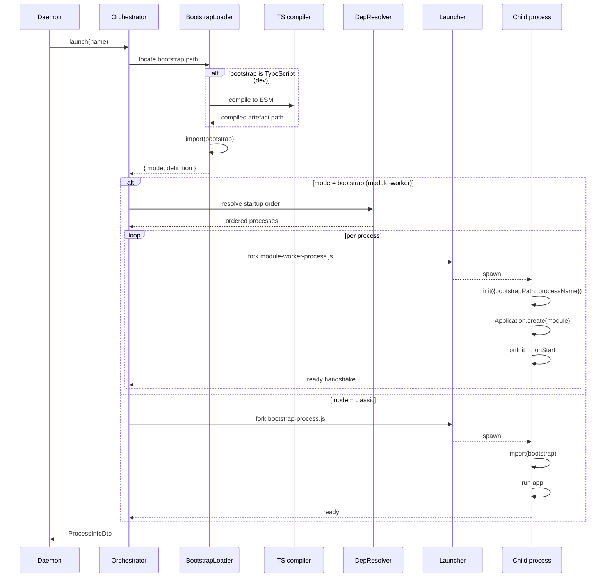
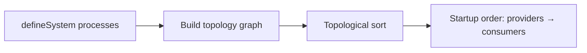
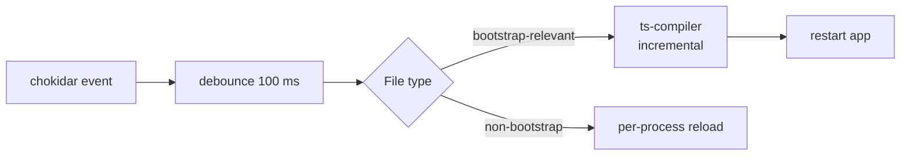

# Orchestrator

The orchestrator is the daemon's per-app launch pipeline. The
daemon decides **when** to start an app; the orchestrator handles
**how** — locate the bootstrap, compile TypeScript if needed,
resolve dependencies, fork the right child process(es), wire DI,
attach a file watcher in dev, supervise crashes, and tear down
cleanly.

Verified against `src/orchestrator/`:

```
orchestrator/
├── orchestrator.service.ts   (~2k lines)  — top-level service
├── app-handle.ts                    — per-app supervisor state
├── bootstrap-loader.ts              — locates + loads bootstrap.{js,ts}
├── bootstrap-process.ts             — per-app bootstrap entrypoint (classic)
├── module-worker-process.ts         — per-process entrypoint (worker mode)
├── classic-launcher.ts              — fork classic-mode bootstrap
├── ts-compiler.ts                   — JIT TypeScript compile
├── file-watcher.ts                  — hot reload in dev
├── dependency-resolver.ts           — startup ordering by topology
├── service-router.ts                — RPC routing to apps
├── process-janitor.ts               — orphan + zombie reap
└── build-service.ts                 — production bundle / tarball
```

## Two launch modes

The orchestrator supports two distinct app-launch shapes. The
mode is determined by the app's `defineSystem(...)` shape and the
`bootstrap.{js,ts}` exports.

### Classic mode

A single child process runs the app's `bootstrap.{js,ts}` end-to-
end. The bootstrap is responsible for creating every
`Application`, every `@Module`, and any internal sub-process
management.

| Trait                          | Behaviour                                          |
| ------------------------------ | -------------------------------------------------- |
| Forks                          | 1 per app                                          |
| Memory                         | All Titan modules in one process                   |
| Boot time                      | Higher — loads everything                          |
| Use case                       | Legacy apps, monolith-style services               |
| Crash semantics                | App-wide; whole bootstrap dies, daemon restarts it |

### Module-worker mode (default for new apps)

One child process per `IProcessEntry` declared in
`defineSystem({processes: [...]})`. Each child imports **only**
that process's module file and runs `Application.create(module)`
directly.

| Trait                          | Behaviour                                                       |
| ------------------------------ | --------------------------------------------------------------- |
| Forks                          | N — one per `IProcessEntry` (× `instances`)                      |
| Memory                         | Per-process minimum — only what that module uses                |
| Boot time                      | Lower per process; total may be similar but parallelisable      |
| Use case                       | Modern multi-process apps, worker pools, isolation requirements |
| Crash semantics                | Per-process; daemon restarts just the failed process            |

The orchestrator auto-selects the mode based on whether the
bootstrap exports a `defineSystem()` result with `processes: [...]`
(module-worker mode) or a classic single-app module (classic mode).

## App handle

`AppHandle` is the per-app supervisor record kept inside the
orchestrator. It carries:

```typescript
class AppHandle {
  readonly name:    string;
  readonly mode:    'classic' | 'bootstrap';
  readonly app:     IAppDefinition;
  // Classic mode only — raw ChildProcess
  childProcess?:    ChildProcess;
  // Bootstrap mode — PM supervisor + per-process workers
  supervisor?:      ProcessManager;
  // Timer for classic-mode crash restart backoff (cleared on explicit stop)
  restartTimer?:    NodeJS.Timeout;
  // Restart accounting
  restarts:         number;
  // Persisted to state.json
  state:            'starting' | 'running' | 'stopped' | 'crashed';
}
```

One `AppHandle` per app. The handle survives restarts; the
`childProcess` / `supervisor` reference is replaced on each
relaunch.

## Launch pipeline



The ready handshake is mandatory — the daemon does not consider
an app "running" until at least one child reports ready.

## Bootstrap loader — `bootstrap-loader.ts`

Locates and loads the app's bootstrap module. Resolution order:

1. Explicit path from `IEcosystemAppEntry.bootstrap`.
2. `<cwd>/dist/bootstrap.js` (production builds).
3. `<cwd>/src/bootstrap.ts` (dev mode — requires TS compiler).

When the source is TypeScript, it routes through the embedded
TS compiler. When the source is already compiled JS, it `import`s
directly.

## TS compiler — `ts-compiler.ts`

JIT TypeScript compilation for dev mode. Compiles
`src/bootstrap.ts` and all its statically reachable imports to
ESM JavaScript on first-launch, then caches the compiled
artefacts. Driven by the project's `tsconfig.json`.

| Behaviour                          | When                                          |
| ---------------------------------- | --------------------------------------------- |
| Fresh full compile                 | Cold start; cache miss                        |
| Incremental compile                | After file watcher reports a changed file      |
| Diagnostic reporting               | Type errors shown in CLI, do not auto-block start |
| Source map emission                | Always in dev — preserves stack traces        |
| Cache directory                    | `node_modules/.cache/omnitron/`               |

## Dependency resolver — `dependency-resolver.ts`

Reads the topology graph implied by each process's `topology`
declarations (`expose` / `access`). Computes a startup order such
that **providers** start before **consumers**:



A process declaring `topology: { access: ['SomeService'] }`
waits for the process declaring `topology: { expose: true }` on
`SomeService` to be ready. Cycles are detected and reported as
configuration errors at boot.

## Service router — `service-router.ts`

Routes RPC calls between the orchestrator and individual app
processes. When the daemon's `exec({name, service, method,
args})` arrives, the router:

1. Looks up the `AppHandle` by app name.
2. Finds the process within the app that hosts the requested
   service (via the discovered service map).
3. Proxies the call through that process's Netron transport.
4. Returns the result.

For pool-mode (`instances > 1`), the router load-balances across
instances using a round-robin policy with health-aware skipping.

## File watcher — `file-watcher.ts`

In dev mode (or when an app's `watch.enabled: true`), the
orchestrator runs a per-app `FileWatcher`. On file change:



Heuristics:

- Bootstrap path changes → full app restart.
- Module file changes → reload only the processes that import the
  changed module (graph-aware).
- Non-source files (e.g., `*.md`, `*.test.ts`) → ignored unless
  in `watch.paths`.

The watcher debounces bursts (editor saves often produce multiple
events) to a single reload per 100 ms window.

## Classic launcher — `classic-launcher.ts`

Forks `bootstrap-process.js` (a thin wrapper) and waits for ready
handshake. Manages:

- stdio piping for log collection.
- Signal forwarding (`SIGTERM` → child).
- Crash detection via exit-code observation.
- Per-app crash-restart backoff timer.

## Module-worker spawner — `module-worker-process.ts`

Forks `module-worker-process.js` once per `IProcessEntry`. Each
fork:

1. Receives its `processName` via IPC.
2. Re-imports the bootstrap to find the matching `IProcessEntry`.
3. Imports the process's `module` file.
4. Discovers `@Service` providers in the module's metadata.
5. Calls `Application.create(module)`.
6. Runs lifecycle (`onInit` → `onStart`).
7. Reports ready on IPC.

A key invariant: the child imports the **single module file**
declared in `IProcessEntry.module` — not the entire bootstrap —
so an app with 10 processes loads 10 disjoint subsets of code.

## Container identity check (worker mode)

`bootstrap-process.ts` and `module-worker-process.ts` verify that
the `Container` class imported by the app's Titan modules is the
**same physical class** as the daemon's `Container`. If they
differ — typically because the app pinned a different
`@omnitron-dev/titan` version, or the workspace has parallel
`node_modules` — `Inject(Container)` cannot resolve and the app
fails to boot. The check produces a clear error message pointing
at the version mismatch.

## Process janitor — `process-janitor.ts`

Background sweep that reaps:

- **Orphans** — child processes whose `AppHandle` no longer
  exists (e.g., daemon was killed mid-spawn).
- **Zombies** — exited children whose exit status hasn't been
  collected.

Runs periodically; never aggressive enough to kill legitimate
children. The janitor's existence means a daemon restart doesn't
leave a leak of orphaned child PIDs.

## Build service — `build-service.ts`

Produces deployment artefacts for `omnitron deploy build <app>`:

1. Run `pnpm build` in the app directory (or whatever's configured).
2. Resolve the app's workspace dependencies.
3. Bundle the app + deps into a tarball.
4. Output to `~/.omnitron/build/<app>-<version>.tar.gz`.

The build service is invoked from the `deploy` RPC service when
preparing a remote ship.

## Reload semantics

`omnitron reload <app>` triggers a **graceful** restart:

- In **module-worker mode**: workers cycle one-by-one; pool size
  is maintained throughout; no request loss.
- In **classic mode**: a new bootstrap is forked side-by-side; the
  old one is signalled to drain (`SIGTERM`), the new one takes
  over once it reports ready.

Reload differs from restart: restart stops everything first,
incurring a downtime window; reload keeps capacity online
throughout.

## Watch control (operator API)

The `OmnitronDaemon` service exposes:

| Method                                    | Effect                                                |
| ----------------------------------------- | ----------------------------------------------------- |
| `enableWatch({apps?})`                    | Start watching listed apps (all if omitted)           |
| `disableWatch()`                          | Stop all file watchers                                |
| `getWatchStatus()`                        | `{ enabled, apps: [{name, directory}] }`              |

The CLI surfaces these implicitly through the `--no-watch` flag
on `omnitron up` — at runtime, you can toggle without restart.

## Per-app observability

Each launched app reports:

- **stdio logs** → ingested by the daemon's log-collector service.
- **Metrics samples** → pushed via the netron-telemetry-transport.
- **Health probes** → pulled by the daemon's health scheduler.
- **Ready / shutdown** → IPC handshake on the fork channel.

The orchestrator instruments every fork so these signals are
automatic — apps don't have to wire anything explicitly beyond
loading `titan-health` / `titan-metrics` modules.

## Failure recovery

| Symptom                            | Orchestrator response                                          |
| ---------------------------------- | -------------------------------------------------------------- |
| Child exits non-zero               | Apply restart policy; backoff; persist `restarts++`           |
| Child times out on ready handshake | Treat as start failure; backoff; retry up to `maxRestarts`     |
| Container identity mismatch        | Surface error; mark app `crashed`; no auto-retry              |
| TS compile error                   | Surface error; if dev mode, watcher will re-attempt on next save |
| Bootstrap module not found         | Mark `crashed`; surface error from the loader                  |
| Janitor finds orphan               | `SIGKILL` the orphan; log                                      |

## Anti-patterns

- **Single huge bootstrap with many `@Module`s in classic mode.**
  Loads everything in one process. Prefer module-worker mode with
  one process per concern.
- **Mutating `state.json` to remove a crashed app.** Use
  `omnitron stop` first; the orchestrator owns lifecycle.
- **File watcher in production.** Wastes CPU and risks
  accidentally hot-reloading prod on a config push. Production
  ecosystems should set `watch.enabled: false`.
- **Cyclic topology declarations.** The dependency resolver
  detects cycles and refuses to start. Refactor to break the
  cycle (often: introduce a shared interface module that both
  sides import).
- **Mixing classic and worker mode in one app.** Pick one. The
  orchestrator can run both modes side-by-side, but only across
  apps — within one app, the mode is global.

## See also

- [Daemon](./daemon.md) — what invokes the orchestrator
- [Architecture](./architecture.md) — where the orchestrator fits
- [titan-pm](../titan/modules/pm.mdx) — the process manager the
  orchestrator builds on
- [Services reference](./services-reference.md) — `OmnitronDaemon.exec`
  routes through the service router
- [CLI](./cli.md) — `start`, `stop`, `reload`, `restart`, `scale`
