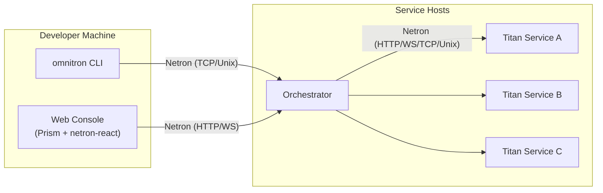

# Omnitron App

`@omnitron-dev/omnitron` is the application supervisor and CLI for the
Omnitron stack. It runs, watches, logs, and orchestrates Titan services
across machines and projects.

## What you get

- **`omnitron dev`** — start a Titan app with hot reload, structured
  logs, and inspector hooks.
- **`omnitron logs`** — tail structured logs across one or many running
  services, locally or remote.
- **`omnitron status`** — health, readiness, metrics, and lifecycle
  state from any running Titan app.
- **Orchestrator** — supervise multiple Titan apps as a stack.
- **Web console** — `apps/omnitron/webapp` exposes dashboards over
  ApexCharts and a service topology over XYFlow.
- **MCP server** — `omnitron-kb` exposes the codebase to AI tooling via
  the Model Context Protocol.

## Architecture



The supervisor is itself a Titan app. Its operator surface is a Netron
service. The CLI and the web console are both Netron clients against
that service.

## Install

```bash
# Globally (recommended for CLI use):
pnpm add -g @omnitron-dev/omnitron

# Or as a dev dependency:
pnpm add -D @omnitron-dev/omnitron
```

## Quick smoke test

```bash
# Start any Titan app in dev mode.
$ omnitron dev ./apps/api

# In another shell, list running services.
$ omnitron status
SERVICE          VERSION   TRANSPORTS         STATE
users            1.0.0     http:3000,ws:3001  ready
orders           1.0.0     http:3000          ready
```

## Read on

- [CLI Reference](./cli.md) — every command, every flag.
- [Orchestrator](./orchestrator.md) — multi-service supervision.
- [Web Console](./console.md) — the admin UI.
