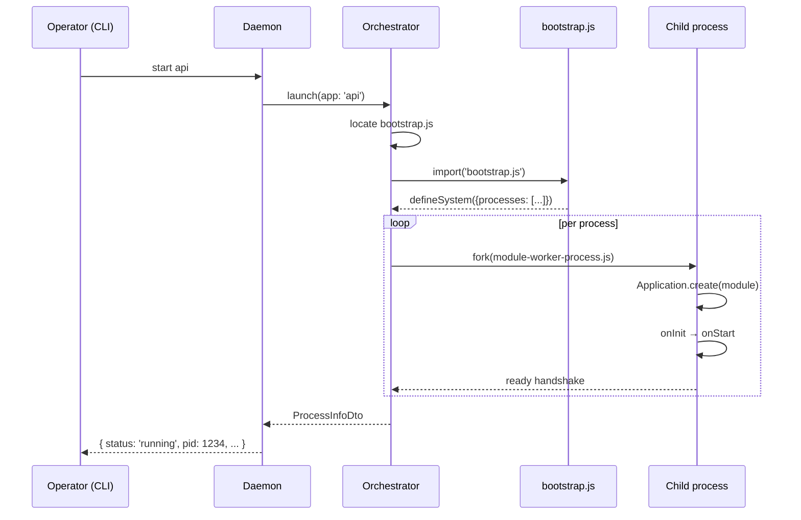

# Omnitron

**Omnitron is the supervisor, control plane, and operator surface
for Titan applications.** One long-running daemon manages many
processes across many apps across many projects, exposes a typed
RPC plane for inspection, ships a CLI and a web console, and
provisions the infrastructure your apps need.

```bash
pnpm add -g @omnitron-dev/omnitron
omnitron up                          # start daemon + all configured apps
omnitron status                      # see what's running
omnitron logs --grep error           # tail filtered logs
omnitron webapp open                 # open the web console
```

## What you get

| Layer | Responsibility |
| ----- | -------------- |
| **CLI** | One binary (`omnitron`) with 13 command groups covering every operator task — start/stop/status/logs/scale/secrets/backup/deploy/cluster/k8s/etc. |
| **Daemon** | Long-running supervisor that owns the process tree, exposes a typed Netron RPC surface, and persists state under `~/.omnitron/` |
| **Orchestrator** | Per-app launch pipeline: TS compile / module load / fork process / wire DI / start lifecycle / watch files in dev |
| **Process tree** | One OS process per `IProcessEntry` you declare; ≥ 1 instances per process; auto-restart with exponential backoff |
| **Services** | Nineteen built-in RPC services (auth, deploy, fleet, secrets, k8s, …) exposed from the daemon |
| **Webapp** | React + Vite single-page console — same RPC surface; lives at `apps/omnitron/webapp/` |
| **Infrastructure** | Provisions Postgres / Redis / S3-compatible / custom containers via Docker (dev) or bare-metal hooks (prod) |
| **MCP** | Built-in Model Context Protocol surface — let agents (IDE assistants, CI bots) read state and trigger operations |

## When you reach for Omnitron

- **You have ≥ 2 Titan apps** and want one place to start, watch,
  inspect, and shut them down together.
- **You need a typed control plane**, not bash scripts. Every
  operator action goes through Netron RPC with auth, RBAC, and
  audit.
- **You want dev / staging / prod parity** with declarative infra
  — the same `omnitron.config.ts` boots Docker locally and
  bare-metal remote, with secrets resolved per environment.
- **You operate a fleet** — multiple nodes, leader election,
  remote daemons addressed by alias, cross-node health and
  metrics.
- **You want the console UI for free** — `omnitron webapp open`
  serves the React console talking to the same daemon.

If you only ever run **one** Titan app on **one** machine, `node
my-app.js` may be enough. Omnitron starts to pay back at two apps
or two machines.

## The mental model

```mermaid
flowchart TB
  subgraph User["Operator"]
    CLI[omnitron CLI]
    Console[Web console]
    MCP[Agent via MCP]
  end

  CLI -- Unix socket --> Daemon
  Console -- HTTP/WS --> Daemon
  MCP   -- stdio    --> Daemon

  subgraph Daemon["Omnitron daemon &#40;one per node&#41;"]
    direction TB
    RPC[Netron RPC<br/>19 services]
    State[(state.json<br/>PID + status)]
    Sched[Daemon scheduler]
  end

  Daemon -- spawn / signal --> AppA
  Daemon -- spawn / signal --> AppB

  subgraph AppA["App: api"]
    P1[process: http]
    P2[process: worker]
  end
  subgraph AppB["App: ingest"]
    P3[process: collector]
    P4[process: aggregator x3]
  end

  Daemon -- provision --> Infra
  subgraph Infra["Infrastructure &#40;Docker / bare-metal&#41;"]
    PG[(Postgres)]
    Redis[(Redis)]
    S3[(MinIO)]
  end

  AppA -. uses .-> PG
  AppA -. uses .-> Redis
  AppB -. uses .-> PG
  AppB -. uses .-> S3
```



The daemon is the **only thing always running**. Apps come and
go; the daemon stays. CLI invocations are short-lived RPC clients
talking to the daemon — they exit immediately after the RPC
returns.

## Filesystem layout

Omnitron owns a single directory:

```text
~/.omnitron/
├── daemon.sock          # Unix socket for the management plane
├── daemon.pid           # Daemon PID file
├── state.json           # Persisted app state (last-known status)
├── secrets.enc          # Encrypted secret store (file provider)
└── logs/
    ├── daemon.log
    ├── api.log
    ├── api.log.1.gz
    └── ...
```

By default everything else is project-local — the daemon never
writes outside `~/.omnitron/` unless you point it at custom
paths.

## Default endpoints

| Plane | Endpoint | Purpose |
| ----- | -------- | ------- |
| Management | `unix://~/.omnitron/daemon.sock` (mode `0o600`, owner-only) | CLI ↔ daemon — `OmnitronDaemon` service + 19 others |
| Public TCP | `tcp://0.0.0.0:9700` (opt-in) | Remote daemons + fleet operations |
| Web/HTTP | `http://0.0.0.0:9800` (opt-in) | Webapp + REST gateway |

The Unix socket is the **trust boundary** — owner-only file
permissions make local CLI calls implicit-auth. TCP and HTTP
require JWT.

## A minimal `omnitron.config.ts`

The single configuration file at the repo root:

```typescript
import { defineEcosystem } from '@omnitron-dev/omnitron';
import { fileURLToPath } from 'node:url';
import path from 'node:path';

const __dirname = path.dirname(fileURLToPath(import.meta.url));

export default defineEcosystem({
  apps: [
    {
      name:        'api',
      bootstrap:   path.join(__dirname, 'apps/api/dist/bootstrap.js'),
      cwd:         path.join(__dirname, 'apps/api'),
      env:         { NODE_ENV: 'production' },
      watch:       { enabled: true, paths: ['src/**/*.ts'] },
    },
    {
      name:        'worker',
      bootstrap:   path.join(__dirname, 'apps/worker/dist/bootstrap.js'),
      cwd:         path.join(__dirname, 'apps/worker'),
    },
  ],
  supervision: {
    strategy: 'one_for_one',
    maxRestarts: 5,
    window: 60_000,
    backoff: { type: 'exponential', initial: 1_000, max: 30_000, factor: 2 },
  },
});
```

Each app's `bootstrap.ts` exports a `defineSystem(...)` that
declares the **processes** (one OS process per `IProcessEntry`).

## How an app launches



Each `IProcessEntry` declared in `defineSystem(...)` becomes
exactly one fork (or a pool when `instances > 1`). The child
imports **only** that module's file — no full bootstrap re-load —
so dependencies stay process-isolated.

## Multi-project / multi-stack

Omnitron groups apps into **projects** and projects into
**stacks**:

```text
project: monorepo-A
  ├── stack: dev      → apps: api, worker
  ├── stack: staging  → apps: api, worker, batch
  └── stack: prod     → apps: api, worker, batch, scheduler

project: monorepo-B
  └── stack: prod     → apps: gateway, events
```

Stack-aware commands (`omnitron stack status <project> <stack>`)
operate on the named subset. Use stacks to keep
`development` / `staging` / `production` boots side-by-side on
one daemon.

## Built-in observability

Every supervised process gets, for free:

| Signal | Where |
| ------ | ----- |
| Structured logs (pino JSON) | `~/.omnitron/logs/{app}.log` with size-based rotation |
| Per-process metrics | aggregated by daemon, exposed via RPC + Prometheus text |
| Health probes | `LiveCheck` / `Ready` from `titan-health`, surfaced by daemon |
| Crash tracking | Restart count, last error, backoff state |
| Distributed traces | OTel-compatible via the telemetry transport |

Both the CLI and webapp read these through the daemon — there's no
separate metrics agent to deploy.

## Webapp (Omnitron Console)

The console is a React + Vite SPA that lives at
`apps/omnitron/webapp/` and talks to the daemon via
`@omnitron-dev/netron-browser`. It gives you:

- Project + stack view with per-app status cards
- Live log streams with filtering
- Metric charts (CPU / RSS / event-loop lag / RPC latency)
- Health probes and restart history
- Infrastructure inventory (Docker containers)
- Secret editor (against the daemon's encrypted store)
- Fleet view across remote daemons

Launch via `omnitron webapp open` — runs Vite dev server with
HMR, opens the browser.

→ Full webapp reference: [console](./console.md).

## Compatibility

| Component | Requirement |
| --------- | ----------- |
| Node.js   | 22.x or 23.x (test matrix runs both) |
| OS | macOS, Linux. Windows works for CLI + non-supervisor commands; daemon assumes Unix sockets |
| Docker | Required for `infra` commands (provisioning Postgres / Redis / etc.) |
| Bun / Deno | Apps may run on Bun/Deno individually, but the daemon expects Node |

## Where to go next

- **Architecture deep-dive:** [Architecture](./architecture.md) —
  every component, every plane, every data flow.
- **CLI reference:** [CLI](./cli.md) — every command, every flag.
- **Daemon internals:** [Daemon](./daemon.md) — PID, state-store,
  scheduler, lifecycle.
- **Orchestrator:** [Orchestrator](./orchestrator.md) —
  bootstrap, file watcher, dependency resolver.
- **RPC services:** [Services reference](./services-reference.md) —
  all 19 services and their methods.
- **Console UI:** [Console](./console.md).
