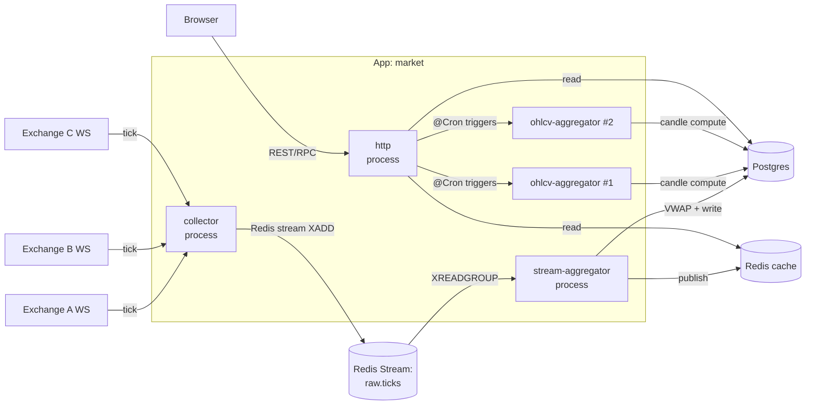
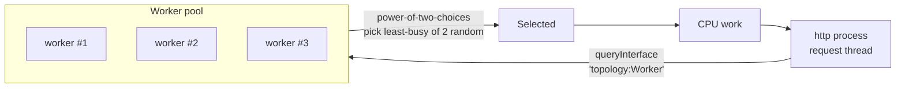
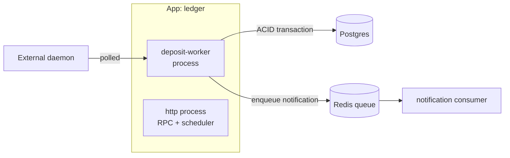
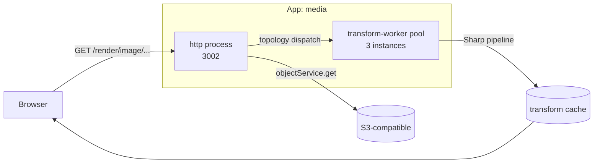

# Recipes

Copy-and-adapt patterns for the operational shapes that
recur in production. Each recipe shows the topology, the
`defineSystem` shape that materialises it, and the gotchas
worth knowing.

Generic example names throughout: substitute what fits your
domain.

## 1. Stream-based fan-in (ingest → aggregate → serve)

**When to use:** real-time data flowing in from many external
sources (exchange websockets, IoT sensors, partner APIs);
needs aggregation before storage and serving.

### Topology



Four `IProcessEntry`s, each with a distinct job:

- **`collector`** — one process holds every external WS connection
  and publishes raw ticks to a Redis stream. Single instance
  (you don't want N pods each opening the same exchange WS).
- **`stream-aggregator`** — consumes the stream, computes VWAP /
  per-symbol roll-ups, writes to Postgres + cache. Single
  instance with a consumer group lets you scale horizontally
  later by adding more.
- **`ohlcv-aggregator`** — CPU-bound candle generation
  (5m / 1h / 1d). Pool of N workers with P2C load balancing.
- **`http`** — public read API + `@Cron` triggers that dispatch
  work to the ohlcv pool via `topology.access`.

### `defineSystem`

```typescript
export default defineSystem({
  name: 'market',
  version: '1.0.0',
  processes: [
    {
      name: 'http',
      module: './app.module.js',
      transports: { http: { port: 3003, host: '0.0.0.0', cors: true } },
      topology: { access: ['OhlcvAggregatorWorker'] },   // ← consume sibling
      hooks: { afterCreate: wireAuth },
    },
    {
      name: 'collector',
      module: './workers/collector.module.js',
      health: { enabled: true, interval: 15_000, timeout: 10_000 },
    },
    {
      name: 'stream-aggregator',
      module: './workers/stream-aggregator.module.js',
      health: { enabled: true, interval: 15_000, timeout: 5_000 },
    },
    {
      name: 'ohlcv-aggregator',
      module: './workers/ohlcv-aggregator.module.js',
      instances: 2,
      health: { enabled: true, interval: 30_000, timeout: 5_000 },
      topology: { expose: true },                        // ← exposed for siblings
    },
  ],
  shutdown: { priority: 20, timeout: 15_000, drainConnections: true },
});
```

Drains in reverse-dependency order: http stops accepting requests
first, then ohlcv finishes in-flight candles, then aggregators
drain the stream, then collector closes WS connections.

### Why Redis streams (not pub/sub)?

- **Durability** — XADD persists; subscribers can disconnect and
  resume from the last ack'd id.
- **Consumer groups** — multiple aggregator pods can split work
  with at-least-once delivery.
- **Replay** — debug by re-running an aggregator from an earlier
  stream id.

Pub/sub is fire-and-forget — fine for cache invalidation, wrong
for raw data you can't afford to lose.

### Gotchas

- **Single collector process.** If you scale collector to `instances: 2`,
  both will dial the same exchange — you'll either trip rate limits
  or get duplicate ticks.
- **Stream backlog.** If the aggregator falls behind, XADD eventually
  fails or the stream grows unboundedly. Monitor stream length
  (`XLEN`) and set a `MAXLEN ~` trim cap on the producer.
- **Consumer-group ID conflicts on rolling restart.** Use stable
  consumer IDs (e.g., `${process.env.OMNITRON_INSTANCE_ID}`) so
  rebalancing is clean.

## 2. CPU-bound worker pool with P2C balancing

**When to use:** request paths that need expensive CPU work
(image transforms, video transcoding, ZK proof generation,
ML inference, candle aggregation).

### Topology



### `defineSystem`

```typescript
processes: [
  {
    name: 'http',
    module: './app.module.js',
    transports: { http: { port: 3000 } },
    topology: { access: ['ImageTransformWorker'] },
  },
  {
    name: 'image-transform',
    module: './workers/image-transform.module.js',
    instances: 4,                          // 4 forks — one CPU core each
    health: { enabled: true, interval: 30_000, timeout: 5_000 },
    topology: { expose: true },            // exposed to siblings
    // Optional autoscaling — pool resizes between 4 and 8:
    scaling: { strategy: 'auto', maxInstances: 8, targetCPU: 70 },
  },
]
```

The orchestrator's load balancer uses **power-of-two-choices**:
pick 2 random workers, dispatch to the less loaded one. Cheap to
compute, near-optimal balance — beats round-robin under skewed
load.

### Calling the pool

```typescript
import { createToken } from '@omnitron-dev/titan/nexus';

const TRANSFORM_POOL_TOKEN = createToken<ImageTransformWorker>('topology:ImageTransformWorker');

@Injectable()
class ImageService {
  constructor(@Inject(TRANSFORM_POOL_TOKEN) private readonly pool: ImageTransformWorker) {}

  async transform(buffer: Buffer, opts: TransformOptions) {
    return this.pool.transform(buffer, opts);   // dispatches to least-busy
  }
}
```

### Gotchas

- **Workers must be stateless across calls.** Pool dispatch
  picks any worker — if a request stores state in worker memory
  for the next request, you'll be inconsistent.
- **Heavy boot per worker.** N forks means N copies of any
  in-process module — Sharp / Tensorflow / etc. cost RAM
  proportionally. Right-size `instances`.
- **`topology.access` is mandatory.** Without it, `queryInterface`
  on the worker service returns nothing — the http process
  silently falls back to in-process work and you wonder why
  the pool sits idle.

## 3. Scheduler-triggered work dispatched to a pool

**When to use:** periodic CPU work (nightly candle generation,
report rollups, cache prewarming).

### Topology

The scheduler runs in the http process (or any always-on
process); it dispatches work to a sibling pool via `topology`.

```typescript
// In the http process (which holds the scheduler):
@Service('market@1.0.0')
class MarketService {
  constructor(@Inject(OHLCV_POOL_TOKEN) private readonly pool: OhlcvWorker) {}

  @Cron('0 */5 * * * *')                            // every 5 minutes
  async rebuild5MinCandles() {
    const symbols = await this.getActiveSymbols();
    await Promise.all(symbols.map(s => this.pool.rebuildCandle(s, '5m')));
  }

  @Cron('0 0 * * * *')                              // hourly
  async rebuild1HourCandles() {
    /* ... */
  }
}
```

Pattern: **always-on processes hold the schedule; pools execute
the work.** Keeps the http event loop responsive (it just
dispatches) and the pool isolated from request traffic.

### Gotcha — `instances > 1` on the scheduler host

If the http process runs as a pool itself (`instances: 4`), the
`@Cron` fires 4× per tick. Either:

- Run the scheduler in a dedicated single-instance process, or
- Use `titan-scheduler.persistence` with distributed lock so only
  one instance fires per tick.

## 4. WebSocket realtime app alongside HTTP RPC

**When to use:** any app that serves both request/response RPC
and live push (chat, notifications, dashboards).

### `defineSystem`

```typescript
processes: [{
  name: 'http',
  module: './app.module.js',
  critical: true,
  transports: {
    http: {
      port: 3005, host: '0.0.0.0', cors: true,
      requestTimeout:    120_000,
      keepAliveTimeout:   65_000,
      headersTimeout:     70_000,
    },
    websocket: {
      port: 3006, host: '0.0.0.0', path: '/ws',
      keepAlive: { interval: 30_000, timeout: 10_000 },
    },
  },
  hooks: { afterCreate: wireAuth },
}],
```

One process serves both transports; clients can use whichever
suits their session pattern. The gateway routes `/api/realtime/`
to `:3005` and `/ws/` to `:3006`.

### Gateway snippet

```nginx
upstream realtime_backend { server ${UPSTREAM_REALTIME_HOST}:${UPSTREAM_REALTIME_PORT}; }
upstream realtime_ws      { server ${UPSTREAM_REALTIME_WS_HOST}:${UPSTREAM_REALTIME_WS_PORT}; }

location /api/realtime/ {
  proxy_pass http://realtime_backend;
}

location /ws/ {
  proxy_pass http://realtime_ws;
  proxy_http_version 1.1;
  proxy_set_header Upgrade $http_upgrade;
  proxy_set_header Connection "upgrade";
  proxy_read_timeout 7d;
}
```

`proxy_read_timeout 7d` lets long-lived connections survive
gateway idle.

### Gotchas

- **Auth on WS** runs on the **upgrade request** only. Closing
  and reopening WS after token rotation is the safest pattern —
  don't try to re-auth a live socket.
- **Sticky session** when scaling realtime to multiple pods.
  Either use sticky LB or route by user-id hash.
- **Don't share `realtime` and `http` ports across pods.** WS
  needs to land on the pod that holds the user's socket.

## 5. Multi-step deposit / settlement pipeline

**When to use:** workflows that span multiple processes /
external systems (payment processing, supply-chain steps,
multi-stage ML pipelines).

### Topology



### `defineSystem`

```typescript
processes: [
  {
    name: 'http',
    module: './app.module.js',
    critical: true,
    transports: { http: { port: 3004 } },
    hooks: {
      afterCreate: async (app) => {
        await wireAuth(app);
        // Eager-load wallet providers so first request doesn't pay cold start:
        await app.container.resolveAsync(WALLET_PROVIDER_A);
        await app.container.resolveAsync(WALLET_PROVIDER_B);
        // Hot-reload runtime settings (commission rate, escrow days):
        const settings = await app.container.resolveAsync(RUNTIME_SETTINGS);
        await settings.loadAndApply();
      },
    },
  },
  {
    name: 'deposit-worker',
    module: './workers/deposit-worker.module.js',
    critical: false,
    startupTimeout: 120_000,         // wallet RPC warm-up takes time
    health: { enabled: true, interval: 30_000 },
  },
],
shutdown: { priority: 15, timeout: 10_000, drainConnections: true },
```

Worker is `critical: false` — its absence doesn't take down the
daemon. Failed deposits surface via metrics and retry on next
poll.

### Why a separate worker process?

- **Crash isolation.** A bad mempool entry kills the worker,
  not the http surface.
- **Independent observability.** Worker logs are separately
  filterable; metrics tagged per worker.
- **Restart freedom.** `omnitron restart deposit-worker` cycles
  the worker without taking the API down.

## 6. Object storage with image transforms

**When to use:** any service that serves user-uploaded media,
applies on-demand transforms (resize, format conversion,
watermarking).

### Topology



### Custom route alongside RPC

```typescript
processes: [{
  name: 'http',
  module: './app.module.js',
  transports: {
    http: {
      port: 3002,
      requestTimeout: 300_000,             // big uploads
      maxRequestSize: '10gb',
    },
  },
  topology: { access: ['ImageTransformWorker'] },
  customRoutes: [{
    method: 'GET',
    pattern: '/render/image/*',
    handler: async (req: Request): Promise<Response | null> => {
      const url = new URL(req.url);
      if (!url.pathname.startsWith('/render/image/')) return null;

      const { bucketId, objectName } = parsePath(url.pathname);
      const opts = transformService.parseTransformOptions(url.searchParams);

      // SAME auth gate as the RPC path — no auth bypass.
      const bucket = await bucketService.get('default', bucketId);
      if (!bucket.public) {
        const token = extractBearer(req);
        if (!token) return new Response('Unauthorized', { status: 401 });
        const authCtx = await jwtService.verify(token);
        await bucketService.assertAccess(bucket, authCtx, 'read');
      }

      const out = await transformService.render(bucketId, objectName, opts);
      return new Response(out.stream, {
        headers: {
          'content-type':   out.mime,
          'cache-control':  'public, max-age=31536000, immutable',
          'etag':           out.etag,
        },
      });
    },
  }],
}]
```

### Gotchas

- **Custom routes can bypass RPC auth.** The example above
  explicitly calls `assertAccess('read')`. Don't omit this —
  history is full of "public preview" routes that leaked
  private data.
- **`maxRequestSize: '10gb'`** is one of the only places where
  the Node defaults are unrealistic. Set it explicitly.
- **Stream the response.** Don't buffer transformed images into
  memory; pipe directly to `Response.body`.

## 7. Per-tenant data isolation via RLS

**When to use:** multi-tenant SaaS where one Postgres instance
holds data for many tenants and the application enforces
isolation.

### Pattern

```typescript
// 1. Define the policy
defineRLSSchema({
  users: {
    rls: [
      { name: 'tenant_isolation', filter: ({ tenantId }) => sql`tenant_id = ${tenantId}` },
    ],
  },
});

// 2. Wire the RLS context wrapper
auth: {
  jwt: { enabled: true, tokenCacheTtl: 60_000 },
  invocationWrapper: createRlsInvocationWrapper(),   // sets tenantId in AsyncLocalStorage
},

// 3. Repositories pick it up automatically:
@Injectable()
class UserRepository {
  constructor(@InjectDatabaseManager() private db: DatabaseManager) {}

  async findAll() {
    return this.db.connection.selectFrom('users').selectAll().execute();
    // Kysera RLS plugin auto-adds `WHERE tenant_id = $current_tenant`
  }
}
```

Every backend in your fan-out uses the **same** invocation
wrapper — so the policy enforces uniformly whether the call
comes via http, websocket, or service-to-service.

### Bypassing RLS for admin operations

```typescript
@Public({ auth: { roles: ['admin'] } })
@BypassRLS()                                // explicit per-method opt-out
async listAllUsersAcrossTenants() {
  return this.db.connection.selectFrom('users').selectAll().execute();
}
```

`@BypassRLS()` is loud by design — it appears in code review
diffs. Search for it during audit.

## 8. Hot-reloadable maintenance mode

**When to use:** scheduled downtime, emergency response, or
graceful degradation.

```mermaid
flowchart LR
  Op[Operator: omnitron --json exec OmnitronSecrets set platform:maintenance 1]
  Op --> R[(Redis)]
  R --> LB[Gateway Lua check]
  LB -- read flag --> R
  LB -- cached 1s --> LB
  alt flag = 1
    LB --> Page[Serve maintenance.html<br/>HTTP 503]
  else flag = 0
    LB --> Backend[Pass-through to backends]
  end
```

The gateway's Lua block (see [Best Practices](./best-practices.md#reverse-proxy-with-maintenance-mode-flag-in-redis))
reads a Redis flag on every request, cached for 1 s. Flip the
flag from any operator surface — CLI, webapp, or directly via
`redis-cli`.

```bash
# Enable maintenance
redis-cli SET platform:maintenance 1
# Disable
redis-cli DEL platform:maintenance
```

No daemon restart, no LB reconfiguration, instant flip.

## 9. Onion-routed operator console

**When to use:** sensitive operator surfaces (admin webapp,
incident dashboards) that should not have public DNS / TLS.

```typescript
infrastructure: {
  services: {
    gateway: { preset: 'openresty', config: { configDir: './infra/nginx' } },
    tor: {
      preset: 'tor',
      config: {
        hiddenServices: [
          { name: 'webapp', virtualPort: 80, target: 'host.docker.internal:9800' },
          { name: 'admin',  virtualPort: 80, target: 'host.docker.internal:8080' },
        ],
      },
    },
  },
},
```

`omnitron tor` prints the `.onion` addresses after the tor
container bootstraps (typically 30–90 s). The keys live in a
persistent volume; same address survives restart.

Defence in depth — not a substitute for RBAC, but it removes
the operator surface from public scanning entirely.

## 10. Cross-app service mesh via topology

**When to use:** apps that need to call services in other
apps directly, not just via shared infrastructure (database,
queue).

```typescript
// app: ledger
processes: [{
  name: 'http',
  module: './app.module.js',
  topology: { access: ['PriceFeed'] },        // ← from a different app
  // ...
}]

// app: market — exposes PriceFeed
processes: [{
  name: 'http',
  module: './app.module.js',
  topology: { expose: true },                  // ledger can now resolve it
}]
```

Behind the scenes Omnitron registers `PriceFeed` on the daemon's
Netron bus when `market` boots. Ledger's `http` process gets a
load-balanced proxy injected via DI under
`createToken('topology:PriceFeed')`.

No URLs, no service discovery code, no DNS — purely declarative.

## 11. Per-app database with shared infrastructure

**When to use:** apps that need data isolation without infra
sprawl.

```jsonc
// apps/ledger/config/default.json
{
  "omnitron": {
    "database": true,        // ← shared Postgres, dedicated database
    "redis":    true,
    "services": { "notifications": true }
  }
}

// apps/media/config/default.json
{
  "omnitron": {
    "database": true,
    "redis":    true,
    "s3":       true
  }
}
```

Omnitron sees both `database: true` declarations, provisions
one Postgres container, creates a `ledger` database and a `media`
database inside it, injects per-app `DATABASE_URL` with the
right database name.

Each app reads its `DATABASE_URL` from env and has no idea the
other exists. Backups can target one database without touching
the other.

## 12. Dev hot-reload with shared workspace deps

**When to use:** monorepo where apps import shared packages and
you want HMR to cascade.

```typescript
// omnitron.config.ts
{
  name: 'media',
  bootstrap: './apps/media/dist/bootstrap.js',
  cwd: './apps/media',
  watch: { directory: './apps/media' },         // ← only watch the app dir
}
```

Workspace packages (`packages/*`) symlinked into
`apps/*/node_modules/` are picked up automatically by esbuild's
import-graph watcher — **do not** add `packages/*` to the
`watch.include` array. Those paths don't exist relative to the
app's cwd; the watcher logs errors trying to stat them.

Trust the build chain to follow symlinks.

## 13. Two-database deploy per stack

**When to use:** running dev + staging on the same host without
collisions.

```typescript
stacks: {
  dev: {
    type: 'local',
    settings: {
      redisDbOffset:  0,
      portOffsets:    { postgres: 0,  redis: 0,  minio: 0  },
      containerPrefix: 'platform-dev',
    },
  },
  staging: {
    type: 'local',
    settings: {
      redisDbOffset:  5,
      portOffsets:    { postgres: 10, redis: 10, minio: 10 },
      containerPrefix: 'platform-staging',
    },
  },
}
```

Both stacks run side-by-side. `omnitron stack start <project> dev`
runs the dev stack; same for staging. They share no state.

## 14. Webhook receiver alongside RPC

**When to use:** integrating with third-party services that push
events (payment providers, git platforms, SaaS notifications).

```typescript
processes: [{
  name: 'http',
  module: './app.module.js',
  customRoutes: [{
    method: 'POST',
    pattern: '/webhooks/payments',
    handler: async (req: Request): Promise<Response> => {
      // 1. Verify signature
      const body = await req.text();
      const sig  = req.headers.get('x-signature');
      if (!verifySignature(body, sig)) return new Response('unauthorized', { status: 401 });

      // 2. Idempotency
      const id = JSON.parse(body).id;
      if (await redis.exists(`webhook:processed:${id}`)) {
        return new Response('already processed', { status: 200 });
      }
      await redis.setex(`webhook:processed:${id}`, 86_400, '1');

      // 3. Hand off to a worker (no inline DB writes here)
      await queueClient.publish('payment.event', body);
      return new Response('ok', { status: 200 });
    },
  }],
}]
```

Pattern: **acknowledge fast, work async.** Third-party webhook
senders timeout aggressively (often 5 s); responding `200 OK`
within milliseconds keeps you off their retry list.

## See also

- [Best practices](./best-practices.md) — patterns that appear
  across all recipes
- [Configuration](./configuration.md) — every option used here
- [Infrastructure](./infrastructure.md) — declarative provisioning
- [Orchestrator](./orchestrator.md) — how the orchestrator runs all this
