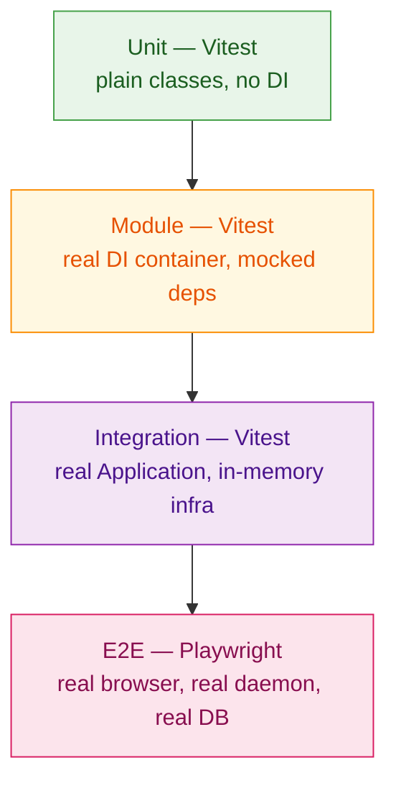

# Testing

A pragmatic guide to testing on this stack. Covers four
levels — from unit tests of a single class to E2E tests
driving a real React app through a real Netron client.

## The pyramid



| Level | What | Tool | Speed | When |
| ----- | ---- | ---- | ----- | ---- |
| **Unit** | Single class / function | Vitest | μs–ms | Pure logic |
| **Module** | DI graph + mocks | Vitest + `Application.create({ overrides })` | ms | Service interaction |
| **Integration** | Real app, in-memory infra | Vitest + Titan testing utilities | 10s of ms | Cross-module flow |
| **E2E** | Real daemon, real client | Vitest / Playwright | seconds | Full system |

## Tooling

| Package | Role |
| ------- | ---- |
| [`vitest`](https://vitest.dev/) | The runner. Native ESM, TypeScript, fast. |
| [`@omnitron-dev/testing`](./testing-package.md) | Cross-runtime helpers + async primitives + Titan-specific test glue |
| [`@playwright/test`](https://playwright.dev/) | E2E browser automation. Used by the webapp. |
| [`@omnitron-dev/netron-react/test`](../frontend/netron/testing.md) | `MockProvider` for React components that call Netron |
| Test-fixture databases | Postgres via `@kysera/migrations-rollback` for transaction-isolated tests |

## What lives where

- **Unit + module tests** live next to the code: `src/foo.ts` +
  `src/__tests__/foo.test.ts`.
- **Integration tests** live in `<package>/test/` or `<app>/test/`.
- **E2E tests** live in `<app>/e2e/` (Playwright by convention).
- **Performance + load** tests in `<package>/benchmark/`.

## The four pages

| Page | What it covers |
| ---- | -------------- |
| [Testing package reference](./testing-package.md) | `@omnitron-dev/testing` API — async helpers, runtime adapters, mock primitives |
| [Integration patterns](./integration.md) | `Application.create({ overrides })`, in-memory DB, fake clocks, transaction rollback |
| [Cross-runtime testing](./cross-runtime.md) | Same test source running on Node + Bun + Deno |
| [React component testing](./react.md) | `MockProvider`, `mockService`, Suspense, error boundaries |

Plus the per-module testing reference:
[Titan / Testing / Modules](../titan/testing/modules.md) —
specific mock recipes for each of the 16+ modules.

## Quick reference — one test per level

### Unit

```typescript
import { describe, it, expect } from 'vitest';
import { calculateInvoiceTotal } from './invoice.js';

describe('calculateInvoiceTotal', () => {
  it('sums line items with tax', () => {
    expect(calculateInvoiceTotal([
      { qty: 2, price: '10.00', taxRate: 0.08 },
      { qty: 1, price: '5.00',  taxRate: 0.08 },
    ])).toBe('27.00');
  });
});
```

No DI, no async, no mocks — just functions and their
expectations.

### Module

```typescript
import { describe, it, expect, vi } from 'vitest';
import { Container, Scope } from '@omnitron-dev/titan/nexus';
import { UsersService } from './users.service.js';

describe('UsersService', () => {
  it('reads from the repo', async () => {
    const container = new Container();
    const fakeRepo  = { findById: vi.fn().mockResolvedValue(MOCK_USER) };

    container.register({ provide: UserRepo,     useValue: fakeRepo });
    container.register({ provide: UsersService, useClass: UsersService });

    const service = await container.resolveAsync(UsersService);
    const user    = await service.findById('u_42');

    expect(user).toEqual(MOCK_USER);
    expect(fakeRepo.findById).toHaveBeenCalledWith('u_42');
  });
});
```

The DI container is real; dependencies are mocks via the
override mechanism.

### Integration

```typescript
import { describe, it, expect } from 'vitest';
import { Application } from '@omnitron-dev/titan';
import { AppModule } from './app.module.js';
import { FakeMailer } from './test/fakes.js';
import { MAILER_TOKEN } from './tokens.js';

describe('user invite flow', () => {
  it('creates a user and queues a welcome email', async () => {
    const app = await Application.create({
      modules:   [AppModule],
      overrides: [{ provide: MAILER_TOKEN, useClass: FakeMailer }],
      disableGracefulShutdown: true,
    });
    await app.start();

    try {
      const users  = await app.resolve(UsersService);
      const mailer = await app.resolve(MAILER_TOKEN) as FakeMailer;

      await users.invite({ email: 'a@b.c', tier: 'pro' });

      expect(mailer.sent).toEqual([
        { to: 'a@b.c', template: 'welcome', data: { tier: 'pro' } },
      ]);
    } finally {
      await app.stop();
    }
  });
});
```

Real `Application`, real DI, real cross-module flow — only the
outermost integration (mailer) is faked.

### E2E

```typescript
// e2e/sign-in.spec.ts (Playwright)
import { test, expect } from '@playwright/test';

test('user signs in', async ({ page }) => {
  await page.goto('http://localhost:5173');
  await page.getByLabel('Email').fill('a@b.c');
  await page.getByLabel('Password').fill('correct-horse-battery');
  await page.getByRole('button', { name: 'Sign in' }).click();
  await expect(page).toHaveURL('http://localhost:5173/');
  await expect(page.getByText('a@b.c')).toBeVisible();
});
```

Real daemon, real React app, real browser. Slowest layer; run
sparingly.

## Per-module mocking

For each of the 16+ Titan modules, the cheapest path to a mock
is in [Titan / Testing / Modules](../titan/testing/modules.md).
Some quick links:

| Module | Pattern |
| ------ | ------- |
| `ConfigModule` | `useValue` ConfigService with `get: () => ...` |
| `LoggerModule` | `createNullLogger()` from `@omnitron-dev/titan/module/logger` |
| `TitanDatabaseModule` | In-memory SQLite or transaction-rollback Postgres |
| `TitanCacheModule` | In-memory L1-only |
| `TitanRedisModule` | `ioredis-mock` |
| `TitanAuthModule` | `useValue` JWT service that returns canned claims |
| `TitanMetricsModule` | `'memory'` storage; assert via `recordTyped` spy |
| `TitanHealthModule` | One indicator returning `'healthy'` |

Each module ships a "Smallest mock" snippet on its page.

## Best practices

- **Test at the lowest level that proves the behaviour.** A unit
  test beats a module test beats an integration test for the
  same assertion — at 1000× speed.
- **One assertion per behavioural intent.** Multiple `expect`s
  fine; multiple intents per test makes failures hard to read.
- **Real DI for module tests.** Mocking the container masks
  wiring bugs that production will hit.
- **Real Application for integration tests.** Mocking
  lifecycle masks ordering bugs.
- **Transaction-rollback for DB tests.** Faster + isolated. No
  cleanup boilerplate.
- **`disableGracefulShutdown: true`** on test `Application.create`
  to skip signal handler installation.
- **Run tests in parallel.** Vitest does this by default — keep
  tests independent (no shared module state, no shared DB rows).

## Anti-patterns

- **Mocking the framework.** Mocking `Application` or
  `Container` means you're not testing your code — you're
  testing the mock.
- **Sleeping for async.** Use Vitest fake timers or
  `await someEvent` — `await delay(100)` is a flake factory.
- **End-to-end-only.** E2E catches integration bugs but slows
  the dev loop. Push assertions down the pyramid.
- **Test files alongside `dist/`.** Tests should run from
  source; compiled tests drift.

## See also

- [Testing package reference](./testing-package.md) — `@omnitron-dev/testing` API
- [Titan / Testing](../titan/testing/overview.md) — framework-level guide
- [Titan / Testing / Modules](../titan/testing/modules.md) — per-module mock recipes
- [Netron React testing](../frontend/netron/testing.md) — `MockProvider`
