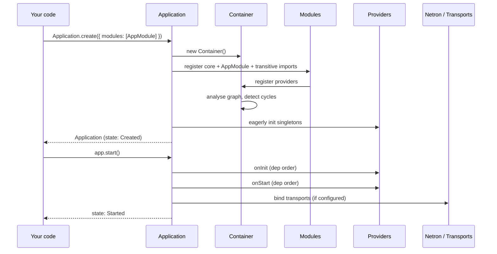

# Bootstrap

Bootstrap is the bridge between "I have a class" and "I have a
running service". Three steps, in this order.



## Step 1 — `Application.create(...)`

Two overloads:

```typescript
// Form 1: module-first.
Application.create(AppModule, options?)

// Form 2: options-only — matches the canonical README example.
Application.create({ modules: [AppModule], ...otherOptions })
```

Aliases:

```typescript
import { createApp, createAndStartApp } from '@omnitron-dev/titan';

createApp           // same as Application.create
createAndStartApp   // create + start in one call (see Step 2)
```

What happens inside `create`:

1. **Application instance** — `new Application(options)` builds the
   instance with its container, lifecycle state machine, module
   registry, and shutdown coordinator.
2. **Main module registration** — if you passed a module class as
   the first argument, it's registered.
3. **Core modules** — unless `disableCoreModules: true`,
   `ConfigModule` and `LoggerModule` are registered.
4. **Auto-discovery** — if `autoDiscovery: true` or `scanPaths` is
   set, modules are discovered from the filesystem (off by default).
5. **Additional modules** — anything in `options.modules` is
   registered next; anything in `options.imports` is imported by
   token.
6. **Root-level providers** — if `options.providers` is set, a
   synthetic root module wraps them and registers each in the
   container.
7. **Eager singleton init** — `container.eagerlyInitialize()` runs
   so cross-module dependencies are resolvable when lifecycle hooks
   fire.

After `create` returns, the container is fully wired but **no
lifecycle hook has fired**. The state is `Created`.

## Step 2 — `app.start()`

```typescript
await app.start();
```

What happens, in order:

1. **State transition** — `Created → Starting`. The lifecycle state
   machine takes over.
2. **`onInit` phase** — every provider that implements `OnInit` (or
   has a `@PostConstruct` method) runs in **dependency order**.
3. **`onStart` phase** — every provider that implements `OnStart`
   runs in dependency order. This is where most modules open
   external connections.
4. **State transition** — `Starting → Started`.

After `start` resolves, every provider has had its `onInit` and
`onStart` called. The application is **live**.

A failure in any phase aborts the start, fires `onStop`/`onDestroy`
for providers that already ran, and rejects with a typed error.

## Step 3 — running

Between `start` and `stop`, the application does almost nothing
itself. The kernel waits, listening for:

- A `stop()` call.
- A bound OS signal (`SIGTERM`, `SIGINT`, `SIGHUP`).
- An uncaught exception or unhandled rejection (configurable).

When one of these fires, the kernel transitions to `Stopping` and
runs the shutdown coordinator (see [Shutdown](./shutdown.md)).

## Useful variants

### `createAndStartApp` — when you want both calls together

```typescript
import { createAndStartApp } from '@omnitron-dev/titan';

const app = await createAndStartApp({
  name:    'my-app',
  version: '1.0.0',
  modules: [AppModule],
});
```

Signature (from the actual source):

```typescript
createAndStartApp(options?: {
  name?:    string;
  version?: string;
  config?:  any;
  modules?: IModule[];
}): Promise<IApplication>;
```

The function calls `createApp(...)`, registers any modules in the
list via `app.use()`, then awaits `app.start()`. Use when you don't
need the intermediate `Created` state.

### `titan()` — the simplest entry point

The Simple API in `@omnitron-dev/titan/application` (re-exported as
the default export of the package) wraps everything:

```typescript
import titan from '@omnitron-dev/titan/application';

const app = await titan(AppModule);
// or
const app = await titan({ port: 3000, redis: 'localhost:6379' });
```

Smart defaults: pretty logging in dev, JSON in prod, graceful
shutdown enabled, scan paths set. Use for prototypes and small apps;
for production stacks, use `Application.create` explicitly so the
configuration is visible.

## Bootstrap diagnostics

Set `debug: true` or `logging: { level: 'debug' }` to see each phase
in the structured log. Look for `phase` and `provider` fields to
trace lifecycle ordering.

## Anti-patterns

- **Calling `start` twice.** It is a no-op after the first
  successful start, but a reliance on idempotency hides bugs.
- **Logging from constructors.** Constructors run during container
  resolution, before `LoggerModule` has fully started. Use `onInit`
  or `onStart` instead.
- **Opening connections in constructors.** Constructors should be
  cheap. Open expensive resources in `onStart`.
- **Catching `start` errors and continuing.** A failed `start`
  leaves the app in `Failed` state. Re-throw and let the supervisor
  restart the process.

→ Next: [Lifecycle](./lifecycle.md).
