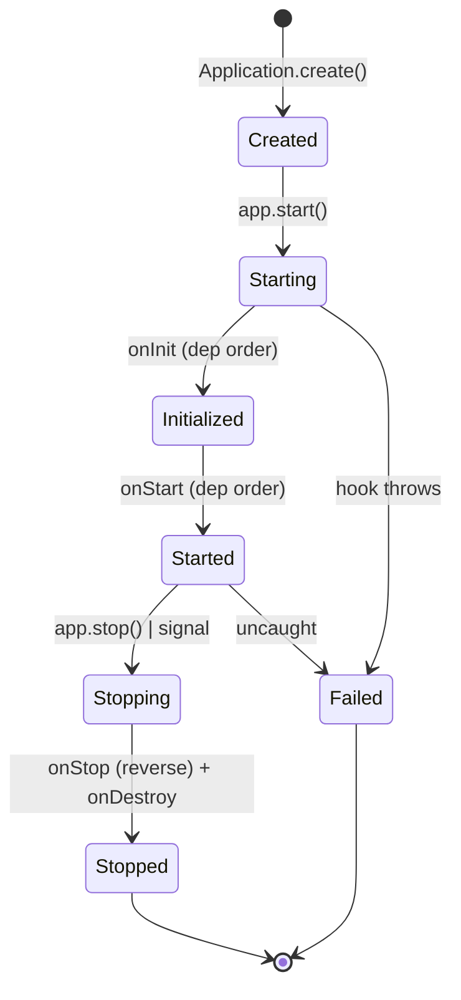

# Lifecycle

Every provider in the container has the option to participate in the
application lifecycle. Four hook interfaces, fired in dependency
order, with typed contracts.

## The four hooks

| Interface     | Method            | Fires when                                                              |
| ------------- | ----------------- | ----------------------------------------------------------------------- |
| `OnInit`      | `onInit()`        | After the container resolves the provider; before `onStart`             |
| `OnStart`     | `onStart()`       | After all `onInit` complete; once the app enters the running state      |
| `OnStop`      | `onStop()`        | When `app.stop()` runs; **reverse** dependency order                    |
| `OnDestroy`   | `onDestroy()`     | Final cleanup phase; after `onStop`                                     |



```typescript
import type { OnInit, OnStart, OnStop, OnDestroy } from '@omnitron-dev/titan';
```

Implement only the ones you need. A provider with no hooks is fine —
it is constructed and used; no lifecycle code runs for it.

## When to use which

- **`onInit`** — work that produces state your *constructor's
  consumers* depend on. Cache warming, schema validation, decoder
  precompilation. Runs before any service that depends on you can
  finish *its* `onInit`.
- **`onStart`** — work that opens external resources or starts
  background activity. Database connection pool, redis client,
  scheduled job registration, file watcher.
- **`onStop`** — close what `onStart` opened. Drain in-flight work.
  Cancel timers.
- **`onDestroy`** — final cleanup. Flush buffers. Write last-state
  to disk. **Do not start new work here.**

## Hook signatures

```typescript
import { Service, Public, type OnInit, type OnStart, type OnStop, type OnDestroy }
  from '@omnitron-dev/titan';

@Service({ name: 'Users', version: '1.0.0' })
export class UsersService
  implements OnInit, OnStart, OnStop, OnDestroy
{
  async onInit(): Promise<void> {
    await this.cache.warm();
  }

  async onStart(): Promise<void> {
    await this.db.connect();
  }

  async onStop(): Promise<void> {
    await this.db.disconnect();
  }

  async onDestroy(): Promise<void> {
    await this.metricsBuffer.flush();
  }
}
```

All four methods may be `async`. The framework awaits each. The
signatures are `() => void | Promise<void>`.

## Decorator-marked hooks

The decorator equivalents to `OnInit` and `OnDestroy` are
`@PostConstruct` and `@PreDestroy`:

```typescript
import { Service, PostConstruct, PreDestroy } from '@omnitron-dev/titan';

@Service({ name: 'Users' })
export class UsersService {
  @PostConstruct()
  async warm() { /* runs once, after construction */ }

  @PreDestroy()
  async drain() { /* runs once, during destruction */ }
}
```

`@PostConstruct` is equivalent to `OnInit.onInit()`; `@PreDestroy`
is equivalent to `OnDestroy.onDestroy()`. For `OnStart` and `OnStop`,
implement the interface form — there are no decorator equivalents,
which is deliberate (the start/stop boundary is semantically
distinct and the interface forces the choice).

## Dependency-order guarantees

Given:

```
A   (no deps)
B   depends on A
C   depends on B
D   depends on A
```

The lifecycle order is:

| Phase     | Order                                                          |
| --------- | -------------------------------------------------------------- |
| `onInit`  | `A`, then `B` and `D` in parallel, then `C`                    |
| `onStart` | Same as `onInit`                                               |
| `onStop`  | `C`, then `B` and `D` in parallel, then `A`                    |
| `onDestroy` | Reverse-order; phased coordination — see [Shutdown](./shutdown.md) |

**Guarantee.** Your `onInit` will not be called until every provider
your constructor depends on has finished `onInit`. Your `onStop` will
be called before any provider your constructor depends on has its
`onStop` called.

## Failure semantics

- **Failure in `onInit` or `onStart`** — startup is aborted. Every
  provider that already completed its `onInit`/`onStart` is rolled
  back via `onStop`/`onDestroy` in reverse order. The `start()`
  promise rejects with a typed error naming the failed provider
  and phase.
- **Failure in `onStop`** — shutdown continues. The failure is
  logged with the failing provider's name; the next provider's
  `onStop` runs. A failed `onStop` should not strand resources held
  by other providers.
- **Failure in `onDestroy`** — same as `onStop`. The phased
  shutdown has a hard timeout regardless; see
  [Shutdown](./shutdown.md).

## Application-level lifecycle hooks

The `IApplication` interface also exposes simple registration
methods for ad-hoc hooks (not tied to a provider):

```typescript
app.onStart(async () => { /* runs during start */ });
app.onStop(async () => { /* runs during stop */ });
app.onError((err) => { /* observe lifecycle errors */ });
```

These are useful for app-level setup that does not belong to any
single module (e.g. binding a third-party SDK).

## Anti-patterns

- **Sleep loops in lifecycle hooks.** If you find yourself writing
  `while (!this.ready) await sleep(100)`, you are inverting the
  dependency. Have whatever is producing readiness be a dependency
  of this provider; the framework will sequence it for you.
- **Cross-provider state in `onInit`.** Reading another provider's
  state during `onInit` is undefined behaviour — the other provider
  may not have finished its own `onInit` yet. Use `onStart` for
  cross-provider state if you must.
- **Throwing for retryable conditions.** A thrown error aborts
  startup. If a database is briefly unavailable at boot, you want
  `onStart` to retry with backoff (use the `computeBackoff` helper
  in `utils/backoff`), not crash the process.
- **Forgetting `onStop`.** Anything you opened in `onStart` must be
  closed in `onStop`. The framework cannot release file descriptors,
  sockets, or timer handles for you.

→ Next: [Shutdown](./shutdown.md).
