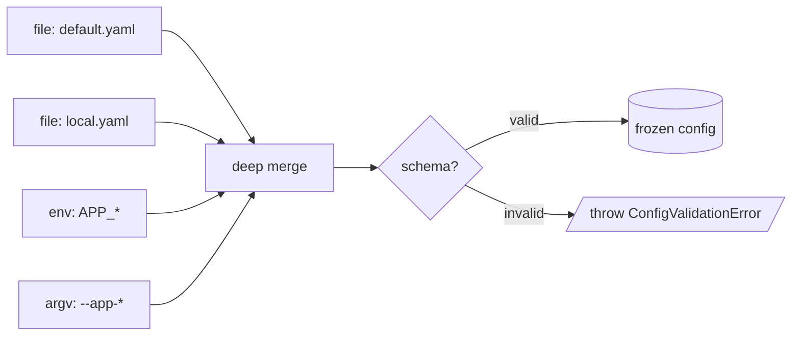

# Configuration Sources

A source produces a partial config object. Multiple sources merge;
the union is what your app sees.

The shapes below are the actual `ConfigSource` union from
`@omnitron-dev/titan/module/config`:

```typescript
type ConfigSource =
  | IFileConfigSource
  | IEnvironmentConfigSource
  | IArgvConfigSource
  | IObjectConfigSource
  | IRemoteConfigSource;
```

## Five built-in source types

### File — JSON / YAML / TOML / INI / .env

```typescript
{
  type:     'file',
  path:     'config/default.yaml',
  format?:  'json' | 'yaml' | 'toml' | 'ini' | 'env',  // auto-detected if omitted
  encoding?: 'utf8',
  transform?: (data) => data,
  optional?: false,
}
```

Reads a file on startup. Format is auto-detected from extension if
`format` is not specified.

### Environment variables

```typescript
{
  type:      'env',
  prefix?:   'APP_',
  separator?: '__',                                   // for nested paths
  transform?: 'lowercase' | 'uppercase' | 'camelCase' | (key, value) => any,
}
```

Env vars matching `prefix` become config keys. `APP_DATABASE__URL`
becomes `database.url` when `separator: '__'`.

### Argv

```typescript
{
  type:    'argv',
  prefix?: '--app-',
}
```

Reads command-line flags.

### Inline object

```typescript
{
  type: 'object',
  data: { port: 3000, debug: true },
}
```

Note `data` (not `value`). A literal object; useful for defaults
that don't warrant a file.

### Remote HTTP

```typescript
{
  type:    'remote',
  url:     'https://config.internal/my-app',
  headers?: { Authorization: 'Bearer …' },
  timeout?: 5_000,
  retry?:   3,
}
```

Fetches config from a URL. Periodic re-fetch is implementation-
defined; check the `ConfigLoaderService` source for current
behaviour.

## Source ordering



Sources merge in the order listed (deep merge — later wins per
leaf key):

```typescript
sources: [
  { type: 'object', data: { db: { url: 'localhost', pool: { max: 10 } } } },
  { type: 'env',    prefix: 'APP_' },        // APP_DB__URL=prod-db
]
// Result: { db: { url: 'prod-db', pool: { max: 10 } } }
```

You can also assign explicit `priority` on the base `IConfigSource`
when natural order is awkward.

## Conventional source layout

A common pattern:

```typescript
ConfigModule.forRoot({
  schema: AppConfigSchema,
  sources: [
    { type: 'file', path: 'config/default.yaml' },
    { type: 'file', path: 'config/local.yaml', optional: true },
    { type: 'env',  prefix: 'APP_' },
  ],
})
```

- `default.yaml` — checked into git, sane defaults.
- `local.yaml` — git-ignored, developer overrides.
- `APP_*` env vars — production secrets, dynamic infra params.

Environment-specific files (`production.yaml`, etc.) can be loaded
by adding an extra source whose `path` is computed at startup from
your app's environment detection.

## Custom sources

Provide your own loader by extending `ConfigLoaderService` or
implementing `IConfigSource` plus a registration shim. The source
interface and loader are in
`@omnitron-dev/titan/module/config/config-loader.service.ts`.

## Anti-patterns

- **Secrets in files committed to git.** `config/default.yaml`
  should not contain production secrets. Use env vars or a secret
  manager.
- **Dynamic config paths from user input.** A config-injection
  vulnerability. Use only static paths or values from trusted
  sources.
- **Big monolithic config.** A 500-line `default.yaml` is hard to
  reason about. Split into per-domain files and load them
  individually.

→ Next: [Validation](./validation.md).
