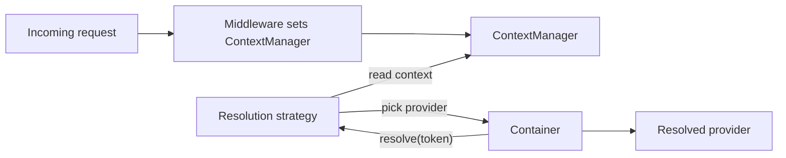

# Contextual Injection

Contextual injection lets a single token resolve to **different
providers** depending on runtime context. Same dependency, different
implementation, chosen per call or per scope.

```typescript
import {
  ContextManager,
  ContextKeys,
  createContextKey,
  InjectContext,
  TenantStrategy,
  RoleBasedStrategy,
  EnvironmentStrategy,
  FeatureFlagStrategy,
  DefaultContextProvider,
  createContextAwareProvider,
  type ContextProvider,
  type ResolutionStrategy,
  type ContextAwareProvider,
} from '@omnitron-dev/titan/nexus';
```

## When you need it

Three scenarios that all reduce to "this dependency depends on who
is asking":

1. **Multi-tenancy.** Tenant A uses a different storage backend
   than tenant B.
2. **Feature flags.** New users get the new payment processor;
   old users get the legacy one.
3. **Per-role behaviour.** Admins see audit-aware queries; regular
   users see plain ones.

Without contextual injection, you would write
`if (tenant === 'X') { useA() } else { useB() }` in every consumer.
Contextual injection moves the decision into the container.

## The pieces



- **`ContextManager`** — request-scoped key/value bag.
- **`ContextKey<T>`** — typed key for one piece of context.
- **`ResolutionStrategy`** — the function that maps context →
  provider choice.
- **`ContextAwareProvider`** — a provider that uses a strategy.

## Built-in strategies

| Strategy                | What it reads                      |
| ----------------------- | ---------------------------------- |
| `TenantStrategy`        | Tenant id from context             |
| `RoleBasedStrategy`     | Current user's role                |
| `EnvironmentStrategy`   | NODE_ENV / config-driven env       |
| `FeatureFlagStrategy`   | Flag query                         |

These compose with the `ContextManager` to drive resolution.

## Defining a context key

```typescript
import { createContextKey } from '@omnitron-dev/titan/nexus';

const TENANT_ID = createContextKey<string>('tenant.id');
const USER_ROLE = createContextKey<string>('user.role');
```

`ContextKeys` is a registry of pre-defined keys the framework uses
(see source for the canonical set).

## Setting context per request

The `ContextManager` interface (a `ContextProvider`) exposes
`get`/`set`/`has`/`delete`/`clear`/`keys`/`toObject`/`createChild`:

```typescript
import { ContextManager } from '@omnitron-dev/titan/nexus';

@Injectable()
class TenantMiddleware {
  constructor(private readonly context: ContextManager) {}

  async handle(ctx: any, next: () => Promise<any>) {
    const tenantId = ctx.headers.get('x-tenant-id');
    this.context.set(TENANT_ID, tenantId);
    return next();
  }
}
```

Inside the request, services that depend on a context-aware token
get the right instance for the tenant.

## Building a context-aware provider

```typescript
import { createContextAwareProvider, TenantStrategy, createToken, Scope } from '@omnitron-dev/titan/nexus';

const STORAGE = createToken<IStorage>('Storage');

const storageProvider = createContextAwareProvider({
  strategy:  TenantStrategy,
  providers: {
    enterprise: { useClass: S3Storage    },
    default:    { useClass: LocalStorage },
  },
  scope:     Scope.Request,
});

container.register(STORAGE, storageProvider);
```

When a consumer resolves `STORAGE`, the strategy reads the current
context (via `ContextManager`), picks the matching provider entry,
and constructs it.

## Composition with scopes

Contextual providers usually live in `Request` scope — the context
varies per request, so the resolution should too. A `Singleton`
contextual provider would resolve once and cache the result,
defeating the purpose.

| Scope         | Behaviour with contextual                                     |
| ------------- | ------------------------------------------------------------- |
| `Singleton`   | Strategy runs once on first resolve; result cached forever    |
| `Request`     | Strategy runs once per request; result cached for the request |
| `Transient`   | Strategy runs every resolve                                   |

`Request` is almost always the right answer.

## `@InjectContext` decorator

Inject the `ContextManager` directly:

```typescript
import { InjectContext } from '@omnitron-dev/titan/nexus';

@Service({ name: 'users' })
class UsersService {
  constructor(@InjectContext() private readonly context: ContextManager) {}

  @Public()
  async whoAmI() {
    return this.context.get(TENANT_ID);
  }
}
```

Use sparingly — reading the context manually in business code
defeats the purpose of contextual injection. The point is that
*services don't know about context*; the container does the
swapping.

## Custom strategies

Implement `ResolutionStrategy`:

```typescript
import type { ResolutionStrategy } from '@omnitron-dev/titan/nexus';

const PaymentTierStrategy: ResolutionStrategy = {
  selectProvider(ctx, providers) {
    const tier = ctx.get(USER_TIER);     // 'free' | 'premium' | …
    return providers[tier] ?? providers['default'];
  },
};
```

## Anti-patterns

- **Contextual for static decisions.** If "which storage" is
  decided at boot, use a regular provider (or
  `EnvironmentStrategy` at registration time). Contextual adds
  runtime cost.
- **Reading context manually inside services.** The point of
  contextual injection is to push the decision into the container.
- **Forgetting to set context.** A strategy that reads `TENANT_ID`
  from a context that was never set returns the default. Make
  sure middleware that sets context runs before the consumer
  resolves.
- **Strategy with side effects.** Strategies are queried during
  resolution; they should be pure functions of the context.

→ Next: [DI Middleware](./middleware.md).
