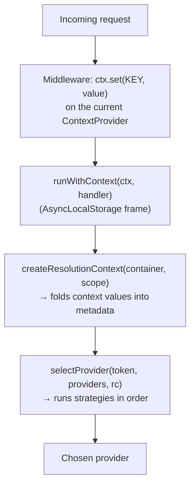

# Contextual Injection

Contextual injection lets a single token resolve to **different
providers** depending on runtime context — the current user, the
active tenant, the environment, or a feature flag. Same dependency,
different implementation, chosen per request or per scope.

The whole subsystem lives in
[`packages/titan/src/nexus/context.ts`](https://github.com/omnitron-dev/omni/blob/main/packages/titan/src/nexus/context.ts).
It has four moving parts:

- **`ContextProvider`** — a key/value bag of context values
  (`get`/`set`/`has`/…), with parent-chained inheritance.
- **`ContextManager`** — owns the active `ContextProvider`
  (isolated per async flow via `AsyncLocalStorage`) and the registry
  of resolution strategies.
- **`ResolutionStrategy`** — `{ name, applies(token, ctx), select(providers, ctx) }`;
  given a candidate array of providers and a `ResolutionContext`, it
  picks one.
- **`ContextAwareProvider`** — `{ provide(ctx), canProvide?(ctx) }`;
  a provider whose value is computed from the resolution context.

```typescript
import {
  ContextKeys,
  InjectContext,
  TenantStrategy,
  ContextManager,
  createContextKey,
  getContextManager,
  RoleBasedStrategy,
  EnvironmentStrategy,
  FeatureFlagStrategy,
  DefaultContextProvider,
  createContextAwareProvider,
  type ContextKey,
  type ContextProvider,
  type ResolutionStrategy,
  type ContextAwareProvider,
} from '@omnitron-dev/titan/nexus';
```

## When you need it

Three scenarios that all reduce to "this dependency depends on who
is asking":

1. **Multi-tenancy.** Tenant A uses a different storage backend
   than tenant B.
2. **Feature flags.** New users get the new payment processor;
   old users get the legacy one.
3. **Per-role behaviour.** Admins see audit-aware queries; regular
   users see plain ones.

Without contextual injection, you would write
`if (tenant === 'X') { useA() } else { useB() }` in every consumer.
Contextual injection moves the decision into the container.

## How resolution threads context


```mermaid
flowchart TD
  Req[Incoming request]
  Set["Middleware: ctx.set(KEY, value)<br/>on the current ContextProvider"]
  Run["runWithContext(ctx, handler)<br/>(AsyncLocalStorage frame)"]
  RC["createResolutionContext(container, scope)<br/>→ folds context values into metadata"]
  Sel["selectProvider(token, providers, rc)<br/>→ runs strategies in order"]
  Resolved[Chosen provider]
  Req --> Set --> Run --> RC --> Sel --> Resolved
```

Two facts about this flow are worth pinning down up front:

1. **Context values live on a `ContextProvider`, not on the
   `ContextManager`.** `ContextManager.getCurrentContext()` returns the
   active `ContextProvider`, and `get`/`set`/`has`/`delete`/`clear`/
   `keys`/`toObject`/`createChild` are all methods on *that* object
   (`context.ts:53-93`).
2. **Strategy selection is an explicit call.** A strategy never runs
   "automatically" on a bare `container.resolve(token)`. The code that
   has several candidate providers for a token calls
   `ContextManager.selectProvider(token, providers, resolutionContext)`,
   which walks the registered strategies and returns one provider
   (`context.ts:377-398`). The `ResolutionContext.metadata` it reads is
   built by `createResolutionContext`, which flattens the current
   `ContextProvider` into a plain object via `toObject()`
   (`context.ts:403-418`).

The four building blocks:

- **`ContextProvider`** — the per-flow key/value bag.
- **`ContextKey<T>`** — typed key for one piece of context.
- **`ResolutionStrategy`** — maps `(candidate providers, context) →
  one provider`.
- **`ContextAwareProvider`** — a provider whose value is computed from
  the resolution context.

## Built-in strategies

| Strategy                | What it reads                      |
| ----------------------- | ---------------------------------- |
| `TenantStrategy`        | Tenant id from context             |
| `RoleBasedStrategy`     | Current user's role                |
| `EnvironmentStrategy`   | NODE_ENV / config-driven env       |
| `FeatureFlagStrategy`   | Flag query                         |

These compose with the `ContextManager` to drive resolution.

## Defining a context key

```typescript
import { createContextKey } from '@omnitron-dev/titan/nexus';

const TENANT_ID = createContextKey<string>('tenant.id');
const USER_ROLE = createContextKey<string>('user.role');
```

`ContextKeys` is a registry of pre-defined keys the framework uses
(see source for the canonical set).

## Setting context per request

The `ContextManager` owns the strategy registry and the active
context. The key/value accessors —
`get`/`set`/`has`/`delete`/`clear`/`keys`/`toObject`/`createChild` —
live on the **`ContextProvider`** returned by `getCurrentContext()`,
so request middleware reaches through the manager to set values:

```typescript
import { ContextManager, ContextKeys } from '@omnitron-dev/titan/nexus';

@Injectable()
class TenantMiddleware {
  constructor(private readonly contextManager: ContextManager) {}

  async handle(ctx: any, next: () => Promise<any>) {
    const tenantId = ctx.headers.get('x-tenant-id');
    // Set on the active ContextProvider, not on the manager itself.
    this.contextManager.getCurrentContext().set(ContextKeys.Tenant, {
      id: tenantId,
      name: tenantId,
    });
    return next();
  }
}
```

To bind a context to one async flow — so concurrent requests don't
see each other's values — wrap the request handler in
`runWithContext`. The active `ContextProvider` is stored in an
`AsyncLocalStorage` frame, so every `getCurrentContext()` call inside
the callback (including across `await`s) sees the same provider
(`context.ts:339-365`):

```typescript
const requestContext = contextManager.createScopedContext();
requestContext.set(ContextKeys.Tenant, { id: 'acme', name: 'Acme' });

await contextManager.runWithContext(requestContext, async () => {
  // Everything here resolves against the `acme` tenant context.
  await handleRequest();
});
```

> The Nexus `Container` holds its own `ContextManager` and a root
> `ContextProvider`. `container.getContext()` returns that provider and
> `container.withContext(fn)` runs `fn` inside the container's context
> frame (`container.ts:2153-2162`) — convenient when you are wiring
> context outside an HTTP layer.

## End-to-end: context-driven provider selection

Here is the full loop, mirroring the integration test in
`test/nexus/context/context.spec.ts`. We populate a request-scoped
context, run a handler inside it, build a `ResolutionContext`, and let
the strategies pick the right provider from a candidate array:

```typescript
import {
  ContextManager,
  ContextKeys,
  Scope,
} from '@omnitron-dev/titan/nexus';

const manager = new ContextManager(); // default strategies pre-registered

// 1. Build the request context and fill it with the facts strategies read.
const requestContext = manager.createScopedContext();
requestContext.set(ContextKeys.User, { id: '1', name: 'Ada', roles: ['admin'] });
requestContext.set(ContextKeys.Tenant, { id: 'tenant1', name: 'Acme' });
requestContext.set(ContextKeys.Environment, 'production');
requestContext.set(ContextKeys.Features, ['newUI']);

// 2. The candidate providers for one logical token. Each carries the
//    discriminator its strategy looks at (environment / tenant / feature /
//    requiredRole). These are plain descriptors, not container registrations.
const providers = [
  { environment: 'development', value: 'dev-service' },
  { environment: 'production', value: 'prod-service' },
];

// 3. Run the handler inside the context, then select.
const chosen = await manager.runWithContext(requestContext, async () => {
  const resolutionContext = manager.createResolutionContext(
    /* container */ undefined,
    Scope.Request,
  );
  // resolutionContext.metadata now contains { user, tenant, environment,
  // features, ... } flattened from the current ContextProvider.

  return manager.selectProvider(SOME_TOKEN, providers, resolutionContext);
});

chosen.value; // 'prod-service' — EnvironmentStrategy matched 'production'
```

Walking the selection (`context.ts:377-398`):

- `selectProvider` short-circuits when there are 0 or 1 candidates.
- Otherwise it iterates strategies **in registration order**
  (`environment`, then `feature-flag`, then `tenant`, then
  `role-based` by default) and calls `applies(token, ctx)` on each.
- The first strategy whose `applies` returns `true` runs
  `select(providers, ctx)`; if that returns a truthy provider, it
  wins. Here `EnvironmentStrategy.applies` is true (metadata has
  `environment`) and its `select` matches `provider.environment ===
  'production'`.
- If no strategy applies (or none selects), it falls back to
  `providers[0]`.

Because `environment` is registered first, it takes precedence over
`tenant` when both could match — registration order is the tie-break.

## Building a context-aware provider

`createContextAwareProvider` is an identity helper over the
`ContextAwareProvider` interface — `{ provide(context), canProvide?(context) }`
(`context.ts:437-454`). It returns its argument unchanged; its only job
is to give you the typed shape. The `provide` callback receives the
active `ResolutionContext` and returns the value (or a Promise of it);
the optional `canProvide` lets a provider opt out of a context:

```typescript
import { createContextAwareProvider } from '@omnitron-dev/titan/nexus';

const storageProvider = createContextAwareProvider<IStorage>({
  provide(context) {
    const tenant = context.metadata?.['tenant'];
    return tenant?.tier === 'enterprise' ? new S3Storage() : new LocalStorage();
  },
  canProvide(context) {
    return context.metadata?.['tenant'] !== undefined;
  },
});

const storage = await storageProvider.provide(resolutionContext);
```

All the branching lives inside `provide`; read whatever you need from
`context.metadata`, which `createResolutionContext` populated from the
current `ContextProvider` via `toObject()` — so a key set as
`ContextKeys.Tenant` (name `'tenant'`) is readable at
`context.metadata['tenant']`.

This is a **distinct** mechanism from `ResolutionStrategy`. A
context-aware provider computes *one* value from the context;
strategies *choose between several* pre-built providers. Use a
context-aware provider when the value is cheap to compute inline; use
strategies (+ `selectProvider`) when you have several concrete
implementations to pick from.

## Composition with scopes

Contextual providers usually live in `Request` scope — the context
varies per request, so the resolution should too. A `Singleton`
contextual provider would resolve once and cache the result,
defeating the purpose.

| Scope         | Behaviour with contextual                                     |
| ------------- | ------------------------------------------------------------- |
| `Singleton`   | Strategy runs once on first resolve; result cached forever    |
| `Request`     | Strategy runs once per request; result cached for the request |
| `Transient`   | Strategy runs every resolve                                   |

`Request` is almost always the right answer. (This assumes you have
wired `selectProvider`/`provide` into a factory registered at that
scope — the scope governs how often that factory re-runs, and the
factory is where the strategy or context-aware `provide` is invoked.)

## `@InjectContext` decorator

`@InjectContext(key)` is a **parameter** decorator that marks a
constructor (or method) parameter to receive a single context
**value**, identified by its `ContextKey` — it does not inject the
`ContextManager`:

```typescript
import { InjectContext, ContextKeys } from '@omnitron-dev/titan/nexus';

@Service({ name: 'users' })
class UsersService {
  constructor(
    @InjectContext(ContextKeys.Tenant) private readonly tenant: { id: string; name: string },
  ) {}

  @Public()
  async whoAmI() {
    return this.tenant?.id;
  }
}
```

Under the hood the decorator only records metadata: it writes the key
into a `context:inject` map keyed by parameter index, via
`Reflect.defineMetadata('context:inject', …)` (`context.ts:424-432`).
The integrating runtime reads that metadata and supplies
`getCurrentContext().get(key)` for the marked parameter. (Plain
`container.resolve()` does not interpret `context:inject` on its own —
it is consumed by the service layer that builds the instance.)

Use it sparingly. Pulling context into business code blurs the line
that contextual injection is meant to draw: ideally a service is
handed the right *implementation* and never inspects the context
itself.

## Custom strategies

Implement `ResolutionStrategy` — `{ name, applies(token, ctx), select(providers, ctx) }`
— and register it with `contextManager.registerStrategy(...)`:

```typescript
import type { ResolutionStrategy } from '@omnitron-dev/titan/nexus';

const PaymentTierStrategy: ResolutionStrategy = {
  name: 'payment-tier',
  applies: (_token, ctx) => ctx.metadata?.['user']?.tier !== undefined,
  select: (providers, ctx) => {
    const tier = ctx.metadata?.['user']?.tier;     // 'free' | 'premium' | …
    return providers.find((p) => p.tier === tier) ?? providers[0];
  },
};
```

`select` receives the candidate provider **array** and the
`ResolutionContext`, and returns the chosen provider. `applies` gates
whether the strategy runs at all for a given token/context.

`registerStrategy` keys strategies by `name`, so registering a
strategy whose name matches a built-in one replaces it; use a fresh
name to add alongside the defaults, or `unregisterStrategy('environment')`
to drop a built-in. Newly registered strategies are appended, so they
are consulted *after* the four defaults — order matters because the
first strategy that both `applies` and returns a provider wins
(`context.ts:316-398`).

## Anti-patterns

- **Contextual for static decisions.** If "which storage" is
  decided at boot, use a regular provider (or
  `EnvironmentStrategy` at registration time). Contextual adds
  runtime cost.
- **Reading context manually inside services.** The point of
  contextual injection is to push the decision into a strategy or
  context-aware provider, not into business logic.
- **Forgetting to set context.** A strategy that reads `tenant` from a
  context that was never set has nothing to match on, so
  `selectProvider` falls back to `providers[0]`. Make sure middleware
  that sets context runs (inside `runWithContext`) before selection
  happens.
- **Strategy with side effects.** Strategies are queried during
  resolution; they should be pure functions of the context.

→ Next: [DI Middleware](./middleware.md).
