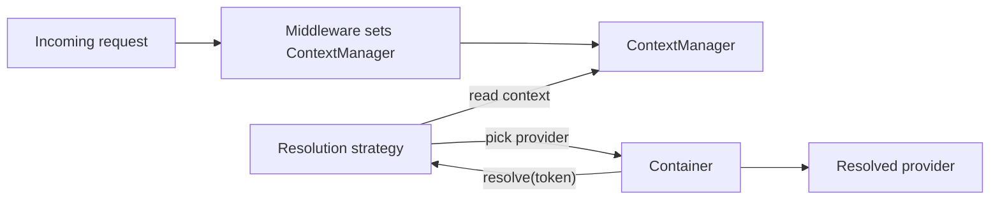

# Contextual Injection

> ⚠️ **NEEDS REWRITE.** Several code samples on this page describe APIs
> that do not match `src/nexus/context.ts`. The verified facts: a
> `ResolutionStrategy` is `{ name, applies(token, ctx), select(providers, ctx) }`;
> `createContextAwareProvider(p)` takes a `{ provide(ctx), canProvide?(ctx) }`
> object (it is an identity helper, *not* a `{ strategy, providers, scope }`
> map); `@InjectContext(key)` injects a single context **value** by
> `ContextKey` (it is not a zero-arg decorator that injects the
> `ContextManager`); and `get`/`set`/`has`/… live on the
> `ContextProvider` returned by `contextManager.getCurrentContext()`,
> not on `ContextManager` itself. The conceptual framing below is
> sound; the concrete snippets need to be re-derived from source before
> relying on them.

Contextual injection lets a single token resolve to **different
providers** depending on runtime context. Same dependency, different
implementation, chosen per call or per scope.

```typescript
import {
  ContextManager,
  ContextKeys,
  createContextKey,
  InjectContext,
  TenantStrategy,
  RoleBasedStrategy,
  EnvironmentStrategy,
  FeatureFlagStrategy,
  DefaultContextProvider,
  createContextAwareProvider,
  type ContextProvider,
  type ResolutionStrategy,
  type ContextAwareProvider,
} from '@omnitron-dev/titan/nexus';
```

## When you need it

Three scenarios that all reduce to "this dependency depends on who
is asking":

1. **Multi-tenancy.** Tenant A uses a different storage backend
   than tenant B.
2. **Feature flags.** New users get the new payment processor;
   old users get the legacy one.
3. **Per-role behaviour.** Admins see audit-aware queries; regular
   users see plain ones.

Without contextual injection, you would write
`if (tenant === 'X') { useA() } else { useB() }` in every consumer.
Contextual injection moves the decision into the container.

## The pieces


```mermaid
flowchart LR
  Req[Incoming request]
  Mw[Middleware sets ContextManager]
  Cm[ContextManager]
  Strat[Resolution strategy]
  Cont[Container]
  Resolved[Resolved provider]
  Req --> Mw --> Cm
  Cont -- "resolve(token)" --> Strat
  Strat -- "read context" --> Cm
  Strat -- "pick provider" --> Cont
  Cont --> Resolved
```

- **`ContextManager`** — request-scoped key/value bag.
- **`ContextKey<T>`** — typed key for one piece of context.
- **`ResolutionStrategy`** — the function that maps context →
  provider choice.
- **`ContextAwareProvider`** — a provider that uses a strategy.

## Built-in strategies

| Strategy                | What it reads                      |
| ----------------------- | ---------------------------------- |
| `TenantStrategy`        | Tenant id from context             |
| `RoleBasedStrategy`     | Current user's role                |
| `EnvironmentStrategy`   | NODE_ENV / config-driven env       |
| `FeatureFlagStrategy`   | Flag query                         |

These compose with the `ContextManager` to drive resolution.

## Defining a context key

```typescript
import { createContextKey } from '@omnitron-dev/titan/nexus';

const TENANT_ID = createContextKey<string>('tenant.id');
const USER_ROLE = createContextKey<string>('user.role');
```

`ContextKeys` is a registry of pre-defined keys the framework uses
(see source for the canonical set).

## Setting context per request

`ContextManager` owns the strategy registry and the active context.
The key/value accessors — `get`/`set`/`has`/`delete`/`clear`/`keys`/
`toObject`/`createChild` — live on the **`ContextProvider`** it returns
from `getCurrentContext()`:

```typescript
import { ContextManager } from '@omnitron-dev/titan/nexus';

@Injectable()
class TenantMiddleware {
  constructor(private readonly contextManager: ContextManager) {}

  async handle(ctx: any, next: () => Promise<any>) {
    const tenantId = ctx.headers.get('x-tenant-id');
    this.contextManager.getCurrentContext().set(TENANT_ID, tenantId);
    return next();
  }
}
```

Inside the request, services that depend on a context-aware token
get the right instance for the tenant.

## Building a context-aware provider

`createContextAwareProvider` is an identity helper over the
`ContextAwareProvider` interface — `{ provide(context), canProvide?(context) }`.
The `provide` callback receives the active `ResolutionContext` and
returns the value (or a Promise of it):

```typescript
import { createContextAwareProvider, ContextKeys } from '@omnitron-dev/titan/nexus';

const storageProvider = createContextAwareProvider<IStorage>({
  provide(context) {
    const tenant = context.metadata?.['tenant'];
    return tenant?.tier === 'enterprise' ? new S3Storage() : new LocalStorage();
  },
});
```

The branching logic lives inside `provide`; read whatever you need
from `context.metadata` (which `ContextManager.createResolutionContext`
populates from the current `ContextProvider`). The built-in
`ResolutionStrategy` classes (`TenantStrategy`, etc.) are a *separate*
mechanism used by `ContextManager.selectProvider()` to pick among
several registered providers — they are not passed into
`createContextAwareProvider`.

## Composition with scopes

Contextual providers usually live in `Request` scope — the context
varies per request, so the resolution should too. A `Singleton`
contextual provider would resolve once and cache the result,
defeating the purpose.

| Scope         | Behaviour with contextual                                     |
| ------------- | ------------------------------------------------------------- |
| `Singleton`   | Strategy runs once on first resolve; result cached forever    |
| `Request`     | Strategy runs once per request; result cached for the request |
| `Transient`   | Strategy runs every resolve                                   |

`Request` is almost always the right answer.

## `@InjectContext` decorator

`@InjectContext(key)` injects a single context **value** by its
`ContextKey` — not the `ContextManager`:

```typescript
import { InjectContext, ContextKeys } from '@omnitron-dev/titan/nexus';

@Service({ name: 'users' })
class UsersService {
  constructor(@InjectContext(ContextKeys.Tenant) private readonly tenant: { id: string }) {}

  @Public()
  async whoAmI() {
    return this.tenant?.id;
  }
}
```

Use sparingly — reading the context manually in business code
defeats the purpose of contextual injection. The point is that
*services don't know about context*; the container does the
swapping.

## Custom strategies

Implement `ResolutionStrategy` — `{ name, applies(token, ctx), select(providers, ctx) }`
— and register it with `contextManager.registerStrategy(...)`:

```typescript
import type { ResolutionStrategy } from '@omnitron-dev/titan/nexus';

const PaymentTierStrategy: ResolutionStrategy = {
  name: 'payment-tier',
  applies: (_token, ctx) => ctx.metadata?.['user']?.tier !== undefined,
  select: (providers, ctx) => {
    const tier = ctx.metadata?.['user']?.tier;     // 'free' | 'premium' | …
    return providers.find((p) => p.tier === tier) ?? providers[0];
  },
};
```

`select` receives the candidate provider **array** and the
`ResolutionContext`, and returns the chosen provider. `applies` gates
whether the strategy runs at all for a given token/context.

## Anti-patterns

- **Contextual for static decisions.** If "which storage" is
  decided at boot, use a regular provider (or
  `EnvironmentStrategy` at registration time). Contextual adds
  runtime cost.
- **Reading context manually inside services.** The point of
  contextual injection is to push the decision into the container.
- **Forgetting to set context.** A strategy that reads `TENANT_ID`
  from a context that was never set returns the default. Make
  sure middleware that sets context runs before the consumer
  resolves.
- **Strategy with side effects.** Strategies are queried during
  resolution; they should be pure functions of the context.

→ Next: [DI Middleware](./middleware.md).
