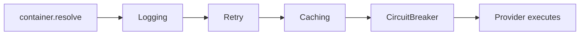

# DI Middleware

DI middleware wraps **container resolution**. It runs at construction
time, not at call time. Use it to add cross-cutting behaviour to how
providers are constructed, not to how their methods are called.

```typescript
import {
  type Middleware,
  type MiddlewareFunction,
  type MiddlewareNext,
  type MiddlewareResult,
  createMiddleware,
  composeMiddleware,
  MiddlewarePipeline,
  // Built-ins
  RetryMiddleware,
  LoggingMiddleware,
  CachingMiddleware,
  RateLimitMiddleware,
  ValidationMiddleware,
  TransactionMiddleware,
  CircuitBreakerMiddleware,
} from '@omnitron-dev/titan/nexus';
```

> **DI middleware ≠ Netron middleware.** This page covers wrapping
> the resolution of providers. For wrapping per-call RPC dispatch,
> see [Netron Middleware](../netron/middleware.md).

## The `Middleware` interface

```typescript
interface Middleware<T = unknown> {
  name:     string;
  execute:  (context: MiddlewareContext<T>, next: () => T | Promise<T>) => T | Promise<T>;
  priority?: number;
  condition?: (context: MiddlewareContext<T>) => boolean;
  onError?:   (error: Error, context: MiddlewareContext<T>) => void;
}
```

`context` carries:

- `token` — the token being resolved.
- `scope` — current resolution scope.
- `parent` — the resolution that triggered this one (depth +
  cycle tracking).

`next()` resolves the provider; call exactly once and return the
value.

## Built-in middleware



| Middleware                 | Purpose                                                   |
| -------------------------- | --------------------------------------------------------- |
| `RetryMiddleware`          | Retry construction if it throws                           |
| `LoggingMiddleware`        | Log every resolution with timing                          |
| `CachingMiddleware`        | Cache resolved instances by token + context               |
| `RateLimitMiddleware`      | Reject resolutions exceeding a threshold                  |
| `ValidationMiddleware`     | Validate resolved instance against a schema               |
| `TransactionMiddleware`    | Wrap resolution in a transaction (DB-aware contexts)      |
| `CircuitBreakerMiddleware` | Open a circuit after consecutive resolution failures      |

The built-ins are factory functions or pre-built middleware objects
exported from `nexus/middleware`. Consult the source for the
constructor signature of each (they accept knob-based options).

## Applying middleware

```typescript
const container = createContainer();

container.useMiddleware([
  LoggingMiddleware({ level: 'debug' }),
  RetryMiddleware({ /* options */ }),
  CachingMiddleware({ /* options */ }),
]);
```

The order in the array is the **outer-to-inner execution order**:
`Logging` runs first, then `Retry`, then `Caching`, then the
provider. The `priority` field on each middleware can override the
array order.

## Custom middleware via `createMiddleware`

```typescript
import { createMiddleware } from '@omnitron-dev/titan/nexus';

const InstrumentationMiddleware = createMiddleware({
  name:    'instrumentation',
  execute: async (ctx, next) => {
    const t0 = performance.now();
    try {
      const instance = await next();
      metrics.histogram('di.resolve.ms', { token: ctx.token.name })
        .observe(performance.now() - t0);
      return instance;
    } catch (e) {
      metrics.counter('di.resolve.errors', { token: ctx.token.name }).inc();
      throw e;
    }
  },
});

container.useMiddleware([InstrumentationMiddleware]);
```

## Composing middleware

`composeMiddleware(middlewares)` produces a single middleware that
chains the inputs. Useful for grouping related middleware as a
single unit.

`MiddlewarePipeline` is the class that drives execution; the
container creates one internally, but you can construct one
yourself if you need to test middleware in isolation.

## Conditional execution

Middleware can opt out per resolution via `condition`:

```typescript
const ExpensiveMiddleware: Middleware = {
  name: 'expensive',
  condition: (ctx) => ctx.token === MY_TOKEN,
  execute: async (ctx, next) => { /* … */ return next(); },
};
```

`condition: false` means skip — `next()` runs directly.

## Per-token middleware

Some middleware suites support per-token application. Check the
specific built-in for whether it accepts a `tokens` filter, and the
provider definition for a `middleware:` field. The exact surface
varies and is documented in the source for each middleware.

## When to write DI middleware

Custom DI middleware is *rare*. The built-ins cover most cases.
Write your own when you need:

- **Project-specific telemetry** — emit to a metrics backend the
  built-ins don't know about.
- **Cross-cutting validation** — assert that every resolved
  provider matches a schema.
- **Tracing instrumentation** — attach a span to every resolution.
- **Test-only middleware** — capture the resolution graph for a
  test assertion.

Most application code does not need DI middleware at all.

## Anti-patterns

- **Putting business logic in DI middleware.** It runs at
  construction time, not per call. Method-call concerns belong in
  Netron middleware.
- **Side effects in middleware.** Middleware should observe and
  decorate, not mutate the application. A middleware that
  registers more providers is a smell.
- **Async work that should be in `onStart`.** Heavy setup belongs
  in lifecycle hooks where the framework can sequence it.

→ Next: [Circular Dependencies](./circular-dependencies.md).
