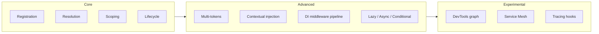

# Dependency Injection

The DI container is the single source of truth for every object in a
Titan application. It is named **Nexus** and ships in the
`@omnitron-dev/titan/nexus` subpath.

```typescript
import { Container, createContainer } from '@omnitron-dev/titan/nexus';
```

This page is the entry point. Mechanics in the per-page references.

## What a DI container does

Three jobs:

1. **Registration** — you tell the container "this token maps to
   this provider".
2. **Resolution** — you ask the container for a token; it constructs
   (or returns the cached instance of) whatever the provider says.
3. **Lifetime** — the container decides when a constructed instance
   is reused, scoped, or disposed.

In a Titan app, you almost never call `container.resolve` yourself.
You declare a class with constructor dependencies; the container
walks the constructor signature, resolves each dependency, and
injects them.

```typescript
@Service({ name: 'users' })
export class UsersService {
  // The container resolves Database and LoggerService from the
  // module's import graph and injects them here.
  constructor(
    private readonly db:     Database,
    private readonly logger: LoggerService,
  ) {}
}
```

## What Nexus brings beyond a basic DI container



- **Multi-tokens** — a single token can hold multiple providers
  (`createMultiToken<T[]>('Validators')`).
- **Contextual injection** — `ContextManager` + strategies
  (`RoleBasedStrategy`, `EnvironmentStrategy`, `FeatureFlagStrategy`,
  `TenantStrategy`) resolve different providers per request /
  tenant / feature flag.
- **DI middleware** — `RetryMiddleware`, `CachingMiddleware`,
  `LoggingMiddleware`, `RateLimitMiddleware`,
  `CircuitBreakerMiddleware`, `ValidationMiddleware`,
  `TransactionMiddleware` wrap resolution itself.
- **Cross-platform** — Node, Bun, Deno, browser. Runtime detection
  via `Runtime`, `detectRuntime()`, `isBun()`, `isNode()`, `isDeno()`,
  `isBrowser()`.
- **Lifecycle hooks** — `LifecycleManager`, `LifecycleEvent`,
  `LifecycleObserver`, plus built-in observers (`AuditObserver`,
  `MemoryObserver`, `PerformanceObserver`).

You do not need to learn a new mental model — Nexus is "DI like you
already know" — but the deeper pages cover the parts that go beyond
the basics.

## A complete example

```typescript
import {
  Container,
  createContainer,
  createToken,
  Scope,
} from '@omnitron-dev/titan/nexus';

interface ILogger {
  info(message: string): void;
}

const LOGGER = createToken<ILogger>('Logger');

class ConsoleLogger implements ILogger {
  info(message: string) { console.log(message); }
}

class UsersService {
  constructor(private readonly logger: ILogger) {}
  list() { this.logger.info('listing users'); return []; }
}

const container = createContainer();

container.register(LOGGER, {
  useClass: ConsoleLogger,
  scope:    Scope.Singleton,
});

container.register(UsersService, {
  useClass: UsersService,
  inject:   [LOGGER],
  scope:    Scope.Singleton,
});

const users = container.resolve(UsersService);
users.list();
```

In a Titan app, you do not write `container.register` calls —
`@Module`, `@Service`, and `@Injectable` translate to the same
registrations behind the scenes.

## What the container guarantees

| Guarantee                                     | Explanation                                                    |
| --------------------------------------------- | -------------------------------------------------------------- |
| **Topological resolution**                    | Dependencies are constructed before dependents                 |
| **Cycle detection**                           | Throws `CircularDependencyError` at resolution time            |
| **Scope correctness**                         | A `Singleton` returns the same instance every time             |
| **Disposal**                                  | `container.dispose()` runs lifecycle teardown                  |
| **Type safety**                               | Tokens are typed; `resolve(LOGGER)` returns `ILogger`          |
| **Async resolution**                          | `resolveAsync<T>(token)` for async providers                   |

## Error types exposed

The Nexus error hierarchy (`NexusError` → specialised subclasses):

| Error class                       | When                                              |
| --------------------------------- | ------------------------------------------------- |
| `RegistrationError`               | Invalid provider registration                     |
| `ResolutionError`                 | Generic resolution failure                        |
| `DependencyNotFoundError`         | Provider for token not registered                 |
| `CircularDependencyError`         | Constructor cycle detected                        |
| `ScopeMismatchError`              | Narrower scope captured in wider scope            |
| `NotInjectableError`              | Class missing the `@Injectable` decoration        |
| `DuplicateRegistrationError`      | Two providers for the same single token           |
| `InvalidProviderError`            | Provider definition malformed                     |
| `InitializationError`             | Provider construction threw                       |
| `AsyncResolutionError`            | Sync `resolve()` on an async provider             |
| `ContainerDisposedError`          | Resolve after dispose                             |
| `DisposalError`                   | Error during teardown                             |
| `NexusAggregateError`             | Multiple errors batched (e.g. parallel disposal)  |
| `ModuleError`                     | Module-level configuration error                  |

## Read the deep pages

| Topic                                         | When to read                                              |
| --------------------------------------------- | --------------------------------------------------------- |
| [Providers](./providers.md)                   | The five provider types and when to use each              |
| [Scopes](./scopes.md)                         | Transient / Singleton / Scoped / Request                  |
| [Tokens](./tokens.md)                         | Class, symbol, multi-, lazy, async, optional tokens       |
| [Multi-injection](./multi-injection.md)       | Plugin patterns, middleware chains                        |
| [Contextual injection](./contextual-injection.md) | Per-request / per-tenant / per-environment              |
| [Middleware](./middleware.md)                 | Wrapping resolution itself                                |
| [Circular Dependencies](./circular-dependencies.md) | Diagnosing and fixing cycles                        |
| [DevTools](./devtools.md)                     | Inspecting the container at runtime                       |

→ Start with [Providers](./providers.md).
