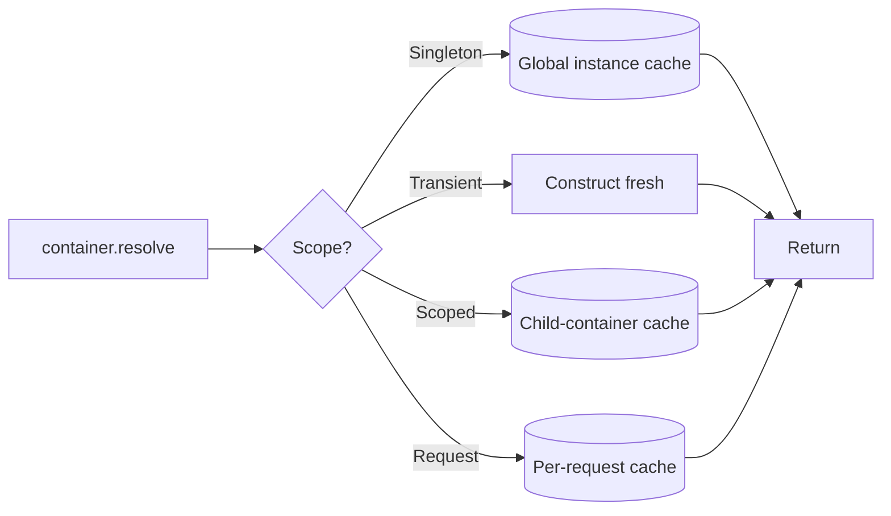

# Scopes

A scope is the container's answer to "when do I make a new instance?"
Nexus has four:

```typescript
import { Scope } from '@omnitron-dev/titan/nexus';

Scope.Transient   // 'transient'
Scope.Singleton   // 'singleton'  (default)
Scope.Scoped      // 'scoped'
Scope.Request     // 'request'
```



| Scope         | New instance per …                                 | Use for                                          |
| ------------- | -------------------------------------------------- | ------------------------------------------------ |
| `Singleton`   | Container (one for the whole app)                  | Stateless services, infra (logger, db pool)      |
| `Transient`   | `resolve()` call (every time)                      | Lightweight value objects, builders              |
| `Scoped`      | Child container scope                              | Per-feature state, request-aware factories       |
| `Request`     | Request scope                                      | Per-request data — current user, request id      |

`Singleton` is the default.

## Singleton

One instance for the lifetime of the container. The container caches
the result of the first `resolve()` and returns it on every
subsequent call.

```typescript
container.register(LOGGER, {
  useClass: ConsoleLogger,
  scope:    Scope.Singleton,        // default; can omit
});
```

**Use for**: stateless services, services that hold shared
infrastructure (pool, client, registry), services with expensive
construction.

**Avoid for**: services that hold per-request state (current user,
transaction handle). Use `Request` instead.

## Transient

A new instance every time the container resolves the token.

```typescript
container.register(REQUEST_BUILDER, {
  useClass: RequestBuilder,
  scope:    Scope.Transient,
});

const a = container.resolve(REQUEST_BUILDER);
const b = container.resolve(REQUEST_BUILDER);
a === b;  // false
```

**Use for**: lightweight value objects (builders, formatters,
short-lived calculators) where instantiation is cheap.

**Avoid for**: services that allocate resources (file handles,
sockets, large caches). Each instance leaks unless explicitly
disposed.

## Scoped

One instance per child container scope. Used to isolate state for a
feature or for a request handler.

```typescript
container.register(FEATURE_STATE, {
  useClass: FeatureState,
  scope:    Scope.Scoped,
});
```

In day-to-day Titan code, `Scoped` overlaps with module-level
encapsulation; you can usually achieve the same isolation by
declaring the provider in the module that owns the scope and not
exporting it.

## Request

One instance per request scope. The container creates a child scope
per request (typically per Netron call); providers in `Request`
scope live exactly as long as that scope.

```typescript
container.register(REQUEST_CONTEXT, {
  useClass: RequestContext,
  scope:    Scope.Request,
});
```

**Use for**:
- Holding the current user (set by auth middleware, read by
  business logic).
- Carrying trace context across handlers within one request.
- Per-request transaction handles in DB modules.

**Avoid for**: shared infrastructure. A `Request`-scoped database
pool would create a new connection per request — exactly what the
pool is meant to prevent.

## Mixing scopes — the "narrower-into-wider" rule

A wider-scoped provider **must not** depend on a narrower-scoped
one. This is a `ScopeMismatchError`:

```typescript
@Service({ name: 'users' })                 // Singleton (wider)
class UsersService {
  constructor(private ctx: RequestContext) {}   // Request (narrower) — invalid
}
```

Why: a singleton lives for the whole app. If it captures a
request-scoped object, that object outlives its scope. Subsequent
requests see stale data.

The fix: inject a *factory* that resolves the narrower scope on
demand, or use `Lazy` (see [Tokens](./tokens.md)).

## Lifetime by scope

| Scope         | Created                       | Disposed                                            |
| ------------- | ----------------------------- | --------------------------------------------------- |
| `Singleton`   | First resolve                 | `container.dispose()`                               |
| `Transient`   | Every resolve                 | Never (caller's responsibility)                     |
| `Scoped`      | First resolve in scope        | Child-scope disposal                                |
| `Request`     | First resolve in request      | End of request                                      |

`Transient` instances are not tracked by the container. If they
hold resources, the caller must dispose them.

## Anti-patterns

- **`Singleton` for per-request state.** Easy mistake; usually
  fixed by wrapping the state in a service that injects a
  `Request`-scoped context.
- **`Transient` for resource-holding services.** Each instance
  leaks. Use `Singleton` or explicit pooling.
- **`Request` for stateless calculators.** Wasteful — a new
  instance per request, with no upside.

→ Next: [Tokens](./tokens.md).
