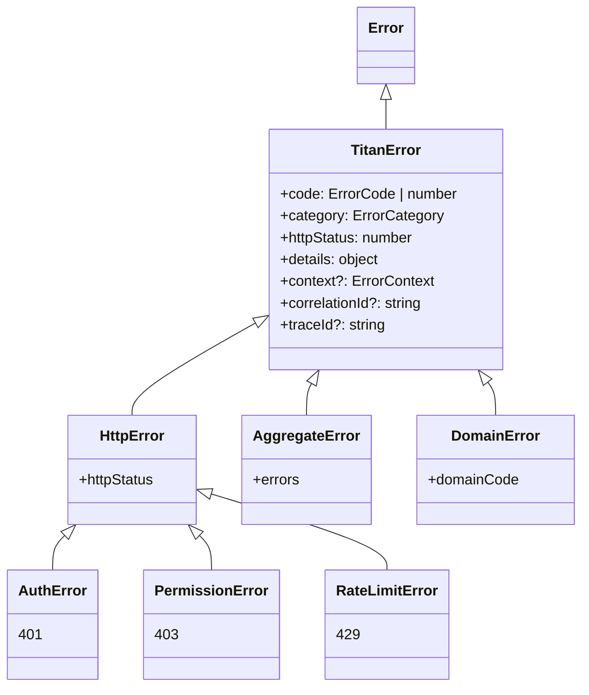

# Error Hierarchy

Titan distinguishes between **classes** (the JavaScript types you
can `instanceof`) and **codes** (the `ErrorCode` enum values that
classify the underlying error). Most errors are instances of
`TitanError` with a specific `ErrorCode`; a few have dedicated
subclasses.

## Class hierarchy



That's the complete class tree.

Errors like "not found" (404), "conflict" (409), "validation" (422)
are **not** separate classes — they are instances of `TitanError`
with `code: ErrorCode.NOT_FOUND`, `ErrorCode.CONFLICT`,
`ErrorCode.VALIDATION_ERROR`. Use the `Errors` namespace to throw
them; use `e.code === ErrorCode.X` to discriminate on the client.

## The narrow subclasses — when class identity matters

Three subclasses are dedicated because they need extra fields beyond
what `TitanError` carries:

### `AuthError` (401)

Authentication failure. Carries auth-specific context (provider,
reason, hints for the client about how to re-authenticate).

```typescript
import { AuthError } from '@omnitron-dev/titan/errors';

// Constructor is positional: (message?, details?, options?)
throw new AuthError('session expired', { reason: 'token_expired', refreshable: true });

// Or use a static factory:
throw AuthError.tokenExpired();
throw AuthError.bearerTokenRequired('api');
throw AuthError.invalidToken('signature mismatch');
```

Catch by `instanceof AuthError` when you want auth-specific
handling (e.g. redirect to login). The third `options` argument
carries `{ authType, realm }` for the `WWW-Authenticate` header.

### `PermissionError` (403)

Authorisation failure — caller is known but lacks the right scope or
role. Carries the missing capability for diagnostics.

```typescript
import { PermissionError } from '@omnitron-dev/titan/errors';

// Constructor is positional: (message?, details?, options?)
throw new PermissionError('users:write scope required', undefined, {
  requiredPermission: 'users:write',
  userPermissions:    ['users:read'],
});

// Or use the static factory:
throw PermissionError.insufficientPermissions('users:write', ['users:read']);
```

### `RateLimitError` (429)

Throttling. Carries the retry-after hint:

```typescript
import { RateLimitError } from '@omnitron-dev/titan/errors';

// Constructor is positional: (message?, details?, options?)
throw new RateLimitError('too many requests', undefined, { retryAfter: 60 }); // seconds

// Or, most commonly, via the factory:
import { Errors } from '@omnitron-dev/titan/errors';
throw Errors.tooManyRequests(60);
```

`options` accepts `{ limit, remaining, resetTime, retryAfter }`;
`getRateLimitHeaders()` renders the matching `X-RateLimit-*` /
`Retry-After` response headers.

### `AggregateError`

Multiple errors batched into one. Useful when a batch operation
partially fails:

```typescript
import { AggregateError, toTitanError, type TitanError } from '@omnitron-dev/titan/errors';

const errors: TitanError[] = [];
for (const item of batch) {
  try {
    await this.processItem(item);
  } catch (e) {
    errors.push(toTitanError(e));
  }
}
if (errors.length > 0) {
  // Constructor is positional: (errors[], options?). Code is MULTIPLE_ERRORS (600),
  // message is auto-generated ("N errors occurred"); pass { deduplicate: true } to
  // collapse identical code+message pairs.
  throw new AggregateError(errors, { deduplicate: true });
}
```

The batched errors are exposed on `.errors`, and a one-line
`.summary`. `TitanError.aggregate(errors, opts?)` is an equivalent
static shortcut.

### `DomainError`

Base for project-specific error classes. Use the `defineDomainCodes`
helper to declare a typed code namespace, then create errors from it:

```typescript
import { defineDomainCodes, DomainError } from '@omnitron-dev/titan/errors';

// Code config keys are `status` (HTTP) + `message` (+ optional `retryable`).
const BillingCodes = defineDomainCodes('BILLING', {
  CARD_DECLINED:        { status: 402, message: 'Payment declined' },
  INSUFFICIENT_BALANCE: { status: 409, message: 'Insufficient balance' },
  FRAUD_DETECTED:       { status: 403, message: 'Fraudulent activity detected' },
});

// BillingCodes.CARD_DECLINED is the string 'BILLING_CARD_DECLINED'.
// DomainError takes { domainCode, httpStatus?, message, details? }.
throw new DomainError({
  domainCode: BillingCodes.CARD_DECLINED,
  httpStatus: 402,
  message:    'Card 4242 declined',
  details:    { last4: '4242', reason: 'do_not_honor' },
});
```

The framework provides `createDomainErrorFactory`,
`createSimpleDomainFactory`, `isDomainCode`, `isDomainError`,
`getDomainCode` helpers for richer typing — see the source for
current signatures.

## The wide use of `ErrorCode`

For everything *not* in the class tree above, use the appropriate
`ErrorCode`:

| Status | Code                       | Throw via                          |
| ------ | -------------------------- | ---------------------------------- |
| 400    | `BAD_REQUEST`              | `Errors.badRequest(...)`           |
| 401    | `UNAUTHORIZED`             | `Errors.unauthorized(...)` or `new AuthError(...)` |
| 403    | `FORBIDDEN`                | `Errors.forbidden(...)` or `new PermissionError(...)` |
| 404    | `NOT_FOUND`                | `Errors.notFound(resource, id?)`   |
| 409    | `CONFLICT`                 | `Errors.conflict(...)` / `Errors.alreadyExists(...)` |
| 422    | `VALIDATION_ERROR`         | `Errors.validation(fields, opts?)` |
| 429    | `TOO_MANY_REQUESTS`        | `Errors.tooManyRequests(retryAfter?)` or `new RateLimitError(...)` |
| 500    | `INTERNAL_ERROR`           | `Errors.internal(...)` (rare; framework usually wraps) |
| 503    | `SERVICE_UNAVAILABLE`      | `Errors.unavailable(...)`          |

The `NetronErrors` namespace covers transport-specific failures:
`serviceNotFound`, `methodNotFound`, `connectionFailed`,
`connectionTimeout`, `connectionClosed`, `transportLost`,
`peerNotFound`, `rpcTimeout`, `invalidRequest`, `streamClosed`,
`serializeEncode`/`serializeDecode`. They produce the matching
`NetronError` subclass (`ServiceNotFoundError`, `TransportError`,
`RpcError`, …) with the appropriate code.

## Discrimination on the client

Two ways, both supported:

```typescript
import { TitanError, ErrorCode, AuthError, PermissionError, RateLimitError }
  from '@omnitron-dev/titan/errors';

catch (e) {
  // By class (works for the four subclasses above + DomainError)
  if (e instanceof AuthError)        return redirectToLogin();
  if (e instanceof PermissionError)  return showForbiddenScreen();
  if (e instanceof RateLimitError)   return backoff(e.details.retryAfter);

  // By code (for everything else)
  if (e instanceof TitanError) {
    switch (e.code) {
      case ErrorCode.NOT_FOUND:        return show404();
      case ErrorCode.CONFLICT:         return showConflict(e.details);
      case ErrorCode.VALIDATION_ERROR: return showFormErrors(e.details);
    }
  }

  // Unknown — re-throw
  throw e;
}
```

Use class-based dispatch when you have a subclass. Use code-based
dispatch for the long tail of `TitanError` variants.

→ Next: [Factories](./factories.md).
