# Migration guides

Coming from another framework or a hand-rolled Node stack? These
guides cover the most common starting points and show what the
equivalent piece looks like in Titan.

The advice across all of them: **migrate one concern at a time**.
Don't try to flip the whole codebase to Titan in one PR. Start
with one of:

- A new feature module — write it Titan-style; everything else
  stays where it is.
- One existing concern (auth, metrics, scheduling) — swap just
  that, leave business logic untouched.
- The bootstrap layer — move the app entry point into Titan's
  `Application.create`; keep your existing services as
  `@Injectable` providers.

## Guides

| Source                                        | What you keep, what you replace                                |
| --------------------------------------------- | -------------------------------------------------------------- |
| [From NestJS](./from-nestjs.md)               | Most concepts map 1:1; the deltas are decorator names, `Netron` for RPC, and lifecycle |
| [From plain Express / Fastify](./from-express.md) | Add structure: module system, DI container, lifecycle, typed RPC |
| [From prom-client](./from-prom-client.md)    | Replace the metrics layer alone — keep everything else        |

## Common patterns regardless of source

### Strangler fig — module by module

The safest migration strategy is the **strangler fig** pattern:

```mermaid
flowchart LR
  subgraph T0["Today"]
    Old1[Legacy: auth]
    Old2[Legacy: orders]
    Old3[Legacy: payments]
    Old4[Legacy: notifications]
  end

  subgraph W1["Week 1"]
    New1[Titan: auth]
    Old2b[Legacy: orders]
    Old3b[Legacy: payments]
    Old4b[Legacy: notifications]
  end

  subgraph W4["Week 4"]
    New1c[Titan: auth]
    New2c[Titan: orders]
    Old3c[Legacy: payments]
    Old4c[Legacy: notifications]
  end

  subgraph W12["Week 12"]
    New1d[Titan: auth]
    New2d[Titan: orders]
    New3d[Titan: payments]
    New4d[Titan: notifications]
  end

  T0 --> W1 --> W4 --> W12
```



At every checkpoint, the app boots, tests pass, prod stays up.

### Boot-time bridging

If your legacy app has its own bootstrap, wrap it with Titan's
`Application.create({ providers: [...] })`:

```typescript
import { Application } from '@omnitron-dev/titan';
import { existingService } from './legacy/services.js';

const app = await Application.create({
  providers: [
    [EXISTING_SERVICE_TOKEN, { useValue: existingService }],
  ],
  modules: [
    NewFeatureModule,                          // new code lives here
  ],
});

await app.start();
```

Legacy code keeps working; new Titan modules can `@Inject` into
it; you migrate at your own pace.

### Two-way bridges

A Titan service can call a legacy function; a legacy function can
call a Titan service via the container. Use this to migrate
incrementally without duplicating logic.

```typescript
// In a Titan service:
constructor(@Inject(LEGACY_PAYMENT_TOKEN) private readonly pay: any) {}

// Or from legacy code:
const titanService = container.resolve(NewService);
await titanService.doSomething();
```

## Testing during migration

Run the new code under the same integration tests as the legacy
code. If you can substitute implementations in DI, you can:

1. Run tests against the legacy implementation — green.
2. Switch the DI binding to the Titan implementation — re-run
   tests — green.
3. Delete the legacy code.

This catches behavioural drift immediately.

## See also

- [Best Practices / Structuring services](../best-practices/structuring-services.md) — where Titan-style services land
- [Modules system / Defining modules](../modules-system/defining-modules.md) — the new unit of composition
- [Testing](../testing/overview.md) — how to verify the migration
