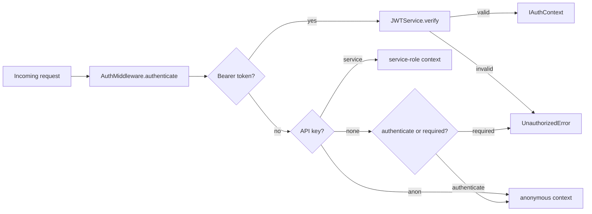

import ModuleBadge from '@site/src/components/ModuleBadge';

# titan-auth

<ModuleBadge origin="official" pkg="@omnitron-dev/titan-auth" status="stable" />

:::info
This page covers the JWT primitives (issuance, verification,
rotation, caching). For the **authorisation** surface
(permissions, roles, ABAC, per-user overrides, RLS bridge,
audit), start at the [Authentication & Authorisation](../../auth/index.md)
section — `titan-auth` is the foundation it builds on.

For migrating from a pre-`pv`-claim deployment, see the
[Auth v1 → v2 migration guide](../migrations/auth-1-to-2.md).
:::

JWT authentication with HS256 / RS256 / ES256 support, remote JWKS,
multi-key rotation via the `kid` header, an LRU token cache, signed-URL
service, and Bearer/API-key middleware. Single self-contained module
that issues, verifies, caches, and rotates.

```bash
pnpm add @omnitron-dev/titan-auth
```

## When you need it

- **Inbound API auth.** Validate Bearer tokens or API keys on every
  RPC call without re-decoding on the hot path.
- **Internal service-to-service.** Use the service-key path for
  trusted machine clients.
- **Signed URLs.** Time-bounded, signed download / webhook URLs that
  don't require server-side session lookup.
- **Zero-downtime key rotation.** Roll signing keys without forcing
  re-login via the `kid` header registry.

## Quickstart

### HS256 (symmetric — simplest)

```typescript
import { TitanAuthModule } from '@omnitron-dev/titan-auth';

@Module({
  imports: [
    TitanAuthModule.forRoot({
      algorithm:    'HS256',
      jwtSecret:    env.JWT_SECRET,
      issuer:       'my-app',
      audience:     'my-api',
      cacheEnabled: true,
      cacheMaxSize: 1_000,
      cacheTTL:     300_000,           // 5 min
    }),
  ],
})
class AppModule {}
```

### RS256 / ES256 with JWKS (external IDP)

```typescript
TitanAuthModule.forRoot({
  algorithm: 'RS256',
  jwksUrl:   'https://auth.example.com/.well-known/jwks.json',
  issuer:    'https://auth.example.com',
  audience:  'my-api',
})
```

The JWKS is lazy-fetched on first verify and cached.

### Async configuration

```typescript
TitanAuthModule.forRootAsync({
  imports:    [ConfigModule],
  useFactory: (config: ConfigService) => ({
    algorithm: 'HS256',
    jwtSecret: config.get('auth.jwtSecret'),
    issuer:    config.get('auth.issuer'),
  }),
  inject: [ConfigService],
})
```

## `IAuthModuleOptions`

| Option              | Type                                  | Default       |
| ------------------- | ------------------------------------- | ------------- |
| `algorithm`         | `'HS256' \| 'RS256' \| 'ES256'`       | `'HS256'`     |
| `jwtSecret`         | `string`                              | —             |
| `jwksUrl`           | `string`                              | —             |
| `issuer`            | `string`                              | —             |
| `audience`          | `string`                              | —             |
| `serviceKey`        | `string` — service-level API key      | —             |
| `anonKey`           | `string` — anonymous API key          | —             |
| `verificationKeys`  | `Record<string, string>` — kid → secret registry for HS256 rotation | — |
| `requireKid`        | `boolean` — reject HS256 tokens without `kid` header | `false` |
| `defaultTenantId`   | `string`                              | `'default'`   |
| `cacheEnabled`      | `boolean`                             | `true`        |
| `cacheMaxSize`      | `number`                              | `1_000`       |
| `cacheTTL`          | `number` (ms)                         | `300_000`     |
| `urlSigningKey`     | `string` (falls back to `jwtSecret`)  | —             |
| `isGlobal`          | `boolean`                             | `false`       |

## `JWTService`

The injected service for verification, context creation, and signed
URL issuing.

```typescript
import { JWT_SERVICE_TOKEN, type IJWTService } from '@omnitron-dev/titan-auth';

@Service({ name: 'admin' })
class AdminService {
  constructor(@Inject(JWT_SERVICE_TOKEN) private readonly jwt: IJWTService) {}

  @Public()
  async whoIs(token: string) {
    return this.jwt.createContext(token);
  }
}
```

### Token verification

| Method                          | Returns                             | Notes                                          |
| ------------------------------- | ----------------------------------- | ---------------------------------------------- |
| `verify(token)`                 | `Promise<IJWTPayload>`              | Cache-first; throws `TokenExpiredError` / `InvalidTokenError` |
| `createContext(token)`          | `Promise<IAuthContext>`             | Convenience — verify + wrap into auth context  |
| `clearCache()`                  | `void`                              | Drop every cached token                        |
| `getCacheStats()`               | `ITokenCacheStats`                  | `{ size, maxSize, hits, misses, hitRate }`     |

### Signed URLs

| Method                                            | Returns               |
| ------------------------------------------------- | --------------------- |
| `createSignedToken(payload, expiresInSeconds)`    | `Promise<string>`     |
| `verifySignedToken(token)`                        | `Promise<ISignedTokenPayload>` |

```typescript
const token = await this.jwt.createSignedToken(
  { resource: `download/${fileId}`, userId },
  3600,                              // 1 hour expiry
);

const url = `https://api.example.com/files/${fileId}?token=${token}`;
```

## `AuthMiddleware`

Extracts credentials from an incoming request, validates them, and
returns an `IAuthContext`.

```typescript
import { AUTH_MIDDLEWARE_TOKEN, type IAuthMiddleware } from '@omnitron-dev/titan-auth';

@Service({ name: 'users' })
class UsersService {
  constructor(@Inject(AUTH_MIDDLEWARE_TOKEN) private readonly auth: IAuthMiddleware) {}

  @Public()
  async whoami(request: IRequestLike) {
    return this.auth.authenticate(request);   // anonymous fallback if no credentials
  }

  @Public()
  async listMine(request: IRequestLike) {
    return this.auth.authenticateRequired(request);   // throws UnauthorizedError if anonymous
  }
}
```

| Method                                 | Returns                              | Notes                                                  |
| -------------------------------------- | ------------------------------------ | ------------------------------------------------------ |
| `authenticate(request)`                | `Promise<IAuthContext>`              | Falls back to anonymous if no credentials present       |
| `authenticateRequired(request)`        | `Promise<IAuthContext>`              | Throws `UnauthorizedError` if no valid credentials      |
| `extractToken(request)`                | `string \| null`                     | Pulls Bearer token from headers                         |
| `validateApiKey(apiKey)`               | `{ valid, type?, context? }`         | Constant-time comparison — defends against timing attacks |

The auth chain: Bearer token (JWT) → service-key API key → anon-key
API key → anonymous context.

## Decorators

```typescript
import {
  RequireAuth,
  RequireServiceAuth,
  RequireAdminAuth,
  RequireRole,
  Public,
} from '@omnitron-dev/titan-auth';
```

### `@RequireAuth(options?)`

```typescript
@Public()
@RequireAuth({ roles: ['admin'], allowAnonymous: false })
async deleteUser(request: IRequestLike, userId: string) {
  // this.__authContext__ is set by the decorator after successful auth
}
```

| Option           | Type       | Default         |
| ---------------- | ---------- | --------------- |
| `roles`          | `string[]` | —               |
| `allowAnonymous` | `boolean`  | `false`         |
| `message`        | `string`   | (default 401)   |

The decorator looks up the middleware on the instance under
`__authMiddleware__`; inject it there. After successful auth, the
resolved context is stored on the instance as `__authContext__`.

### Shorthands

| Decorator                 | Equivalent                                              |
| ------------------------- | ------------------------------------------------------- |
| `@RequireServiceAuth()`   | `@RequireAuth({ roles: ['service_role'] })`             |
| `@RequireAdminAuth()`     | `@RequireAuth({ roles: ['admin', 'service_role'] })`    |
| `@RequireRole(roles, msg?)` | `@RequireAuth({ roles, message: msg })`               |
| `@Public()`               | Skip auth on this method or class                       |

## Multi-key rotation (HS256)

Rotate signing secrets without forcing re-login by registering
multiple keys keyed by `kid`:

```typescript
TitanAuthModule.forRoot({
  algorithm: 'HS256',
  jwtSecret: env.JWT_SECRET_CURRENT,                 // for new tokens
  verificationKeys: {
    '2025-q1': env.JWT_SECRET_OLD_Q1,               // accept tokens signed with old key
    '2025-q2': env.JWT_SECRET_CURRENT,
  },
  requireKid: false,                                  // accept tokens without kid (legacy)
})
```

Resolution order on verify:

1. RS256/ES256 via JWKS if `jwksUrl` is configured.
2. HS256 with `kid` header → look up `verificationKeys`. Unknown
   `kid` rejects.
3. HS256 without `kid` → legacy single-secret path, unless
   `requireKid: true`.

After every active token has expired, drop the retired key from
`verificationKeys` to complete the rotation.

## Auth flow



## Tokens

| Token                       | Purpose                                       |
| --------------------------- | --------------------------------------------- |
| `JWT_SERVICE_TOKEN`         | `JWTService`                                  |
| `AUTH_MIDDLEWARE_TOKEN`     | `AuthMiddleware`                              |
| `SIGNED_URL_SERVICE_TOKEN`  | `JWTService` (same instance, narrower interface) |
| `AUTH_OPTIONS_TOKEN`        | Resolved options bundle                       |

## Lifecycle

Neither service implements explicit lifecycle hooks. JWKS is
lazy-loaded; the token cache is in-memory and trims itself via LRU
eviction.

## Anti-patterns

- **Long `cacheTTL` with frequent token revocation.** Revocation
  bypasses the cache only after `cacheTTL` expires. For high-churn
  revocation lists, lower `cacheTTL` or call `clearCache()` on
  revocation events.
- **Reading `jwtSecret` from a checked-in config.** Always inject
  via env or a secret manager.
- **Skipping `issuer` and `audience` claims.** Without them, a token
  issued for one tenant validates against another. Always pin both.
- **Using `serviceKey` from a browser.** The service key bypasses
  user-scoped policies. Reserve it for trusted machine clients.

## See also

- [Netron Authentication](../netron/authentication.md) — the policy
  framework (`BuiltInPolicies`, `PolicyEngine`) for fine-grained
  authorisation
- [`@RequireAuth`](#requireauthoptions) — vs `@Public({ auth: …  })`
  (the inline form on `@Public`)
