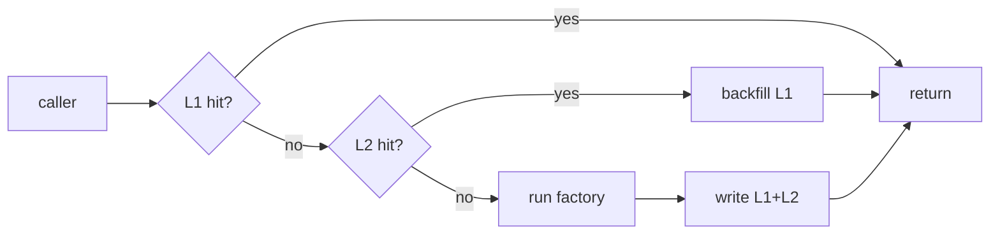

import ModuleBadge from '@site/src/components/ModuleBadge';

# titan-cache

<ModuleBadge origin="official" pkg="@omnitron-dev/titan-cache" status="stable" />

Multi-tier (L1/L2) caching with multiple eviction strategies, tag-based
invalidation, optional compression, atomic `getOrSet`, partition views,
and warming strategies. Single-tier in-memory by default; pluggable L2
(typically Redis) for cross-pod sharing.

```bash
pnpm add @omnitron-dev/titan-cache
```

## When you need it

Three workloads it solves cleanly:

1. **Read-heavy services** — a per-process LRU in front of expensive
   lookups. Cuts database load 10-50× on typical request patterns.
2. **Cross-pod cache coherence** — L1 in each pod for low latency, L2
   in Redis for shared invalidation. Tag-based eviction propagates
   to every pod through L2.
3. **Idempotency tokens** — `getOrSet` is atomic from the caller's
   perspective; a thundering herd of identical requests collapses to
   one factory invocation.

## Quickstart

### Single-tier in-memory

```typescript
import { TitanCacheModule } from '@omnitron-dev/titan-cache';

@Module({
  imports: [
    TitanCacheModule.forRoot({
      maxSize:        5_000,
      defaultTtl:     600,                    // seconds
      evictionPolicy: 'lru',
      enableStats:    true,
    }),
  ],
})
class AppModule {}
```

### Multi-tier (L1 in-memory + L2 Redis)

```typescript
@Module({
  imports: [
    TitanRedisModule.forRoot({ host: 'redis-host' }),
    TitanCacheModule.forRoot({
      multiTier: true,
      l1: { maxSize: 1_000, ttl: 60 },        // hot cache, short TTL
      l2: { client: redisAdapter, ttl: 3600, prefix: 'cache:' },
    }),
  ],
})
class AppModule {}
```

A read hits L1; a miss falls through to L2 and backfills L1. A write
populates both tiers. Tag-based invalidation propagates through L2.

### Async configuration

```typescript
TitanCacheModule.forRootAsync({
  useFactory: (config: ConfigService) => ({
    multiTier: config.get('cache.multiTier'),
    l1: { maxSize: config.get('cache.l1.size'), ttl: config.get('cache.l1.ttl') },
    l2: { client: redisAdapter, ttl: config.get('cache.l2.ttl') },
  }),
  inject: [ConfigService],
})
```

## `ICacheModuleOptions`

| Option                  | Type                                                                        | Default       |
| ----------------------- | --------------------------------------------------------------------------- | ------------- |
| `multiTier`             | `boolean`                                                                   | `false`       |
| `l1`                    | `{ maxSize, ttl }`                                                          | —             |
| `l2`                    | `{ client, ttl, prefix }`                                                   | —             |
| `defaultTtl`            | `number` (seconds)                                                          | `300`         |
| `maxSize`               | `number`                                                                    | `1_000`       |
| `evictionPolicy`        | `'lru' \| 'lfu' \| 'fifo' \| 'random' \| 'ttl'`                             | `'lru'`       |
| `enableStats`           | `boolean`                                                                   | `true`        |
| `statsInterval`         | `number` (ms)                                                               | —             |
| `partitions`            | `ICachePartition[]`                                                         | —             |
| `warmingStrategies`     | `ICacheWarmingStrategy[]`                                                   | —             |
| `useWeakRef`            | `boolean`                                                                   | `false`       |
| `compressionThreshold`  | `number` (bytes)                                                            | `1_024`       |
| `compressionAlgorithm`  | `'none' \| 'gzip' \| 'deflate' \| 'brotli' \| 'lz4'`                        | `'none'`      |
| `ttlCleanupInterval`    | `number` (ms — wheel-timer bucket size)                                     | —             |
| `wheelTimerBuckets`     | `number`                                                                    | —             |
| `staleWhileRevalidate`  | `number` (seconds — SWR window)                                             | —             |
| `backgroundRefresh`     | `boolean`                                                                   | —             |
| `isGlobal`              | `boolean`                                                                   | `false`       |

## `CacheService`

The top-level service exposed via DI. Resolves named caches; creates
ad-hoc ones at runtime; emits / observes lifecycle events.

```typescript
import { CACHE_SERVICE_TOKEN, type ICacheService } from '@omnitron-dev/titan-cache';

@Service({ name: 'users' })
class UsersService {
  constructor(@Inject(CACHE_SERVICE_TOKEN) private readonly cache: ICacheService) {}
}
```

| Method                                                  | Purpose                                          |
| ------------------------------------------------------- | ------------------------------------------------ |
| `getCache<T>(name?)`                                    | Get cache by name (default: `'default'`)         |
| `createCache<T>(name, options?)`                        | Create a new named cache                         |
| `getOrCreateCache<T>(name, options?)`                   | Atomic get-or-create                             |
| `listCaches()`                                          | All cache names                                  |
| `deleteCache(name)`                                     | Remove a cache                                   |
| `getGlobalStats()`                                      | Aggregated stats across every cache              |
| `on(event, listener)` / `off(event, listener)`          | Subscribe / unsubscribe                          |
| `dispose()`                                             | Async cleanup of all caches                      |

## `ICache<T>` — the per-cache surface

```typescript
const users = this.cache.getCache<User>('users');
const user  = await users.getOrSet(`u:${id}`, () => this.repo.findById(id), { ttl: 60 });
```

| Method                                              | Purpose                                                       |
| --------------------------------------------------- | ------------------------------------------------------------- |
| `get(key, options?)`                                | Read; returns `undefined` on miss                             |
| `set(key, value, options?)`                         | Write with optional TTL / tags / compression                  |
| `has(key)`                                          | Existence check — **see TOCTOU note below**                   |
| `getOrSet(key, factory, options?)`                  | Atomic read-through; preferred over `has + get + set`         |
| `delete(key)`                                       | Remove a key                                                  |
| `clear(pattern?)`                                   | Drop all or by string / RegExp pattern                        |
| `invalidateByTags(tags[])`                          | Drop every entry tagged with any of these                     |
| `getMany(keys[])` / `setMany(map, options?)`        | Batch read / write                                            |
| `getStats()` / `resetStats()`                       | Per-cache stats                                               |
| `getEntry(key)`                                     | Read value + metadata (created, hits, tags)                   |
| `keys(pattern?)` / `size()`                         | Enumerate / count                                             |
| `warm(strategies?)`                                 | Preload from configured warming strategies                    |
| `partition(name)`                                   | Get a partition view (isolated key namespace)                 |
| `dispose()`                                         | Async per-cache cleanup                                       |

### TOCTOU note on `has()`

From the source:

> There is a TOCTOU window between `has(key) === true` and a subsequent
> `get(key)` — the entry can expire or be evicted in between, so
> `get()` may return `undefined` even when `has()` just returned `true`.
> If you need to *use* the value, prefer `getOrSet(key, factory)`
> (atomic from the caller's perspective). Reserve `has()` for fast-path
> cardinality checks where the value isn't read afterwards.

## Multi-tier API — `IMultiTierCache<T>` extends `ICache<T>`



Additional methods on a multi-tier cache:

| Method                       | Effect                                       |
| ---------------------------- | -------------------------------------------- |
| `getL1()` / `getL2()`        | Access per-tier cache for advanced ops       |
| `promote(key)`               | Force entry into L1 (preload after eviction) |
| `demote(key)`                | Force entry out of L1 (keep in L2 only)      |
| `sync()`                     | Pull recently-changed L2 entries into L1     |
| `getTierStats(tier)`         | Stats per tier — useful for hit-ratio tuning |

## Decorators

### `@Cacheable(options)` — read-through cache

```typescript
import { Cacheable, CacheKey } from '@omnitron-dev/titan-cache';

@Public()
@Cacheable({ cacheName: 'users', keyPrefix: 'u', ttl: 300, tags: ['users'] })
async findById(@CacheKey() id: string): Promise<User> {
  return this.repo.findById(id);
}
```

| Field          | Type                                                  |
| -------------- | ----------------------------------------------------- |
| `cacheName?`   | `string` — which cache to use                         |
| `keyPrefix?`   | `string`                                              |
| `keyGenerator?`| `(...args) => string`                                 |
| `ttl?`         | `number` (seconds)                                    |
| `tags?`        | `string[] \| ((...args) => string[])`                 |
| `condition?`   | `(...args) => boolean` — skip caching if `false`      |
| `unless?`      | `(result) => boolean` — don't cache certain results   |
| `compress?`    | `boolean` — force compression regardless of size      |

### `@CacheInvalidate(options)` — bust on mutation

```typescript
@CacheInvalidate({ cacheName: 'users', tags: ['users'] })
async update(id: string, patch: Partial<User>): Promise<User> { /* … */ }
```

| Field             | Type                                                       |
| ----------------- | ---------------------------------------------------------- |
| `cacheName?`      | `string`                                                   |
| `keyPattern?`     | `string` — supports `{0}`, `{1}` placeholder substitution  |
| `tags?`           | `string[] \| ((...args) => string[])`                      |
| `allEntries?`     | `boolean` — clear the whole cache                          |
| `beforeInvocation?` | `boolean` — invalidate before the method (default: after) |
| `keyGenerator?`   | `(...args) => string[]`                                    |

### `@CachePut(options)` — write-through cache

Extends `@Cacheable` options; runs the method first and writes the
returned value into the cache. Used when the method itself is the
canonical source.

### `@CacheKey()` — parameter marker

When **any** parameter is marked `@CacheKey()`, only marked parameters
contribute to the auto-generated key. Useful when the method has
auxiliary args (logger, span) you don't want in the key.

### Property injection helpers

| Decorator                  | Effect                                                    |
| -------------------------- | --------------------------------------------------------- |
| `@InjectCacheService()`    | Property decorator — marks the property as the cache service for decorator discovery |
| `@InjectCacheLogger()`     | Property decorator — marks the property as logger for error reporting |

## Tags-based invalidation

Tags are the right primitive for "drop everything related to user `u_42`":

```typescript
@Cacheable({ cacheName: 'users', tags: (id) => [`user:${id}`] })
async findById(id: string) { /* … */ }

@CacheInvalidate({ cacheName: 'users', tags: (id) => [`user:${id}`] })
async updateProfile(id: string, patch: ProfilePatch) { /* … */ }
```

`invalidateByTags(['user:u_42'])` drops every entry tagged
`user:u_42` regardless of key. In multi-tier deployments, tag
invalidation goes through L2 and reaches every pod.

## Compression

For payloads above `compressionThreshold` (default 1 KB), the cache
optionally compresses with the configured `compressionAlgorithm`.
`'none'` is the default — turn it on only when payloads are
demonstrably large and CPU has budget.

```typescript
TitanCacheModule.forRoot({
  compressionAlgorithm: 'lz4',     // fast, modest ratio
  compressionThreshold: 4_096,
})
```

Set `compress: true` on a specific `@Cacheable` to force compression
regardless of size.

## Warming

Pre-populate hot keys at boot, on schedule, or on demand:

```typescript
TitanCacheModule.forRoot({
  warmingStrategies: [
    { trigger: 'onBoot', loader: async () => loadHotKeys() },
    { trigger: 'cron',   schedule: '*/5 * * * *', loader: async () => loadRecent() },
  ],
})

// Or trigger manually
await this.cache.getCache('users').warm();
```

## Partitions

Slice one cache into namespaced views — useful for per-tenant
isolation without separate caches:

```typescript
const users = this.cache.getCache('users');
const tenantUsers = users.partition(tenantId);
await tenantUsers.get('u_42');     // isolated from other tenants
```

## Stats

```typescript
const stats = users.getStats();
// { hits, misses, hitRate, size, bytes, evictions, ... }
```

Per-cache and global. Reset with `resetStats()` after a warmup or
deployment.

## Anti-patterns

- **Caching everything.** Adds invalidation surface for no benefit on
  cold paths. Cache only what you've measured to be hot.
- **`has + get` pattern.** Race condition (TOCTOU). Use `getOrSet`.
- **Skipping `tags` and relying on `clear()`.** `clear()` is a
  carpet bomb — tags target only what you actually want to drop.
- **Putting `Request`-scoped keys in a `Singleton` cache.** Per-user
  data needs per-user keys (`user:${id}`), not per-process keys.
- **Forgetting `defaultTtl`.** Unbounded entries grow until the
  eviction policy kicks in. Always set a TTL appropriate to your
  data's volatility.

## Tokens

| Token                          | Purpose                                          |
| ------------------------------ | ------------------------------------------------ |
| `CACHE_SERVICE_TOKEN`          | Resolve `ICacheService`                          |
| `CACHE_DEFAULT_TOKEN`          | Resolve the default `ICache` instance directly   |
| `CACHE_OPTIONS_TOKEN`          | Resolved options bundle                          |
| `getCacheToken(name)`          | Token for a named cache (advanced injection)     |

## Lifecycle

`CacheService` does not implement explicit `OnInit` / `OnDestroy` —
cleanup runs through its async `dispose()`, which the framework calls
during container teardown. If you create caches dynamically, call
`deleteCache(name)` when done.

## Inter-module dependencies

- Uses `@omnitron-dev/eventemitter` for cache lifecycle events.
- Optional L2 typically uses an adapter built on
  [`titan-redis`](./redis.mdx); the cache module itself does not
  hard-depend on Redis.
- Compresses with Node's `zlib` (built-in) or a pluggable adapter.

## See also

- [`titan-redis`](./redis.mdx) — typical L2 backing
- [`titan-lock`](./lock.mdx) — prevent thundering-herd writes outside `getOrSet`
- [Best Practices / Performance](../best-practices/performance.md)
