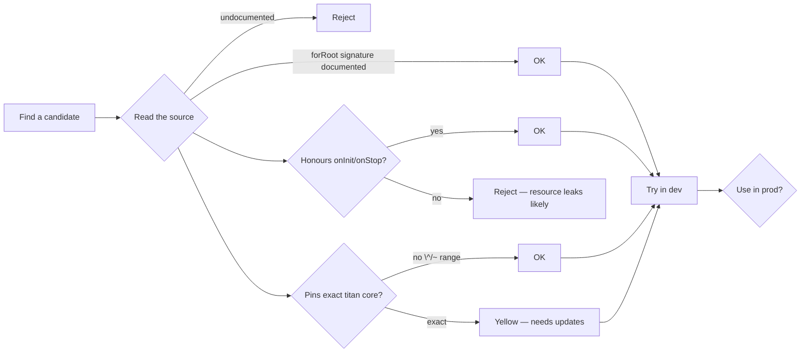

import ModuleBadge from '@site/src/components/ModuleBadge';

# Community Modules

<ModuleBadge origin="community" pkg="@your-scope/titan-yourmodule" />

No community-maintained Titan modules are registered yet. This page
is the canonical home for them as the ecosystem grows.

## What counts as a community module

A community module is a third-party package that:

1. Follows the Titan module conventions — exports a class with
   `.forRoot(...)` (and ideally `.forRootAsync(...)`).
2. Depends on `@omnitron-dev/titan` and (optionally)
   `@omnitron-dev/titan-redis` or other ecosystem modules.
3. Is published to a public registry (npm, GitHub Packages, etc.).
4. Is maintained outside the `omnitron-dev` organisation.

## Adopting a community module — what to check

Specifically:

- **Lifecycle compliance.** Does it implement `OnInit` / `OnStart` /
  `OnStop` / `OnDestroy` properly? Lifecycle violations leak
  resources at shutdown.
- **Token isolation.** Does it export typed tokens for all its
  services? Modules that resolve by string keys are fragile.
- **Configuration validation.** Does the `forRoot` options interface
  have a Zod schema, or does it crash at first use on bad
  configuration?
- **Test coverage.** Does the package ship with a test suite that
  exercises the public API?
- **Maintenance.** When was the last commit? Does the maintainer
  respond to issues?

## Publishing your own

If you build a module worth sharing:

1. **Package convention.** Name it `<your-scope>/titan-<purpose>`
   (e.g. `@acme/titan-stripe`).
2. **Module class.** Export a `XxxModule` class with at least
   `.forRoot(options)`. Add `.forRootAsync(...)` if your
   configuration depends on other providers.
3. **README.** Document the `forRoot` options, the exported
   services and tokens, and a minimal quickstart.
4. **License.** MIT or Apache 2.0 are the friendliest defaults.
5. **Mention us.** Open a PR against `omnitron-dev/omni` adding
   your module to this page. Include the package URL, a one-line
   purpose statement, and a maintenance commitment.

## Future entries

Once community modules are registered, each gets its own page in
this section with a `<ModuleBadge origin="community" ... />`
chip. The reader knows at a glance the module is third-party and
should be audited before adoption.

For the canonical Titan ecosystem, see the [Official
modules](./index.mdx).
