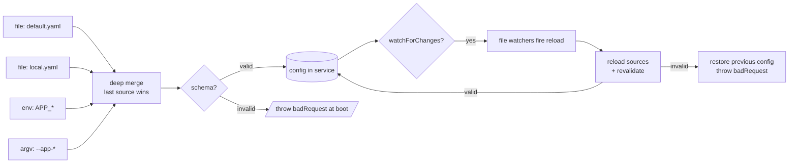
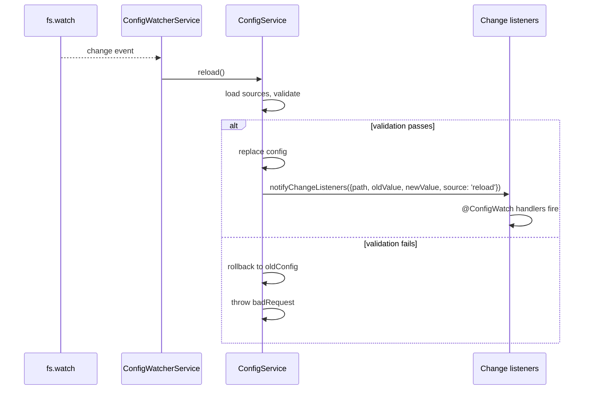

import ModuleBadge from '@site/src/components/ModuleBadge';

# ConfigModule

<ModuleBadge origin="built-in" pkg="@omnitron-dev/titan" subpath="/module/config" status="stable" />

Layered, validated, hot-reloadable configuration. **Auto-loaded** as
a core module by every Titan application (unless `disableCoreModules:
true`). No extra install required — ships inside `@omnitron-dev/titan`.

## When you need it

Every non-trivial backend has configuration that varies by
environment, secret, deploy target. ConfigModule provides:

- **Layered sources** — file defaults under environment overrides
  under env-var overrides under command-line overrides.
- **Schema validation at boot** — misconfiguration fails immediately
  rather than at the first dependent service call.
- **Hot reload** — change file-based config without restarting (use
  for log levels, feature flags, anything safe to swap live).
- **Typed injection** — `@Config('database.url')` returns the
  schema's type, not `string | undefined`.
- **Atomic reload** — if reload's validation fails, the old config
  stays in place; no half-updated state.

## Quickstart

```typescript
import { z } from '@omnitron-dev/titan/validation';
import { ConfigModule } from '@omnitron-dev/titan/module/config';

const AppConfigSchema = z.object({
  port:     z.number().int().min(1).max(65535),
  database: z.object({ url: z.string().url() }),
  cache:    z.object({ ttlMs: z.number().int().positive().default(60_000) }),
});

@Module({
  imports: [
    ConfigModule.forRoot({
      schema:  AppConfigSchema,
      sources: [
        { type: 'file', path: 'config/default.yaml' },
        { type: 'file', path: 'config/local.yaml', optional: true },
        { type: 'env',  prefix: 'APP_' },
      ],
      validateOnStartup: true,
      watchForChanges:   true,
    }),
  ],
})
class AppModule {}
```

## `IConfigModuleOptions`

| Option              | Type                                                |
| ------------------- | --------------------------------------------------- |
| `sources`           | `ConfigSource[]` (priority — last wins)             |
| `schema`            | `AnyZodSchema`                                      |
| `environment`       | `string` (default: `process.env.NODE_ENV`)         |
| `validateOnStartup` | `boolean`                                           |
| `watchForChanges`   | `boolean`                                           |
| `cache`             | `{ enabled, ttl? }` — TTL in ms                    |
| `strict`            | `boolean` — throw on missing required values        |
| `logger`            | `any`                                               |
| `global`            | `boolean`                                           |

> **Priority order matters.** Sources are processed first-to-last;
> later sources override earlier ones during deep merge. Put
> committed defaults first, dev overrides second, environment-
> sourced secrets last.

## `ConfigSource` union

The five source types each have an explicit shape:

```typescript
type ConfigSource =
  | { type: 'file';   path, format?, encoding?, transform?, optional? }
  | { type: 'env';    prefix?, separator?, transform? }
  | { type: 'argv';   prefix? }
  | { type: 'object'; data }                                  // ← `data`, not `value`
  | { type: 'remote'; url, headers?, timeout?, retry? };
```

Files auto-detect format by extension (`json`, `yaml`, `toml`,
`ini`, `env`). Env vars become nested paths via `separator`
(default `'__'`).

→ See [Configuration / Sources](../configuration/sources.md) for
the full per-source reference.

## Services

| Class                       | Purpose                                                |
| --------------------------- | ------------------------------------------------------ |
| `ConfigService`             | Main API — `get`, `set`, `has`, `delete`, `onChange`, `reload`, `validate`, … |
| `ConfigLoaderService`       | Loads from sources at startup                          |
| `ConfigValidatorService`    | Runs the schema(s)                                     |
| `ConfigWatcherService`      | Hot-reload watcher (when `watchForChanges: true`)      |

### `ConfigService` API

```typescript
import { Inject, Service } from '@omnitron-dev/titan';
import { ConfigService, CONFIG_SERVICE_TOKEN } from '@omnitron-dev/titan/module/config';

@Service('users@1.0.0')
class UsersService {
  constructor(@Inject(CONFIG_SERVICE_TOKEN) private readonly config: ConfigService) {}

  @Public()
  async findById(id: string) {
    const ttl = this.config.get<number>('cache.ttlMs', 60_000);
    return this.cache.getOrSet(`u:${id}`, () => this.repo.findById(id), { ttl });
  }
}
```

| Method                          | Purpose                                                  |
| ------------------------------- | -------------------------------------------------------- |
| `get<T>(path, defaultValue?)`   | Read a typed value at the dotted path                    |
| `set(path, value)`              | Write at runtime (not persisted)                         |
| `has(path)`                     | Existence check                                          |
| `getAll()`                      | Snapshot of the full config object                       |
| `getTyped<T>(schema, path?)`    | Validated read — runs the schema against `path`-subtree |
| `validate(schema?)`             | Validate against a schema (returns `IConfigValidationResult`) |
| `reload()`                      | Force re-load all sources; rolls back on validation fail |
| `onChange(listener)`            | Subscribe to changes; returns `unsubscribe` function     |
| `getMetadata()`                 | Source attribution, loaded-at timestamps                 |
| `environment` (getter)          | The configured environment string                        |

## Decorators

```typescript
import {
  Config, InjectConfig, ConfigSchema, Configuration,
  ConfigValidate, ConfigWatch, ConfigDefaults,
  ConfigProvider, ConfigTransform,
} from '@omnitron-dev/titan/module/config';
```

| Decorator                  | Effect                                                  |
| -------------------------- | ------------------------------------------------------- |
| `@Config(path, default?)`  | Inject a single value                                   |
| `@InjectConfig()`          | Inject the full `ConfigService`                         |
| `@ConfigSchema(schema)`    | Class-level Zod schema for this class's config subtree  |
| `@Configuration(prefix?)`  | Bind a class as a typed view of a config subtree        |
| `@ConfigValidate(schema)`  | Method-level validation of one config subtree           |
| `@ConfigWatch(path)`       | Method runs when the watched path changes               |
| `@ConfigDefaults({...})`   | Provide class-level defaults                            |
| `@ConfigProvider(name)`    | Custom config provider class                            |
| `@ConfigTransform(fn)`     | Property-level value transformer                        |

```typescript
@Service('users@1.0.0')
class UsersService {
  @Config('cache.ttlMs', 60_000)
  private readonly cacheTtl!: number;

  @InjectConfig()
  private readonly config!: ConfigService;

  @ConfigWatch('cache.ttlMs')
  async onCacheTtlChange(newTtl: number) {
    this.cache.setDefaultTtl(newTtl);
  }
}
```

### Bound configuration class

```typescript
@Configuration('cache')
class CacheConfig {
  @Config('ttlMs', 60_000)    ttlMs!: number;
  @Config('maxItems', 10_000) maxItems!: number;
}

// Inject the typed view directly:
constructor(private readonly cache: CacheConfig) {}
```

`@Configuration` is the most ergonomic pattern for a service that
needs many config values — the typed class doubles as documentation
of what config it consumes.

## Tokens

| Token                              | Purpose                              |
| ---------------------------------- | ------------------------------------ |
| `CONFIG_SERVICE_TOKEN`             | Inject `ConfigService`               |
| `CONFIG_LOADER_SERVICE_TOKEN`      | Inject `ConfigLoaderService`         |
| `CONFIG_VALIDATOR_SERVICE_TOKEN`   | Inject `ConfigValidatorService`      |
| `CONFIG_WATCHER_SERVICE_TOKEN`     | Inject `ConfigWatcherService`        |
| `CONFIG_OPTIONS_TOKEN`             | Resolved options bundle              |
| `CONFIG_SCHEMA_TOKEN`              | Global schema                        |

## Source merge + validation pipeline



### Atomic reload semantics

`reload()` is **atomic**: when validation fails after a reload, the
service rolls back to the previous config snapshot and throws. You
never see a half-updated config inside `ConfigService.get` mid-call.

```typescript
try {
  await config.reload();
} catch (e) {
  // Validation failed; the previous config is still active.
  // Log and alert; the running app is not broken.
  logger.error({ err: e }, 'config reload validation failed');
}
```

## Multi-environment scaffold

A common production layout for layered config:

```
config/
├── default.yaml          # committed, shared defaults
├── development.yaml      # committed, dev overrides
├── staging.yaml          # committed, staging overrides
├── production.yaml       # committed, prod-safe non-secrets
└── local.yaml            # git-ignored, per-developer
```

Wire it up:

```typescript
const env = process.env.NODE_ENV ?? 'development';

ConfigModule.forRoot({
  schema:      AppConfigSchema,
  environment: env,
  sources: [
    { type: 'file', path: 'config/default.yaml' },
    { type: 'file', path: `config/${env}.yaml`,  optional: false },
    { type: 'file', path: 'config/local.yaml',    optional: true },
    { type: 'env',  prefix: 'APP_' },
    { type: 'argv', prefix: 'app-' },
  ],
  validateOnStartup: true,
  watchForChanges:   env !== 'production',
});
```

Priority (low → high): defaults → env-specific → local-dev →
process env → CLI argv. Secrets always come from `env` or `argv`,
never from any committed file.

## Remote config source

The `'remote'` source fetches from an HTTP endpoint at boot:

```typescript
sources: [
  { type: 'file', path: 'config/default.yaml' },
  { type: 'remote',
    url:     'https://config-server.internal/api/configs/my-api',
    headers: { authorization: `Bearer ${process.env.CONFIG_TOKEN}` },
    timeout: 5_000,
    retry:   { attempts: 3, delay: 1_000 },
  },
  { type: 'env', prefix: 'APP_' },
],
```

The loader:
- Tries `attempts` times on transport failure.
- Waits `delay` ms between attempts (exponential backoff if your
  loader is so configured).
- After exhaustion, throws — boot aborts.

For consumers that may be partitioned from the config server,
combine a remote source with a file fallback:

```typescript
sources: [
  { type: 'file',   path: 'config/default.yaml' },
  { type: 'remote', url, optional: true },     // skipped on failure
],
```

When `optional: true`, a remote-source failure is logged and the
boot continues with file defaults only.

## Validation error UX

Schema failure on boot raises `Errors.badRequest('Configuration
validation failed', { errors: [...] })` where each error is:

```typescript
interface ConfigValidationError {
  path:     string;       // e.g., 'database.url'
  message:  string;       // human-readable
  expected?: string;
  received?: string;
}
```

For operator-friendly boot diagnostics, catch and format:

```typescript
try {
  await Application.create({ modules: [AppModule] });
} catch (e) {
  if (e?.code === 'BAD_REQUEST' && e.details?.errors) {
    console.error('Configuration is invalid:');
    for (const err of e.details.errors) {
      console.error(`  ${err.path}: ${err.message}`
        + (err.expected ? ` (expected ${err.expected}, got ${err.received})` : ''));
    }
    process.exit(1);
  }
  throw e;
}
```

## Deep-merge edge cases

The merger is recursive but predictable:

| Case                                | Behaviour                                                |
| ----------------------------------- | -------------------------------------------------------- |
| Object × Object                     | Recursive merge, last-write-wins per key                 |
| Array × Array                       | **Replace**, not concat (avoids accumulating defaults)   |
| Primitive × undefined               | Keep the primitive                                       |
| Primitive × null                    | `null` wins — explicit "remove" semantics                |
| Object × Primitive                  | Primitive replaces the object (type change is allowed)   |
| Forbidden keys (`__proto__` etc.)   | Silently skipped — prototype-pollution guard             |

The forbidden-key guard is non-configurable; the keys are
`__proto__`, `constructor`, `prototype`. Any source that tries to
set them is ignored.

## Cache semantics

```typescript
ConfigModule.forRoot({
  // ...
  cache: { enabled: true, ttl: 5_000 },
});
```

When enabled, `get(path)` results are cached for `ttl` ms — useful
when many components read the same value on every request. The
cache is cleared on every successful `reload()` and on `set()`
to the affected path.

Skip the cache for paths that change often via `set()` — the
clear-on-write hits the entire cache, not just the changed path,
so per-write thrashing can defeat the optimisation.

## Strict mode

```typescript
ConfigModule.forRoot({ strict: true });
```

When `strict: true`, `get(path)` without a `defaultValue` throws
on a missing path instead of returning `undefined`. Combines well
with `validateOnStartup: true` to make every missing required value
loud at boot rather than silent at first-use.

## Conventional layout

```typescript
ConfigModule.forRoot({
  schema: AppConfigSchema,
  sources: [
    { type: 'file', path: 'config/default.yaml' },                  // committed defaults
    { type: 'file', path: 'config/local.yaml', optional: true },    // git-ignored dev overrides
    { type: 'env',  prefix: 'APP_' },                               // production secrets / per-pod overrides
  ],
  validateOnStartup: true,
  watchForChanges:   process.env.NODE_ENV !== 'production',
})
```

## Watcher cascade

When `watchForChanges: true`, the `ConfigWatcherService` opens an
fs-watch on every file source. On change:



Watch is debounced internally — a burst of changes (e.g., editor
save with multiple write events) coalesces to one reload.

## Lifecycle

| Hook        | What it does                                                |
| ----------- | ----------------------------------------------------------- |
| `onInit`    | Load all sources in order; deep-merge; validate             |
| `onStart`   | If `watchForChanges`, start file watchers                   |
| `onStop`    | `watcher.unwatch()`                                         |
| `onDestroy` | `watcher.unwatch()` again (idempotent)                      |

If validation fails in `onInit`, the app aborts boot with the
underlying error wrapped — no partial start.

## Anti-patterns

- **Secrets in committed files.** `default.yaml` should not
  contain production secrets. Use env vars or a secret manager.
- **No schema.** Without a schema, misconfiguration surfaces at the
  first dependent service call — typically in production, in a
  rare code path. Schema-validate at boot.
- **Hot-reloading connection strings.** A live database URL swap
  cannot rebind an open connection pool. Reserve hot-reload for
  log levels, feature flags, and similar safe-to-swap values.
- **Reading `process.env` in services.** Defeats the layered
  source merge and breaks tests. Read through `ConfigService` /
  `@Config`.
- **Mutating `getAll()` output.** It's a snapshot — mutations
  don't propagate and surprise the next reader. Use `set(path,
  value)` for runtime writes.
- **`watchForChanges: true` in containers where files don't
  change.** The fs watcher idle-runs forever doing nothing.
  Disable in production unless you actually deploy config to the
  pod's filesystem.
- **Treating `set()` as persistent.** It modifies the in-memory
  config only. The next `reload()` reverts it. For persistent
  changes, edit the source file.

## See also

- [Configuration / Overview](../configuration/overview.md) —
  conceptual guide
- [Configuration / Sources](../configuration/sources.md) — per-
  source shape and merge order
- [Configuration / Validation](../configuration/validation.md) —
  schema patterns and error handling
- [Configuration / Hot Reload](../configuration/hot-reload.md) —
  `config:changed` event flow
- [Options patterns](./options-patterns.mdx) — wiring other modules
  through `ConfigService` via `forRootAsync`
- [Tokens & RPC reference](./tokens-reference.mdx) — token inventory
