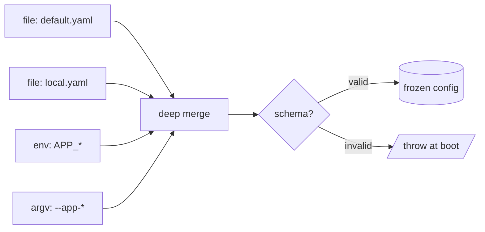

import ModuleBadge from '@site/src/components/ModuleBadge';

# ConfigModule

<ModuleBadge origin="built-in" pkg="@omnitron-dev/titan" subpath="/module/config" status="stable" />

Layered, validated, hot-reloadable configuration. **Auto-loaded** as
a core module by every Titan application (unless `disableCoreModules:
true`). No extra install required — ships inside `@omnitron-dev/titan`.

## When you need it

Every non-trivial backend has configuration that varies by
environment, secret, deploy target. ConfigModule provides:

- **Layered sources** — file defaults under environment overrides
  under env-var overrides under command-line overrides.
- **Schema validation at boot** — misconfiguration fails immediately
  rather than at the first dependent service call.
- **Hot reload** — change file-based config without restarting (use
  for log levels, feature flags, anything safe to swap live).
- **Typed injection** — `@Config('database.url')` returns the
  schema's type, not `string | undefined`.

## Quickstart

```typescript
import { z } from '@omnitron-dev/titan/validation';
import { ConfigModule } from '@omnitron-dev/titan/module/config';

const AppConfigSchema = z.object({
  port:     z.number().int().min(1).max(65535),
  database: z.object({ url: z.string().url() }),
  cache:    z.object({ ttlMs: z.number().int().positive().default(60_000) }),
});

@Module({
  imports: [
    ConfigModule.forRoot({
      schema:  AppConfigSchema,
      sources: [
        { type: 'file', path: 'config/default.yaml' },
        { type: 'file', path: 'config/local.yaml', optional: true },
        { type: 'env',  prefix: 'APP_' },
      ],
      validateOnStartup: true,
      watchForChanges:   true,
    }),
  ],
})
class AppModule {}
```

## `IConfigModuleOptions`

| Option              | Type                                                |
| ------------------- | --------------------------------------------------- |
| `sources`           | `ConfigSource[]`                                    |
| `schema`            | `AnyZodSchema`                                      |
| `environment`       | `string`                                            |
| `validateOnStartup` | `boolean`                                           |
| `watchForChanges`   | `boolean`                                           |
| `cache`             | `{ enabled, ttl? }`                                 |
| `strict`            | `boolean` — throw on missing required values        |
| `logger`            | `any`                                               |
| `global`            | `boolean`                                           |

## `ConfigSource` union

The five source types each have an explicit shape:

```typescript
type ConfigSource =
  | { type: 'file';   path, format?, encoding?, transform?, optional? }
  | { type: 'env';    prefix?, separator?, transform? }
  | { type: 'argv';   prefix? }
  | { type: 'object'; data }                          // ← `data`, not `value`
  | { type: 'remote'; url, headers?, timeout?, retry? };
```

Files auto-detect format by extension (`json`, `yaml`, `toml`,
`ini`, `env`). Env vars become nested paths via `separator`
(default `'__'`).

→ See [Configuration / Sources](../configuration/sources.md) for
the full per-source reference.

## Services

| Class                       | Purpose                                                |
| --------------------------- | ------------------------------------------------------ |
| `ConfigService`             | Main API — `get`, `set`, `has`, `delete`, `watch`, `validate`, etc. |
| `ConfigLoaderService`       | Loads from sources at startup                          |
| `ConfigValidatorService`    | Runs the schema(s)                                     |
| `ConfigWatcherService`      | Hot-reload watcher (when `watchForChanges: true`)      |

### `ConfigService` API

```typescript
import { Inject, Service } from '@omnitron-dev/titan';
import { ConfigService, CONFIG_SERVICE_TOKEN } from '@omnitron-dev/titan/module/config';

@Service({ name: 'users' })
class UsersService {
  constructor(@Inject(CONFIG_SERVICE_TOKEN) private readonly config: ConfigService) {}

  @Public()
  async findById(id: string) {
    const ttl = this.config.get<number>('cache.ttlMs', 60_000);
    return this.cache.getOrSet(`u:${id}`, () => this.repo.findById(id), { ttl });
  }
}
```

| Method                         | Purpose                                                  |
| ------------------------------ | -------------------------------------------------------- |
| `get<T>(path?, defaultValue?)` | Read a typed value at the dotted path                    |
| `set(path, value)`             | Write at runtime (not persisted)                         |
| `has(path)`                    | Existence check                                          |
| `delete(path)`                 | Remove a key                                             |
| `watch(path, callback)`        | Subscribe to changes at a path                           |
| `reload()`                     | Force re-load all sources                                |
| `validate(schema)`             | Validate against a schema (returns result)               |
| `getAll()`                     | Snapshot of the full config object                       |
| `getMetadata()`                | Source attribution per key, last-loaded timestamps       |

## Decorators

```typescript
import {
  Config, InjectConfig, ConfigSchema, Configuration,
  ConfigWatch, ConfigDefaults, ConfigProvider,
} from '@omnitron-dev/titan/module/config';
```

| Decorator                  | Effect                                                  |
| -------------------------- | ------------------------------------------------------- |
| `@Config(path, default?)`  | Inject a single value                                   |
| `@InjectConfig()`          | Inject the full `ConfigService`                         |
| `@ConfigSchema(schema)`    | Class-level Zod schema for this class's config subtree  |
| `@Configuration(prefix?)`  | Bind a class as a typed view of a config subtree        |
| `@ConfigWatch(path)`       | Method runs when the watched path changes               |
| `@ConfigDefaults({...})`   | Provide class-level defaults                            |
| `@ConfigProvider(name)`    | Custom config provider class                            |

```typescript
@Service({ name: 'users' })
class UsersService {
  @Config('cache.ttlMs', 60_000)
  private readonly cacheTtl!: number;

  @InjectConfig()
  private readonly config!: ConfigService;

  @ConfigWatch('cache.ttlMs')
  async onCacheTtlChange(newTtl: number) {
    this.cache.setDefaultTtl(newTtl);
  }
}
```

## Tokens

| Token                              | Purpose                              |
| ---------------------------------- | ------------------------------------ |
| `CONFIG_SERVICE_TOKEN`             | Inject `ConfigService`               |
| `CONFIG_LOADER_SERVICE_TOKEN`      | Inject `ConfigLoaderService`         |
| `CONFIG_VALIDATOR_SERVICE_TOKEN`   | Inject `ConfigValidatorService`      |
| `CONFIG_WATCHER_SERVICE_TOKEN`     | Inject `ConfigWatcherService`        |
| `CONFIG_OPTIONS_TOKEN`             | Resolved options bundle              |
| `CONFIG_SCHEMA_TOKEN`              | Global schema                        |

## Source merge + validation pipeline



→ See [Configuration / Validation](../configuration/validation.md)
  and [Hot Reload](../configuration/hot-reload.md) for the full
  reference.

## Conventional layout

```typescript
ConfigModule.forRoot({
  schema: AppConfigSchema,
  sources: [
    { type: 'file', path: 'config/default.yaml' },                  // committed defaults
    { type: 'file', path: 'config/local.yaml', optional: true },    // git-ignored dev overrides
    { type: 'env',  prefix: 'APP_' },                               // production secrets / per-pod overrides
  ],
  validateOnStartup: true,
  watchForChanges:   process.env.NODE_ENV !== 'production',
})
```

## Anti-patterns

- **Secrets in committed files.** `default.yaml` should not
  contain production secrets. Use env vars or a secret manager.
- **No schema.** Without a schema, misconfiguration surfaces at the
  first dependent service call — typically in production, in a
  rare code path. Schema-validate at boot.
- **Hot-reloading connection strings.** A live database URL swap
  cannot rebind an open connection pool. Reserve hot-reload for
  log levels, feature flags, and similar safe-to-swap values.
- **Reading `process.env` in services.** Defeats the layered
  source merge and breaks tests. Read through `ConfigService` /
  `@Config`.

## See also

- [Configuration / Overview](../configuration/overview.md) —
  conceptual guide
- [Configuration / Sources](../configuration/sources.md) — per-
  source shape and merge order
- [Configuration / Validation](../configuration/validation.md) —
  schema patterns and error handling
- [Configuration / Hot Reload](../configuration/hot-reload.md) —
  `config:changed` event flow
